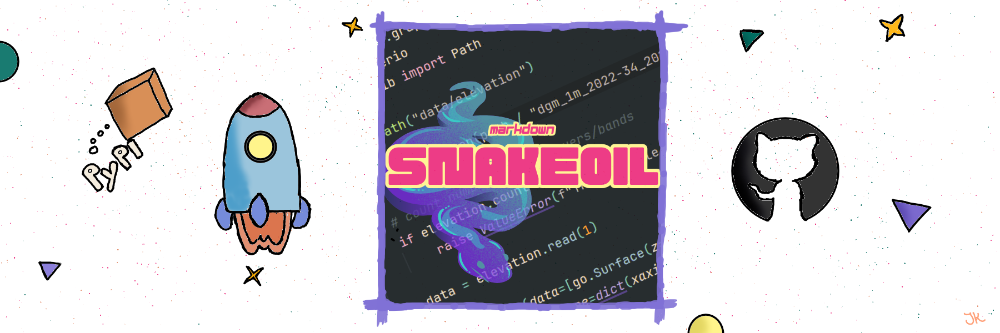

---
date:
  created: 2025-08-08
readtime: 3
pin: true
authors:
  - jakob
slug: md-snakeoil
tags:
  - Project Showcase
  - Python Packaging
  - PyPI
---

# A exercise in Python packaging: `md-snakeoil`



TL;DR: Have you ever tried to read code in a document, only to find it messy and
hard to follow? I often write guides and lecture materials in Markdown, but keeping
all the code examples tidy can be a real challenge. That’s why I created 
**md-snakeoil**, a tool that automatically cleans up Python code, making 
everything look neat. :glowing_star:

<p align="center">
  <a href="https://github.com/JakobKlotz/md-snakeoil" target="_blank">
    
  </a>
  <a href="https://pypi.org/project/md-snakeoil/" target="_blank">
    
  </a>
</p>

<!-- more -->

---

## About the project

**md-snakeoil** helps you keep your code examples looking their best. If you 
write notes, tutorials or documentation that includes Python code, this tool 
will make sure all your code blocks are consistently styled and easy to read—no
more messy formatting! It was written purely in Python 
:fontawesome-brands-python: and can be easily installed with your favorite
package manager.

| Package Manager   | Command                       |
|-------------------|-------------------------------|
| `pip`             | `pip install md-snakeoil`     |
| `pipx` (as tool)  | `pipx install md-snakeoil`    |
| `uv` (as package) | `uv add md-snakeoil`          |
| `uv` (as tool)    | `uv tool install md-snakeoil` |

### Before and After

Here’s a quick visual example of what md-snakeoil can do:
<p align="center">
  
  
</p>

<p align="center">
  <b>Left:</b> Before using <code>md-snakeoil</code> &nbsp; | &nbsp; <b>Right:</b> After using <code>md-snakeoil</code>
</p>

The import statements get sorted, unnecessary new lines and whitespace is 
removed. Although this might be an exaggerated example, it illustrates the kind
of improvements md-snakeoil can make.

Whole directories can be processed in one go (a single command), making it easy
to maintain consistency across large projects. 

??? info

    With md-snakeoil installed, use

    ```bash
    snakeoil path/to/directory
    ```

    to process all files in the directory.


## Why did I build it?

I write a lot of technical documentation in Markdown which includes a lot of 
code examples. Keeping a consistent style across these code blocks can be a
challenge, especially when working with multiple files or collaborating with
others. I wanted a tool that could take care of that. Since there was no 
existing solution that met my needs, I simply wrote one myself.

## What did I learn?

The development process taught me a lot about Python packaging, such as 
structuring and packaging the project with `uv` 
(see the [previous post](./uv.md) on `uv`). I gained more experience setting 
up automated tests and managing releases using GitHub Actions. Additionally, 
through code contributions from others, the project has grown and improved!

All that left me with a blueprint for

- A workflow to publish the package on PyPI
- Documentation for users and contributors
- Automated testing

---

???+ tip

    Feel free to skim through the codebase and copy bits and pieces useful for 
    your own projects.

## Try it out!

If you’re curious, you can check out md-snakeoil on GitHub or PyPI.

- [:fontawesome-brands-github: GitHub Repository](https://github.com/JakobKlotz/md-snakeoil)
- [:fontawesome-brands-python: PyPI Package](https://pypi.org/project/md-snakeoil/)

Want to know more about the development process or the tools involved to build
something similar? Feel free to reach out! :blush:
