# Tree-based algorithms

## Decision Tree

While linear regression and logistic regression are simple and interpretable,
they are limited to linear relationships. Decision trees are non-linear models
able to capture complex relationships in the data. They are easy to interpret
and visualize, making them a popular choice for many applications.

Moreover, decision trees can be used for both regression ^^*and*^^
classification.

In this chapter, we will explore the theory behind decision trees followed by
a practical example. We will then extend our understanding to Random Forests,
an ensemble method that combines multiple decision trees for improved 
predictions. Another example concludes the chapter. As always we will use
`scikit-learn` for hands-on experience.

### Basic intuition

Although you might not know it, you're already familiar with decision trees.
Imagine, you're planning a skiing trip and need to decide whether to go skiing
or not. You might ask yourself:

```mermaid
graph TD
    A[Can I get to a skiing resort?] -->|Yes| B[Is there any snow?]
    A -->|No| C[No skiing 😥]
    B -->|Yes| D[Go skiing ⛷]
    B -->|No| E[No skiing 😥]
    
    style A fill:#1e2129,stroke:#ffffff
    style B fill:#1e2129,stroke:#ffffff
    style D fill:#009485,stroke:#ffffff
    style C fill:#e92063,stroke:#ffffff
    style E fill:#e92063,stroke:#ffffff
```

Depending on the answers, you can decide whether to go skiing or not.

A decision tree resembles a flowchart where each internal node represents a
decision based on a feature (e.g., Is there any snow?), each branch represents 
the outcome of that decision, and each leaf node represents a final 
prediction (either a class label for classification or a continuous value 
for regression). 

To get a better understanding of the terms node, branch and leaf, consider 
the illustration of a (rotated) tree.

<figure markdown="span">
    
    <figcaption>The same decision tree with literal illustrations of 
        node, branch and leaf.
    </figcaption>
</figure>

In the skiing example, the nodes are the questions you ask yourself. With 
branches being a simple (binary) yes or no answer. The leaf nodes are the final
predictions, in our case whether to go skiing.

<?quiz?>
question: Given the skiing decision tree, what kind of supervised learning task is this?
answer: Multi-class classification (not previously covered)
answer: Regression
answer-correct: Binary classification
answer: It's not a supervised learning task, since we are missing our target.
content:

Correct, the leaves predict two different labels, namely "Go skiing" 
and "No skiing" which is a classic binary classification task.

<?/quiz?>

### Theory

???+ info

    This theoretical section on decision trees follows: ^^Christopher M. 
    Bishop. 2006. *Pattern Recognition and Machine Learning*[^1]^^
    
    We focus on a particular tree based algorithm called CART 
    (=**C**lassification **A**nd **R**egression **T**rees).
    The theoretical foundations of CART were developed by:
    ^^Leo Breiman, Jerome Friedman, Richard Olshen, and Charles Stone. 1984.
    *Classification and Regression Trees*[^2]^^
    
    [^1]:
        Christopher M. Bishop. Pattern Recognition and Machine Learning. 
        Springer, 2006. [Link](https://www.microsoft.com/en-us/research/uploads/prod/2006/01/Bishop-Pattern-Recognition-and-Machine-Learning-2006.pdf)
    [^2]:
        Leo Breiman, Jerome Friedman, Richard Olshen, and Charles Stone. 
        Classification and Regression Trees. Chapman and Hall/CRC, 1984.
        [https://doi.org/10.1201/9781315139470](https://doi.org/10.1201/9781315139470)

---

