# Tree-based algorithms

## Decision Tree

While linear regression and logistic regression are simple and interpretable,
they are limited to linear relationships. Decision trees are non-linear models
able to capture complex relationships in the data. They are easy to interpret
and visualize, making them a popular choice for many applications.

Moreover, decision trees can be used for both regression ^^*and*^^
classification.

In this chapter, we will explore the theory behind decision trees followed by
a practical example. We will then extend our understanding to Random Forests,
an ensemble method that combines multiple decision trees for improved 
predictions. Another example concludes the chapter. As always we will use
`scikit-learn` for hands-on experience.

### Basic intuition

Although you might not know it, you're already familiar with decision trees.
Imagine, you're planning a skiing trip and need to decide whether to go skiing
or not. You might ask yourself:

```mermaid
graph TD
    A[Can I get to a skiing resort?] -->|Yes| B[Is there any snow?]
    A -->|No| C[No skiing 😥]
    B -->|Yes| D[Go skiing ⛷]
    B -->|No| E[No skiing 😥]
    
    style A fill:#1e2129,stroke:#ffffff
    style B fill:#1e2129,stroke:#ffffff
    style D fill:#009485,stroke:#ffffff
    style C fill:#e92063,stroke:#ffffff
    style E fill:#e92063,stroke:#ffffff
```

Depending on the answers, you can decide whether to go skiing or not.

A decision tree resembles a flowchart where each internal node represents a
decision based on a feature (e.g., Is there any snow?), each branch represents 
the outcome of that decision, and each leaf node represents a final 
prediction (either a class label for classification or a continuous value 
for regression). 

To get a better understanding of the terms node, branch and leaf, consider 
the illustration of a (rotated) tree.

<figure markdown="span">
    
    <figcaption>The same decision tree with literal illustrations of 
        node, branch and leaf.
    </figcaption>
</figure>

In the skiing example, the nodes are the questions you ask yourself. With 
branches being a simple (binary) yes or no answer. The leaf nodes are the final
predictions, in our case whether to go skiing.

<?quiz?>
question: Given the skiing decision tree, what kind of supervised learning task is this?
answer: Multi-class classification (not previously covered)
answer: Regression
answer-correct: Binary classification
answer: It's not a supervised learning task, since we are missing our target.
content:

Correct, the leaves predict two different labels, namely "Go skiing" 
and "No skiing" which is a classic binary classification task.

<?/quiz?>

<h3>Excited for some theory?</h3>
<iframe 
    src="https://giphy.com/embed/zZC2AqB84z7zFnlkbF" width="480" height="360" 
    style="" frameBorder="0" class="giphy-embed" allowFullScreen>
</iframe>

### Theory

???+ info

    This theoretical section on decision trees follows: ^^Christopher M. 
    Bishop. 2006. *Pattern Recognition and Machine Learning*[^1]^^
    
    We focus on a particular tree based algorithm called CART 
    (=**C**lassification **A**nd **R**egression **T**rees).
    The theoretical foundations of CART were developed by:
    ^^Leo Breiman, Jerome Friedman, Richard Olshen, and Charles Stone. 1984.
    *Classification and Regression Trees*[^2]^^
    
    [^1]:
        Christopher M. Bishop. Pattern Recognition and Machine Learning. 
        Springer, 2006. [Link](https://www.microsoft.com/en-us/research/uploads/prod/2006/01/Bishop-Pattern-Recognition-and-Machine-Learning-2006.pdf)
    [^2]:
        Leo Breiman, Jerome Friedman, Richard Olshen, and Charles Stone. 
        Classification and Regression Trees. Chapman and Hall/CRC, 1984.
        [https://doi.org/10.1201/9781315139470](https://doi.org/10.1201/9781315139470)

---

When building a decision tree a couple of questions arise:

-   :fontawesome-solid-question:{ .lg .middle } __Question__

    ---

    1. How do we pick the right feature for a split?
    2. What's the decision criteria at each node?
    3. How large do we grow the tree?
    4. When do we stop growing the tree?

-   :fontawesome-solid-lightbulb:{ .lg .middle } __Intuition__

    ---

    1. Which questions do we ask? Why did we ask "Can I 
       get to a skiing resort?" and "Is there any snow?"?
    2. It does not have to be a simple yes/no question. It can be a
       threshold for continuous values as well. E.g., "Is there more than 
       10cm of fresh snow?" But how do we choose the threshold?
    3. How many questions do we ask? Why only 2 and not more?
    4. When are there no more meaningful questions to ask?

With these questions in mind, let's dive into the theory of decision trees 
to tackle them.

---

#### Greedy optimization

As a decision tree is a supervised learning algorithm, the goal is to predict
the target variable \(y\) with a set of features \(x_1, x_2, ..., x_n\).

With the data at hand, the CART algorithm finds the optimal tree 
structure that minimizes the prediction error. In turn, the 
optimal tree structure depends on the chosen feature for each split and the 
corresponding threshold. However, given large data sets, there are too many 
splitting possibilities to consider at once. Hence, the tree is grown in a 
greedy fashion.

The greedy optimization starts with a single root node splitting the data 
into two partitions and adds additional nodes one at a time. At each step, the
algorithm chooses a feature threshold combination using exhaustive search. The 
best split (feature threshold combination) is determined by a criterion. 
Remember, that decision trees can deal with regression and classification 
problems. Hence, the criterion differs for the two tasks.

---

##### Regression

For regression trees, the best split (feature threshold combination) at each 
node is determined by minimizing the *residual sum-of-squares error (RSS)*, 
defined as:

???+ defi "Residual sum-of-squares (RSS)"

    \[ 
        RSS = \sum_{i \in t_L} (y_i - \bar{y}_L)^2 + \sum_{i \in t_R} (y_i -
        \bar{y}_R)^2 
    \]

where \(t_L\) and \(t_R\) are the left and right child nodes after the split,
and \(\bar{y}_L\) and \(\bar{y}_R\) are the mean target values in the
respective nodes.

The algorithm searches through all possible splits to find the one that 
minimizes this RSS criterion.

???+ info

    Since each split separates the input data into two partitions, the
    prediction is the mean of the target variable \(y\) in the respective 
    partition.
    
    Hence, intuitively speaking, we do not optimize the entire tree at once 
    but rather optimize each split locally.

##### Classification

For classification tasks, the best split at each node is determined by minimizing 
the *Gini impurity*. 

???+ defi "Gini impurity"

    For a node \(t\) with \(K\) classes, the Gini impurity is defined as:

    \[
       Gini(t) = \sum_{k=1}^K p_{k}(1-p_{k}) = 1 - \sum_{k=1}^K p_{k}^2
    \]
    
    where \(p_k\) is the proportion of class \(k\) observations.

The Gini impurity (sometimes referred to as Gini index) encourages leaf nodes
where the majority of observations belong to a single class.

???+ info

    The prediction at each leaf node is the majority class among the training 
    observations in that node.

---

#### TLDR

No matter the task (regression or classification), with a greedy optimization 
strategy, the CART algorithm searches for the best split using an exhaustive 
search at each node to ultimately minimize the prediction error. Thus answering
the first two questions, *a* (How do we pick the right feature for a split?) 
and *b* (What's the decision criteria at each node?).

A CART can be seen as a piecewise-constant model, as it partitions the feature 
space into regions and assigns a constant prediction (either the mean of a 
continuous value or a label) to each region.
