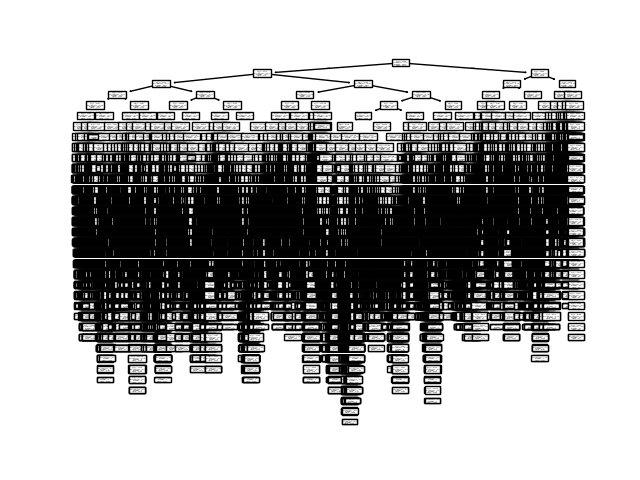

# Decision Tree

While linear regression and logistic regression are simple and interpretable,
they are limited to linear relationships. Decision trees are non-linear models
able to capture complex relationships in the data. They are easy to interpret
and visualize, making them a popular choice for many applications.

Moreover, decision trees can be used for both regression ^^*and*^^
classification.

In this chapter, we will explore the theory behind decision trees followed by
practical examples. As always we will use `scikit-learn` for hands-on 
experience.

## Basic intuition

Although you might not know it, you're already familiar with decision trees.
Imagine, you're planning a skiing trip and need to decide whether to go skiing
or not. You might ask yourself:

```mermaid
graph TD
    A[Can I get to a skiing resort?] -->|Yes| B[Is there any snow?]
    A -->|No| C[No skiing 😥]
    B -->|Yes| D[Go skiing ⛷]
    B -->|No| E[No skiing 😥]
    
    style A fill:#1e2129,stroke:#ffffff
    style B fill:#1e2129,stroke:#ffffff
    style D fill:#009485,stroke:#ffffff
    style C fill:#e92063,stroke:#ffffff
    style E fill:#e92063,stroke:#ffffff
```



Depending on the answers, you can decide whether to go skiing or not.

A decision tree resembles a flowchart where each internal node represents a
decision based on a feature (e.g., Is there any snow?), each branch represents 
the outcome of that decision, and each leaf node represents a final 
prediction (either a class label for classification or a continuous value 
for regression). 

To get a better understanding of the terms node, branch and leaf, consider 
the illustration of a (rotated) tree.

<figure markdown="span">
    
    <figcaption>The same decision tree with literal illustrations of 
        node, branch and leaf.
    </figcaption>
</figure>

In the skiing example, the nodes are the questions you ask yourself. With 
branches being a simple binary split (the answers to the question).
The leaf nodes are the final predictions, in our case whether to go skiing.

<?quiz?>
question: Given the skiing decision tree, what kind of supervised learning task is this?
answer: Multi-class classification (not previously covered)
answer: Regression
answer-correct: Binary classification
answer: It's not a supervised learning task, since we are missing our target.
content:
<p>Correct, the leaves predict two different labels, namely "Go skiing" 
and "No skiing" which is a classic binary classification task.
</p>
<?/quiz?>

<div style="text-align: center">
<h3>Excited for some theory?</h3>
<iframe 
    src="https://giphy.com/embed/zZC2AqB84z7zFnlkbF" width="480" height="360" 
    style="" frameBorder="0" class="giphy-embed" allowFullScreen>
</iframe>
</div>

## Theory

???+ info

    This theoretical section on decision trees follows: ^^Christopher M. 
    Bishop. 2006. *Pattern Recognition and Machine Learning*[^1]^^
    
    We focus on a particular algorithm called CART 
    (=**C**lassification **A**nd **R**egression **T**rees).
    The theoretical foundations of CART were developed by:
    ^^Leo Breiman, Jerome Friedman, Richard Olshen, and Charles Stone. 1984.
    *Classification and Regression Trees*[^2]^^
    
    [^1]:
        Christopher M. Bishop. Pattern Recognition and Machine Learning. 
        Springer, 2006. [Link](https://www.microsoft.com/en-us/research/uploads/prod/2006/01/Bishop-Pattern-Recognition-and-Machine-Learning-2006.pdf)
    [^2]:
        Leo Breiman, Jerome Friedman, Richard Olshen, and Charles Stone. 
        Classification and Regression Trees. Chapman and Hall/CRC, 1984.
        [https://doi.org/10.1201/9781315139470](https://doi.org/10.1201/9781315139470)

---

When building a decision tree a couple of questions arise:

<div class="grid cards" markdown>

-   :fontawesome-solid-question:{ .lg .middle } __Question__

    ---

    1. How do we pick the right feature for a split?
    2. What's the decision criteria at each node?
    3. How large do we grow the tree?


-   :fontawesome-solid-lightbulb:{ .lg .middle } __Intuition__

    ---

    1. Which questions do we ask? Why did we ask "Can I 
       get to a skiing resort?" and "Is there any snow?"?
    2. It does not have to be a simple yes/no question. It can be a
       threshold for continuous values as well. E.g., "Is there more than 
       10cm of fresh snow?" But how do we choose the threshold?
    3. How many questions do we ask? Why only 2 and not more?

</div>

With these questions in mind, let's dive into the theory of decision trees 
to tackle them.

---

### Greedy optimization

As a decision tree is a supervised learning algorithm, the goal is to predict
the target variable \(y\) with a set of features \(x_1, x_2, ..., x_n\).

With the data at hand, the CART algorithm finds the optimal tree 
structure that minimizes the prediction error. In turn, the 
optimal tree structure depends on the chosen splits. 

???+ info
    
    A split in CART is a binary decision rule that divides the dataset into two
    subsets based on a specific feature and threshold.

    Imagine if we extend our skiing example with the split "Is there more than 
    10cm of fresh snow?". The split divides the data into two subsets: one 
    where observations have more than 10cm of fresh snow and another where
    observations don't. With *amount of fresh snow* being the feature and *10cm* 
    the threshold.

However, given large data sets, there are too many splitting possibilities to 
consider at once. Hence, the tree is grown in a greedy fashion.

The greedy optimization starts with a single root node splitting the data 
into two partitions and adds additional nodes one at a time. At each step, the
algorithm chooses a split using exhaustive search. The best split is determined
by a criterion. Remember, that decision trees can deal with regression and 
classification problems. Hence, the criterion differs for the two tasks.

---

#### Regression

For regression trees, the best split (feature threshold combination) at each 
node is determined by minimizing the *residual sum-of-squares error (RSS)*, 
defined as:

???+ defi "Residual sum-of-squares (RSS)"

    \[ 
        RSS = \sum_{i \in t_L} (y_i - \bar{y}_L)^2 + \sum_{i \in t_R} (y_i -
        \bar{y}_R)^2 
    \]

where \(t_L\) and \(t_R\) are the left and right child nodes after the split,
and \(\bar{y}_L\) and \(\bar{y}_R\) are the mean target values in the
respective nodes.

The algorithm searches through all possible splits to find the one that 
minimizes this RSS criterion.

???+ info

    Since each split separates the input data into two partitions, the
    prediction is the mean of the target variable \(y\) in the respective 
    partition.
    
    Hence, intuitively speaking, we do not optimize the entire tree at once 
    but rather optimize each split locally.

#### Classification

For classification tasks, the best split at each node is determined by minimizing 
the *Gini impurity*. 

???+ defi "Gini impurity"

    For a node \(t\) with \(K\) classes, the Gini impurity is defined as:

    \[
       Gini(t) = \sum_{k=1}^K p_{k}(1-p_{k}) = 1 - \sum_{k=1}^K p_{k}^2
    \]
    
    where \(p_k\) is the proportion of class \(k\) observations.

The Gini impurity (sometimes referred to as Gini index) encourages leaf nodes
where the majority of observations belong to a single class.

???+ info

    The prediction at each leaf node is the majority class among the training 
    observations in that node.

---

#### TLDR

No matter the task (regression or classification), with a greedy optimization 
strategy, the CART algorithm searches for the best split using an exhaustive 
search at each node to ultimately minimize the prediction error. Thus answering
the first two questions, *a* (How do we pick the right feature for a split?) 
and *b* (What's the decision criteria at each node?).

A CART can be seen as a piecewise-constant model, as it partitions the feature 
space into regions and assigns a constant prediction (either the mean of a 
continuous value or a label) to each region.

### Tree size

Lastly, we answer question, *c* (How large do we grow the tree?).
Put differently, when should we stop adding nodes? 

First, the tree is grown as large as possible until a stopping criterion is 
met. This criterion can be the maximum tree depth or a minimum number of 
observations per leaf. Second, the tree is pruned back. Pruning is the process 
of removing nodes that do not improve the model's performance. It balances the 
RSS error or Gini impurity against model complexity.

???+ info

    If you want to dive deeper into tree pruning, we recommend reading page 665
    of Bishop's book *Pattern Recognition and Machine Learning*[^1]

---

## Advantages and Limitations

Decision trees offer several significant advantages, but they also have their 
limitations:

<div class="grid cards" markdown>

-   :fontawesome-regular-thumbs-up:{ .lg .middle } __Advantages__

    ---

    - Easy to interpret and visualize
    - Can capture non-linear relationships


-   :fontawesome-regular-thumbs-down:{ .lg .middle } __Limitations__

    ---

    - Prone to overfitting, i.e., building a model that perfectly fits the 
      training data but fails to generalize on new (unseen) data.
    - Sensitive to data, i.e., small changes in the data can lead to 
      significantly different trees.

</div>

## Examples

As mentioned earlier, we will use `scikit-learn` for hands-on experience.
`scikit-learn` contains an implementation of the CART algorithm discussed.[^3]

[^3]:
    `scikit-learn` documentation: [Decision Trees](https://scikit-learn.org/stable/modules/tree.html#tree-algorithms-id3-c4-5-c5-0-and-cart)

Functionalities around decision trees are all part of the 
[`tree` module](https://scikit-learn.org/stable/api/sklearn.tree.html) in
`scikit-learn`.

### Regression

First, we start with a regression task. We will use the California housing
data to predict house prices using a decision tree regressor.

#### Load data

Load the data and split it into training and test sets. If you need a refresh
on training and test splits, visit the
[Split the data](../classification.md#split-the-data) section of the previous
chapter.

```python
from sklearn.datasets import fetch_california_housing
from sklearn.model_selection import train_test_split

X, y = fetch_california_housing(return_X_y=True, as_frame=True)

X_train, X_test, y_train, y_test = train_test_split(
    X, y, test_size=0.2, random_state=42, shuffle=True
)
```

As always, a seed is set for reproducibility (`#!python random_state=42`). It 
can be any integer, you can simply pick any random number.

#### Fit and evaluate the model

Next, we load the class `DecisionTreeRegressor` from the `tree` module.

```python
from sklearn.tree import DecisionTreeRegressor

model = DecisionTreeRegressor(random_state=784)
```

Again, we set a seed. More on the stochastic nature of decision trees later.

To fit and evaluate the model:

```python
model.fit(X_train, y_train)
score = model.score(X_test, y_test)
print(f"Model performance (R²): {round(score, 2)}")
```

```title=">>> Output"
Model performance (R²): 0.61
```

The `score` method returns the coefficient of determination \(R^2\). 
The \(R^2\) is already familiar, as it was first introduced 
in the [Regression chapter](../regression.md#coefficient-of-determination) to 
evaluate the fit of a linear regression.

The decision tree model achieved an \(R^2\) of 0.61 on the test set, which 
leaves room for improvement.

???+ info

    On a side note: Although we fitted a decision tree on `#!python 16512` 
    observations, the process of actually training the model is quite fast!

#### Plot the tree

##### It's a mess...

As discussed, one main advantage of decision trees is their interpretability.
We can easily visualize the tree using the `plot_tree` function.

???+ tip

    This is the first time that we discourage you from running the code 
    snippet below. Soon you know why.

```python
import matplotlib.pyplot as plt
from sklearn.tree import plot_tree

plot_tree(model)
plt.show()  # use matplotlib to show the plot
```

<figure markdown="span">
    
    <figcaption>Yes, that's the actual tree. :sweat_smile: 
    </figcaption>
</figure>

Though we can't read any of the information present, the plot hints at a huge 
tree. Due to its complexity, the model does not add much value to the
understanding of the data (it's simply not interpretable).

Actually visualizing this particular tree takes some time, hence we 
discouraged you from executing the code.

But why do we get such a huge tree? By default, the CART implementation in 
`scikit-learn` grows the tree as large as possible and does *not* prune it.

##### ... to fix

To prevent the tree from growing too large, we can set two parameters.

```python hl_lines="5"
from sklearn.tree import DecisionTreeRegressor

# set max_depth and min_samples_leaf
model = DecisionTreeRegressor(
    random_state=784, max_depth=2, min_samples_leaf=15
)

# fit the model again
model.fit(X_train, y_train)
```

The `max_depth` parameter limits the depth of the tree, while `min_samples_leaf`
sets the minimum number of samples (observations) required to be in a leaf 
node. Both prevent the tree from growing too large.

???+ info

    Remember, we want to prevent overfitting. By setting these parameters, we
    control the complexity of the tree and thus reduce the risk of overfitting.
    Additionally, it results in a smaller tree which is easier to interpret.

Let's plot the pruned tree.

```python
plot_tree(model, filled=True, feature_names=X.columns, proportion=True)
plt.show()
```

<figure markdown="span">
    
    </figcaption>
        The tree is in a stark contrast to the one we had before; it is way 
        smaller.
    </figcaption>
</figure>

???+ tip

    The nodes are quite easy to read:
    
    Starting with the root node, the feature `MedInc` performs 
    the first split. If the median income is less than 5.086, we follow the 
    left branch else the right branch. The resulting `squared_error` of the 
    split is shown as well.
    The root node splits the data into two subsets, the left branch results 
    in a subest containing 79.3% of the training data and the right branch 
    20.7%. After two more splits, we reach the leaf nodes. Each leaf node 
    contains a value, the prediction.

Now we have a pruned tree, which reduced the risk of overfitting. However, at 
the cost of model performance. The \(R^2\) decreased from 0.61 to 0.42 which 
might indicate that such a simple tree might not capture the complexity of the 
data well.

<div style="text-align: center">
<h3>Now get to the point!</h3>
<iframe 
    src="https://giphy.com/embed/l1AsRdc4mnfIB6OhW" width="480" height="360" 
    style="" frameBorder="0" class="giphy-embed" allowFullScreen>
</iframe>
</div>

In practice, you have to find the right parameters to balance model complexity
and performance. Unfortunately, there is no one-size-fits-all solution. You 
have to tune the parameters based on the data and the task at hand.

???+ question "Parameter tuning"

    Try some different combinations of `max_depth` and `min_samples_leaf`.
    Use the same train test split, we defined earlier.
    
    1. Manually change the values.
    2. Fit the model.
    3. Evaluate the model.
    4. Plot the model.
    5. Repeat! :repeat:

    Can you get an \(R^2\) higher than `#!python 0.7`?

### Classification

Next, we switch to a classification task. We will re-use the breast cancer 
data set introduced in the previous Classification chapter.

#### Load data

```python hl_lines="3"
from sklearn.datasets import load_breast_cancer

X, y = load_breast_cancer(return_X_y=True, as_frame=True)
X_train, X_test, y_train, y_test = train_test_split(
    X, y, test_size=0.2, random_state=42, shuffle=True
)
```

#### Fit and evaluate the model

For classification trees, `scikit-learn` provides the class 
`DecisionTreeClassifier`.

```python hl_lines="1"
from sklearn.tree import DecisionTreeClassifier

model = DecisionTreeClassifier(
    # again, set max_depth and min_samples_leaf to prevent growing a huge tree
    random_state=784, max_depth=7, min_samples_leaf=5
)
```

???+ question "Fit and evaluate the model"

    Now it is your time to fit and evaluate the model. Although, you have never
    used an instance of `DecisionClassifier` before, you can use the same 
    methods as with other models in `scikit-learn`. Simply refer to the 
    previous regression example.
    
    1. Fit the model on `X_train` and `y_train`.
    2. Evaluate the model on `X_test` and `y_test`.
    3. Print the model's performance.
    4. Plot the tree.

    Lastly answer following quiz question to evaluate your result.

<?quiz?>
question: What is the model's accuracy (rounded to 2 decimal places)?
answer: 92.98%
answer-correct: 94.74%
answer: 90.35%
content:
<p>
    Correct! The mean accuracy is 94.74% which is a bit lower than the 95.61%
    from the logistic regression.
</p>
<?/quiz?>

## Recap

We comprehensively explored decision trees, focusing on the CART algorithm. 
The theory section illuminated its core mechanisms, while practical 
examples demonstrated building and evaluating decision trees for regression and
classification tasks. Key takeaways include:

- Algorithm insights into tree construction
- Practical implementation skills 
- Understanding of decision trees' interpretability and overfitting risks

Next, we'll extend our knowledge to Random Forests, an ensemble method 
combining multiple decision trees to enhance predictive performance.
