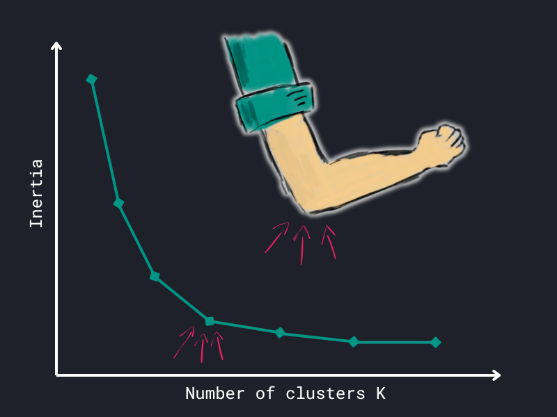
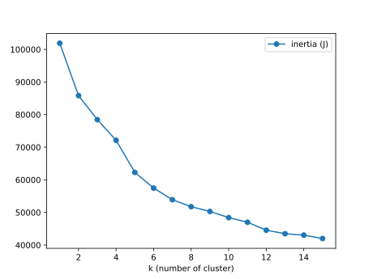

# Clustering

In this section, we will start to explore unsupervised learning, where we work 
with data that isn't accompanied by labels. One of the primary techniques 
within this realm is clustering, which aims to uncover patterns or structures 
in the data by grouping similar data points together. A popular method for 
achieving this is k-means clustering, which aims to identify clusters of 
similar observations.

## K-means

K-means was briefly introduced in the [Introduction](../index.md#example_1) to 
Supervised vs. Unsupervised Learning and used to segment customers based on 
their annual spending and average basket size.

<div style="text-align: center;">
    <iframe src="/assets/data-science/algorithms/clusters.html" width="600" height="450">
    </iframe>
    <figcaption>
        An exemplary application of k-means clustering to segment customers.
    </figcaption>
</div>

The algorithm groups similar data points together based on their attributes
without being told what these groups should be. 

To get a better understanding of k-means, we will explore the theory behind it
and employ the algorithm to cluster data from Spotify and a semiconductor 
manufacturer.

### Theory

???+ info

    The theoretical part is adapted from:
    ^^Christopher M. Bishop. 2006. *Pattern Recognition and Machine 
    Learning*[^1]^^

    [^1]:
    Christopher M. Bishop. Pattern Recognition and Machine Learning. 
    Springer, 2006. [Link](https://www.microsoft.com/en-us/research/uploads/prod/2006/01/Bishop-Pattern-Recognition-and-Machine-Learning-2006.pdf)

Assume a set of features \(x_1, x_2, ..., x_n\). K-means partitions the data
into \(K\) number of clusters. Each cluster is represented by \(\mu_k\), 
which can be seen as the center of a cluster \(k\).

Intuitively speaking, the goal is to assign each data point \(x_n\) to the 
cluster with the closest center \(\mu_k\). 

#### The objective

Since, the optimal assignment of data points to specific clusters is not known,
the objective is to minimize the sum of squared distances between data 
points and their assigned cluster centers.
This is known as the **distortion measure**:

???+ defi "Distortion measure"

    \[
    J = \sum_{n=1}^{N} \sum_{k=1}^{K} r_{nk} \lVert x_n - \mu_k \rVert^2
    \]

    where:
    
    - \(N\) is the number of data points,
    - \(K\) being the number of clusters,
    - \(r_{nk}\) is a binary indicator of whether data point \(x_n\) is 
      assigned to cluster \(k\),
    - \(\mu_k\) representing the cluster center.

In short, we want to find the optimal \(r_{nk}\) and \(\mu_k\) that minimize 
the distortion measure \(J\).

\(J\) is minimized in an iterative process. First, we initialize \(\mu_k\) 
with some random values. Then we alternate between two steps:

1. **Assignment step**: Keep \(\mu_k\) fixed. Minimize \(J\) with respect 
    to \(r_{nk}\). This is done by assigning each data point to the closest 
    cluster center.
2. **Update step**: Keep \(r_{nk}\) fixed. Minimize \(J\) with respect to 
    \(\mu_k\). This is done by updating the cluster centers to the mean of 
    the data points assigned to the cluster.

Step 1 can be seen as re-assigning the data points to clusters, while step 2
re-computes the cluster centers.

???+ info

    Since \(\mu_k\) is the mean of the data points assigned to cluster \(k\),
    we speak of the k-means algorithm.

The optimization of \(J\) is guaranteed to converge, but it might not find the
global minimum. The final solution depends on the initial cluster centers.

???+ question "Get a better understanding"

    To improve your understanding of the k-means algorithm, either watch the
    following video or visit the interactive visualization.
    Both variants illustrate the iterative process of k-means.

=== "Option 1: :fontawesome-brands-youtube: Video"
    
    <div style="text-align: center;">
        <iframe width="560" height="315" 
            src="https://www.youtube.com/embed/R2e3Ls9H_fc?si=Lz4jq8Fbxjr1BmeL" 
            title="YouTube video player" frameborder="0" allow="accelerometer; 
            autoplay; clipboard-write; encrypted-media; gyroscope; picture-in-picture;
            web-share" referrerpolicy="strict-origin-when-cross-origin" 
            allowfullscreen>
        </iframe>
    </div>

=== "Option 2: :fontawesome-solid-globe: Website"
    
    Visit the site [clustering-visualizer.web.app/kmeans](https://clustering-visualizer.web.app/kmeans).
    Use mouse clicks to draw data points. Click on "START".
    
    The web app illustrates the iterative algorithm. You can watch the 
    data points being assigned to clusters and the update of cluster centers 
    which are denoted in the app as \(C_1, C_2, ... , C_N\).

#### Elbow method :flexed_biceps:

So far we have not discussed the number of clusters \(K\) in depth. Since the
algorithm requires the number of clusters as an input, it is crucial to choose 
\(K\) wisely.

One common approach to determine the optimal number of clusters is the
**elbow method**. The idea is to plot the distortion measure \(J\) (inertia)
for different values of \(K\). The plot will show a sharp decrease in \(J\) 
as \(K\) increases. The optimal number of clusters is the point where the 
decrease flattens out, resembling an elbow.

<figure markdown="span">
    
    <figcaption>
        Illustration of the elbow method.
    </figcaption>
</figure>

We will apply both k-means and the elbow method in the following examples.

## Examples

With the theory out of the way, we can now apply k-means to real-world data.
First, we build a recommendation system for Spotify tracks and then move on to
clustering semiconductor data.

### Recommendation system

To build a recommendation system, we will use a modified Spotify dataset. 
The goal is to cluster songs based on their audio features and recommend
similar songs to the user.

???+ info

    The original data can be found on 
    [Kaggle](https://www.kaggle.com/datasets/asaniczka/top-spotify-songs-in-73-countries-daily-updated?resource=download).

    The modified data we are using, contains songs from 2024 up until now 
    (time of writing: January 31, 2025).
    
---

???+ question "Download and read data"

    1. Download the data set.
    2. Read it with `pandas` and for convenience assign it to a variable called
       `data`. Then you will be able to use the following code snippets more
       easily.
    3. Print the first rows of `data`.

<div class="center-button" markdown>
[Download Spotify tracks :fontawesome-solid-download:](../../../assets/data-science/algorithms/clustering/spotify.csv){ .md-button }
</div>

---

With the data set loaded, we pick the following audio features for clustering:

```python hl_lines="14"
features = [
    "danceability",
    "energy",
    "loudness",
    "speechiness",
    "acousticness",
    "instrumentalness",
    "liveness",
    "valence",
    "tempo",
]

# subset data
X = data[features]
```

???+ question "Have a look at the data"

    1. Look at the first couple of rows of the `DataFrame` `X`.
    2. Check for potential missing values.

    Hint: If you need a refresh on missing values, visit the 
    [Data preprocessing](../../data/preprocessing.md#missing-values) chapter.

You might have noticed that all features are numerical. In fact, k-means
==requires numerical data==.

???+ danger

    Since k-means is based on (Euclidian) distances, do ==not== apply 
    k-means to categorical data, even if your data is encoded as labels. 
    Distances for categorical labels are meaningless!

    Instead you can look at algorithms like k-modes.

Let's have another look at the data:

```python
X.describe()
```

```title=">>> Output"
       danceability        energy  ...       valence         tempo
count  11320.000000  11320.000000  ...  11320.000000  11320.000000
mean       0.683081      0.660006  ...      0.525337    122.571478
std        0.134193      0.162655  ...      0.222797     27.628201
min        0.093900      0.001740  ...      0.000010     46.999000
25%        0.597000      0.560000  ...      0.355000     99.987000
50%        0.701000      0.675000  ...      0.526000    121.974000
75%        0.780000      0.777000  ...      0.696000    140.056000
max        0.988000      0.998000  ...      0.989000    236.089000
```

These basic statistics reveal that the features have different scales.
For example, compare `tempo` and `danceability`. Tempo ranges from 
`#!python 46` to `#!python 236`, while danceability ranges from 
`#!python 0.0939` to `#!python 0.988`.

Thus, we apply a Z-Score normalization to all features (to have a mean of `0` 
and a standard deviation of `1`). This prevents k-means to disproportionately
weigh features like `tempo` and ensures each feature contributes equally to
the distance calculations.

```python
from sklearn.preprocessing import StandardScaler

scaler = StandardScaler()  # Z-Score normalization
X = scaler.fit_transform(X)
```

#### Apply k-means

The application of k-means is straightforward:

```python hl_lines="4"
from sklearn.cluster import KMeans

kmeans = KMeans(n_clusters=5, random_state=42)
cluster_indices = kmeans.fit_predict(X)
print(cluster_indices)
```

```title=">>> Output"
array([4, 0, 3, ..., 1, 1, 2], dtype=int32)
```

The `n_clusters` parameter specifies the number of clusters. We set it to 
`#!python 5` for now. The `random_state` parameter ensures reproducibility.
Using the `fit_predict()` method, we obtain the cluster indices for each data
point. These indices range from `#!python 0` to `#!python 4` in this case.
I.e., the first track belongs to cluster `#!python 4`, the second to cluster
`#!python 0`, and so on.

... but wait, how do we know if `#!python 5` is the right number of clusters?
This is where the elbow method comes into play. :flexed_biceps:

#### Elbow method

With the attribute `inertia_`, we can access the distortion measure \(J\).
From the k-means docs:

> `inertia_`:
> 
> Sum of squared distances of samples to their closest cluster center,...
> 
> -- <cite>[KMeans docs](https://scikit-learn.org/stable/modules/generated/sklearn.cluster.KMeans.html)</cite>

In a loop we fit the k-means algorithm for different numbers of clusters \(K\)
and store the corresponding distortion measure (`inertia_`). Then we plot the 
results.

We define a function to apply the elbow method:

```python hl_lines="3 8"
def elbow_method(X, max_clusters=15):
    inertia = []
    K = range(1, max_clusters + 1)

    for k in K:
        model = KMeans(n_clusters=k, random_state=42)
        model.fit(X)
        inertia.append(model.inertia_)

    # for convenience store in a DataFrame
    distortions = pd.DataFrame(
        {"k (number of cluster)": K, "inertia (J)": inertia}
    )

    return distortions
```

By default, the function `elbow_method()` tries values for \(K\) from 
`#!python 1` to `#!python 15` and stores the corresponding distortion measure 
in a `DataFrame`. 

---

???+ question "Apply the elbow method"

    1. Apply the `elbow_method()` on our scaled data `X`.
    2. Create a line plot with the number of clusters (K) on the x-axis and 
        the distortion measure on the y-axis.

        Hint: Use the [`plot()`](https://pandas.pydata.org/docs/reference/api/pandas.DataFrame.plot.html)
        method of the resulting `DataFrame`.

Expand the below section to see a plot as possible solution.

??? note "Expand to see the plot"

    <figure markdown="span">
        
        <figcaption>
            Elbow method applied to the Spotify data set.
        </figcaption>
    </figure>
