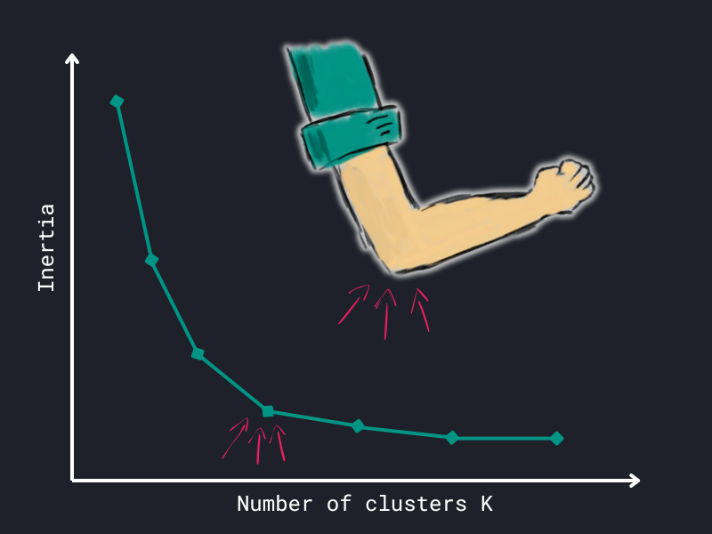

# Clustering

In this section, we will start to explore unsupervised learning, where we work 
with data that isn't accompanied by labels. One of the primary techniques 
within this realm is clustering, which aims to uncover patterns or structures 
in the data by grouping similar data points together. A popular method for 
achieving this is k-means clustering, which aims to identify clusters of 
similar observations.

## K-means

K-means was briefly introduced in the [Introduction](../index.md#example_1) to 
Supervised vs. Unsupervised Learning and used to segment customers based on 
their annual spending and average basket size.

    <iframe src="/assets/data-science/algorithms/clusters.html" width="600" height="450">
    </iframe>
    <figcaption>
        An exemplary application of k-means clustering to segment customers.
    </figcaption>

The algorithm groups similar data points together based on their attributes
without being told what these groups should be. 

To get a better understanding of k-means, we will explore the theory behind it
and employ the algorithm to cluster data from Spotify and a semiconductor 
manufacturer.

### Theory

???+ info

    The theoretical part is adapted from:
    ^^Christopher M. Bishop. 2006. *Pattern Recognition and Machine 
    Learning*[^1]^^

    [^1]:
    Christopher M. Bishop. Pattern Recognition and Machine Learning. 
    Springer, 2006. [Link](https://www.microsoft.com/en-us/research/uploads/prod/2006/01/Bishop-Pattern-Recognition-and-Machine-Learning-2006.pdf)

Assume a set of features \(x_1, x_2, ..., x_n\). K-means partitions the data
into \(K\) number of clusters. Each cluster is represented by \(\mu_k\), 
which can be seen as the center of a cluster \(k\).

Intuitively speaking, the goal is to assign each data point \(x_n\) to the 
cluster with the closest center \(\mu_k\). 

#### The objective

Since, the optimal assignment of data points to specific clusters is not known,
the objective is to minimize the sum of squared distances between data 
points and their assigned cluster centers.
This is known as the **distortion measure**:

???+ defi "Distortion measure"

    \[
    J = \sum_{n=1}^{N} \sum_{k=1}^{K} r_{nk} \lVert x_n - \mu_k \rVert^2
    \]

    where:
    
    - \(N\) is the number of data points,
    - \(K\) being the number of clusters,
    - \(r_{nk}\) is a binary indicator of whether data point \(x_n\) is 
      assigned to cluster \(k\),
    - \(\mu_k\) representing the cluster center.

In short, we want to find the optimal \(r_{nk}\) and \(\mu_k\) that minimize 
the distortion measure \(J\).

\(J\) is minimized in an iterative process. First, we initialize \(\mu_k\) 
with some random values. Then we alternate between two steps:

1. **Assignment step**: Keep \(\mu_k\) fixed. Minimize \(J\) with respect 
    to \(r_{nk}\). This is done by assigning each data point to the closest 
    cluster center.
2. **Update step**: Keep \(r_{nk}\) fixed. Minimize \(J\) with respect to 
    \(\mu_k\). This is done by updating the cluster centers to the mean of 
    the data points assigned to the cluster.

Step 1 can be seen as re-assigning the data points to clusters, while step 2
re-computes the cluster centers.

???+ info

    Since \(\mu_k\) is the mean of the data points assigned to cluster \(k\),
    we speak of the k-means algorithm.

The optimization of \(J\) is guaranteed to converge, but it might not find the
global minimum. The final solution depends on the initial cluster centers.

???+ question "Get a better understanding"

    To improve your understanding of the k-means algorithm, either watch the
    following video or visit the interactive visualization.
    Both variants illustrate the iterative process of k-means.

=== "Option 1: :fontawesome-brands-youtube: Video"
    
    

        <iframe width="560" height="315" 
            src="https://www.youtube.com/embed/R2e3Ls9H_fc?si=Lz4jq8Fbxjr1BmeL" 
            title="YouTube video player" frameborder="0" allow="accelerometer; 
            autoplay; clipboard-write; encrypted-media; gyroscope; picture-in-picture;
            web-share" referrerpolicy="strict-origin-when-cross-origin" 
            allowfullscreen>
        </iframe>
    

=== "Option 2: :fontawesome-solid-globe: Website"
    
    Visit the site [clustering-visualizer.web.app/kmeans](https://clustering-visualizer.web.app/kmeans).
    Use mouse clicks to draw data points. Click on "START".
    
    The web app illustrates the iterative algorithm. You can watch the 
    data points being assigned to clusters and the update of cluster centers 
    which are denoted in the app as \(C_1, C_2, ... , C_N\).

#### Elbow method :flexed_biceps:

So far we have not discussed the number of clusters \(K\) in depth. Since the
algorithm requires the number of clusters as an input, it is crucial to choose 
\(K\) wisely.

One common approach to determine the optimal number of clusters is the
**elbow method**. The idea is to plot the distortion measure \(J\) (inertia)
for different values of \(K\). The plot will show a sharp decrease in \(J\) 
as \(K\) increases. The optimal number of clusters is the point where the 
decrease flattens out, resembling an elbow.

<figure markdown="span">
    
    <figcaption>
        Illustration of the elbow method.
    </figcaption>
</figure>

We will apply both k-means and the elbow method in the following examples.

## Examples

With the theory out of the way, we can now apply k-means to real-world data.

