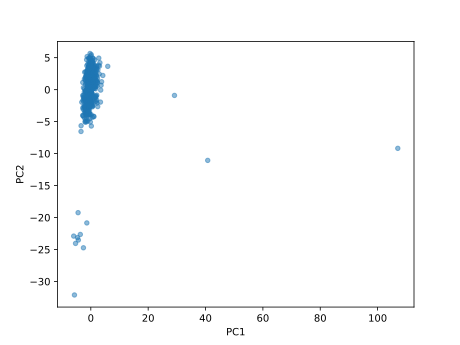
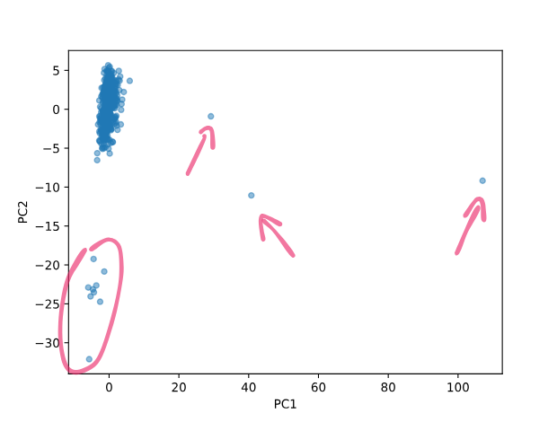

# Dimensionality Reduction

## Principal Component Analysis (PCA)

In data science and machine learning, we often encounter data sets with 
hundreds or even thousands of features. We speak of high-dimensional data 
sets. While these features may contain valuable information, working with 
such high-dimensional data can be computationally expensive, prone to 
overfitting, and difficult to visualize. This is where another 
unsupervised method, dimensionality reduction comes in — a technique used to 
simplify data sets, while retaining much of the critical information.

One of the most widely used methods for dimensionality reduction is 
Principal Component Analysis (PCA). PCA transforms a high-dimensional (= 
lots of features) data set into a smaller set of features (components). In
practice, PCA can reduce hundreds of features down to just 2 or 3 
features, making PCA an ideal tool for visualization, preprocessing, and 
feature extraction.

In this section, we will explain the inner workings of PCA and apply it to
the semiconductor data set.

### What is PCA?

PCA is a **linear transformation technique** that identifies the directions 
(also called **principal components**) in which the data varies the most. 
These principal components capture as much variance as possible. PCA has a 
variety of applications, such as:

- **Data visualization**: Plot a dimensionality reduced data set on 2D.
- **Preprocessing**: Removing noise or redundant features while retaining the
  essential patterns in data.
- **Feature engineering**: Summarizing high-dimensional data into a smaller set
  of meaningful features.

### How does it work?

PCA follows these essential steps:

1. **Compute the covariance matrix**: PCA captures relationships between
   features by calculating the covariance between them.

    ???+ info
    
        Think of the covariance matrix as the "spread" of the data. PCA looks 
        at the interaction :fontawesome-solid-arrow-right: the correlation of 
        features with each other.

2. **Eigen decomposition**: Identify the eigenvalues and eigenvectors of the
   covariance matrix. The eigenvectors represent the directions of the
   principal components, while the eigenvalues represent the amount of variance
   captured by each component.

    ???+ info
    
        If you want to know more about eigenvalues and eigenvectors, check out
        this [site](https://www.mathsisfun.com/algebra/eigenvalue.html).

3. **Rank components**: Components are ranked by their eigenvalues. The first
   principal component captures the most variance, the second captures the
   next-most, and so on.
4. **Transform the data**: Project the original data onto the top principal
   components to reduce its dimensionality.

### The mathematical objective

Let’s assume we have a data set \(X\) with \(p\) features (dimensions). We
aim to transform \(X\) into a new matrix \(Z\) with \(k\) features such
that \(k < p\), while retaining as much variance as possible.

The transformation (described previously under point 4) is defined as:

???+ defi "PCA transformation"

    \[
    Z = X W
    \]

    Where:
    
    - \(Z\) is the transformed data set in the lower-dimensional space,
    - \(W\) is a matrix whose columns are the top \(k\) eigenvectors of the
        covariance matrix of \(X\).

???+ tip

    Dimensionality reduction helps in combating the *curse of dimensionality*, 
    a phenomenon where the performance of algorithms deteriorates with an 
    increase in the number of features. Algorithms like clustering 
    often struggle to find meaningful patterns when working with a 
    high-dimensional data set.

## Example

It’s time to apply PCA to real-world data. We'll revisit the semiconductor
data set that we used in the previous clustering chapter. The first goal 
is to use PCA to reduce the data set's dimensions and visualize them.

### Prepare the data

First, we load the data set. If you haven’t already downloaded it, you can grab
it below:

<div class="center-button" markdown>
[Download semiconductor data :fontawesome-solid-download:](../../../assets/data-science/algorithms/clustering/semiconductor.csv){ .md-button }
</div>

???+ question "Load the data"

    1. Load the `csv` file and assign it to a variable called `data`.

Before applying PCA, let’s make sure we deal with potential problems such as
missing values.

```python
# fill missing values with the mean
data = data.fillna(data.mean())
```

Next, scale the features to standardize the data set to ensure that all
features contribute equally to the analysis, preventing features with larger
numerical ranges from dominating the principal components.

```python
from sklearn.preprocessing import StandardScaler

scaler = StandardScaler()  # Z-Score
scaled_data = scaler.fit_transform(data)
```

### Apply PCA

We now apply PCA to reduce the dimensions. First, we fit the PCA model on
the `scaled_data`:

```python
from sklearn.decomposition import PCA

pca = PCA(n_components=2, random_state=42)  # (1)!
components = pca.fit_transform(scaled_data)
```

1. Although the above definition of PCA is deterministic, the actual 
   implementation can be stochastic (depending on the solver used). Since
   `svd_solver` is set to `#!python "auto"` by default, the results can 
   vary slightly. Long story short, setting `random_state` ensures 
   reproducibility in all cases.

`n_components=2` specifies that we want to reduce the data set to 2 dimensions.

???+ question "Check the shape"

    1. What is the shape of the `components` array?

### Visualize

We can easily visualize the low-dimensional data set using a scatter plot:

```python
import matplotlib.pyplot as plt

components = pd.DataFrame(components, columns=["PC1", "PC2"])
components.plot(type="scatter", x="PC1", y="PC2", alpha=0.5)  # (1)!
```

1. The `alpha` parameter controls the transparency of the points. A value of
   `#!python 0.5` makes the points semi-transparent.

<figure markdown="span">
    
    <figcaption>
        PCA visualized: The semiconductor data set reduced to 2 dimensions.
        With principal component 1 on the x-axis and principal component 2 on
        the y-axis.
    </figcaption>
</figure>

To quickly recap so far:
We were able to reduce the semiconductor data set from `#!python 590` 
features to just `#!python 2`. 

### Plot interpretation

The scatter plot shows the data set in a 2D space which separates our 
different observations, thus we can observe clusters. Since, principal 
components are ranked by the amount of variance they capture, the first
component (PC1) is "more important" than the second component (PC2).

Therefore, differences along the x-axis (PC1) are more significant than
differences along the y-axis (PC2). As we are interested in potential 
anomalies in semiconductor products, we can detect some observations that might
be well worth some further investigation.

<figure markdown="span">
    
    <figcaption>
        Potential anomalies in the semiconductor data set.
    </figcaption>
</figure>

A majority of the data points are clustered in the upper left corner. 
Contrary, these single observations with a high difference on the x-axis 
(PC1) might be anomalies. Furthermore, samples within the encircled area 
can be investigated further.

???+ question "Re-apply PCA on unscaled data"

    What would happen if you apply PCA to the unscaled data?
    
    1. Intialize a new PCA object with `n_components=2`.
    2. Fit the PCA model on the `data` (unscaled) and transform it.
    3. Visualize the new components in a 2D scatter plot.
    4. Compare the results with the previous PCA visualization.

??? tip

    PCA is sensitive to the scale of the data. Thus, the scaled data nicely
    separates the clusters, while the unscaled data does not. So be sure to 
    pick the right preprocessing steps for your data.

### Explained variance

When evaluating a PCA model, it is crucial to understand how much variance is
captured by each principal component. Simply access the 
`explained_variance_ratio_` attribute:

```python
print(pca.explained_variance_ratio_)
```

Regarding, the `pca` fitted on the *scaled* data, the output is:

```title=">>> Output"
[0.06319909 0.03672407]
```

The first principal component captures approximately `6.32%` of the variance,
while the second component captures `3.67%`. Together, the two components
capture roughly `10%` of the variance.

???+ tip

    Put simply, our two principal components capture `10%` of the variance
    of the original `#!python 590` features which is not that great. :sad:

Unfortunately, when dealing with real world data, results may not be as
promising as expected. In this case, we might need to consider more
components to capture a higher percentage of the variance.

???+ info "Choosing the number of components"
    
    It is essential to choose the right number of components. For example, you
    could use the components as features for another machine learning model,
    hence you want to retain as much information as possible.
    
    However, the choice of how many components to keep is subjective. 
    A common approach is to retain enough components to explain 90-95% of 
    the variance.

???+ question "Number of components to exceed 95% variance" 

    Use the scaled semiconductor data set to fit a new PCA model.
    How many components are necessary to explain at least 95% of the variance?

    Hint: If you google and read the documentation carefully, you can solve 
    the question in 3 lines of code maximum, without accessing the 
    `explained_variance_ratio_` attribute.

    Use the following quiz question to evaluate your answer.

<?quiz?>
question: How many components are necessary to explain at least 95% of the variance?
answer-correct: 146
answer: 590
answer: 589
content:
Correct! To explain at least 95% of the variance, you need 146 components.
<?/quiz?>

