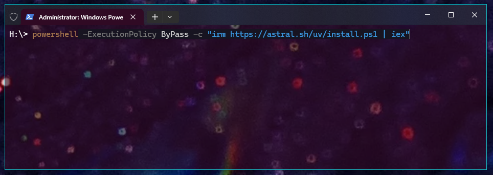

# Setup

To get started, we setup the programming environment. Follow these couple of
steps to get ready, no prerequisites needed.

## Visual Studio Code

First, install a code editor. We urge you to instal Visual Studio Code (VS
Code) a free and open-source editor developed by Microsoft
:fontawesome-brands-windows:.

If you don't have Visual Studio Code already installed, download it from their
website: <https://code.visualstudio.com/>.

### Profile

To quickstart your VS Code setup, download our profile that includes essential
plugins and convenient settings tailored for data science work.

<div class="center-button" markdown>
[VS Code Profile :fontawesome-solid-download:](../../assets/data-science/vscode-profile/Data-Science.code-profile){ .md-button }
</div>

#### Included Extensions

The profile comes with the following essential extensions:

- **Python** - Core Python language support
- **Python Debugger** - Debug your Python code
- **Jupyter** - Work with Jupyter Notebooks directly in VS Code

Additionally, stylistic plugins are included for a more pleasant coding
experience and auto-save is enabled by default so you never lose your work.
:rocket:

## `uv`

From the Python course you should already be familiar with the package manager
`pip`. That background will help you quickly understand `uv`, a modern tool
that not only replaces `pip` for package management but also handles Python
installations.

**Why the switch?** While `pip` remains widely used and important to
understand, this course aims to prepare you for modern real-world projects.
`uv` has become a popular, state-of-the-art tool in modern Python development
and learning it now will give you a competitive advantage.

???+ tip "No prior Python install necessary"

    A key benefit of `uv` is that you don’t need to install Python manually.

### Install `uv`

=== ":fontawesome-brands-windows: Windows"

    Open Windows Powershell. Visit the `uv` documentation under under "Standalone
    installer"
    [link](https://docs.astral.sh/uv/getting-started/installation/#__tabbed_1_2).
    Make sure the Windows tab is selected.

    Return to PowerShell and paste the installer command shown in the docs.

    

=== ":fontawesome-brands-apple: MacOS / :fontawesome-brands-linux: Linux"

    On macOS or Linux, open Terminal. Visit the `uv` documentation under
    "Standalone installer",
    [link](https://docs.astral.sh/uv/getting-started/installation/). Make sure the
    macOS or Linux tab is selected.

    Return to your terminal and paste the installer command.

Press ++enter++ to execute the command

______________________________________________________________________

Regardless of your operating system, upon completion you should see something
like:

```
Downloading uv
    uv
    uvx
    uvw
everything's installed!
```

You can now close the Terminal (:fontawesome-brands-apple: macOS /
:fontawesome-brands-linux: Linux) or PowerShell (:fontawesome-brands-windows:
Windows).

???+ info

    The following steps are OS-agnostic; they are the same for Windows, macOS and
    Linux.

### 1. Create a project

Now, we will cover a typical workflow to set up and initialize a new project.

???+ info

    A project is a folder that contains all scripts, configuration and data files
    that belong together. Everything for the project lives in that folder.

Create a new folder named `data-science` in an easy-to-find location you’ll use
throughout this course.

Open VS Code. Go to File → Open Folder…, select the `data-science` folder. VS
Code will open a new window.

???+ tip

    For more on navigating VS Code, see the Python course chapter:
    [link](../../python-extensive/ide.md)

### 2. Initialize the project

In VS Code, open the integrated terminal (via Terminal → New Terminal).

```bash
uv init --vcs none  # (1)!
```

1. With the `--vcs` flag a **v**ersion **c**ontrol **s**ystem can be specified.
    By default `--vcs git` is set, which initializes a git repository. Since
    git is not within the scope of this project, we set `--vcs` to none.

This initializes the project. `uv` creates a few files in your folder. Your
workspace should look like this:

<figure markdown="span">
    
</figure>

With the project structure:

```plaintext
📁 data-science/
├── 📄 .python-version
├── 🐍 main.py
├── 📄 pyproject.toml
├── 📄 README.md
```

#### Explore the new files

Click through these new files:

- `.python-version` Contains the Python version used by your virtual
    environment.
- `main.py` An entry script to verify the setup (we’ll revisit this later).
- `pyproject.toml` Project metadata such as name and version.
- `README.md` An empty README for a project description; you can ignore it for
    now.

### 3. Virtual Environment

With an initialized project we can easily set up a virtual environment. To do
so simply run:

```bash
uv sync
```

<figure markdown="span">
    
</figure>

???+ tip "Virtual Environments?"

    If you need a refresh on virtual environments, what they do and their purpose,
    read through the corresponding section in the Python course:
    [link](../../python-extensive/packages.md#virtual-environments)

#### What happens during `uv sync`?

When you run `uv sync`, three things happen automatically:

1. **Python installation**: `uv` checks the `.python-version` file and installs
    the specified Python version if it's not already available on your
    machine.

1. **Virtual environment**: A `.venv` folder is created at the root of your
    project, containing an isolated Python environment for your project.

1. **Dependency locking**: A `uv.lock` file is generated. This file pins all
    package versions used in your project, ensuring anyone else can faithfully
    recreate the exact same environment.

???+ danger "No manual edits"

    Since the `uv.lock` is auto-generated, never ever manually edit this file!

#### Test your setup

Let's verify everything works by running the `main.py` script that was created
during initialization:

```bash
uv run main.py
```

If you have a similar output, you've successfully created your first project.
:tada:

```title=">>> Output"
Hello from data-science!
```

???+ info "No activation needed"

    Notice that the `run` command automatically invokes the project's virtual
    environment, meaning you do not have to activate the environment beforehand. In
    practice that means you create your scripts and simply execute them without an
    activated environment.

### 4. Packages

Since, we will be working with a couple of different packages, we have to
discuss commands for installing and removing packages.

???+ info "Again, no activation needed"

    Once again, you don't have to activate your environment to install and remove
    packages. With `uv`, you can manage dependencies directly from any terminal in
    your project folder, the virtual environment is "handled" automatically in the
    background.

To install packages use the `add` command:

```bash
uv add <package-name>
```

replace `<package-name>` for example with `pandas`:

```bash
uv add pandas
```

After a successful installation, take some time to open the `pyproject.toml`
file. Under dependencies you should find the `pandas` package.

```toml title="pyproject.toml" hl_lines="7-9" linenums="1"
[project]
name = "data-science"
version = "0.1.0"
description = "Add your description here"
readme = "README.md"
requires-python = ">=3.14"
dependencies = [
    "pandas>=3.0.0",
]
```

The content of `uv.lock` was changed as well, the file contains more info on
the installed packages such as `pandas` and its dependencies as well (i.e.,
`numpy`, `python-dateutil`, `six` and `tzdata`).

???+ tip "Share a project"

    If you share your project, be sure to include the files `.python-version`,
    `pyproject.toml` and `uv.lock`. These allow for a recreation of your virtual
    environment.

______________________________________________________________________

Let's remove the package with the `remove` command:

```bash
uv remove pandas
```

Again, you can check both `pyproject.toml` and `uv.lock` which are
automatically updated accordingly.

???+ question "Get a script running"

    1. Create a new script called `plot.py`

    1. Paste following example (taken from
        [matplotlib docs](https://matplotlib.org/stable/gallery/lines_bars_and_markers/curve_error_band.html))
        within your script:

        ```python title="plot.py" linenums="1"
        import matplotlib.pyplot as plt
        import numpy as np

        from matplotlib.patches import PathPatch
        from matplotlib.path import Path

        N = 400
        t = np.linspace(0, 2 * np.pi, N)
        r = 0.5 + np.cos(t)
        x, y = r * np.cos(t), r * np.sin(t)

        fig, ax = plt.subplots()
        ax.plot(x, y, "k")
        ax.set(aspect=1)
        plt.show()
        ```

    1. Determine necessary packages to get this script running and install them
        with `uv`.

    1. Lastly, the script with `uv`.

## Python Scripts or Jupyter Notebooks?

For this course, you can work with Python scripts (`.py` files) and/or Jupyter
Notebooks (`.ipynb` files). Both are supported in VS Code and each has its
strengths.

<div class="grid cards" markdown>

- :fontawesome-brands-python:{ .lg .middle } __Python Scripts__

    ______________________________________________________________________

    :fontawesome-regular-thumbs-up: Advantages

    - Better for production code and reusability
    - Easier version control and collaboration
    - Runs faster without cell-by-cell overhead
    - Cleaner debugging with standard tools

    ______________________________________________________________________

    :fontawesome-regular-thumbs-down: Disadvantages

    - Less interactive during exploration
    - Need to rerun entire script for changes
    - Harder to visualize intermediate results

- :simple-jupyter:{ .lg .middle } __Jupyter Notebooks__

    ______________________________________________________________________

    :fontawesome-regular-thumbs-up: Advantages

    - Great for exploration and prototyping
    - Inline visualizations
    - Combines documentation and code
    - Easier to share findings with non-programmers

    ______________________________________________________________________

    :fontawesome-regular-thumbs-down: Disadvantages

    - Can become messy with non-linear execution
    - Harder to maintain as projects grow
    - More challenging for version control
    - Not ideal for reusability

</div>

???+ tip "Our recommendation"

    Many data scientists use both: notebooks for exploration, scripts for
    production. Simply experiment with both. For quick prototyping lean towards a
    :simple-jupyter: Jupyter Notebook. For more refined code switch to
    :fontawesome-brands-python: Python scripts.

______________________________________________________________________

## Wrap-Up

You've successfully set up your development environment! Throughout this
course, you'll create multiple projects using the workflow covered in sections
1-4. Don't worry about memorizing every step—just refer back to this page when
needed.

For quick reference, here's a cheat sheet:

???+ note "Cheat Sheet - Project Setup"

    1. Create a new folder for your project
    1. Open the folder in VS Code
    1. In the terminal, run:
        ```bash
        uv init --vcs none
        uv sync
        ```
    1. Install packages as needed:
        ```bash
        uv add <package-name>
        ```
    1. Run your code:
        ```bash
        uv run <script-name>.py
        ```

    **Need help?** Run `uv --help` for more commands and options.
