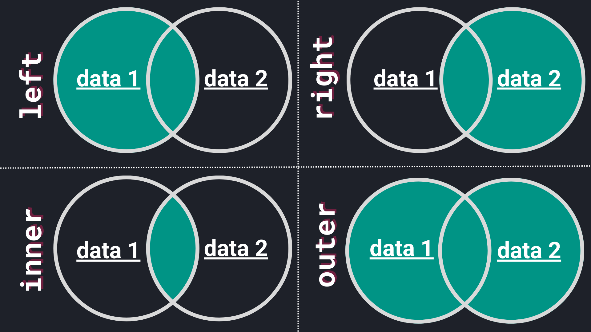

# Data preparation

## Preface

???+ info

    Starting with this chapter, we will work with ^^adapted data^^ from:
    
    ^^S. Moro, P. Cortez and P. Rita (2014). *A Data-Driven Approach to 
    Predict the Success of Bank Telemarketing*[^1]^^
    
    [^1]:
        Decision Support Systems, Volume 62, June 2014, Pages 22-31:
        [https://doi.org/10.1016/j.dss.2014.03.001](https://doi.org/10.1016/j.dss.2014.03.001)
    
    The publicly available dataset is from a Portuguese retail bank 
    and houses information on direct marketing campaigns (phone calls). Bank 
    customers were contacted and asked to subscribe to a term deposit. Using 
    this practical example, we will explore the realms of:
    
    - Data merging
    - Data cleaning
    - Data transformation
    - Machine learning (with selected algorithms)
    - Comparison of model performance
    - Model persistence (practical guide on how to save and load machine 
      learning models)
    
      Eventually, you will end up with a model that predicts whether a customer
      will subscribe to a term deposit or not.

## Obtaining the data

???+ tip "Set up a project"

    As always, we strongly recommend to set up a new project *including* a 
    virtual environment. We will perform all steps from data merging to 
    saving the model in this project.

    If you are having trouble setting up a virtual environment, please refer 
    to the [virtual environment creation](../../python-extensive/packages.md#create-a-virtual-environment) 
    guide.

Let's dive right in and download both files:

[Bank Marketing :fontawesome-solid-download:](../../assets/data-science/data/bank.tsv){ .md-button }
[Bank Marketing Social Features :fontawesome-solid-download:](../../assets/data-science/data/bank-social.csv){ .md-button }

Place the files in a new folder called `data`. Your project now should look 
like this:

```
📁 bank_marketing/
├── 📁 .venv/
├── 📁 data/
├───── 📄 bank.tsv
└───── 📄 bank-social.csv
```

???+ question "Open the files"

    Before we start, simply open the files with a text editor.
    Scroll through both files and read a couple of rows to get acquainted with 
    the data.

## Read the files

Since we are obviously dealing with two rather large files, we opt to read 
them with `Python` :fontawesome-brands-python:. At the end of this section
we end up with a single (clean!) data set.

???+ info
    
    Conveniently, in our case the data was already collected, saving us hours 
    and hours of work. Thus, we can focus on the data preparation step. 
    Since data is commonly obtained from different sources and in various 
    different formats, both data sets we have at hand (`bank.tsv` and `bank-social.csv`)
    will mimic theses scenarios.

To start, we are using `pandas` for reading and manipulating data. If you 
haven't already, install the package within your environment. 
Assuming your Jupyter Notebook or script is located at the project's root, we
start by reading the first file :fontawesome-solid-arrow-right: `bank.tsv`.

```python
import pandas as pd

data = pd.read_csv("data/bank.tsv", sep="\t")
```

Although, we can use a simple single-liner to read the file, there are a 
couple of things to break down:

1. We are dealing with a tab-separated file, meaning values within the file 
   are separated by a tab character (`\t`). The fact that we are dealing 
   with a tab-separated file is indicated by the file extension `.tsv` and 
   the space surrounding the values within the file.
2. Although we do not have a `csv` file at hand, `pandas` is versatile enough 
   to handle different separators. 
   Thus, we can utilize the `#!python pd.read_csv()` function to read the 
   file. ==Tip==: All sorts of text files can be usually read with 
   `#!python pd.read_csv()`.
3. Lastly, the `sep` parameter is set to `\t` to indicate the tab 
   separation.

Let's read the second file :fontawesome-solid-arrow-right: `bank-social.csv`.

<?quiz?>
question: Open the file <code>bank-social.csv</code> with your text editor. Which separator is used in the file?
answer: : (colon)
answer: None, it is not a valid csv file.
answer-correct: ; (semicolon)
answer: , (comma)
content:
<p>Exactly, values are separated by a semicolon.</p>
<?/quiz?>

???+ question "Read the second file"
    
    Simply read the second file (`bank-social.csv`) with `pd.read_csv()` 
    and specify the appropriate separator. Store the `DataFrame` in a 
    variable called `data_social`.

## Duplicated data

Now, with both files in memory, let's examine them closer in order to 
perform a merge.

=== "`print(data.head())`"

       | id | age | default | housing | ... | cons.conf.idx | euribor3m | nr.employed | y  |
       |----|-----|---------|---------|-----|---------------|-----------|-------------|----|
       | 1  | 30  | no      | yes     | ... | -46.2         | 1.313     | 5099.1      | no |
       | 2  | 39  | no      | no      | ... | -36.4         | 4.855     | 5191.0      | no |
       | 3  | 25  | no      | yes     | ... | -41.8         | 4.962     | 5228.1      | no |
       | 4  | 38  | no      | unknown | ... | -41.8         | 4.959     | 5228.1      | no |
       | 5  | 47  | no      | yes     | ... | -42.0         | 4.191     | 5195.8      | no |

      The rows represent customers and the columns are features of the 
      customers. The column `y` indicates whether a customer subscribed to a 
      term deposit or not. Customers are uniquely identified by the `id` 
      column. Later on, we will have a closer look at the attributes when 
      modelling the data.

=== "`print(data_social.head())`"

      | id   | job           | marital | education           |
      |------|---------------|---------|---------------------|
      | 2178 | technician    | married | professional.course |
      | 861  | blue-collar   | single  | professional.course |
      | 3020 | technician    | married | professional.course |
      | 2129 | self-employed | married | basic.9y            |
      | 3201 | blue-collar   | married | basic.9y            |

      Again, each row represents a customer (uniquely identified with `id`).
      The remaining columns `job`, `marital`, and `education` are social
      attributes.

---

Let's examine the shape of both `DataFrame`s as well.

```python
print(f"Shape of data: {data.shape}; Shape of data_social: {data_social.shape}")
```

```title=">>> Output"
Shape of data: (4530, 18); Shape of data_social: (4304, 4)
```

The output indicates that `data` contains more observations (customers) than
`data_social`. However, first and foremost it is good practice to check 
for duplicated data.

```python
# check for duplicated rows
print(data.duplicated().sum())
```

```title=">>> Output"
np.int64(411)
```

`data` contains `#!python 411` duplicated rows. These can be removed easily:

```python
data = data.drop_duplicates()
```

???+ question "Check for duplicates"
    
    Check for duplicates in `data_social` and remove them if necessary.

<?quiz?>
question: How many duplicates were present in <code>data_social</code>?
answer: None
answer: 3760
answer: 411
answer-correct: 376
content:
<p><code>data_social</code> had 376 duplicated rows.</p>
<?/quiz?>

???+ info "A note on `#!python pd.DataFrame.drop_duplicates()`"
        
    By default, the method `#!python pd.DataFrame.drop_duplicates()` removes
    all duplicated rows. However, you can pass an argument to `subset` in 
    order to remove duplicates based on specific columns. For example, if we 
    want to drop duplicates based on the `id` column, we can do so by:
    
    ```python
    data_social = data_social.drop_duplicates(subset=["id"])
    ```

    `subset` can also be all list of multiple columns.

## Merge methods

To combine both data sets we will use the `#!python pd.DataFrame.merge()` 
method to

> Merge DataFrame or named Series objects with a database-style join
> 
> -- <cite>[pandas documentation](https://pandas.pydata.org/docs/reference/api/pandas.DataFrame.merge.html)</cite>

Looking at the `how` parameter we are presented with 5 (!) different options 
to perform a merge. The most common ones are:

- `#!python "left"`
- `#!python "right"`
- `#!python "inner"`
- `#!python "outer"`

<div style="text-align: center;">
 <iframe src="https://giphy.com/embed/kaq6GnxDlJaBq" width="218" height="240" style="" frameBorder="0" class="giphy-embed" allowFullScreen></iframe><p><a href="https://giphy.com/gifs/chloe-concerned-kaq6GnxDlJaBq"></a></p>
 <figcaption style="text-align: center;">
      And now what?!
 </figcaption>

</div>

In order to be able to choose the appropriate method, we need to break them 
down:



- **Left join**: The resulting `DataFrame` will contain all rows from the 
  left `DataFrame` (data 1) and the matched rows from the right `DataFrame` 
  (data 2).
- **Right join**: The resulting `DataFrame` will contain all rows from the 
  right `DataFrame` (data 2) and the matched rows from the left `DataFrame` 
  (data 1).
- **Inner join**: The resulting `DataFrame` will contain only the rows that 
  have matching values in both `DataFrame`s.
- **Outer join**: The resulting `DataFrame` will contain all rows from both 
  `DataFrame`s.

Since we are interested in customer data that is present in both data sets,
we opt for an `#!python "inner"` merge (or join). Additionally, we need to pass
a column name to the parameter `on` that is present in both data sets and can 
be used to match the rows. Conveniently, we have the `id` column which uniquely
identifies a customer. Long story short, the merge is as simple as:

```python
data_merged = data.merge(data_social, on="id", how="inner")
```

Let's examine the shape of the merged data set.

```python
print(f"Shape of data_merged: {data_merged.shape}")
```

```title=">>> Output"
Shape of data_merged: (3928, 21)
```

We end up with `#!python 3928` customers that are present in both data sets.
Lastly, we can write the merged data set to a new file. Let's use a common 
format :fontawesome-solid-arrow-right: `csv` with the default `,` as separator.

```python
data_merged.to_csv("data/bank-merged.csv", index=False)
```

## Recap

Using the bank marketing data, we have seen how to find and remove duplicated 
data, explored different merge methods and ended up with a single data set.

In the next chapter, we will explore this data further, look for missing 
values and perform some basic data transformations.
