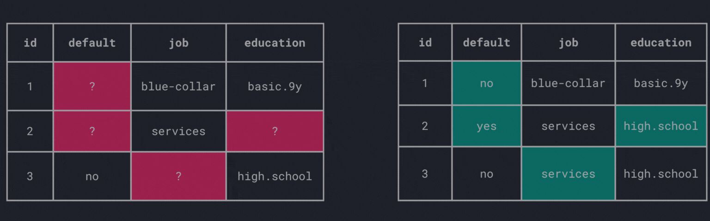

# Data preprocessing


<figcaption style="text-align: center;">
    Continue your data preprocessing quest! 🧙‍♂️
</figcaption>

???+ info "`scikit-learn`"
    
    This chapter introduces the package
    [`scikit-learn`](https://scikit-learn.org/stable/), the swiss-army knife
    for data preprocessing, transformation and machine learning.

    We will continue to work with the Portuguese retail bank data 
    set[^1] and preprocess it further. Alongside we start to explore 
    `scikit-learn`'s functionalities.

    [^1]:
        Decision Support Systems, Volume 62, June 2014, Pages 22-31:
        [https://doi.org/10.1016/j.dss.2014.03.001](https://doi.org/10.1016/j.dss.2014.03.001)

    Check-out the excellent [scikit-learn documentation](https://scikit-learn.org/stable/).

## Prerequisites

If you have followed the previous chapter closely, your project structure 
looks like this:

```plaintext hl_lines="2 5"
📁 bank_marketing/
├── 📁 .venv/
├── 📁 data/
├───── 📄 bank.tsv
├───── 📄 bank-merged.csv
└───── 📄 bank-social.csv
```

With `bank-merged.csv` being the `#!python "inner"` join of `bank.csv` and 
`social.csv`, minus all duplicated customer data. 

If you are missing the file `bank-merged.csv`, we strongly recommend you to 
go back and complete the previous chapter. For the sake of completeness, 
we provide a distilled version of the code from 
[Data preparation](preparation.md):

??? info "Merge the data sets"

    ```python linenums="1"
    # Steps from the Data preparation chapter
    import pandas as pd
    
    data = pd.read_csv("bank.tsv", sep="\t")
    data_social = pd.read_csv("bank-social.csv", sep=";")
    
    data = data.drop_duplicates()
    data_social = data_social.drop_duplicates()
    
    data_merged = data.merge(data_social, on="id", how="inner")
    data_merged.to_csv("data/bank-merged.csv", index=False)
    ```
    
    <div class="center-button" markdown>
    [Merged data :fontawesome-solid-download:](../../assets/data-science/data/bank-merged.csv){ .md-button }
    </div>

Again, we urge you to use a virtual environment which by now, should be second 
nature anyway.

???+ info "Create a new notebook"

    To follow along, create a new Jupyter notebook within your project.

## Missing values

After dropping duplicates and merging the data, the next step is to check 
for missing values. First, we read the data.

```python
import pandas as pd

data = pd.read_csv("data/bank-merged.csv")
```

We chain a couple of methods to count the missing values in each column.

```python
print(data.isna().sum())
```

The `#!python isna()` method checks each element and whether it is a missing 
value or not. The result is a `DataFrame` with boolean values of the same 
shape as the initial `DataFrame` (in our case `data`), with `#!python True` 
being a missing value. With the chaining of `#!python sum()` we simply sum the 
`#!python True` values (missing values) for each column.

A truncated version of the output is shown below:

| Column    | Missing Values |
|-----------|----------------|
| id        | 0              |
| age       | 0              |
| default   | 0              |
| housing   | 0              |
| ...       | ...            |
| job       | 0              |
| marital   | 0              |
| education | 0              |
| ...       | ...            |

It seems like the columns have no missing values. To sum missing values of 
the whole `DataFrame`, we can chain another `#!python sum()`.

```python
print(data.isna().sum().sum())
```

The output once more indicates that the whole data set has `#!python 0` 
missing values. So far so good, but this is not the end of the story (who 
saw that coming 🤯).

<div style="text-align: center;">
    <iframe src="https://giphy.com/embed/aWPGuTlDqq2yc" width="480" height="254" style="" frameBorder="0" class="giphy-embed" allowFullScreen></iframe><p><a href="https://giphy.com/gifs/celebrity-reshuffle-aWPGuTlDqq2yc"></a></p>
    <figcaption>
        Plot twist...
    </figcaption>
</div>

Although, it seems like we don't have to bother with missing values, they 
are simply a bit more hidden.

### Missing values in disguise

`pandas` considers types like `#!python None` or `#!python np.nan` as 
missing. However in practice, missing values are encoded in various ways.
For instance, strings like `#!python "NA"` or integers like `#!python -999` 
are used. Consequently, we can't detect these ways of encoding with 
simply calling `#!python isna()`.

Since we have to manually detect these encoded missing values, it is 
essential to have a good understanding of the data. Let's get more 
familiarized with the data.

Visit the UCI Machine Learning Repository 
[here](https://archive.ics.uci.edu/dataset/222/bank+marketing) which also 
hosts the data set and some additional information. Interestingly, the section 
*Dataset Information* states:

> **Has Missing Values?**
>
> No

Although that might be technical correct (the data contains no empty values), 
we have to dig deeper.

???+ question "Detect the encoding of missing values"
    
    Open the [UCI Machine Learning Repository](https://archive.ics.uci.edu/dataset/222/bank+marketing).
    Look at the *Variables Table*. How are the missing values encoded in the 
    data set?

    Use the following quiz question to validate your answer.

    Remember, the bigger picture :fontawesome-solid-arrow-right:
    by getting more familiar with the data, we can train a better fitting 
    model to predict the target variable `y` (subscribed to term deposit or 
    not).

<?quiz?>
question: How are missing values encoded in this specific data set?
answer-correct: "unknown"
answer: -1
answer: "NA"
answer: 999
content:
<p>Correct, the label "unknown" is used for missing values. Nominal attributes 
like <u>occupation</u>, <u>marital status</u> and ordinal attributes, for 
example <u>education</u>, contain "unknown" values.</p>
<?/quiz?>

### Missing values uncovered

Now that we uncovered the encoding of missing values, we replace them with 
`#!python None` to properly detect them and handle them more easily.

???+ question "Replace encoding with `#!python None`"
    
    Since, you've detected the particular encoding of missing values, replace 
    them with `#!python None` across the whole data frame.
    
    Use the `DataFrame.replace()` method and read the 
    [docs](https://pandas.pydata.org/docs/reference/api/pandas.DataFrame.replace.html), 
    especially the *Examples* section for usage guidance.

After solving the question, we (again) sum up the missing values per column.

```python
print(data.isna().sum())
```

A truncated version of the output:

| Column    | Missing Values |
|-----------|----------------|
| id        | 0              |
| age       | 0              |
| default   | 760            |
| housing   | 97             |
| ...       | ...            |
| job       | 35             |
| marital   | 11             |
| education | 161            |
| ...       | ...            |

At first glance, a lot of columns contain missing values. Let's calculate 
the ratio to get a better feeling.

```python hl_lines="4"
count_missing = data.isna().sum()
n_rows = len(data)

missing_ratio = (count_missing / n_rows) * 100
print(missing_ratio.round(2))
```

| Column    | Missing Values (%) |
|-----------|--------------------|
| id        | 0.00               |
| age       | 0.00               |
| default   | 19.35              |
| housing   | 2.47               |
| ...       | ...                |
| job       | 0.89               |
| marital   | 0.28               |
| education | 4.10               |
| ...       | ...                |

Compared to the initial observation where we found `#!python 0` 
missing values across the whole data set, it's a stark contrast.

Looking at the attribute *default*, nearly a fifth of the observations are 
missing (19.35 %). Other attributes contain less missing values, yet we still 
need to handle them. Therefore, we explore different strategies to deal 
with missing values.

???+ info

    Though it might not seem much, being able to detect these missing values 
    will prove invaluable in the future.

    By identifying and properly handling these gaps, we might be able to 
    train a better fitting model as unaddressed missing values can lead to 
    biased predictions. Most importantly, most algorithms can't handle 
    missing values at all.

### Sources

We have extensively covered how to detect missing values but have not 
talked about their possible origins.

The reasons for missing values can be manifold:

- Data collection issues
    - Non-responses in a survey
    - Equipment failures
    - Simple human errors when entering data
- Technical challenges
    - Preprocessing errors (i.e., merging data sets from multiple sources)
- Intentional omissions
    - Privacy concerns or legal restrictions

... or the information is simply not available.

### Drop columns/rows

One simple way to handle missing values is to drop (i.e. remove) the 
respective columns which contain any missing values.

```python
data_dropped = data.dropna(axis=1)
```

`#!python axis=1` specified the columns to be dropped.

To comprehend the impact of this operation, we calculate the number of 
columns that were removed.

```python
print(data.shape[1] - data_dropped.shape[1])
```
This operation removed `#!python 6` out of `#!python 21` columns/attributes. 

???+ question "Remove rows with missing values"

    Contrary, we can leave all columns and instead drop the rows containing 
    missing values.

    1. Use the [`DataFrame.dropna()`](https://pandas.pydata.org/docs/reference/api/pandas.DataFrame.dropna.html)
    method to remove rows with missing values.
    2. Calculate the number of rows that were removed.

Depending on the data at hand, dropping rows or columns might be a valid 
option, if you're dealing with a small number of missing values. However, in 
other cases these operations might lead to a significant loss of information.
Since, we are dealing with a substantial amount of missing values, we are 
looking for more sophisticated ways to handle them.

### Imputation techniques

What about filling in the missing values? The process of replacing missing 
values is called imputation.


<figcaption style="text-align: center;">
    Data imputation
</figcaption>

There are various imputation techniques available, each with its own
advantages and disadvantages.

##### Fill manually

Of course, there is always the option to fill the values manually which 
could be time-consuming and infeasible for large data sets.

##### Global constant

The simplest way to impute missing values is to replace them with a global
constant, i.e., filling gaps across ^^all^^ columns with the same value.

```python
data_filled = data.fillna("no")
```

This method is straightforward and easy to implement. However, there are 
some drawbacks:

- how to choose the global constant?
- introduces further challenges with mixed attributes (i.e., 
  nominal/ordinal and numerical attributes)

##### Central tendency

Another common approach is to replace missing values with the mean, median,
or mode of the respective column.

Fill a nominal attribute with the mode:

```python
job_mode = data["job"].mode()
print(job_mode)

data["job_filled"] = data["job"].fillna(job_mode[0])
```

```title=">>> Output"
0    admin.
```

Fill a numerical attribute with the mean:

```python
age_mean = data["age"].mean()
print(age_mean)

data["age_filled"] = data["age"].fillna(age_mean)
```

```title=">>> Output"
np.float64(40.1433299389002)
```

???+ info

    Since the bank data does not contain any numerical attribute with 
    missing values, the above code snippet assumed gaps in *age*. As there 
    are none, the operation did not change the data. 

#### Machine Learning

Lastly, we can use machine learning algorithms to predict the missing values.
The idea is to estimate the missing values based on the other attributes. 
Linear regression, k-nearest neighbors, or decision trees are common choices.

???+ info

    As we have not covered machine learning yet, we won't get into the details.
    But feel free to return to this section. Especially, 
    [this](https://scikit-learn.org/stable/auto_examples/impute/plot_missing_values.html)
    scikit-learn comparison of imputation techniques (including k-nearest 
    neighbors) is a good starting point for further exploration.

## Transformation

Step by step, we are getting closer to actually training a machine learning 
model. Beforehand, we introduce data transformations that are commonly applied
to improve the fit of the model.

For starters, install the `scikit-learn` package within your activated 
environment.

```bash
pip install scikit-learn
```

<div style="text-align: center;">
    <iframe src="https://giphy.com/embed/xT5LMxAxpGSb5AZt8A" width="480" height="362" style="" frameBorder="0" class="giphy-embed" allowFullScreen></iframe><p><a href="https://giphy.com/gifs/season-5-the-simpsons-5x8-xT5LMxAxpGSb5AZt8A"></a></p>
    <figcaption>
        <code>scikit-learn</code> the swiss-army knife for data 
        preprocessing and machine learning in Python.
    </figcaption>
</div>

From now on, we will heavily use `scikit-learn`'s functionalities.

### Discretize numerical attributes

When dealing with noisy data, it is often beneficial to discretize 
numerical (continuous) attributes.

???+ info "Noise in data"

    Noise is a random error or variance in a measured variable. It is 
    meaningless information that can distort the data.
    
    Noise can be identified using basic statistical methods and 
    visualization techniques like boxplots or scatter plots.

The process of discretizing is called binning. I.e., the continuous data 
is separated into intervals (bins).
Bins can generally lead to a smoothing effect which in turn reduce the noise.

As an example, we pick the attribute *age* and visualize it with a boxplot.

<div style="text-align: center;">
    <iframe src="/assets/data-science/data/age-boxplot.html" width="350px" height="500px">
    </iframe>
</div>

??? tip "Create a static boxplot"

    To create a static version of the boxplot, perfect for a quick overview:
      
    ```python
    import matplotlib.pyplot as plt
    
    data["age"].plot(kind="box")  # (1)!
    plt.show()
    ```
    
    1.  The `#!python plot()` method uses `matplotlib` as backend.
  
    <div style="text-align: center;">
        
    </div>

Since, *age* contains outliers, we discretize the attribute *age* into five 
bins with the same width.

```python
from sklearn.preprocessing import KBinsDiscretizer

bins = KBinsDiscretizer(n_bins=5, strategy="uniform", encode="ordinal")
bins.fit(data[["age"]])
age_binned = bins.transform(data[["age"]])  # (1)!
```

1.  The additional square brackets in `#!python data[["age"]]` are used to 
    select the column *age* as a `DataFrame` (instead of a `Series`). 
    This is necessary for the `#!python transform()` method as a 
    two-dimensional input is required.

The above snippet returns 5 bins with a width of 14 years. Inspect the bin 
edges with:

```python
print(bins.bin_edges_)
```

```title=">>> Output"
[array([18., 32., 46., 60., 74., 88.])]
```

Though the actual binning is just two three lines of code, we have a couple of 
things to dissect.

???+ tip "Working with `scikit-learn`"

    Although the package is named `scikit-learn`, it is imported as 
    `#!python import sklearn`. Package names on 
    [PyPI (Python Package Index)](../../python/packages.md/#pypi)
    can be different from the import name.

    ---

    `scikit-learn` frequently uses classes (e.g., `KBinsDiscretizer`)
    to represent different models and preprocessing techniques. Two important 
    methods that many of these classes implement are `fit` and `transform`.

    - `#!python fit(X)`: This method is used to learn the parameters from the 
    data (referred to as `X`). 
    
    - `#!python transform(X)`: This method is used to apply the learned 
    parameters to the data :fontawesome-solid-arrow-right: `X`.

    Put simply, think about the `#!python fit(X)` method as scikit-learn takes 
    a look at the data and learns from it. The `#!python transform(X)` 
    method then transfers this knowledge and applies it to the data.

    The `#!python fit_transform()` method combines both of these steps in one.


Alternatively, use `#!python strategy="quantile"` to bin the data based on
quantiles and thus create bins with the same number of observations.

```python
bins = KBinsDiscretizer(n_bins=5, strategy="quantile", encode="ordinal")
age_binned = bins.fit_transform(data[["age"]])

print(bins.bin_edges_)
```

```title=">>> Output"
[array([18., 31., 36., 41., 50., 88.])]
```

No matter the strategy `#!python "uniform"` or `#!python "quantile"`, a 
matrix is returned with the

> bin identifier encoded as an integer value.
> 
> [`KBinsDiscretizer` docs](https://scikit-learn.> org/stable/modules/generated/sklearn.preprocessing.KBinsDiscretizer.html)

### Normalization

Normalization is a common preprocessing step to scale the data to a standard
range, which can improve the performance and training stability of machine
learning models. Two popular normalization techniques are Min-Max normalization
and Z-Score normalization.

#### Min-Max Normalization

Min-Max normalization scales the data to a fixed range, usually [0, 1].

???+ defi "Definition: Min-Max Normalization"

    \[
    X' = \frac{X - X_{min}}{X_{max} - X_{min}}
    \]

    where \(X\) is the original value, \(X_{min}\) is the minimum value of the 
    feature, and \(X_{max}\) is the maximum value of the feature.

This technique is useful when you want to ensure that all features have the 
same scale without distorting differences in the ranges of values.

To illustrate the normalization, we use the attribute *euribor3m* (3 month
Euribor rate).

> Euribor is short for Euro Interbank Offered Rate. The Euribor rates are based
> on the average interest rates at which a large panel of European banks borrow
> funds from one another.
> 
> [euribor-rates.eu](https://www.euribor-rates.eu/en/)

```python
from sklearn.preprocessing import MinMaxScaler

print(f"X_min: {data['euribor3m'].min()}, X_max: {data['euribor3m'].max()}")

scaler = MinMaxScaler()
scaler.fit(data[["euribor3m"]])
scaled = scaler.transform(data[["euribor3m"]])

print(scaled)
print(f"Min: {scaled.min()}, Max: {scaled.max()}")
```

```title=">>> Output"
X_min: 0.635, X_max: 4.97

[[0.15640138]
 [0.97347174]
 [0.99815456]
 ...
 [0.16585928]
 [0.99907728]
 [0.80392157]]
 
Min: 0.0, Max: 1.0
```

???+ question "Normalization of new data"

    Assume new data is added:
    
    ```python
    new_data = pd.DataFrame({"euribor3m": [0.5, 5.0, 2.5]})
    ```
    We would like to transform these three new interest rates using the Min 
    Max normalization.
    Remember that the `MinMaxScaler` was already fitted on the original 
    data with \(X_{min}=0.635\) and \(X_{max}=4.97\).

    Answer the following quiz question. Look at the formula again and try 
    to answer the question without executing code.

<?quiz?>
question: What happens if you call <code>transform(new_data)</code>?
answer: An error is raised, since the new data has not been fitted.
answer: The new data is normalized.
answer-correct: The normalization works, but the range [0, 1] is not preserved.
content:
<p>Correct, since the newly added Euribor rates of 0.5 and 5.0, are lower or 
higher than the previous minimum and maximum respectively, the normalization 
will not preserve the range [0, 1], i.e. resulting in the normalized values:
<br>
<code>[[-0.03114187], [1.00692042], [0.43021915]]</code>
<p>
<?/quiz?>

#### Z-Score Normalization

Z-Score normalization, also known as standardization, scales the data based on
the mean and standard deviation of an attribute. 

???+ defi "Definition: Z-Score Normalization"

    \[
    X' = \frac{X - \mu}{\sigma}
    \]

    where \(\mu\) is the mean of the feature and \(\sigma\) is the standard 
    deviation.

This technique centers the data around zero with a standard deviation of one, 
which is useful for algorithms assuming normally distributed data.

???+ question "Apply Z-Score normalization"

    Use the [`StandardScaler`](https://scikit-learn.org/stable/modules/generated/sklearn.preprocessing.StandardScaler.html)
    from `scikit-learn` to apply Z-Score normalization to the attribute 
    *campaign* (number of times a customer was contacted).

    1. Fit the `StandardScaler` on the data.
    2. Transform the data.
    3. Calculate and print the mean and standard deviation of the transformed 
    data.

### One-Hot Encoding

So far we have focused on numerical attributes. But what about 
categorical variables? Since, many machine learning algorithms can't handle 
categorical attributes directly, they need to be encoded. One common technique
is to one-hot encode these attributes.

Imagine the toy example below to illustrate the concept of one-hot encoding 
on the feature *job*.

<div style="text-align: center;">
    <video width="100%" height="700" controls>
      <source src="/assets/data-science/data/one-hot-encoding.mp4" type="video/mp4">
      Your browser does not support the video, consider updating your browser.
    </video>
</div>

???+ defi "Definition: One-Hot Encoding"

    One-hot encoding is a technique to convert categorical attributes into 
    numerical attributes. Each category is represented as a binary vector 
    where only one bit is set to 1 (hot) and the rest are set to 0 (cold).

The class [`OneHotEncoder`](https://scikit-learn.org/stable/modules/generated/sklearn.preprocessing.OneHotEncoder.html)
from `scikit-learn` can be used to encode categorical attributes to a one-hot 
encoded representation.

???+ question "Apply One-Hot Encoding"

    Use the `OneHotEncoder` to encode the the attribute *job* from the 
    following toy `DataFrame` (same as in the video).

    ```python
    toy_data = pd.DataFrame(
        {"id": [1, 2, 3, 4], "job": ["engineer", "student", "teacher", "student"]}
    )
    ```
    
    1. Apply an instance of `#!python OneHotEncoder(sparse_output=False)` to 
    *job*.
    2. Check if the resulting matrix matches with the one in the video.

### Label Encoding

Lastly, we introduce label encoding. Label encoding is another technique to
encode categorical attributes. Instead of creating a binary vector for each
category, label encoding assigns a unique integer to each category.

`scikit-learn`'s [`LabelEncoder`](https://scikit-learn.org/stable/modules/generated/sklearn.preprocessing.LabelEncoder.html)
is specifically designed to encode the target variable (i.e., the attribute we 
want to predict). In our case, we apply the `LabelEncoder` to the column named
`#!python "y"`.

`#!python "y"` :fontawesome-solid-arrow-right: represents if the client 
subscribed to a term deposit or not.

```python
from sklearn.preprocessing import LabelEncoder

print(f"Unique values: {data['y'].unique()}")

encoder = LabelEncoder()
y_encoded = encoder.fit_transform(data["y"])
print(y_encoded)
```

```title=">>> Output"
Unique values: ['no' 'yes']
[0 0 0 ... 0 0 0]
```

As `#!python "y"` contains the values `#!python "yes"` and `#!python "no"`, 
we retrieve a binary representation with `#!python 0` and `#!python 1`.

## Recap

In this chapter, we have extensively covered missing values. The challenges to 
detect them in the first place and how to properly encode them. We explored 
different strategies to deal with missing values, from dropping columns/rows 
to imputation techniques.

Using `scikit-learn` we were able to easily apply transformation to the 
Portuguese retail bank data set. We discretized (`KBinsDiscretizer`) numerical
attributes, normalized them (`MinMaxScaler`, `StandardScaler`), and encoded 
categorical features with one-hot encoding (`OneHotEncoder`). Lastly, we 
briefly covered the encoding of target variables with the `LabelEncoder`.

With all these preprocessing steps, we are now well-equipped to dive into 
the machine learning part and are closer to training our first model.
