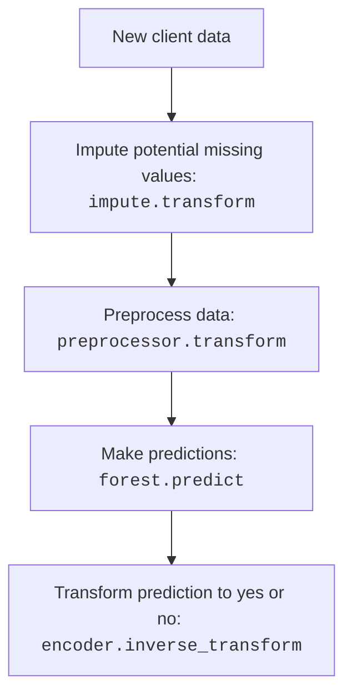

## Introduction

We distill all relevant code blocks from the previous two chapters into one
cohesive script/notebook. This file will be an end-to-end example to fit a
machine learning model on the bank marketing data set. Lastly, we will save the
model to disk.

???+ tip

    The script/notebook we will create, can serve as a reference point for your
    further data science projects.

So start by creating yet another script/notebook.

```plaintext hl_lines="7"
📁 bank_model/
├── 📁 .venv/
├── 📁 data/
├───── 📄 bank-merged.csv
├── 🐍 preparation.py
├── 🐍 modelling.py
├── 🐍 end-to-end.py
```

## Previously...

In the previous chapters, we:

1. Loaded the data
1. Defined techniques to impute (`SimpleImputer`) and preprocess the data
    (`ColumnTransformer`)
1. Split the data into train and test sets
1. Applied imputation and preprocessing techniques to the data
1. Evaluated different model types and concluded that a
    `RandomForestClassifier` is the best model (we found) for this task
1. Fit and evaluated the random forest

Here are the bullet points distilled in one code block:

```python linenums="1"
import pandas as pd
from sklearn.compose import ColumnTransformer
from sklearn.ensemble import RandomForestClassifier
from sklearn.impute import SimpleImputer
from sklearn.metrics import balanced_accuracy_score
from sklearn.model_selection import train_test_split
from sklearn.preprocessing import (
    KBinsDiscretizer,
    LabelEncoder,
    OneHotEncoder,
    StandardScaler,
)

data = pd.read_csv("data/bank-merged.csv")
data = data.replace("unknown", None)

impute = SimpleImputer(strategy="most_frequent", missing_values=None)

preprocessor = ColumnTransformer(
    transformers=[
        (
            "nominal",
            OneHotEncoder(),
            [
                "default",
                "housing",
                "loan",
                "contact",
                "poutcome",
                "job",
                "marital",
            ],
        ),
        ("ordinal", OneHotEncoder(), ["month", "day_of_week", "education"]),
        (
            "binning",
            KBinsDiscretizer(n_bins=5, strategy="uniform", encode="onehot"),
            ["age", "campaign", "pdays", "previous"],
        ),
        (
            "zscore",
            StandardScaler(),
            [
                "emp.var.rate",
                "cons.price.idx",
                "cons.conf.idx",
                "euribor3m",
                "nr.employed",
            ],
        ),
    ]
)

# remove the target from data and assign it to y
y = data.pop("y")
X = data

X_train, X_test, y_train, y_test = train_test_split(
    X, y, test_size=0.2, random_state=42
)

# impute missing values
impute.fit(X_train)
X_train = impute.transform(X_train)
X_test = impute.transform(X_test)

# convert back to DataFrame
X_train = pd.DataFrame(X_train, columns=X.columns)
X_test = pd.DataFrame(X_test, columns=X.columns)

# apply preprocessing (OneHotEncoder, KBinsDiscretizer & StandardScaler)
preprocessor.fit(X_train)
X_train = preprocessor.transform(X_train)
X_test = preprocessor.transform(X_test)

# encode target
encoder = LabelEncoder()
y_train = encoder.fit_transform(y_train)
y_test = encoder.transform(y_test)

# fit on train set
forest = RandomForestClassifier(
    n_estimators=100,
    max_depth=10,
    min_samples_leaf=10,
    random_state=42,
    class_weight="balanced",
)
forest.fit(X_train, y_train)

# evaluate on test set
y_pred = forest.predict(X_test)
score = balanced_accuracy_score(y_test, y_pred)
print(f"Balanced accuracy: {round(score, 4)}")
```

```title=">>> Output"
Balanced accuracy: 0.7445
```

???+ question "Copy and execute the block"

    Since the code block is nothing new, simply copy and execute it. If everything
    went smoothly, you should see the balanced accuracy score printed.

## Re-fit on whole data set

Previously, we split our data into train and test sets. Using the test set we
were able to estimate the performance of our model. That's the whole purpose of
the test set.

Now, our goal is to save the trained model for future use. Therefore, in
practice, we want to leverage the power of the whole data set. Thus, we re-fit
the model on the whole data set to make use of all available data.

```python
# preprocess the whole data set
X = impute.transform(X)
X = pd.DataFrame(X, columns=data.columns)
X = preprocessor.transform(X)

# encode target
y = encoder.transform(y)
```

To preprocess the whole data set, we can reuse the `impute` and `preprocessor`
objects. We only need to transform the data and encode the target. Lastly, we
fit the model on the whole data set. It's as simple as:

```python
forest.fit(X, y)
```

???+ info

    Note, we can simply call `fit()` again, this will "overwrite" the previous
    model and uses the whole data set to fit the model once-again.

The `forest` is now fitted on the whole data set. That's it! We have our final
model which we will save to disk. :party_popper:

## Model persistence

To save the model to disk, we can use
[`pickle`](https://docs.python.org/3.12/library/pickle.html). It's a part of
base :fontawesome-brands-python: Python. With `pickle`, you can save any Python
object and load it back later.

<div style="text-align: center; border-radius: 15px;">
    
    <figcaption>
        <code>pickle</code> comes from the concept of 
        "pickling" in food preservation. Similarly, <code>pickle</code> is 
        used to "preserve" Python objects.
    </figcaption>
</div>

### Simple example

For example, we can save any object such as a simple `#!python list`:

```python
import pickle

simple_list = [1, 2, 3, 4, 5]

with open("list.pkl", "wb") as file:
    pickle.dump(simple_list, file)
```

Let's break down the code block:

1. We open a new file named `list.pkl`; `.pkl` is just a common extension for
    `pickle` files.
1. The file is opened in write-binary mode (`"wb"`) - as pickle files are
    binary files.
1. We use `pickle.dump()` to save the object `simple_list` to the file.

???+ info

    You can delete `list.pkl`, it was just an example.

### Save the model

Let's extend this knowledge to save our model. Unfortunately, it's not just a
matter of saving the `forest` object. First, we look at the steps we need to
take to make a prediction for a new client:

<div style="text-align: center;">
<h4><i>The prediction process</i></h4>

</div>

To get our prediction process working, we need to save all objects involved:

- `impute`
- `preprocessor`
- `encoder`
- `forest`

???+ warning "Critical: Save ALL preprocessing objects!"

    **You must save every single object** used in the prediction pipeline, not just
    the model!

    Missing even one object will break your predictions:

    - Missing `impute` → Cannot handle new missing values
    - Missing `preprocessor` → Cannot transform features correctly
    - Missing `encoder` → Cannot convert predictions back to original labels
    - Missing `forest` → Cannot make predictions

    **The model is useless without its preprocessing pipeline!** :warning:

We can save all these objects in one file using a simple `#!python dict`:

```python
model = {
    "imputer": impute,
    "preprocessor": preprocessor,
    "forest": forest,
    "target-encoder": encoder,
}

with open("bank-model.pkl", "wb") as file:
    pickle.dump(model, file)
```

Bundling all objects in a dictionary ensures you never accidentally forget a
component. When you load `bank-model.pkl`, you have **everything** needed for
predictions in one place.

???+ question "Load the model"

    Create a new script or notebook which we will use to test the saved model.

    Use the following code block to load the `model` `#!python dict`.

    ```python
    import pickle

    with open("bank-model.pkl", "rb") as file:  # (1)!
        model = pickle.load(file)
    ```

    1. `#!python "rb"` stands for read-binary mode.

???+ danger

    Do not download and load `pickle` files from the internet, unless you trust the
    source. Since, `pickle` can execute arbitrary code, it can be a security risk.

## Predictions

Let's run the prediction process. Assume the bank contacted another client with
following attributes:

```python
import pandas as pd

client = pd.DataFrame(
    {
        "id": 155611,
        "age": 54,
        "default": None,
        "housing": "no",
        "loan": "no",
        "contact": "cellular",
        "month": "aug",
        "day_of_week": "tue",
        "campaign": 3,
        "pdays": 999,
        "previous": 0,
        "poutcome": "nonexistent",
        "emp.var.rate": -2.9,
        "cons.price.idx": 92.201,
        "cons.conf.idx": -31.4,
        "euribor3m": 0.878,
        "nr.employed": 5087.2,
        "job": "retired",
        "marital": "divorced",
        "education": "professional.course",
    },
    index=[0],
)
```

Does the client subscribe to a term deposit? :thinking:

???+ question "Make a new prediction"

    Predict if the client will subscribe to a term deposit.

    1. Use the above code snippet to create a new observation `client`.
    1. Use all objects in the dictionary `model` to make a prediction.

    Hint: To make a prediction, simply implement the above prediction process
    illustrated as a graph.

Try to solve the task on your own. For completeness, we provide one possible
solution.

??? info

    ```python
    def predict(model, client):
        # preprocess the client data
        X = model["imputer"].transform(client)
        X = pd.DataFrame(X, columns=client.columns)
        X = model["preprocessor"].transform(X)

        # make a prediction
        prediction = model["forest"].predict(X)
        # inverse transform (0, 1) to ("no", "yes")
        prediction = model["target-encoder"].inverse_transform(prediction)

        return prediction
    ```

## Conclusion

Across three chapters, we successfully reached our end goal: To build a machine
learning model on the bank marketing data set. We ended up with a random forest
model with a balanced accuracy of 74.45%.

The saved model can be deployed in a production environment. The prediction
process is straightforward and can be easily applied on new clients.

______________________________________________________________________

<div style="text-align: center;">
    <h3>
        Congratulations, you have reached the end of this practical guide! 🎉
        You are now well-equipped to tackle your own data science projects.
    </h3>
</div>

______________________________________________________________________

## Outlook

There are many more avenues to explore in the data science/machine learning
landscape:

### :rocket: Model deployment

Learn how to deploy a model in a production environment. This can be done with
a REST API, a web application or a mobile application (among others).

Start with:

- `fastapi` for building APIs
    [:octicons-link-external-16:](https://fastapi.tiangolo.com/)

which is a great way to serve your model.

### :woman_technologist: Model persistence with `onnx`

The Open Neural Network Exchange (ONNX) format provides an interesting
alternative to `pickle`. ONNX allows you to convert your trained models into a
standardized format that can be run efficiently across different platforms and
programming languages.

For example, `onnx` allows you to build the model in
:fontawesome-brands-python: Python and deploy it with :fontawesome-brands-js:
JavaScript.

Start with:

- `onnx` documentation for Python
    [:octicons-link-external-16:](https://onnx.ai/onnx/intro/python.html)
- `onnx` with `scikit-learn`
    [:octicons-link-external-16:](https://scikit-learn.org/stable/model_persistence.html#onnx)

### :toolbox: Expand your model toolkit

We covered a selection of different model types, yet there are many more to
explore. `scikit-learn` offers many more models for classification, regression,
clustering or dimensionality reduction.

Since you're already familiar with `scikit-learn`, applying these models is
straightforward.

Start with:

- `scikit-learn` documentation.
    [:octicons-link-external-16:](https://scikit-learn.org/stable/index.html)

### :wrench: Advanced pipeline techniques

`scikit-learn` offers more sophisticated ways for modelling through pipelines.
In a bonus chapter we explore advanced techniques for hyperparameter tuning,
custom transformers and more.
