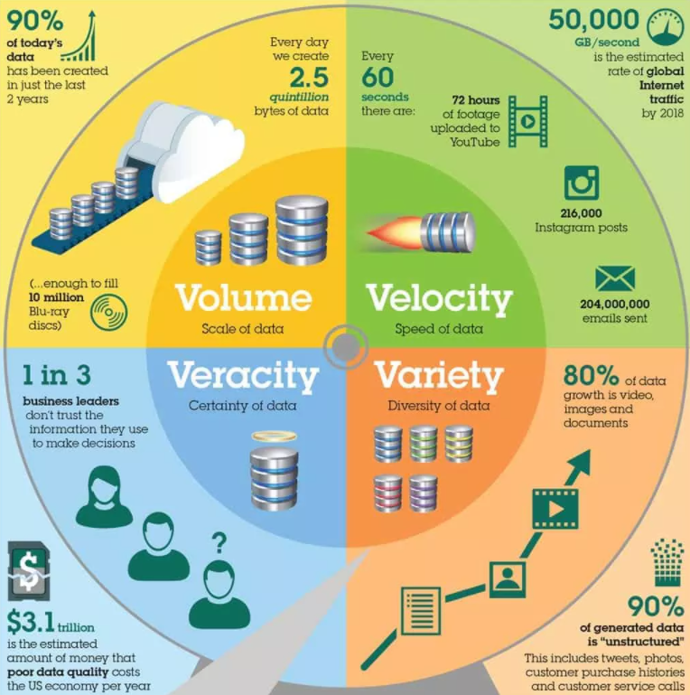

# Data vs. Big Data

In its simplest form, data represents information stored digitally :fontawesome-solid-database:, serving as a foundation for analysis and decision-making. Data acts as building blocks for information and knowledge when it is organized and processed. Data is the fundamental element upon which insights, decisions, and actions are based in fields like science, business, and technology.

## Classical Data
**Classical data** refers to traditional datasets that have been analyzed for decades. These datasets are typically **structured**, meaning they are organized in a predictable way, such as rows and columns in a relational database. Classical data is generally **smaller in volume**, ranging from megabytes (MB) to gigabytes (GB), and can be processed using **standard tools** like SQL databases or spreadsheets :fontawesome-regular-file-excel:. Key characteristics of classical data include:

- **Structured Format**: Data is arranged in a predefined schema, such as tables with rows and columns.
- **Low to Moderate Volume**: Datasets are relatively small and manageable.
- **Predictability**: The data follows a consistent structure, making it easier to analyze using traditional methods.
- **Centralized Storage**: Classical data is typically stored in centralized databases, managed by database management systems (DBMS).

Classical data is ideal for tasks where data volumes are manageable, the structure is well-defined, and computational requirements are not excessive. Examples include customer transaction records, survey data, or small-scale experimental data.

## Big Data
**Big Data** refers to datasets that are **large, complex, or fast-changing**, often surpassing the capabilities of traditional data tools. Big Data is characterized by the "three Vs": **Volume**, **Velocity**, and **Variety**. These datasets are often unstructured or semi-structured and do not fit neatly into traditional database formats. The size of Big Data can range from terabytes (TB) to petabytes (PB) or more. Key characteristics of Big Data include:

- **Volume**: The data size is massive, requiring distributed systems like Hadoop or cloud-based solutions for storage and processing.
- **Velocity**: Data is generated and processed at high speeds, often in real-time.
- **Variety**: Big Data comes in various formats:
    - **Structured**: Data that can be mapped in databases like addresses, product lists, HR management
    - **Unstructured**: Files like PDF, scanned mails, presentations, images, and videos.
    - **Semi-structured**: Partly structured, partly unstructured like mails (recipient, sender and subject show a structure, but content is unstructured)
- **Complexity**: The diversity and interconnectedness of data sources add to the complexity of managing and analyzing Big Data.

<figure markdown="span">
    { width=100% }
    <figcaption>Visualisation of Big Data according to IBM (Source: <a href="https://blogdozouza.wordpress.com/2016/01/21/extracting-business-value-from-the-4-vs-of-big-data/">BlogDozouza</a>)</figcaption>
</figure>

Big Data requires specialized tools and technologies to handle its characteristics. Distributed computing frameworks like Apache Hadoop and Spark, NoSQL databases, and advanced machine learning algorithms are often employed to extract insights from these vast and complex datasets. Examples of Big Data include social media interactions, sensor data from the Internet of Things (IoT), and genomic sequences.

<figure markdown="span">
    { width=100% }
    <figcaption>60 Seconds in the Internet (Source: eDiscovery Today & LTMG)</figcaption>
</figure>

## Understanding the Difference
Understanding the differences between classical data and Big Data is essential for professionals in data analysis, data engineering, or data science. Classical data involves structured and manageable datasets processed with conventional tools, while Big Data deals with vast, fast-moving, and complex datasets requiring innovative storage solutions and advanced processing methods.

|                              | **Classical Data**        | **Big Data**                     |
|-------------------------------:|:---------------------------:|:-----------------------------------:|
| **Scale**                     | Small                     | Massive                          |
| **Structure**                 | Structured                | Structured, Semi-structured, Unstructured |
| **Processing Requirements**   | Traditional tools         | Advanced algorithms              |
| **Storage**                   | Centralized database      | Distributed storage              |
| **Analytical Approaches**     | Statistics                | Machine learning, Data mining, Real-time processing |
