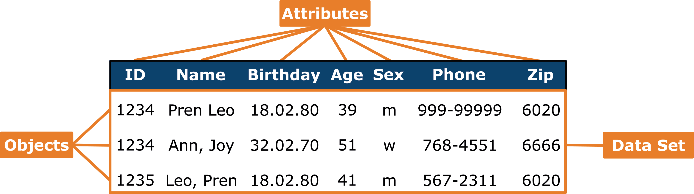
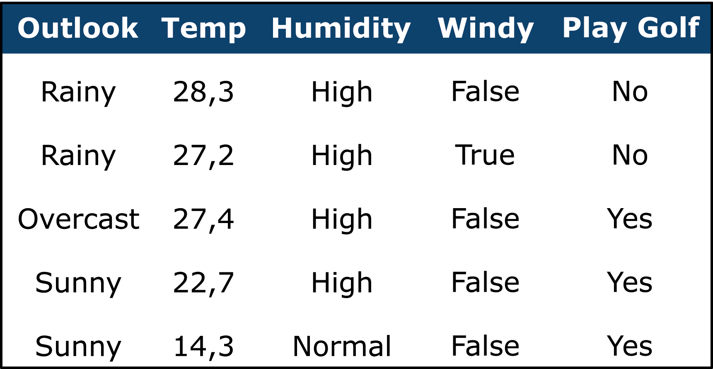

# Data Basics
Before starting with Data Science, it's essential to **get to know the data** you'll be working with. This means thoroughly examining the attributes and values to understand their characteristics. Real-world data is often messy, large, and diverse, which can make it difficult to handle. For example, data from sensors might include missing or corrupted values, while social media data might be unstructured and include text, images, or even videos. In financial data, outliers or extreme values may skew analysis results.

Having a deep understanding of the data is crucial for successful data preprocessing, which is the first major step after acquiring the data. For instance, in sensor data, you may need to filter noise, while in social media data, you might need to convert unstructured text into a structured format for analysis. The main objective is to gather useful insights about the data, which will aid in the preprocessing stage, such as identifying patterns, missing values, or outliers. Grasping these aspects early on provides a solid foundation for the rest of your data analysis process.

## Dataset, Objects, Attributes
In order to do that, we need to distinguish between the terms data set, object and attribute:

- **Data Set**: A data set is a collection of related data organized in a structured format. It consists of multiple objects, each described by a set of attributes. A data set can be represented as a table, where each row corresponds to a data object and each column corresponds to an attribute. Data sets are commonly used in data analysis, machine learning, and other data-driven tasks, serving as the primary source of input for these processes.
- **Object**: An object (or sometimes records, instances, or entries) is an individual unit of data within a data set. It represents a single entity or instance, such as a person, a product, or an event, depending on the context of the data. Each data object is characterized by a set of attributes, which define its specific properties or features. In a tabular data set, a data object corresponds to a row, with each attribute value for that object stored in the respective columns.
- **Attributes**: Attributes (or sometimes variable, field, dimension, feature or observations) are the characteristics or properties that describe data objects in a data set. Each attribute represents a specific feature of the data object and is associated with a particular value. For example, in a data set of customer information, attributes might include "Name," "Age," "Gender," and "Purchase History." In a tabular representation, attributes are typically the column headers, with each column containing the attribute values for the corresponding data objects (rows). Attributes can be of different types as described later.

???+ example "Example: Data Set"
    <figure markdown="span">
        { width=100% }
    </figure>
    The displayed data shows a dataset consisting of three objects and seven attributes. The first attribute, `ID` is a key attribute and is meant to uniquely identify each object.

## Qualitative vs Quantitative
A variable is called **qualitative** (categorical) when each observation distinctly falls into a specific category. Qualitative variables express different qualitative properties, but do not convey any magnitude. Conversely, a variable is termed **quantitative** (numerical) when it measures the magnitude of a property. Quantitative variables can be either **Discrete** (The variable can only take on a finite number of values) or **Continuous** (The variable can take on any value within a given interval).

???+ example "Example: Qualitative vs Quantitative Attributes"

    - **Qualitative**: Race, religious affiliation, gender, children in the household (yes/no)
    - **Quantitative**: Age, test scores, number of children in a household
        - **Discrete**: Number of children in a household  
        - **Continuous**: Height, weight, length measurements

## Attribute Types
We now know, that attributes define the properties of data objects and are crucial in determining the methods and algorithms that can be applied during analysis. Different types of attributes - such as nominal, ordinal, interval, and ratio - each have unique characteristics that influence how they should be handled and interpreted. Recognizing and appropriately categorizing these attribute types is a key step in ensuring accurate data analysis and meaningful results.

### Nominal
Nominal attributes refer to those that are associated with **names or labels**. 

```py
cars = ['BMW', 'Audi', 'VW', 'Skoda', 'Tesla', 'Audi']
```

The values of nominal attributes are typically symbols or names representing different categories, codes, or states. These values are used to classify data into distinct groups, often referred to as categorical attributes. Importantly, the values of nominal attributes do not have any inherent or meaningful order; they simply indicate membership within a particular category without implying any rank or sequence. 

???+ example "Example: Nominal Attributes"

    - Occupation: teacher, dentist, programmer, farmer,...
	- Hair color: black, brown, blond, red, gray, white,...

    You can only determine whether two people have the same hair color or not. It is not possible to establish a greater-than or less-than relationship, and the differences between hair colors cannot be meaningfully interpreted.

The symbols or names associated with nominal attributes can also be **represented by numbers**.

```py
cars_num = [1, #'BMW'
            2, #'Audi'
            3, #'VW'
            4, #'Skoda'
            5, #'Tesla'
            2] #'Audi'  
```

However, in such cases, these numbers are not meant to be used quantitatively, meaning that mathematical operations on them are not meaningful. For instance, calculating the mean or median of these numbers would not make sense. 

```py
import statistics 
statistics.mean(cars_num)
```

```title=">>> Output"
2.8333333333333335
```

But what does that mean? Is it half `#!python 'Audi'`, half `#!python 'VW'`? And we also could have used the numer `#!python 32` for `#!python 'Audi'` and `#!python 0` for `#!python 'VW'`. So its meaningless! 

Instead, the mode, which identifies the most frequently occurring value, can be used and is particularly useful in this context.

```py 
statistics.mode(cars)
```

```title=">>> Output"
Audi
```

???+ example "Example: Nominal Attributes Represented by Numbers"

    - Customer ID: 0001, 0002, 0003, 0004, 0005,...
    - Hair color: black=001, brown=010, blond=011,...


**Binary attributes** are a specific type of nominal attribute that consist of only two categories. These categories are often represented by the numbers 0 and 1, where 0 indicates the absence of the attribute and 1 indicates its presence. This binary classification is commonly used in data analysis to represent simple variables

???+ example "Example: Binary Attributes"

    - Smoker: Yes=1, No=0
	- Medical Test: Positive=1, Negative=0

### Ordinal

For certain types of attributes, the possible values have a **meaningful order** or ranking among them, indicating that one value can be considered greater or less than another. However, while this order is significant, the exact magnitude or distance between successive values is not known. This means that while the sequence of values is meaningful, we cannot quantify the difference between them with precise measurements. Therefore it is possible and meaningful to calculate the median and mode. Mean on the other hand is not meaningful.

```py 
drinks = ['small', 'small', 'small', 'medium', 'medium', 'medium', 'large']

print('Median: ' + statistics.median(drinks))
print('Mode: ' + statistics.mode(drinks))
```

```title=">>> Output"
Median: medium
Mode: small
```


???+ example "Example: Ordinal Attributes"

    - Professional Rank: private, specialist, corporal, sergeant
	- Drink size: small, medium, large
    
    As with the nominal scale, you can determine whether two drinks are the same size or not. Additionally, you can say whether one drink is larger than another. However, it is still not possible to meaningfully interpret the differences between sizes. You cannot specify by how much one drink is larger than another.

### Numerical

Numeric attributes are quantitative in nature, meaning they represent **measurable quantities**. These attributes can be expressed as either integer or real values. One of the key characteristics of numeric attributes is their ability to quantify the difference between values, allowing for meaningful comparisons. Statistical measures such as the mean, median, and mode can be calculated from numeric attributes, and these measures are both possible and useful for analyzing the data.

```py 
income = [1005, 2500, 2500, 5100, 6011, 10500]

print('Mean: ' + str(statistics.mean(income)))
print('Median: ' + str(statistics.median(income)))
print('Mode: ' + str(statistics.mode(income)))
```

```title=">>> Output"
Mean: 4602.67
Median: 3800.0
Mode: 2500
```

#### Interval-scaled 

Interval-scaled attributes can be measured on a scale with equal-sized units, allowing for consistent and comparable intervals between values. These attributes have an inherent order and they can take on positive, zero, or negative values. This means that the ranking of values is possible and meaningful, providing a clear sense of progression or regression along the scale.

???+ example "Example: Interval-scaled Attributes"

    - Calendar dates: For instance, the years 2002 and 2010 are eight years apart
	- Celsius temperature: $20^\circ C$ is five degrees higher than a temperature of $15^\circ C$

    As with the ordinal scale, you can determine whether two temperatures are the same and whether one temperature is higher than another. Additionally, the difference between temperatures can be meaningfully interpreted. However, because the zero point is arbitrary, ratios cannot be meaningfully interpreted.

#### Ratio-scaled 

Ratio-scaled attributes possess an inherent zero-point, which indicates the complete absence of the attribute. This characteristic allows us to meaningfully discuss one value as being a multiple of another. Because of this, ratio-scaled data supports a wide range of mathematical operations, including meaningful comparisons of both differences and ratios between values.

???+ example "Example: Ratio-scaled Attributes"

    - Kelvin temperature: has true zero-point
	- Count attributes: years of experience, number of words, Income in Euros
		
    As with the interval scale, you can determine whether two people have the same income and whether one person earns more than another. Additionally, the differences between incomes can be meaningfully interpreted. Furthermore, the ratio between two incomes can now also be interpreted, such as determining how many times one income is compared to another.


???+ question "Task: Attribute Types"

    Name the types of attributes in the following data set and justify
    <figure markdown="span">
        { width=60% }
    </figure>