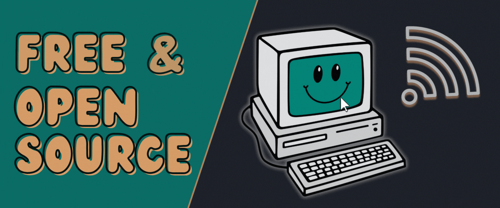

# MCI | Industrial Engineering & Management

## Welcome to the world of `Python` :fontawesome-brands-python:! 

Here, you’ll find a variety of hands-on resources designed to guide you step-by-step through the world of programming, data analysis, and beyond. All educational materials on this page can be followed without ^^any^^ prior knowledge -- All you need is a computer, an internet connection, and curiosity :material-lightbulb-on:. Since our course materials are centered around the `Python` :fontawesome-brands-python: programming language, all software used is free and open-source. 

**Dive in and discover new skills at your own pace!**

???+ info
    
    This page hosts course materials for various Python
    :fontawesome-brands-python: lectures.

    As we continously try to improve the materials and this page, content
    might be subject to change. If you have any questions or suggestions,
    feel free to open an [issue](https://github.com/mciwing/mciwing.github.io/issues)
    on GitHub or contact the maintainers:
    
    

    - 
        Manuel

        :fontawesome-regular-envelope: - [manuel.ferdik@mci.edu](mailto:manuel.ferdik@mci.edu)

    - 
        Jakob

        :fontawesome-regular-envelope: - [jakob.klotz@mci.edu](mailto:jakob.klotz@mci.edu)
    

## Topics

### :fontawesome-brands-python: Python Crash Course

- 
    
    Get started with the basics of the Python programming language. We will
    start from zero - setting up Python on your computer, learning to store and
    work with different types of information, and building up to writing your
    own code. Step by step you will understand fundamental programming concepts
    and by the end, you will be able to write your own simple Python programs.

    [:octicons-arrow-right-24: Get started](python/index.md)

### :fontawesome-brands-python: Python Extensive Course

- 

    
    Delve deeper into Python’s capabilities, covering advanced use of data types, control structures, and functions - plus practical development tools like Git. You will practice data handling with pandas, learn how to build basic graphical interfaces, and get hands-on experience with data acquisition and plotting. By the end, you will be confident in developing more robust Python applications and managing code in collaborative environments.

    [:octicons-arrow-right-24: Get started](python-extensive/index.md)

### :material-chart-bar: Statistics

- 
    
    Explore the foundations of descriptive and inferential statistics with Python. You will learn how to calculate univariate and bivariate measures, work with probability theory, and perform hypothesis testing and regression analysis. By the end, you will be able to apply statistical methods to real-world datasets and interpret the results with confidence.

    [:octicons-arrow-right-24: Get started](statistics/index.md)

### :material-family-tree: Data Science

- 
    
    Learn how to prepare and preprocess data before diving into machine learning concepts such as supervised and unsupervised learning. You will explore evaluation metrics, build end-to-end pipelines, and discover best practices for model persistence. By the end, you will be ready to implement data science workflows and create data-driven solutions to complex problems.

    [:octicons-arrow-right-24: Get started](data-science/index.md)

### :material-eye: Computer Vision

- 
    
    Gain an understanding of object detection and segmentation techniques, while exploring YOLO-based approaches for both images and videos. You will learn how to process visual data, develop detection solutions, and even train your own models. By the end, you will be equipped to tackle fundamental computer vision tasks and build custom vision applications.

    [:octicons-arrow-right-24: Get started](yolo/index.md)

