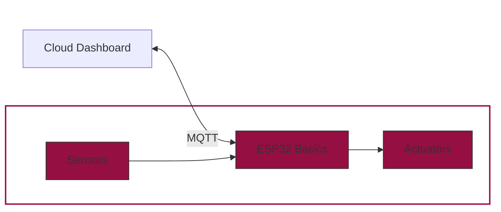

The pump cannot simply be connected to a GPIO pin. A water pump is basically just an electric motor. The pump you are using needs 3V voltage and 100mA current. There are several ways to connect the pump. The most common is to use an external voltage source and some safety components, such as a diode and resistors, to regulate the current and ensure that the current only flows where we want it to.

Another possibility is a MOSFET (metal-oxide-semiconductor field-effect transistor). You can think of a MOSFET as an electronic valve or switch. It can either be built directly into the circuit or a MOSFET driver module can be used. A MOSFET has 3 pins: gate, drain and source. Drain and source specify a potential difference that we can switch with the gate. If we connect drain to ground and source to 3.3V, we have the 3.3V potential difference and can switch it through by controlling the gate pin with a GPIO. If we set the GPIO to high (i.e. 1), the MOSFET is switched through and we receive the 3.3V on the pump. If the GPIO is set to low again (i.e. 0), the mosfet is closed and no more current can flow as there is no potential difference. You can also visualise it like this: You connect 2 buckets full of water to a hose and there is a valve in the centre of the hose. In order for water to flow, the valve must be open and one of the two buckets must be higher than the other. The potential difference here is the difference in height and we are talking about potential energy, not electrical energy. But you can see the parallels. The GPIO does nothing other than control the valve.

If you use the driver, the whole thing is actually constructed in the same way. The MOSFET driver module is a small board with a MOSFET soldered in and slightly more comprehensible output labelling. Both are equivalent for the project. Normally an external source is used for such projects, for example AAA batteries. However, the microcontroller manages the low current required by the pump and also has the necessary voltage. The pump actually needs 3V, but gets 3.3V. That's not too bad. We usually have some losses through the cables, MOSFET etc.  In addition, it may well be that the pin does not output exactly 3.3V and the pump simply draws the current it needs; if a little more voltage is applied, it may also draw a little more current. This should not be relevant for this water pump. However, if you connect a different motor, this may well be a problem. It is best to carefully read the motor's data sheet. There should be an upper limit for current and voltage somewhere in there. Then you would need to use additional resistors to limit current or use an external source such as batteries to ensure a constant voltage. It should also be noted that the setup here works because we only use one sensor and the pump. The ESP32 chip can produce enough current to power the pump. However, if a large number of additional pins are used and very computationally intensive programmes are executed on the chip, the microcontroller may need so much of the current itself that it can no longer supply enough current to the pump. In this case, the pump could not be used. However, as we take a certain sequence of operations into account in the project and don`t use a lot of additional hardware, this should not be a problem.

xxxx pump.py

Now you have the tools to water your plants. But how much water do they need and what are good threshold humidity values for different plants and environments?

| **Plant Type** | **Moisture Threshold (%)** | **Notes** |
| --- | --- | --- |
| Succulent & Cacti | 10-30% | Soil should be very dry between waterings |
| Medium-water plants | 30-50% | Examples: pothos, spider plants. Allow the top centimeters to dry |
| Tropical plants | 50-70% | Examples: peace lilies, ferns. Maintain consistent moisture without waterlogging |
| Edible plants, herbs | 40-60% | Most herbs like moist but well-draining soil |
| Flowering plants | 40-70% | Example: Violets, begonias. Avoid extreme watering for blooms | 

1. **Adjusting thresholds based on environment**
    - **Light:** Increase threshiolds by 5-10% for broght, sunny locations to compensate for faster drying.
    - **Humidity:** Decrease thresholds by 5-10% in high-humidity environments to avoid overwatering.
    - **Soil Type:** For sandy soil, keep thresholds lower (water drains quickly). For clay soil, keep thresholds higher (retains water longer).

2. **How much water to provide per watering**
    - **Small plants (<15cm pots):** Use about 100-200 ml of water per watering.
    - **Medium plants (<15-30cm pots):** Use about 250-500 ml.
    - **Large plants (>30cm pots):** Use about 500-1000 ml. 

Our water pump should dispense approximatley 30-50 ml of water per second. Adjust the *pump_on_time* depending on how much water you need for the plant. For average soil for potted plants, 100 ml of water corresponds to about 10-20% moisture. You can easily test this at home. It is best to first check how much water is dispensed in one second. If you let the soil dry out completely and then add a certain amount of water, you can see how much the moisture value increases. This can be used to create a spreadsheet. Soil also has a saturation level. Add water to the soil until the moisture level barely changes. This is the point at which the soil is saturated. These are then the start and end points of your spreadsheet. 

Example:

* **Suppose you have a medium pot with 1.5 liters of soil:**
    * Inital soil moisture: 30%
    * Add 100 ml water
    * New soil moisture: 40%
    * Ratio: 
$$ \frac{ΔMoisture}{Water\: Volume} ​= \frac{40\%−30\%}{100 ml} ​= 0.1\% \:per \: ml $$

