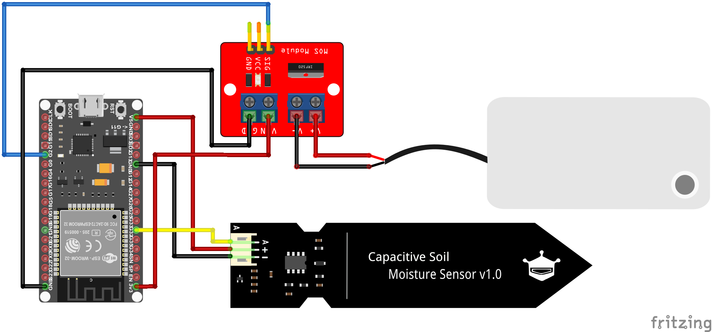
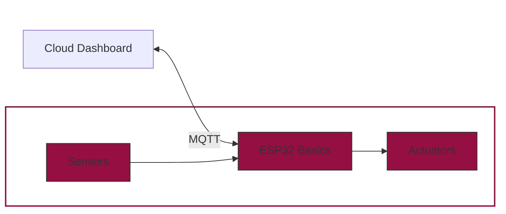

# Controlling a Water Pump

Now that we can successfully read the soil moisture, it’s time to take action: if the soil is too dry, our system should water the plant instead of turning on the LED. To do this, we’ll use a small water pump and control it with our ESP32.

<figure markdown="span">
    
</figure>

## The Hardware

### Submersible Pump

A submersible pump is a compact electric pump designed to operate underwater, typically used to move liquids from one place to another. In our project, it draws water from a reservoir to irrigate a plant.

Submersible pumps work by pushing water to the surface using an impeller, which creates fluid pressure. They are quiet, efficient, and ideal for applications where space and simplicity are important - like automatic plant watering systems.

<figure markdown="span">
    
</figure>

The wiring of the pump is quite simple. It has 2 wires: **Red** for ~3V and **Black** for GND.

### Pump Power Supply

Microcontrollers like the ESP32 cannot directly power components such as motors or pumps - they simply don't provide enough current. For example, our water pump operates at 3 V and requires 100–200 mA, while a single GPIO pin of the ESP32 can only supply around 15 mA. Therefore, we need an **interface** that allows us to switch higher currents using the ESP32’s low-power control signals. The most common solutions are **relay modules** and **MOSFET drivers**.

In this project, we use a **MOSFET driver module** like this one:

<figure markdown="span">
    
</figure>

It acts like an electronically controlled switch: the small signal from a GPIO pin controls whether a larger current flows through the pump. A MOSFET has three terminals:

- **Gate**: the control input (connected to the ESP32 GPIO)
- **Drain**: where current flows out (connected to the pump's negative side)
- **Source**: the return path to ground

When the gate is set `HIGH`, the MOSFET allows current to flow from source to drain, completing the circuit and powering the pump. When the gate is set `LOW`, the switch is off and no current flows.

Although pumps are often powered by external sources (e.g. AAA batteries), in this case the ESP32's onboard 3.3 V output is sufficient. While the pump is rated for 3 V, running it at 3.3 V is acceptable - small voltage differences are typically tolerated, especially with minor losses through wires and switching components.

???+ warning "Power Supply Limitations"

    However, this simplified setup works only under certain conditions. If you plan to use larger motors or additional components, or if your code requires heavy processing, the ESP32 may no longer be able to provide enough power.

## Wiring the Pump

For this chapter, we want to go further in our project and combine all the components we have learned so far with a simple connection of a pump.
Therefore, we need to connect all the components as shown in the following diagram:

<figure markdown="span">
    
</figure>

## Coding

To control the pump, we simply need to control one single GPIO pin connected to the MOSFET driver module. By switching the GPIO pin from `HIGH` to `LOW`, we directly control the pump.

???+ question "Task: Watering System Automation"
    Now it's time to build a first version of our watering system. Perform the following steps:

    - Use the code from the previous chapters to read the sensor and turn on the pump instead of the LED.
    - Adjust the code to:
        - Read the sensor every 10 seconds.
        - If moisture is below 30%, turn on the pump for 5 seconds.
        - Print appropriate messages in the terminal.
        - Test the behavior with wet and dry sensor conditions.

    <figure markdown="span">
        
    </figure>

---

## Conclusion

You now know how to switch a water pump using a MOSFET driver. In the next chapter, we’ll learn how to send the sensor values to the cloud and receive commands using **MQTT**!

