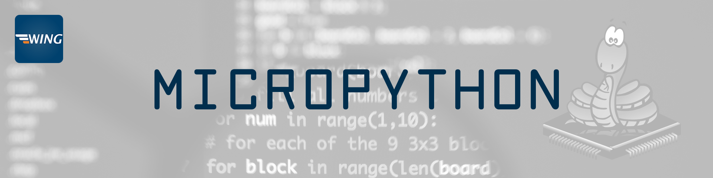
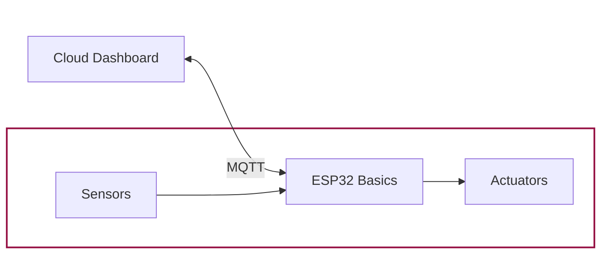

# Home

Welcome to the `MicroPython` Course! :waving_hand:

This course is designed to provide you with a comprehensive introduction to building an IoT project with MicroPython on the ESP32. You will learn how to read sensor data, control a water pump, communicate via MQTT, and create a dashboard for remote monitoring - all through hands-on code examples!

## Course overview

1. **Setup & Basics:**  Introduction to MicroPython, flashing the ESP32 with the firmware, setting up your development environment and learn the basics of MicroPython by controlling the onboard LED.
3. **Sensor Integration:**  Interface with a soil moisture sensor to monitor your plant’s water needs.
4. **Actuator Control:**  Learn to drive a pump (via a relay module) based on sensor readings.
5. **MQTT Communication:**  Transmit sensor data and receive remote commands using MQTT.
6. **Dashboard Development:**  Create an interactive dashboard to visualize sensor data and control your watering system.

## Tools

In this course, we use MicroPython running on the ESP32 along with these great tools:

---

    

        
    

    

        
    

    

        
    

    

        
    

---

## Sneak peek

Here is a sneak peek of selected topics we cover in this course:

-   __:bulb: MicroPython Basics & LED Control__ 

    --- 
    Learn how to flash your ESP32 with MicroPython and start by blinking the onboard LED.

-   <figure markdown="span">
        
    </figure>

-   <figure markdown="span">
        
    </figure>

-   __:seedling: Sensor Integration__ 

    --- 
    Read data from a soil moisture sensor to detect your plant’s water needs.

-   __:electric_plug: Pump Control__ 

    --- 
    Control a water pump (via a relay) to automate the irrigation process.

-   <figure markdown="span">
        
    </figure>

-   <figure markdown="span">
        
    </figure>

-   __:satellite: MQTT Communication__ 

    --- 
    Transmit sensor data and receive remote commands using MQTT for real-time control.

-   __:chart_with_upwards_trend: Dashboard Development__ 

    --- 
    Build a user-friendly dashboard to monitor sensor readings and control the pump.

-   <figure markdown="span">
        
    </figure>

## Needed Hardware

The following hardware is needed for this course:

- 1x [ESP32-Wroom-32 Breakout Board](https://www.az-delivery.de/products/esp32-developmentboard)
- 1x [Adafruit Submersible 3V DC Water Pump](https://www.adafruit.com/product/4547)
- 1x [MOSFET Modul](https://www.keyestudio.com/products/1pcs-mos-fet-tube-drive-module-irf520-driver-module-for-arduino-driver-module)
- 1x [HW-390 Moisture Sensor](https://www.vipitec.de/produkt/kapazitiver-bodenfeuchtesensor-v2-0-mit-anleitung-hw-390-3-3-5-v_06-0002-00001A)
- 1x Micro USB Cable
- 1x Jumper Wires (F-M & F-F)
- 1x 1k Ohm Resistor

## Expected outcome

By the end of this course, you will have built a complete smart plant watering system. You will know how to:

- Monitor soil moisture using a sensor.
- Automatically control a water pump based on sensor data.
- Communicate with your device via MQTT.
- Visualize data and interact with your system through a dashboard.

---

    <h3>Let's get started! 🚀</h3>

---
