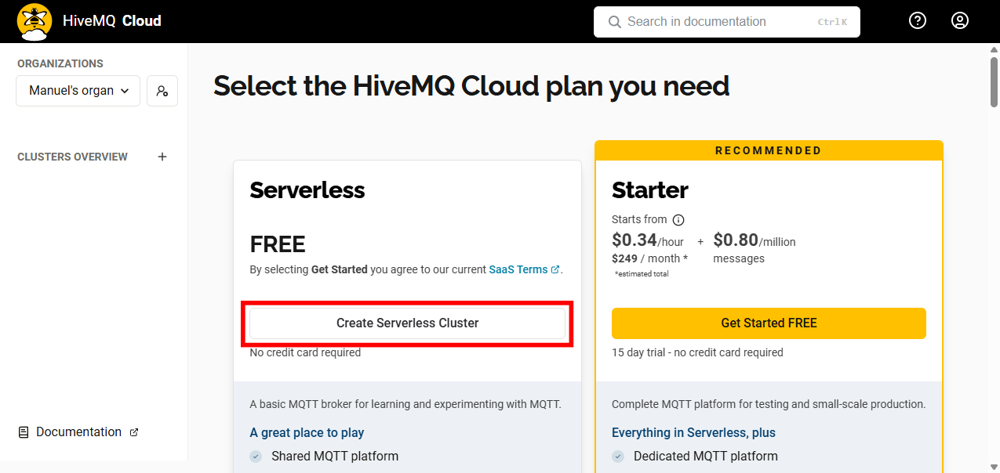
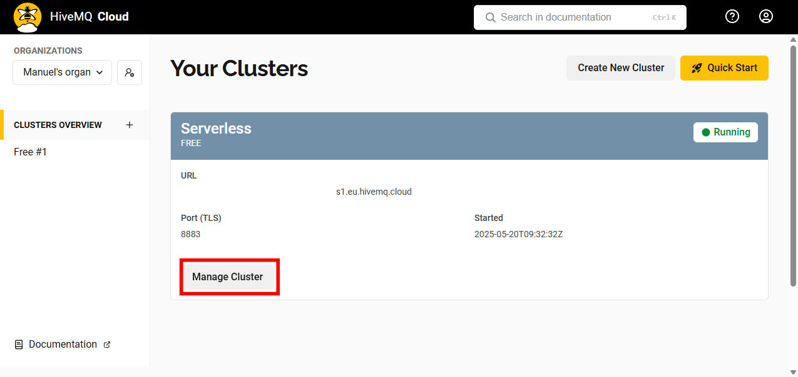
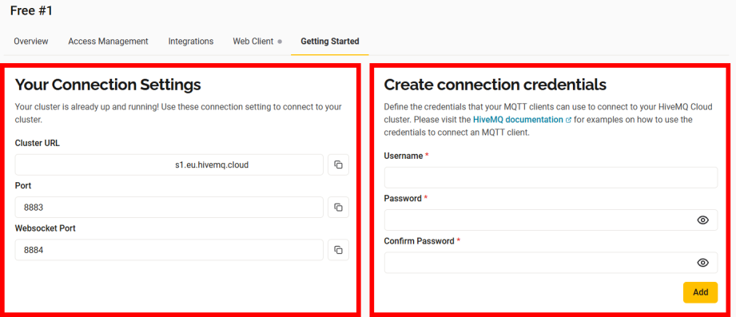
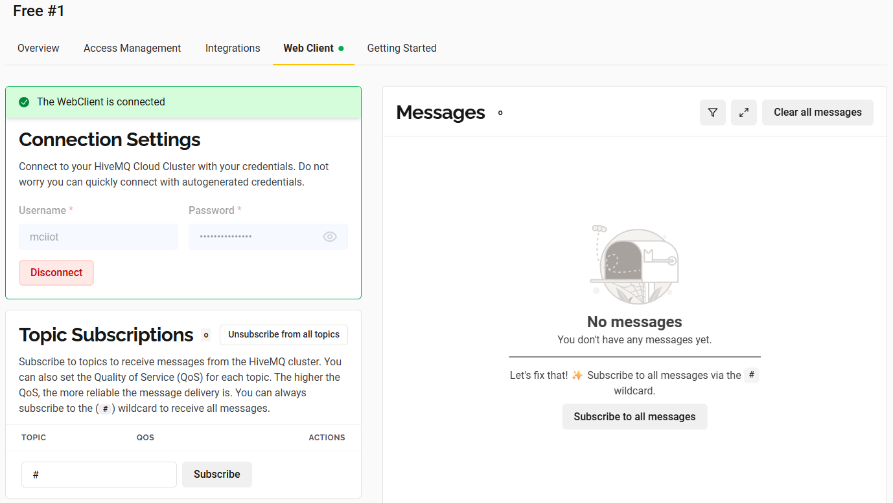
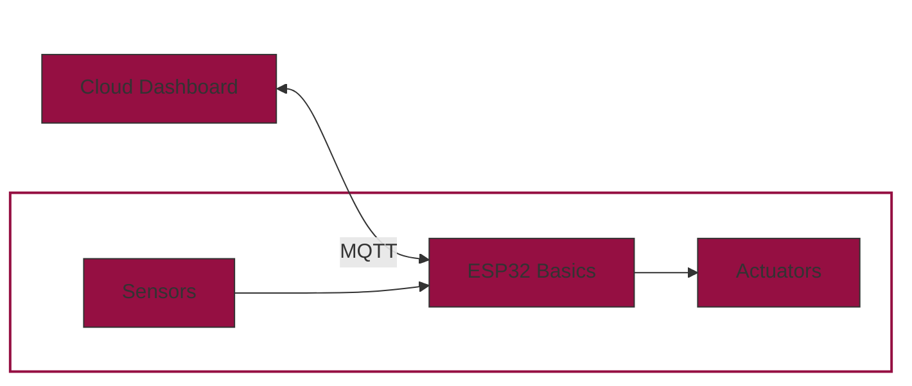

# Cloud Dashboard

<figure markdown="span">
    
</figure>

Let's take a deep breath and think about what we've done so far. We've learned how to work with an ESP32 microcontroller, how to read a sensor and how to control an actuator. 
But so far, we are only able to interact with our system locally over the USB connection. So, to update the threshold or to manually turn the pump on and off, we need to be physically present at the system.
Now, we want to change this! 

The goal of this chapter is to make our system more interactive. We want to be able to see the sensor values and control the actuator from everywhere (at least where you have an internet connection).
We will build a browser-based dashboard using **MQTT Tiles** from [flespi.io](https://mqtttiles.flespi.io/#/). The dashboard will allow you to monitor sensor values (like soil moisture) and send control commands (like humidity thresholds) directly to your ESP32 device via MQTT.

---

## What is MQTT?

**MQTT** (Message Queuing Telemetry Transport) is a lightweight, publish-subscribe network protocol designed for reliable communication between devices over low-bandwidth or high-latency networks.

The key concepts of MQTT are:

* **Broker**: The central server that manages communication between clients.
* **Topic**: The channel to which devices can **publish** or **subscribe**.
* **Payload**: The message content.

MQTT follows a publisher/subscriber model, which makes it scalable and well-suited for IoT systems.

???+ tip "Publish-Subscribe Model"
    Think of it like Instagram: users post messages to a channel (topic), and followers (subscribers) get updates in real time.

---

## Setting up a MQTT Broker
Before we can start programming our ESP32, we need to create a MQTT broker. In this example we will use [HiveMQ](https://www.hivemq.com/) as a free cloud-based broker.
Follow these steps to create and configure your own MQTT broker:

1. Visit [HiveMQ](https://www.hivemq.com/)
2. Sign in using Google, GitHub, or LinkedIn — or create a free account
3. Select the Free Plan and create a serverless cluster

    

4. Click on 'Manage Cluster'

    

5. Switch to the 'Getting Started' tab

    

    - Left side: you'll find all the details needed to connect (Cluster/Broker URL, TLS Port (8883), WebSocket URL)
    - Right side:In order to connect to the broker, you need to create a connection credential. Therefore, enter a username and password and click on 'Add'. After creation, credentials can be reviewed and managedunder the 'Access Management' tab

6. To test your connection. Go to the 'Web Client' tab, enter your MQTT credentials and click 'Connect'. You should see a green 'connected' message. +

    

## ESP32 Setup
### Hardware

To send and receive data from the ESP32, no additional hardware is required. However, since we will continue building on our irrigation system later, we will keep using the same circuit setup as before. So, **no changes to the wiring are needed at this point**.


### Wi-Fi Connection 🌐

The standard MicroPython installation on the ESP32 includes a built-in **Wi-Fi library**, making it easy to connect to a wireless network with just a few lines of code. For detailed documentation, see the [MicroPython Wi-Fi guide](https://docs.micropython.org/en/latest/esp32/quickref.html#wlan).

To establish an internet connection, the following code can be placed in the `boot.py` file, as the connection only needs to be initialized once at startup:

???+ tip "Security Tip"
    Never store credentials directly in your main code. Instead, create a separate `config.py` file:

    ```python linenums="1" title="config.py"
    ssid = "your_ssid"
    password = "your_password"
    ```

```python linenums="1" title="boot.py"
# WIFI CONFIGURATION
import machine, network
import config # own config.py file

def do_connect():

    wlan = network.WLAN()
    wlan.active(True)
    if not wlan.isconnected():
        print('connecting to network...')
        wlan.connect(config.ssid, config.password)
        while not wlan.isconnected():
            machine.idle()
    print('connection successful!')
    print('network config:', wlan.ipconfig('addr4'))
    return wlan

wlan = do_connect()
```

???+ warning "WPA2 Enterprise (Eduroam)"
    Unfortunately, the ESP32 does not support WPA2 Enterprise networks like Eduroam.
    To work around this, use a different Wi-Fi router or create a personal mobile hotspot.

???+ question "Task: Connect and Disconnect from Wi-Fi"
    - Connect to your Wi-Fi network using the `do_connect()` function.
    - After a successful connection, disconnect from the Wi-Fi network. Take a look in the [documentation](https://docs.micropython.org/en/latest/esp32/quickref.html#wlan) for the `wlan` object to find the function.

    Your console log should look something like this: 

    ```
    connecting to network...
    connection successful!
    network config: ('172.20.10.2', '255.255.255.240')
    disconnecting from network...
    disconnected!
    ```

### MQTT Communication 📡

Nachdem wir uns nicht nur mit der großen weiten Welt verbinden wollen, sondern auch Interagieren (senden und empfangen), müssen wir uns nun ein geeignetes Protokoll aussuchen. Wie bereits beschrieben, ist MQTT im Bereich IoT sehr beliebt und wird von vielen Anbietern unterstützt. Wir sollen nun unseren EPS32 so programmieren, dass er sich mit dem Internet und mit dem MQTT-Broker verbindet und anschließend Daten sendet und empfängt.

#### Initial Setup

Wir setzen nun unseren Code (Wifi Connection) fort und erweitern ihn um die MQTT-Funktionalität.
Bevor wir Daten senden und empfangen können, müssen wir uns zunächst mit dem MQTT-Broker verbinden. Dazu benötigen wir die folgenden Informationen welche wir in der Datei `config.py` ergänzen (Durch eigene Informationen von HiveMQ ersetzen):

```python linenums="1" title="config.py"
mqtt_server = 'your_mqtt_server'    # MQTT URL (e.g. 'xy.s1.eu.hivemq.cloud')
mqtt_user = 'your_mqtt_user'        # MQTT-Broker Username 
mqtt_pass = 'your_mqtt_password'    # MQTT-Broker Password
mqtt_port = 8883                    # MQTT-Broker Port
```

Nachdem wir die `config.py` bereits in unserer `boot.py` Datei eingefügt haben, können wir nun mit der Verbindung zum MQTT-Broker beginnen.

Um nicht sämtlichen Code des Kommunikationsprotokolls selbst zu schreiben, verwenden wir einen bereits fertigen Code. Diese Library ist nicht in der Standard Library (wie z.b. `network` oder `machine`) enthalten, sondern muss selbst heruntergeladen werden. Dieser kann hier heruntergeladen werden:

<div class="center-button" markdown>

[upymqtt.py](../../assets/micropython/upymqtt.py){ .md-button }

</div>

Wir speichern nun diese Datei in unseren Projektordner auf der selben Ebene wie die `boot.py` Datei. Anschließend ergänzen wir unsere `boot.py` Datei um die folgenden Zeilen:

```python linenums="20" title="boot.py"
...

# MQTT CONFIGURATION
from upymqtt import MQTTClient
import ubinascii  #(1)!

# Generate Unique Client ID
client_id = ubinascii.hexlify(machine.unique_id())

# Topics to subscribe and publish
topic_sub = b'settings'
topic_pub = b'kpi'

# MQTT Server Credentials
mqtt_server = config.mqtt_server
mqtt_user = config.mqtt_user
mqtt_pass = config.mqtt_pass
mqtt_port = config.mqtt_port

```

1. This library is part of the standard library.


Schauen wir uns den Code nun genauer an. Die ersten Zeilen dienen dem Importieren der benötigten Bibliotheken.
Anschließend wird eine eindeutige Client ID erstellt, welche wir für die Verbindung zum MQTT-Broker benötigen.
Danach können wir festlegen, welche Topics wir empfangen wollen (z.B. `topic_sub`) und zu welchen Topics wir Daten senden wollen (z.B. `topic_pub`).
Abschließend werden die MQTT-Credentials aus der `config.py` Datei geladen. 


#### Connection

Nun können wir endlich eine Verbindung zum MQTT-Broker herstellen. Dazu verwenden wir die `MQTTClient` Klasse aus der `upymqtt` Library. Wir erstellen eine Instanz der Klasse und übergeben die Client ID, die MQTT-Server-Credentials und die Portnummer.

```python
# Create a client instance; enable SSL for encrypted transport (TLS).
client = MQTTClient(
    client_id,
    mqtt_server,
    user=mqtt_user,
    password=mqtt_pass,
    port=mqtt_port,
    ssl=True
)
```

Befor wir eine Verbindung herstellen können, müssen wir noch festlegen, was passiert, wenn eine Nachricht in einem unserer subscribed Topics empfangen wird.

```python

# Register the callback so incoming packets trigger `sub_cb`.
def sub_cb(topic, msg):
    print(f"New Message: {topic}, {msg}")

client.set_callback(sub_cb)
```

In unserem einfachen Beispiel, wird jede Nachricht einfach in der Konsole ausgegeben.

Anschließend stellen wir eine Verbindung zum MQTT-Broker her und subscribe unsere Topics.

```python
# Open a network connection to the MQTT broker.
client.connect()
print(f"Connected to {mqtt_server} MQTT broker")


# Tell the broker which topic we want to listen to.
client.subscribe(topic_sub)
print(f"Subscribed to {topic_sub} topic")
```

Nun ist alles bereitgestellt um Daten zu senden und zu empfangen.

#### Send and Receive Data

Nun können wir in die `main.py` Datei wechseln und die Daten senden und empfangen.
Dafür können folgende zwei Funktionen verwendet werden:

```python
# Sending the word 'hello'”' on topic_pub.
client.publish(topic_pub, b'hello')

# Receiving messages on topic_sub.
client.check_msg()
```

`check_msg()` ist eine Funktion, die überprüft, ob neue Nachrichten am Brocker zur Verfügung stehen. Dabei wird immer eine Nachricht ausgelesen. Sollten mehrere Nachrichten vorhanden sein, wird die älteste Nachricht ausgelesen. Daher macht es Sinn, diese Funktion in einer Schleife zu verwenden.

```python
while True:
    # Receive messages from the broker and process them.
    # the callback (`sub_cb`) will be invoked automatically.
    client.check_msg()
```

???+ question "Task: Receive and send messages"
    asdf


xxxxxxxxxxxxxxxxxxxxxxxxxxxxxx

xxxxxxxxxxxxxxx

xxxxxxxxxxxxxxxx


## Create a Dashboard
    send and receive messages


#

## 🔌 Setting up MQTT Communication on the ESP32

To connect your ESP32 to an MQTT broker, you’ll need to:

1. Connect to Wi-Fi
2. Configure MQTT credentials and topics
3. Establish encrypted communication (TLS via port `8883`)
4. Publish sensor data and receive control data

This setup involves four key scripts:

### 1. `boot.py`

Connects to Wi-Fi and initializes MQTT client.

### 2. `main.py`

Reads sensor values, publishes to MQTT, and listens for control messages.

### 3. `robust.py`

Handles MQTT connection resilience.

### 4. `simple.py`

The core MicroPython MQTT library for TLS/SSL connections.

> ⚠️ `boot.py` runs automatically on boot. Always **hard-reboot** (unplug + replug or press reset button) after editing this file.

> ❗ If you receive SSL-related errors like `AttributeError: 'bool' object has no attribute 'wrap_socket'`, try replacing `import ussl` with `import ssl`.

---

## 🧰 Tools for Debugging

To monitor MQTT activity, you can use:

* [MQTT Explorer](https://mqtt-explorer.com/) — to see messages in real time
* The VSCode terminal — to view logs printed from your ESP32

Once you see your sensor publishing a message (e.g., `hello = Hello #3`), your connection works!

---

## 🖥️ Building a Dashboard with MQTT Tiles

[MQTT Tiles](https://mqtttiles.flespi.io/#/) lets you create an interactive UI to visualize MQTT data and send control commands.

### Step-by-step Setup

1. **Connect to Broker**:

   * Click **Connect** → **+**
   * Set a **name**
   * Use `wss://...` (WebSocket Secure URL) — this is different from the normal `mqtt://` TLS URL
   * Use the WebSocket port (typically `8884`) and end it with `/mqtt`
   * Enter your **username** and **password**

2. **Verify Connection**

   * If the client name appears in **green** and says `online`, you're connected!

3. **Create a Board**:

   * Click **New Board**
   * Set a name like `Plant Monitor`
   * Use meaningful names for topics in **Init Messages** (e.g., `plant/control/threshold`)

4. **Add Widgets**:

   * Start with a **Slider**
   * Assign the same topic as your ESP32 is subscribed to
   * Set range (e.g., 0–100 for humidity %)
   * Optionally, add **display widgets** to visualize sensor data

> ✅ You can verify slider interaction via MQTT Explorer: the topic value should change when the slider moves.

---

## ⚠️ Important Notes for Integration

* Use **ADC1** pins for the moisture sensor (ADC2 is occupied by Wi-Fi)
* Keep `adc.atten(ADC.ATTN_11DB)` in your code to enable 0–3.6 V range
* Ensure your MQTT topic structure is consistent across code and dashboard

---

## Example Setup Summary

* ESP32 publishes soil moisture to: `plant/data/moisture`
* ESP32 subscribes to threshold control: `plant/control/threshold`
* MQTT Tiles displays moisture as a gauge and slider to adjust threshold
* ESP32 turns pump on/off based on received threshold vs. sensor data

---

## Visual Overview



---

Now you're ready to build a full feedback loop: measure humidity, adjust thresholds remotely, and trigger the pump — all via MQTT Tiles in the browser.

Let me know if you’d like an example `main.py` that integrates this logic!


xxxxxxxxxxxxxxxxxxxxxxxxxxxxxxxxxxxxxxxxx


xxxxxxxxxxxxxxxxxxxxxxxxxxxxxxxxxxxxxxxx
### MQTT

MQTT is an open network protocol for machine-to-machine communication that enables the transmission of messages between devices. MQTT works according to the publisher / subscriber principle, via a central broker. This can either be a local host or a cloud server. You can think of it like Instagram. The data sources report their data via a so-called ‘topic’ and everyone who is a subscriber to this ‘topic’ receives the data. The whole thing is not ‘real-time capable’, but is specialised for low bandwidth and high latency. The message itself is called ‘payload’ in MQTT and is not bound to a specific structure; JSON is often used (or converted into JSON). JSON (JavaScript Object Notation) is a compact data format in an easily readable text form for data exchange between applications and independent of programming languages. Don't worry, JSON is so widely used that there are online tools to properly convert all kinds of data and libraries to manage and convert JSON files.  

If you've never heard of MQTT before, it may sound a little confusing, but it's easier than you think and offers many advantages. This protocol is so common that you can create and run an MQTT server for free from providers such as HiveMQ (with certain restrictions on data volumes and number of subscribers). If you want to host locally, you can use Eclipse Mosquitto and use a microcontroller as a host, for example. Sometimes smaller data can also be saved and plotted via the brokers, which can be quite convenient. A database is of course recommended for large quantities of data. MQTT has the advantage that it has a star-shaped structure. This means that a central distributor in the centre can communicate with several actors and data can be written and read ‘at will’. Of course, it is possible to restrict how many and which rights a device that exchanges data has. Messages can also be encrypted using TLS (the standard security protocol for Internet communication).   


#### Connection to the MQTT-Broker


This link can be used as a guideline: https://randomnerdtutorials.com/micropython-mqtt-esp32-esp8266/

If you want to use your own MQTT server, you are welcome to do so. For example, you can use *HiveMQ*. This website allows you to run MQTT servers on their cloud via Amazon Web Service and is free of charge. You can register there and create a so-called cluster. It is best to follow the instructions on the website. At the end you will need credentials and then you can get started. This is already made available to you in the class. It is possible to run an MQTT server locally on a second microcontroller. You can use the Mosquitto Broker for this.

Of course, you also need an internet connection. Unfortunately, the Eduroam wifi is protected and cannot be connected to the controller. At the class, a router is used via which you can connect. At home, simply use your normal access data for the WLAN or create a hotspot. You will need a relatively large amount of code for the connection compared to what you have seen so far. A wifi and MQTT connection is a lot more complicated than just controlling a GPIO pin. Especially because the HiveMQ server is encrypted via TLS and it needs constant polling to make sure that data is sent and received in time. Please don't be alarmed, you don't need to understand everything. I will explain the most important sections, otherwise you can also copy the code into ChatGPT, the AI will be able to give you information about the programmes. The link above also explains a lot.      

This code sample should be copied into the *boot.py*:

xxxxx boot.py


At the top, as usual, are the libraries, including all but one standard library, more on this later. This is followed by all the access data for the WLAN and the MQTT server. Normally you should receive this information from your professor. If you create an MQTT server yourself, you will find information about the IP or URL on the website and you have to create a user with a password. Below you can see screenshots from the HiveMQ website for this data. In my configuration, the cluster URL is the server IP, ‘8883’ is the secure port, ‘hive_iot_server’ is the user I created and the corresponding password. It is important that my user has ‘PUBLISH-SUBSCRIBE’ as permission. With ‘PUBLISH-ONLY’ or ‘SUBSCRIBE-ONLY’ you can either only write to the server or read from the server. 

A unique ‘client_id’ is created in the programme, so that problems won`t occur if several users would try to use the same ID. Also 2 topics are created. One to which we publish and one to which we subscribe. Then some variables are initialised and a message is generated if the connection to the WLAN was successful. 

**VERY IMPORTANT!**: *boot.py* works in such a way that this code is automatically executed on a reboot (hard reboot). This means that as soon as the microcontroller is plugged in and receives power, this programme is executed and an attempt is made to establish a connection. If you want to see if the code is running, you have to unplug the controller and plug it in again or use the reboot button on the board! Even if you change something in the code of the ‘boot.py’ programme, you must perform a hard reboot so that the new code is loaded.  


This code sample should be copied into the *main.py*:


xxxxx main.py


Here we define some functions that are necessary for establishing the connection to the MQTT server and we check whether messages have arrived to which we are subscribed and which messages should be published. Some of you may have already noticed that we have the same non-standard library *robust* in both *boot.py* and *main.py*, from which we call a function. This library is explained below: (create a new file and name it *robust.py*)

xxxxx robust.py

This library processes MQTT connections and ensures that the interaction takes place smoothly. However, the programme uses another library called *simple.py*:

xxxxx simple.py

This is the most important library in Micropython for communicating with MQTT servers. It covers all the steps that occur when interacting with these servers and defines all the functions that are used. In line 68 (*import ussl*), a library is included if we want to connect with ssl. SSL is the standard technology for securing Internet connections by encrypting the data transmitted between a website and a browser (or between two servers). HiveMQ mainly operates via this network protocol. This is a standard library in Python, but not in Micropython. If you receive an error message in the console when executing the code that looks like this: *AttributeError: ‘bool’ object has no attribute ‘wrap_socket’*, the reason is that something is wrong with the SSL/TLS configuration. It is best to check all the user data again, that the port *8883* is being used (TLS port) and that this library is integrated somewhere. If an error message like this appears: *ImportError: no module named ‘ussl’*, then simply swap *import ussl* with *import ssl* and do the same with the function, i.e. ssl.wrap_socket instead of ussl.wrap_socket.  

Once you have placed all 4 programmes in your project folder and loaded everything onto the controller, you can reboot, but you will probably have to reconnect to Pymakr afterwards. You than may be able to see messages or status updates in your console. If not, reboot the console again with *‘ctrl’ + ‘d’*. If you want to check whether anything is arriving on the MQTT server, you can use *MQTT Explorer*: https://www.heise.de/download/product/mqtt-explorer/download. Simply log in there with the MQTT server data, then you can see what is happening on the server and whether your message is arriving. The message would be: ‘**hello** = Hello #3’, which is incremented by one every 5 seconds. You should then see the same line in your console. (Gif)


Of course, we want to be able to specify a humidity value at which irrigation is carried out. This means we would like to have a dashboard on which we can get information about the plant and set values. There are a few tools that offer this, one of which is MQTT-Tiles. We can connect the MQTT server there and thus have access to the data. We can also integrate a slider and retrieve its value using the *subscribe* function. The next programme you see below is again *main.py*, but this time rewritten so that the humidity sensor sends data to the MQTT server and the values from the slider are read out in MQTT tiles. Before that, a brief explanation of how to use and set up MQTT tiles:  


MQTT tiles (https://mqtttiles.flespi.io/#/) has a red *Connect* field at the top right. Click on it and then on the plus. (Image below as a reference for the following lines) You can enter a name at the top of the window and you can simply leave the *Client ID* as it is. For *Host* write *wss://* and then NOT!!!!! the normal TLS MQTT URL, but the TLS Websocket URL. I think this has to do with the fact that you are using a website here. But don't worry, the websocket URL is almost identical to the ‘normal’ URL. The MQTT URL normally ends with *.eu.provider.cloud:8883*, where 8883 is the port on which the data is transmitted. The websocket URL ends with *.eu.provider.cloud.8884/mqtt*. The provider's website normally contains all this information. If you do not create the server yourself, the data should be provided to you. You then only need to fill in *username* and *password*. 

Then click on *Update* and after a short load the name of the client should now appear in green at the top right and *online* below it. If this is the case, you can create a new board. Give the board a descriptive name such as *Test_board* or any other name. You can leave the *Sync alias* as it is. You do not necessarily need variables. You can simply enter a topic under *Init messages*. It is best to enter a meaningful name here, because the topic is the variable that is then used in the code to read the data. Therefore, you should still know in a fortnight what the value is that you get here. You can leave *Payload* blank. Then click on *Update & Open*. Now you can add a new widget. Let's start with a slider. Go to Slider under *Type*, give it a name and, most importantly, enter the correct one that you have previously created under *Topic*. You can enter a default value at which the slider will start during initialisation. You can also define the value range at the bottom. Simply click on *Save* and that should be it. You can check whether it has worked by looking at the server with MQTT Explorer. The slider value should now appear there and also change when you move the slider.  

Now you just have to change the variable *topic_sub* in your *boot.py* to the topic you have just created. If you now connect the humidity sensor and execute the code, you should see the humidity value in the console, the slider value and the humidity value has been published to the topic that is in the *boot.py*. If the slider value is changed, this should be updated both in the console and in the Explorer. Please note the following section before connecting the sensor:


If we now want to combine different programms and code parts, we have to keep certain things in mind, that could complicate out life or cause problems: 

The ESP32 has 2 types of ADC pins, ADC1 and ADC2. You will notice the difference as soon as you try to connect to the WiFi. This is because ADC2 pins are connected internally in the chip to the WiFi driver. This means that when using WiFi, the ADC2 pins will be overwritten and will not work. If this happens, you should receive an error message stating that you are initialising the pin incorrectly or that something went wrong with the ‘attenuation’, for example. Please take another look at the overview of pins at the very beginning and check that you are using one of the ADC1 pins. Also, please do not delete the *adc.atten* line from the code. The sensor needs 5V input voltage, which means the output signal will be between 0-5V. An ADC can only manage 0-3.6V and if you don't write anything, the default value is 1.1V, so it can happen that the values are read out incorrectly or not at all. With *adc.atten* you can throttle the voltage, otherwise you would have to use additional resistors to reduce the voltage manually. *ADC.ATTN_11DB* allows the ADC to use the entire range from 0-3.6V. You could use other value ranges with other specifications (0DB, 2_5DB or 6DB), depending on the sensor and the application. 


## Watering Strategy: How Much and When?

Now that your system is able to water plants, the key question becomes: **how much water is needed**, and **what are good threshold values for different types of plants and environments**?

### 🌿 Recommended Moisture Thresholds by Plant Type

| **Plant Type**      | **Moisture Threshold (%)** | **Notes**                                                               |
| ------------------- | -------------------------- | ----------------------------------------------------------------------- |
| Succulents & Cacti  | 10–30%                     | Let soil dry completely between waterings                               |
| Medium-water Plants | 30–50%                     | e.g. pothos, spider plants; let top soil dry                            |
| Tropical Plants     | 50–70%                     | e.g. ferns, peace lilies; maintain consistent moisture, avoid sogginess |
| Herbs & Edibles     | 40–60%                     | Prefer moist, well-drained soil                                         |
| Flowering Plants    | 40–70%                     | e.g. violets, begonias; avoid extreme wet/dry cycles                    |


### 📈 Adjusting Thresholds Based on Environment

* **Light:** In bright, sunny spots, increase moisture thresholds by **5–10%** to compensate for faster drying.
* **Humidity:** In high-humidity rooms, decrease thresholds by **5–10%** to avoid overwatering.
* **Soil Type:**

  * **Sandy soil:** drains quickly → use **lower thresholds**
  * **Clay soil:** retains water → use **higher thresholds**


### 💧 How Much Water to Dispense?

| **Plant Size**         | **Recommended Water Volume** |
| ---------------------- | ---------------------------- |
| Small pots (<15 cm)    | 100–200 ml                   |
| Medium pots (15–30 cm) | 250–500 ml                   |
| Large pots (>30 cm)    | 500–1000 ml                  |

???+ tip "Tip"
    **Note:** Our pump delivers approximately **30–50 ml per second**.
    To determine how long to run the pump, adjust the `pump_on_time` based on your desired volume.


### 🧪 Tip: Calibrate Water vs. Moisture

To make your system smart and reliable, you can empirically measure the **effect of water on soil moisture**.

#### Example Calibration:

* **Pot size:** 1.5 liters of soil
* **Initial moisture:** 30%
* **Add:** 100 ml water
* **New moisture reading:** 40%
* → Change:

  $$
  \frac{\Delta \text{Moisture}}{\text{Water Volume}} = \frac{40\% - 30\%}{100\ \text{ml}} = 0.1\% \text{ per ml}
  $$

Create a table or spreadsheet for your plant type, pot size, and soil. Observe how much moisture rises for a given volume. You’ll also find a point where additional water doesn’t significantly raise the value — this is your **saturation point**.

Use this data to define precise thresholds and optimize your watering cycle.

---

Let me know if you’d like this part integrated into your actuator chapter or as a separate calibration guide.


xxxxx py file

