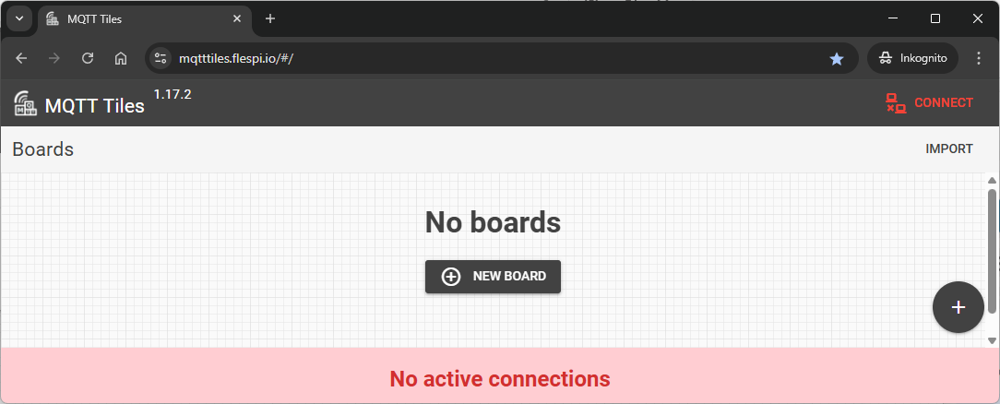
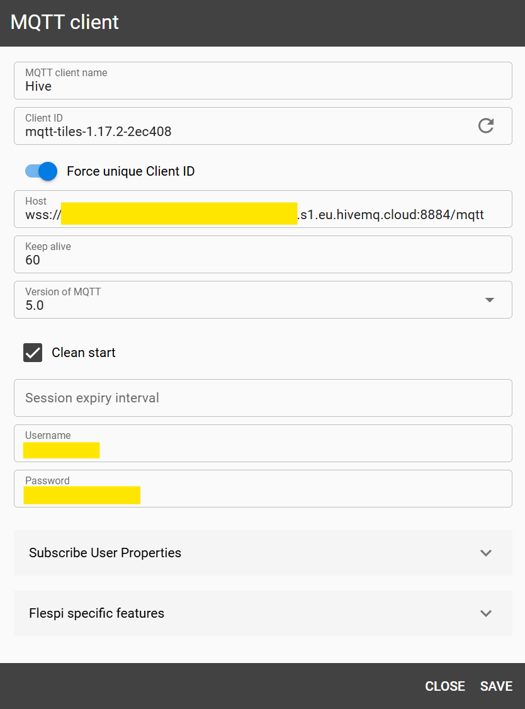
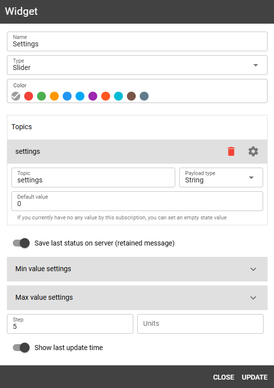
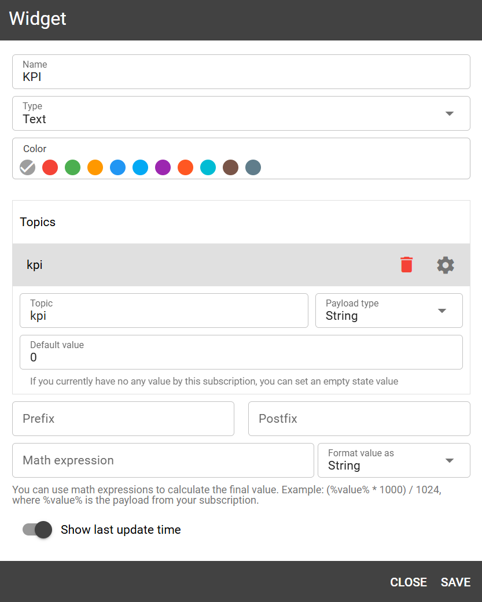
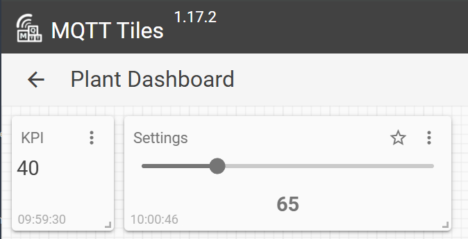
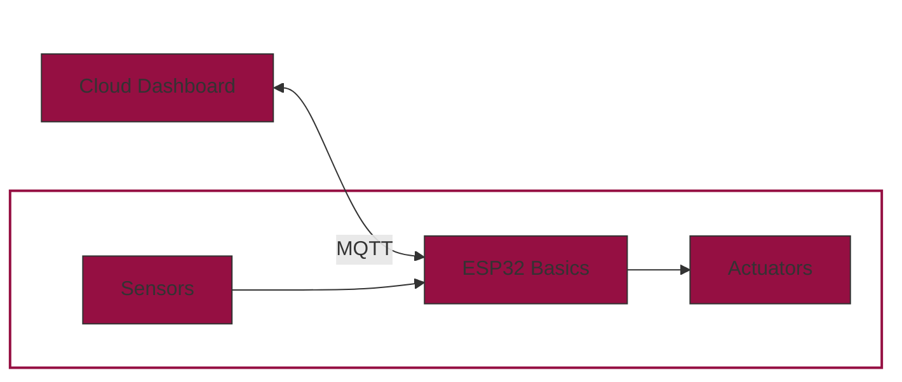

# Cloud Dashboard

<figure markdown="span">
    
</figure>

Let's take a deep breath and think about what we've done so far. We've learned how to work with an ESP32 microcontroller, how to read a sensor and how to control an actuator. 
But so far, we are only able to interact with our system locally over the USB connection. So, to update the threshold or to manually turn the pump on and off, we need to be physically present at the system.
Now, we want to change this! 

The goal of this chapter is to make our system more interactive. We want to be able to see the sensor values and control the actuator from everywhere (at least where you have an internet connection).
We will build a browser-based dashboard using **MQTT Tiles** from [flespi.io](https://mqtttiles.flespi.io/#/). The dashboard will allow you to monitor sensor values (like soil moisture) and send control commands (like humidity thresholds) directly to your ESP32 device via MQTT.

---

## What is MQTT?

**MQTT** (Message Queuing Telemetry Transport) is a lightweight, publish-subscribe network protocol designed for reliable communication between devices over low-bandwidth or high-latency networks.

The key concepts of MQTT are:

* **Broker**: The central server that manages communication between clients.
* **Topic**: The channel to which devices can **publish** or **subscribe**.
* **Payload**: The message content.

MQTT follows a publisher/subscriber model, which makes it scalable and well-suited for IoT systems.

???+ tip "Publish-Subscribe Model"
    Think of it like Instagram: users post messages to a channel (topic), and followers (subscribers) get updates in real time.

---

## Setting up a MQTT Broker
Before we can start programming our ESP32, we need to create a MQTT broker. In this example we will use [HiveMQ](https://www.hivemq.com/) as a free cloud-based broker.
Follow these steps to create and configure your own MQTT broker:

1. Visit [HiveMQ](https://www.hivemq.com/)
2. Sign in using Google, GitHub, or LinkedIn — or create a free account
3. Select the Free Plan and create a serverless cluster

    

4. Click on 'Manage Cluster'

    

5. Switch to the 'Getting Started' tab

    

    - Left side: you'll find all the details needed to connect (Cluster/Broker URL, TLS Port (8883), WebSocket URL)
    - Right side:In order to connect to the broker, you need to create a connection credential. Therefore, enter a username and password and click on 'Add'. After creation, credentials can be reviewed and managedunder the 'Access Management' tab

6. To test your connection. Go to the 'Web Client' tab, enter your MQTT credentials and click 'Connect'. You should see a green 'connected' message. +

    

## ESP32 Setup
### Hardware

To send and receive data from the ESP32, no additional hardware is required. However, since we will continue building on our irrigation system later, we will keep using the same circuit setup as before. So, **no changes to the wiring are needed at this point**.


### Wi-Fi Connection 🌐

The standard MicroPython installation on the ESP32 includes a built-in **Wi-Fi library**, making it easy to connect to a wireless network with just a few lines of code. For detailed documentation, see the [MicroPython Wi-Fi guide](https://docs.micropython.org/en/latest/esp32/quickref.html#wlan).

To establish an internet connection, the following code can be placed in the `boot.py` file, as the connection only needs to be initialized once at startup:

???+ tip "Security Tip"
    Never store credentials directly in your main code. Instead, create a separate `config.py` file:

    ```python linenums="1" title="config.py"
    ssid = "your_ssid"
    password = "your_password"
    ```

```python linenums="1" title="boot.py"
# WIFI CONFIGURATION
import machine, network
import config # own config.py file

def do_connect():

    wlan = network.WLAN()
    wlan.active(True)
    if not wlan.isconnected():
        print('connecting to network...')
        wlan.connect(config.ssid, config.password)
        while not wlan.isconnected():
            machine.idle()
    print('connection successful!')
    print('network config:', wlan.ipconfig('addr4'))
    return wlan

wlan = do_connect()
```

???+ warning "WPA2 Enterprise (Eduroam)"
    Unfortunately, the ESP32 does not support WPA2 Enterprise networks like Eduroam.
    To work around this, use a different Wi-Fi router or create a personal mobile hotspot.

???+ question "Task: Connect and Disconnect from Wi-Fi"
    - Connect to your Wi-Fi network using the `do_connect()` function.
    - After a successful connection, disconnect from the Wi-Fi network. Take a look in the [documentation](https://docs.micropython.org/en/latest/esp32/quickref.html#wlan) for the `wlan` object to find the function.

    Your console log should look something like this: 

    ```
    connecting to network...
    connection successful!
    network config: ('172.20.10.2', '255.255.255.240')
    disconnecting from network...
    disconnected!
    ```

### MQTT Communication 📡

Nachdem wir uns nicht nur mit der großen weiten Welt verbinden wollen, sondern auch Interagieren (senden und empfangen), müssen wir uns nun ein geeignetes Protokoll aussuchen. Wie bereits beschrieben, ist MQTT im Bereich IoT sehr beliebt und wird von vielen Anbietern unterstützt. Wir sollen nun unseren EPS32 so programmieren, dass er sich mit dem Internet und mit dem MQTT-Broker verbindet und anschließend Daten sendet und empfängt.

Now that we don't just want to connect our ESP32 to the outside world, but also interact with it (send and receive data), we need to choose an appropriate communication protocol. As discussed earlier, MQTT is widely used in IoT applications and supported by many providers. In this section, we will program the ESP32 to connect to Wi-Fi and the MQTT broker. After that we will send and receive messages over defined MQTT topics.

#### Initial Setup

We will now expand our existing Wi-Fi connection code by adding MQTT functionality.
Before sending or receiving any data, we must connect to the MQTT broker using credentials.
Add the following parameters to your existing `config.py` file and replace them with your HiveMQ details:


```python linenums="1" title="config.py"
mqtt_server = 'your_mqtt_server'    # MQTT URL (e.g. 'xy.s1.eu.hivemq.cloud')
mqtt_user = 'your_mqtt_user'        # MQTT-Broker Username 
mqtt_pass = 'your_mqtt_password'    # MQTT-Broker Password
mqtt_port = 8883                    # MQTT-Broker Port
```
Since we already import `config.py` in `boot.py`, we can now begin setting up the MQTT connection.

#### MQTT Library

To avoid writing the full MQTT protocol implementation ourselves, we'll use a prebuilt MicroPython-compatible MQTT library.
This file is not included in the MicroPython standard library and must be downloaded manually:

<div class="center-button" markdown>

[upymqtt.py](../../assets/micropython/upymqtt.py){ .md-button }

</div>

Save `upymqtt.py` in the same folder as your `boot.py` (your project root).

Then extend your `boot.py` with the following:

```python linenums="20" title="boot.py"
...

# MQTT CONFIGURATION
from upymqtt import MQTTClient
import ubinascii  #(1)!

# Generate Unique Client ID
client_id = ubinascii.hexlify(machine.unique_id())

# Topics to subscribe and publish
topic_sub = b'settings'
topic_pub = b'kpi'

# MQTT Server Credentials
mqtt_server = config.mqtt_server
mqtt_user = config.mqtt_user
mqtt_pass = config.mqtt_pass
mqtt_port = config.mqtt_port

```

1. `ubinascii` is part of the MicroPython standard library and helps generate a unique device ID.

Let's take a closer look at the code. The first lines are for importing the required libraries.
Then a unique device ID is created, which we need for the connection to the MQTT broker.
Then we can define the topics we want to receive (e.g. `topic_sub`) and the topics we want to send data to (e.g. `topic_pub`).
Finally, the MQTT credentials from the `config.py` file are loaded. 

#### Connection

Now we can finally establish a connection to the MQTT broker. We use the `MQTTClient` class from the `upymqtt` library. We create an instance of the class and pass the client ID, the MQTT server credentials and the port number.

```python
# Create a client instance; enable SSL for encrypted transport (TLS).
client = MQTTClient(
    client_id,
    mqtt_server,
    user=mqtt_user,
    password=mqtt_pass,
    port=mqtt_port,
    ssl=True
)
```

Before connecting, we define a callback function that will be called every time a message is received on a subscribed topic:

```python

# Register the callback so incoming packets trigger `sub_cb`.
def sub_cb(topic, msg):
    print(f"New Message: {topic}, {msg}")

client.set_callback(sub_cb)
```

This function will print each received message to the console.

Now we can connect to the broker and subscribe to our chosen topic:

```python
# Open a network connection to the MQTT broker.
client.connect()
print(f"Connected to {mqtt_server} MQTT broker")


# Tell the broker which topic we want to listen to.
client.subscribe(topic_sub)
print(f"Subscribed to {topic_sub} topic")
```

At this point, your ESP32 is ready to send and receive MQTT messages.

#### Send and Receive Data

In your `main.py`, you can now use the following commands to communicate via MQTT:

```python
# Sending the word 'hello'”' on topic_pub.
client.publish(topic_pub, b'hello')

# Receiving messages on topic_sub.
client.check_msg()
```
The `check_msg()` function checks the broker for new messages. It processes one message per call, so if you expect continuous updates, it's best to place it inside a loop:

```python
while True:
    # Receive messages from the broker and process them.
    # the callback (`sub_cb`) will be invoked automatically.
    client.check_msg()
```

???+ question "Task: Receive and send messages"
    Now it's your turn to send and receive messages. Try the code above and see if you can receive and send messages. Therefore:

    - Follow the steps above to connect to the broker (`boot.py` and `credentials.py`)
    - Check for new messages in the subscribed topic (`settings`) in a loop and publish a message to the `kpi` topic once before the loop starts. 
    - Got to [HiveMQ](https://console.hivemq.cloud/) and click on 'Manage Cluster'. Switch to the 'Web Client' tab and connect with your credentials. On the right side click on 'Subscribe to all messages'. Now you should see the message you published with your ESP32. (Hint: since the publish function is called once before the loop starts, it is a good idea to soft-reset you ESP32 in order to send the message again) 
    - On the left side in the 'Web Client' tab click on 'Send Message'. Enter the `kpi` topic and publish a message with a payload of your choice. You should see the message in the console of your ESP32. 
    ```
    Connected to xyxyxy.s1.eu.hivemq.cloud MQTT broker
    Subscribed to b'settings' topic
    New Message: b'settings', b'test'
    ```

If everything works, there is only one thing left to do: We want to visualize the data in a dashboard. 


## Dashboard

The basic features of our system are now complete. We can read out sensors, control actuators and send and receive data via MQTT. 
The final step is to visualize the data in a dashboard. For this we will use [MQTT Tiles](https://mqtttiles.flespi.io/#/).
MQTT Tiles is a free tool that allows you to create a dashboard to visualize your data without signing up.

Once you visit the website you will find



### Connection to the Broker

On the right upper corner you can click on 'Connect' followed by :material-plus-circle:. A new pop-up will appear where you need to enter you connection credentials: 

<figure markdown="span">
  {width=50%}
</figure>

???+ warning "Construct the Host URL"
    As host enter `wss://` followed by the URL of your broker, followed by `:8884/mqtt`.

If everything is correct you should see a green 'online' status in the upper right corner of MQTT Tiles.

### Create a Dashboard

Now it's time to create a dashboard. Click on 'New Board' and enter a name for your dashboard. Leave everything else as it is and click on 'Save & Open'.

Now you can click on 'Add Widget' or the :material-plus-circle: on the right bottom corner. We want to create two widgets now: 


<div class="grid cards" markdown>
-   __Slider (topic: `settings`)__ 

    ---

    A slider that publishes a value to the topic `settings`. The ESP32 is subscribed to this topic and will receive the value of the slider. If the ESP32 is running, you should see the value of the slider in the console.

    

-   __Text (topic: `kpi`)__

    ---

    A text widget that is subscribed to the topic `kpi`. Every time the ESP32 publishes a message to this topic, the text widget will display the message.

    
</div>

The result should look like this:

<figure markdown="span">
  {width=70%}
</figure>


???+ question "Task: Create a Dashboard"
    It's time to create a dashboard yourself. Follow the steps above to create a dashboard and:

    - Add a slider (topic: `settings`) and a text widget (topic: `kpi`).
    - Try different payloads and see how the text widget displays the message.
    - Try different widgets and see how they work.

## Conclusion

Now you know everything you need to know to build a smart plant watering system. We can measure the soil moisture, control the pump, send and receive data via MQTT and visualize the data in a dashboard.
It's time to build the final system using the knowledge you have gained so far. 

