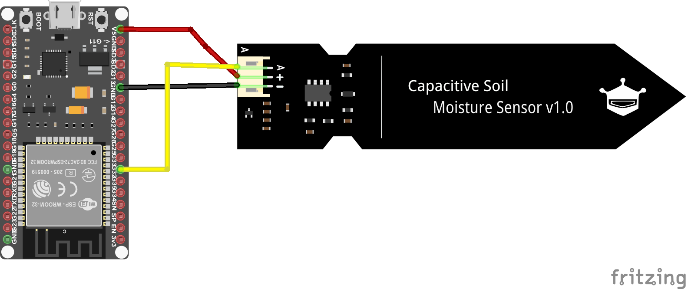

# Reading a Sensor


Now that we’ve successfully written and run our first blink program, it’s time to dive into the real heart of our project: reading data from a sensor. In this section, you’ll learn how to wire a sensor to your ESP32, read its output with MicroPython, and process the results in code.

## Practical Guideline

### Organizing Your Code

Whenever you sync your PyMakr project, **all** files in that folder are pushed to the ESP32. As we go along in this course, 
you’ll accumulate many scripts - blink tests, sensor readers, utilities, etc. - but you only want to deploy what’s actually in use. To keep things clean:

1. **Maintain a "script library"** on your PC:

    ```hl_lines="1"
    📁 script_collection/
        ├── 📄 blinking_led_main.py
        ├── 📄 sos_blinking_main.py
        ├── 📄 read_sensor_main.py
        └── 📄 ...
    ```

2. **Keep your active project separate**:

    ```hl_lines="1"
    📁 esp_project/
        ├── 📄 main.py
        ├── 📄 boot.py
        └── 📄 pymakr.conf
    ```

3. **Deploy only what you need:** Once you have finished a task and want to start a new one, copy the scripts you’re working on (in the `esp_project` folder) into the `script_collection` folder.

By giving each file a clear, descriptive name and only syncing the files in `esp_project/`, you’ll prevent accidental pin overlaps, minimize memory usage and make it trivial to swap in new routines (just overwrite `main.py`)


### Pin Types

When working with microcontrollers, knowing **which pin to use** and **how** is one of the most important things you need to know. Pins are the connections between the microcontroller and the outside world. Usually the first thing you do is to look at the [pinout](https://cdn.shopify.com/s/files/1/1509/1638/files/AZ281_A_18-10_DE_B08BTWJGFX_e699c448-ffc6-4744-8b93-5c9f102d22b0.pdf?v=1721128839) of the microcontroller and see which pins are available. A typical microcontroller has between 6 and 60 pins. Each microcontroller (sometimes different models of the 'same' controller) have different configurations. Pins often have multiple functions. This is called **pin multiplexing**.


???+ tip "Pinout"
    Each microcontroller has pin names specific to its hardware or architecture. This means that controllers from different manufacturers may use different designations. 
    Common manufacturers of microcontrollers for IoT applications are Espressif, Arduino and Raspberry Pi. The advantage over noname controllers is that there are always data sheets (see 'ESP32_datasheet') with exact pin assignment. 
    So it's better to spend 10€ on a good µC instead of buying one from an unknown manufacturer for 2€ and then the pins don't match!


There are different types of pins which can use to interface with the outside world. The most common ones are:

|**Pin Type**|**Common Labels**|**Purpose**|**Common Use Cases**|
|---|---|---|---|
|Power|VCC, VIN, 3.3V, 5V|Provides power to the board/sensors|Power for sensors/modules|
|Ground|GND (⏚)|Returns current to complete the circuit|Essential for all connections|
|GPIO|GPIO, D0, G0, etc.|General-purpose input/output|Flexible pin for input/output|
|Digital I/O|D0, D1, D2...|Reads/writes digital states|Buttons, LEDs, simple sensors|
|PWM|~ or PWM|Provides variable control (analog output)|Dim LEDs, control motors|
|Analog Input|A0, A1, ADC1|Reads varying voltages|Temperature, light, humidity sensors|
|Serial (UART)|TX/RX|Basic data communication|GPS, Bluetooth modules, PC-µC connection|
|I2C|SDA, SCL|Multi-device communication with 2 wires|OLED displays, accelerometers|
|SPI|MOSI, MISO, SCK, SS|High-speed communication|SD cards, TFT displays|

---

By following these practical organization guidelines so far and using the pinout diagram above, you’ll wire up sensors and actuators correctly, write clear code, and keep your ESP32 project’s filesystem neat and efficient.
Happy tinkering!

## Reading a Sensor

Now it's time to move forward with our project to keep our plant alive. The first step is to measure the soil moisture: is it too dry or too wet? 

### How can we measure soil moisture?
#### Theory

There are two common types of sensors used to measure soil moisture: **resistive** and **capacitive** sensors. Both are generally referred to as **hygrometers**.

- **Resistive moisture sensors** work by placing a hygroscopic (water-attracting) material between two conductive electrodes. This material is typically a non-conductive polymer that becomes increasingly conductive as it absorbs water. The change in conductivity alters the voltage between the electrodes, which can then be measured.
These sensors offer a large surface area, making them effective for detecting small moisture variations—even in already damp environments. However, their performance drops at very low moisture levels.
A major drawback for our use case is **durability**. Since resistive sensors require direct contact with moisture in the soil, they are prone to corrosion. In particular, cheap resistive sensors can suffer from **electrolysis**, where the sensor material begins to degrade and potentially release **toxic substances** into the soil — harmful for plants and unsuitable for long-term use.

- **Capacitive moisture sensors**, on the other hand, rely on a capacitor-like structure whose electrical field is affected by the moisture content of the surrounding soil. As soil moisture increases, so does the soil's dielectric constant, which alters the sensor’s capacitance.
These sensors do not require direct water contact — hence the black protective coating — and are much more **durable** and **maintenance-free**, as corrosion is not an issue. Capacitive sensors are typically more **accurate**, **reliable**, and **resistant to wear and temperature fluctuations**. For these reasons, they are often used in professional applications like agriculture, despite being slightly more expensive.

#### Hardware

For our project we’ll be using the **HW-390 capacitive moisture sensor**, a widely available and cost-effective sensor with a simple 3-wire interface. While different manufacturers may offer this model, its functionality and wiring remain consistent across versions.

<figure markdown="span">

</figure>


#### Wiring
The HW-390 sensor has three pins:

- VCC – Connect to 5V on the ESP32
- GND – Connect to GND
- AOUT – Connect to any analog-capable GPIO

To find an analog-capable GPIO, we can take a closer look at the pinout diagram shown above. The ESP32 has many GPIO pins, but only some of them are capable of analog input.
Look for pins labeled ADC - these are connected to an Analog-to-Digital Converter (ADC). Since the sensor outputs an analog signal and microcontrollers operate digitally, we need an ADC to convert the analog voltage into a digital value the ESP32 can process.
In short, the ADC acts as a bridge between the analog world of sensors and the digital world of microcontrollers.


<figure markdown="span">
    
</figure>

For our project we will use GPIO32 as input pin for the sensor value. The wiring diagram is shown below. Connect all components as shown. 

<figure markdown="span">
    
</figure>

Now we are all set up and we can start coding!

### Coding

As with our first program, we only need to edit the `main.py` file. We begin by importing the required libraries:

```python
from machine import ADC
from time import sleep
```

This time, instead of importing only the `Pin` class, we're also using the `ADC` class from the `machine` module to enable analog-to-digital conversion. You can find the official MicroPython documentation for the ESP32 [here](https://docs.micropython.org/en/latest/esp32/quickref.html#adc-analog-to-digital-conversion).


Next, we initialize the `ADC` class:

```python
# Set GPIO 32 as ADC pin
adc_pin = Pin(32)
adc = ADC(adc_pin, atten=ADC.ATTN_11DB)
```
First, we choose pin 32 as the ADC pin and then initialize it with the ADC class. 

We can now read values from the sensor using the `read_u16()` method. The term `u16` stands for unsigned 16-bit integer, which means the returned value ranges from `0` to `65,535` (2<sup>16</sup> distinct levels).

In the context of an ADC (Analog-to-Digital Converter), this value represents the voltage level read on the pin, scaled across the ADC's resolution. A 16-bit ADC can distinguish between `65,536` different voltage steps - the higher the resolution (number of bits), the more precisely it can measure small changes in voltage.


```python
val16 = adc.read_u16()
print('ADC Value: ', val16)
```

If you run this code while the sensor is on your desk, you’ll get a value roughly like this:

```
ADC Value:  48139
```

???+ question "Task: Calibrate the Sensor"
    Now it's your turn to code!

    Create a program that reads the sensor value and prints it to the console.

    - **Continuous Reading**: Use a simple inifinity loop to read the sensor value and print it to the console. Include a delay of 1 second between readings.
    - **Min/Max Values**: Read the minimum and maximum value of the sensor. Therefore measure and note the value when the sensor is dry (leave it on the desk) and when it is wet (put it in a glass of water).

        ???+ danger "Sensor Damage"
            The sensor consists of a capacitive plate and some electronics. Do not immerse the electronics in the water! There is a line indicating the maximum water level on the sensor.
            <figure markdown="span">
                
            </figure>

    - **Mapping to Percentage**: Map the sensor value to a percentage of soil moisture (0% = dry, 100% = wet). A Min-Max-Normalization can be used therefore. If you need a refresher on the calculation, take a look [here](../data-science/data/preprocessing.md#min-max-normalization). Careful: As you may have noticed, with a capacitive sensor, a low value means more moisture! Furthermore, ensure that the percentage is always between 0 and 100.
    - **Function**: Write a function that returns the moisture percentage and the raw sensor value. This function should be called in the loop.
    - **Moisture Warning System**: Now combine your knowledge from before and implement a warning system that turns on a LED if the moisture is below 30%. Test your system with a glass of water. 

---

## Conclusion

Now we have a basic understanding of how to use the ADC Pins, read a sensor value and how to process it. In the next section we will use this knowledge to control a water pump.

---


