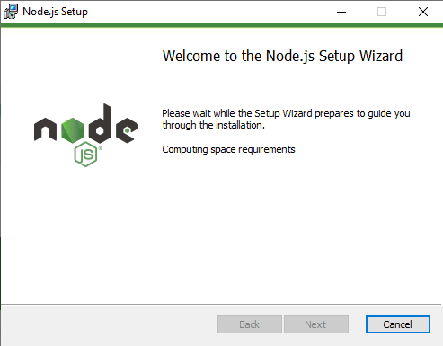
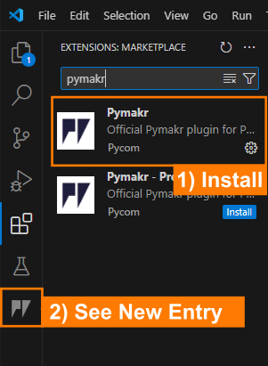
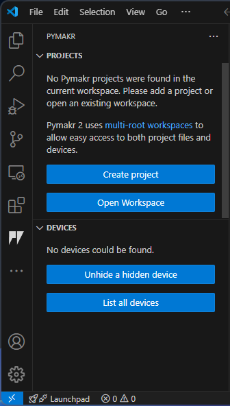
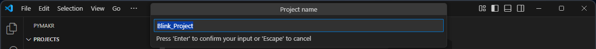
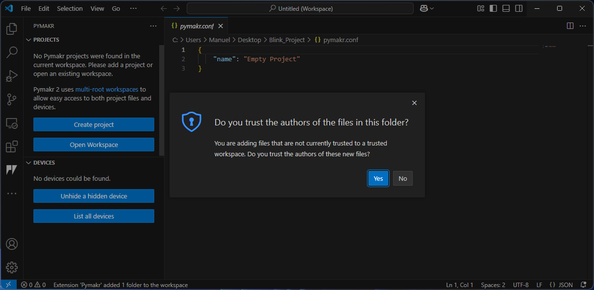
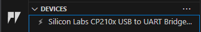
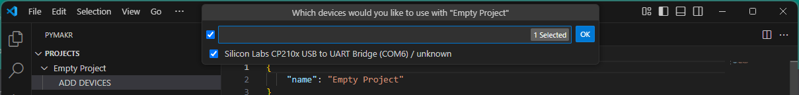
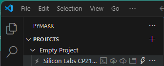
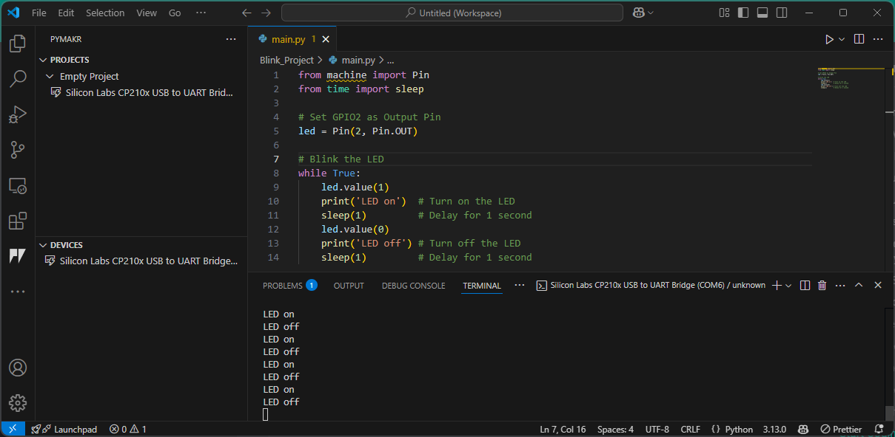
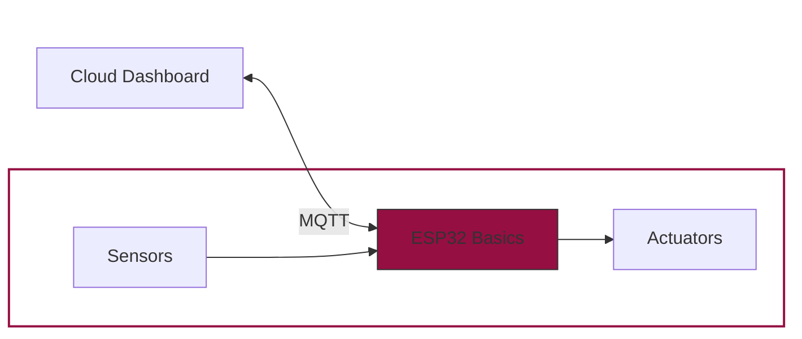

# Getting Started

<figure markdown="span">
        
    </figure>

## What Do We Want to Do?
In this course, we will explore key principles of the Internet of Things (IoT) by developing an **automated plant monitoring and watering system**. Our goal is to create a smart irrigation solution using a microcontroller as the project’s core. In our system, a sensor will continuously measure soil humidity (and temperature) and send these readings via `MQTT` to a central server. There, the data can be processed and visualized using a browser-based dashboard, allowing you to monitor the plant’s status. Furthermore, you will be able to remotely set parameters - such as the optimal humidity level - and these settings will be transmitted back to the microcontroller to trigger a water pump when necessary.

*And let’s face it: not everyone is blessed with a natural green thumb. With this system, even if you have the gardening skills of a cactus 🌵, your plants will still thrive!*

## :material-hammer-wrench: And Therefore We Use...
While `Python` :fontawesome-brands-python: is typically associated with data analysis and software development on PCs, it can also be used to program microcontrollers. In this course, we leverage Python’s flexibility to develop firmware for embedded systems.

We are now in the realm of embedded systems. Embedded systems are essentially 'computers' :fontawesome-solid-computer: integrated into technical systems that combine electronic and often mechanical components. Unlike a typical PC, a microcontroller usually runs either without an operating system or with a highly specialized one, and always relies on firmware. The firmware is generally structured into three main components:

- **Bootloader:** Loads the operating system and the application software.
- **Operating System** (if present): Manages multitasking, memory, and file systems.
- **Application Software:** This is the code you write - in our case, using MicroPython.

### Software: MicroPython
Although the traditional approach for programming embedded systems is to use `C`, this method requires deep hardware knowledge and specialized expertise. Since our focus is on learning IoT concepts without getting lost in low-level programming, we will use MicroPython. MicroPython is a lean implementation of `Python 3`, written in `C` and optimized for microcontrollers. It compiles Python code to bytecode, which is then interpreted at runtime.

???+ tip "CircuitPython"
    For beginners, there’s also CircuitPython - a variant designed with an even friendlier interface - but for this course, we’ll stick with MicroPython.

### Hardware: ESP32

<figure markdown="span">
        
    </figure>


The ESP32 microcontroller is an ideal choice for IoT projects. It comes in various versions and supports wireless communication via Wi-Fi and Bluetooth, as well as wired interfaces like SPI, SDIO, I2C, and UART. Thanks to its power efficiency, robustness, and affordability (basic models are available for around €10), the ESP32 is well suited for a wide range of applications - from simple prototypes to complex systems. While other popular microcontrollers include Arduino, STM32, and Raspberry Pi, the ESP32 strikes a great balance between performance and cost for our smart plant watering project.

???+ question "Get Familiar with ESP32"

    Open the corresponding [ESP32 datasheet](https://cdn.shopify.com/s/files/1/1509/1638/files/ESP_-_32_NodeMCU_Developmentboard_Datenblatt_AZ-Delivery_Vertriebs_GmbH_10f68f6c-a9bb-49c6-a825-07979441739f.pdf?v=1598356497) and answer the following questions:

    - How many cores does the ESP32 have?
    - How much flash memory does the ESP32 have?
    - What kind of Bluetooth does the ESP32 support?
    - What are the electrical characteristics of the ESP32 (voltage, current, etc.)?

We will explore the functionalities of the ESP32 step by step in the following sections. :rocket:

    

## Setting up our Project
Before we can start programming our ESP32, we need to prepare some tools and the hardware. 

### Firmware Upload

To be able to write code to the microcontroller, the MicroPython firmware must be loaded onto the ESP32. For this, we will use Thonny IDE - a friendly and intuitive Integrated Development Environment that simplifies the process of programming MicroPython on the ESP32.

Below are the step-by-step instructions:

1. **Download Thonny IDE:**  

    - Head over to [thonny.org](https://thonny.org) and download the IDE software appropriate for your operating system.
    - Install thonny by following the instructions. 

2. **Connect the ESP32:** 

    - Plug your ESP32 into your computer using a USB cable.
    - Note that the ESP32 will be detected as a **COM** port on Windows. To check, if the ESP32 is detected correctly, we look in the **Device Manager** under **Ports**. You should see something like this: 
    

    ???+ warning "CP210X Driver"
        If you cannot find the correct port, it might be because your PC or laptop does not have the necessary USB-to-UART driver installed. The chip responsible for the USB-to-UART conversion is usually a large, black, square component located next to the connector. If you shine a light on it, you should be able to read **CP2102** on the second line, indicating that the chip is manufactured by Silicon Labs. Since the driver is specific to the chip’s architecture, you can download the appropriate driver from [Silicon Labs USB-to-UART Bridge VCP Drivers](https://www.silabs.com/developer-tools/usb-to-uart-bridge-vcp-drivers?tab=downloads). 

        For Windows users, select the **CP210x VCP Windows** file, unzip the downloaded .zip file, and run the installer for your system architecture (x64 or x86). Once the driver is installed, the correct port should appear in your device manager.

3. **Install or Update the Firmware in Thonny:**  

    - Open Thonny IDE and go to **Tools > Options > Interpreter**. 
    - Select **MicroPython (ESP32)** from the interpreter options 
    - Select the correct **port** (see step before).
    - Click the **Install or update MicroPython (esptool)** button. 

    <div style="display: flex; justify-content: center;">
        
    </div>

    A new window will open. Make the following selections:

    - **Target port:** USB to UART  
    - **MicroPython family:** ESP32  
    - **Variant:** Espressif ESP32 / WROOM  
    - **Version:** 1.24.1 (this is the latest version at the time of writing)

    <div style="display: flex; justify-content: center;">
        
    </div>

    After clicking on **Install** the firmware will be flashed onto the ESP32. Sometimes the flashing process can lead to an error. Try holding the **boot** button on the ESP32 while clicking on **Install**. :white_check_mark:

    ???+ info "Verify the Installation"

        - In Thonny, you can select the **Micropython (ESP32)** from the bottom right corner.
        - You should see a connection established in the shell at the bottom.  
        - Type `help()` and press Enter to check that the controller is responding correctly.
        <div style="display: flex; justify-content: center;">
            
        </div>


Happy coding and welcome to the world of MicroPython :material-file-code:! 

---

### Prepare Visual Studio Code

Although you can program directly in Thonny, we've already explored Visual Studio Code - which offers advantages such as enhanced code completion and seamless GitHub integration. These features make VS Code a powerful option, especially for larger projects or collaborative work. If you need a refresher on how to set up VS Code, you can check out the [IDE Setup](../python-extensive/ide.md) section.


???+ warning "Install Node.js"
    Before continuing, ensure you have **`Node.js`** installed on your computer. `Node.js` is a cross-platform, open-source JavaScript runtime that lets you execute JavaScript code outside of a web browser.

    If you don't have it installed yet, please [download](https://nodejs.org/en/download) and install `Node.js`. During installation, it's highly recommended to tick the option to install any required additional programs. Once you proceed, a terminal window may open where you might need to confirm a few prompts. The installation process might take a few minutes; the terminal will close automatically when the installation is complete. Afterward, you should see `Node.js` listed among your installed programs.

    Once `Node.js` is successfully installed, you can move on to the next steps.
    <figure markdown="span">
        
    </figure>
    

To run our code on the ESP32, we'll use the **`PyMakr` extension** in Visual Studio Code. This extension allows you to easily upload and execute your MicroPython scripts directly on the ESP32. We already covered how to install [extensions](../python-extensive/ide.md#extensions).

<figure markdown="span">
    
</figure>

After adding the extension, you should see `PyMakr` as a new button on the left-hand side of the VS Code window.

Now we are all set up and can start programming! :rocket:

---

## Blink :material-lightbulb-multiple-outline: | The Hello World of Embedded Systems

Now it's time to start our first project :material-lightbulb-multiple-outline: and get familiar with PyMakr, hardware setup and the basics of MicroPython.

In this first mini-project, we'll make an external LED blink using the ESP32. Blinking an LED is a classic "Hello World" exercise in microcontroller programming - it demonstrates how to set up an output pin and control it with code. 

<figure markdown="span">
    
</figure>

### Hardware Setup

Before we start coding, we need to setup the hardware. The core element of our project is - as already mentioned - the ESP32 microcontroller. The ESP32 it self is the large silver component on the breakout board shown below. The breakout board helps us to connect the ESP32 to the real world and also deals with other topics like power supply and programming the microcontroller. From now on, whenever we refer to the **ESP32**, we specifically mean the **ESP32 Breakout Board**.

For the Blink project, we need to connect the ESP32 to an LED via a resistor. The resistor is necessary to limit the current flowing through the LED, which can damage the LED if too much current flows through it. In the below image you can see the wiring scheme. Connect all components as shown. 

<figure markdown="span">
    
</figure>

???+ tip "LED Pinout"
    The LED has two legs: the **cathode** (shorter leg) and the **anode** (longer leg). The cathode is connected to `GND`, and the anode to the supply voltage (here to a `1 kΩ` resistor, and from the resistor to `G2` on the ESP32 which will be controlled by the code.)

???+ info "ESP32 Pinout"
    Until now, we have not talked about the different Pins on the ESP32. The ESP32 has many Pins, which can be used to control the microcontroller. What they do and what different kinds of Pins exist, will be covered in the next sections. 

    For now, just remember that we can use the Pin `G2` as an output pin to control the LED.

### PyMakr Project Setup


Below is a quick guide on how to create a new PyMakr project, connect your ESP32, and get started with MicroPython in Visual Studio Code.

#### 1. Create a New Project

- **Open Visual Studio Code (VS Code).**
- **Select "PyMakr"** from the left sidebar.

    <figure markdown="span">
        
    </figure>

    If you don’t see 'PyMakr' in the sidebar, make sure the [PyMakr extension is installed](#prepare-visual-studio-code).

- **Click on "Create Project"**
- **Select the folder** where you want to store your project (e.g., `Blink_Project`).
- A **popup** will appear asking you to name your project. 

    <figure markdown="span">
        
    </figure>

    The default name is often the folder name. For example, `Blink_Project`. Press ++enter++ to confirm.

- A **second popup** appears: "Please select a template for your project". Leave this blank and press ++enter++.
- If VS Code asks, "Do you trust the authors of the files in this folder?", confirm with **yes**.

    <figure markdown="span">
        
    </figure>


- A new project is now created! 

    <div style="display: flex; justify-content: center;">
        
        
    </div>

    <figcaption style="text-align: center;">
        Your project will be shown in the PyMakr sidebar (left) and the files in the VS Code Explorer (right).
    </figcaption>

#### 2. Connect the ESP32

- **Plug the ESP32** into your computer via USB.  
- In the PyMakr sidebar, you should see a **"Devices"** section showing your ESP32.

    <figure markdown="span">
        
    </figure>

#### 3. Add the Device

- Under **"PyMakr Projects"**, select your project (e.g., "empty project") and click **"ADD DEVICE"**  
- Choose the device (your ESP32) from the list.

    <figure markdown="span">
        
    </figure>
    
    Confirm by clicking **"OK."**

- The device should now appear under your project.  

#### 4. Connect to Device

- Hover your mouse over your device in the **"PyMakr Projects"** section to see various icons:

    <figure markdown="span">
        
    </figure>

    - **Create terminal** :octicons-terminal-16: : Opens a new terminal window for executing commands and interacting with the system or device.  
    - **Sync project to device** :material-cloud-upload-outline: : Uploads the current project files from the local system to the connected device.  
    - **Download project from device** :material-cloud-download-outline: : Retrieves project files from the device and saves them to the local system.  
    - **Open device in file explorer** :material-folder-outline: : Opens the file explorer to browse and manage files stored on the connected device.  
    - **Connect device** :material-flash-outline: / **Disconnect device**: Establishes or terminates the connection between the computer and the external device.

- **Click on "Connect"** :material-flash-outline: 
- **Click on "Create Terminal"**  :octicons-terminal-16:
- In the newly opened terminal, you should see the output of the ESP32:

    ```bash
    MicroPython v1.24.1 on 2024-11-29; Generic ESP32 module with ESP32
    Type "help()" for more information.
    >>>
    ```

This indicates that your ESP32 is successfully connected and ready to receive MicroPython commands. :partying_face:

You can now upload scripts and run code directly on the device.

#### 5. Default File Structure

When you create a new project, VS Code will automatically create a folder with a default file structure. In the file explorer, you should see the following files:

- `main.py` - This is the main file that will contain our code.
- `boot.py` - This file is automatically executed when the ESP32 starts (executed once before the main.py file is executed).
- `pymakr.conf` - This file contains the configuration for the PyMakr extension.

All programmes and libraries that we need are edited and loaded in this folder. If you click on **Sync project to device** in the PyMakr tab, the entire project folder will be loaded onto the microcontroller. 

???+ warning "Important Files"
    Please do not rename `boot.py` and `main.py`. If you do not need `boot.py`, you can delete it or leave it empty until you use it again, but `main.py` should always be there!


??? info "Configuration File"
    The `pymakr.conf` file typically contains only one entry, such as `"name": "Empty Project"`. If you haven’t created an *empty project*, it may have additional entries, but these are not crucial. This file is a **configuration file**, historically used for setting up Pymakr. While it was more significant in older versions, modern VSCode automatically generates **JSON-based configuration files** in the background, where these settings are stored.

    However, knowing where to find these settings can still be useful. You can access them in VSCode by navigating to:  
    **File** → **Preferences** → **Settings** (or press ++ctrl+comma++) → **Extensions** → **Pymakr**.  

    Under **Devices**, you'll find the option **Edit in settings.json**, where various connection settings are defined. At the top, you’ll see the path to your Python interpreter, followed by default connection settings and their properties.  

    If you want your laptop to **automatically connect** to the microcontroller, you could add an entry specifying the port and set options like `"autoConnect": "always"`. Further down, there are **notification settings** that inform you if something goes wrong. The file may also list **device manufacturers**, such as *Silicon Labs*, but modifying these entries is usually unnecessary.  

    Understanding these settings can be helpful if you encounter issues and seek troubleshooting advice from ChatGPT or other sources. While the `pymakr.conf` file is rarely used today, **settings.json** and the built-in VSCode configurations have taken over its role.

### Start Coding

Now that we have our project setup, we can start coding. For our first project, we will only need to work in the `main.py` file.
We will start by importing the necessary modules (we do not need to install them with pip or something else. There are already preinstalled).

```python
from machine import Pin
from time import sleep
```

???+ warning "MicroPython Libraries"
    Unlike standard Python, where you can use virtually any library available on your computer, MicroPython relies on a limited set of libraries specifically designed for microcontrollers.

    When working in VSCode, you may notice that some libraries used in your program are underlined or marked as missing. This is because they don’t exist on your computer—they are only available on the microcontroller. Do not attempt to install these libraries manually! They are built into the MicroPython firmware and are intended to run only on the device.

    This limitation can make debugging more challenging, as errors often don’t appear until the code is actually running on the microcontroller. Make sure to check the console output, which can provide helpful hints. Some common issues are already discussed in this guide.

    This is one of the key differences between MicroPython and languages like C:
    In C, code must be compiled before being uploaded to the microcontroller, and most errors are caught during compilation. In contrast, Python and MicroPython upload the raw script, which is only interpreted and executed after it's on the device—so runtime errors may only appear during execution.

    Keep this in mind when troubleshooting your code.


The [`machine`](https://docs.micropython.org/en/latest/library/machine.html) library in MicroPython provides low-level access to hardware components, such as GPIO pins (General-Purpose Input/Output), ADCs, I2C, SPI, and other peripherals, allowing direct interaction with microcontrollers.
The [`Pin`](https://docs.micropython.org/en/latest/library/machine.Pin.html) class from the `machine` module is used to control the GPIO pins on the microcontroller.

???+ info "GPIO Insights"
    A **GPIO (General Purpose Input/Output)** is a digital pin on a microcontroller or processor that can be freely configured as an **input** or **output** through programming. By default, GPIOs are unassigned and can be controlled in a binary manner (`HIGH` or `LOW`).  

    GPIOs typically operate at **3.3V** and can supply **2-16 mA** of current, making them suitable for driving components like LEDs. For example, if a GPIO pin is set to **HIGH**, the LED turns **on**; when set to **LOW**, the LED turns **off**. GPIOs are fundamental for interfacing with sensors, actuators, and other peripherals in embedded systems. 

    We will cover the different types of Pins in the [sensors](../micropython/sensors.md#pin-types) chapter.

The second line of code imports the `sleep` function from the MicroPython (or standard Python) `time` module, which is used to pause the execution of a program for a specified number of seconds.

---

Next, we need to define the interface to the real world. In our case, we want to control the LED. Therefore, we need an output pin on the ESP32 which can be set to high (led on) or low (led off). Each pin on the ESP32 breakout board is assigned a number. 
As we have connected it [before](#hardware-setup), for this project, we will use the `G2` pin as an output pin (`Pin.OUT`) and assign it to the variable `led`.

```python
# Set G2 as output
led = Pin(2, Pin.OUT)
```

---

Now we can start coding the logic to blink the LED. We can set the `led` to high or low by calling the `value()` method of the `led` object.

```python
led.value(1) # set the led to high
```

Afterwards, we need to pause the program for a second to see the LED light up

```python
sleep(1)
```

and then set the `led` to low again.

```python
led.value(0) # set the led to low
sleep(1)
```

In order to make the LED blink, we need to repeat this process in an infinite loop (`while True:`).

---

The complete code can be distilled to: 


```python linenums="1" title="main.py"
from machine import Pin
from time import sleep

# Set G2 as Output Pin
led = Pin(2, Pin.OUT)

# Blink the LED
while True:
    led.value(1)     # Turn on the LED
    print('LED on')  # Print to Terminal
    sleep(1)         # Delay for 1 second
    led.value(0)     # Turn off the LED
    print('LED off') # Print to Terminal
    sleep(1)         # Delay for 1 second
```

We added some print statements to the terminal to make it easier to see what is happening. In the next section, we will use the terminal to debug our code.

## Upload and Run the Code

Now we are ready to upload and run the code on our microcontroller. Once the `main.py` file is saved, we can upload the code to the microcontroller by clicking on the **Sync project to device** :material-cloud-upload-outline: button by hovering over the device in our PyMakr project. The files will be uploaded to the ESP32. 

After the upload, the program will {==not==} start automatically. We will need to reset the microcontroller by pressing the **RST** button on the ESP32 breakout or performing a **soft reset**.


???+ warning "Control Commands"

    In the terminal, you can use the following control commands to interact with the microcontroller:

    - ++ctrl+c++: **interrupt the running program**. This can be helpfull, if something is not working as expected. Additionally, it is also necessary to stop the program before you can upload new code.
    - ++ctrl+d++: **soft reset**. It wipes the program in the memory and reruns the `boot.py` and `main.py` file.

???+ tip "Auto-Start"
    If you unplug the microcontroller and plug it back in, it will automatically restart and run the `boot.py` and `main.py` file. So, once the coding is done, you can unplug it from the computer and use a power source to power it. In this case you are completely independend from your computer and the ESP is just using your code. 


Now you should see, the LED blink on and off at one-second intervals. 
Open the terminal (click **Create Terminal** at the device in your PyMakr project) and check for the correct output. You should see the print statements `LED on` and `LED off` to verify that everything is working.

<figure markdown="span">
    
</figure>


<div style="text-align: center;">
    
</div>

???+ tip "Troubleshooting"
    If you have issues with the LED not blinking while the terminal output is correct, make sure you have the correct GPIO pin referenced, and verify that your wiring and resistor are connected properly.


Congratulations - you've completed your first hardware test with MicroPython!
<div style="text-align: center;">
    
</div>

???+ question "Task: SOS blinking"
    Now it's your turn to code!

    Create a program that makes the LED blink in the `SOS` morse code sequence. Therefore use the official [Morse Code Timing](https://morsecode.world/international/timing.html). As base unit use 0.2 seconds.

    - Basic: Use a simple loop to blink the LED in the SOS sequence.
    - Pro (optional): Use loops and functions to make the code more readable and modular.

    <figure markdown="span">
    {width=70% }
    <figcaption>(Source: <a href="https://imgflip.com/memegenerator">Imgflip Meme Generator</a>) </figcaption>
    </figure>


