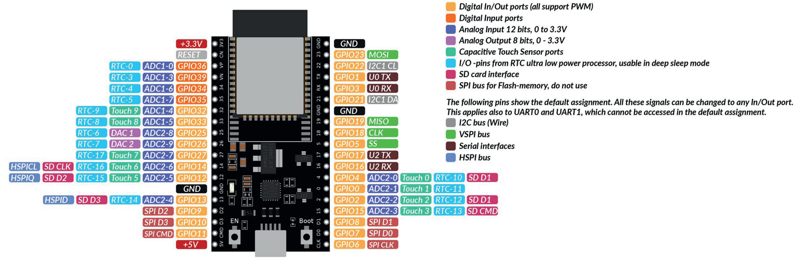

# Getting Started

<figure markdown="span">
        
    </figure>

## What Do We Want to Do?
In this course, we will explore key principles of the Internet of Things (IoT) by developing an **automated plant monitoring and watering system**. Our goal is to create a smart irrigation solution using a microcontroller as the project’s core. In our system, a sensor will continuously measure soil humidity (and temperature) and send these readings via `MQTT` to a central server. There, the data can be processed and visualized using a browser-based dashboard, allowing you to monitor the plant’s status. Furthermore, you will be able to remotely set parameters - such as the optimal humidity level - and these settings will be transmitted back to the microcontroller to trigger a water pump when necessary.

*And let’s face it: not everyone is blessed with a natural green thumb. With this system, even if you have the gardening skills of a cactus 🌵, your plants will still thrive!*

## :material-hammer-wrench: And Therefore We Use...
While `Python` :fontawesome-brands-python: is typically associated with data analysis and software development on PCs, it can also be used to program microcontrollers. In this course, we leverage Python’s flexibility to develop firmware for embedded systems.

We are now in the realm of embedded systems. Embedded systems are essentially 'computers' :fontawesome-solid-computer: integrated into technical systems that combine electronic and often mechanical components. Unlike a typical PC, a microcontroller usually runs either without an operating system or with a highly specialized one, and always relies on firmware. The firmware is generally structured into three main components:

- **Bootloader:** Loads the operating system and the application software.
- **Operating System** (if present): Manages multitasking, memory, and file systems.
- **Application Software:** This is the code you write - in our case, using MicroPython.

### Software: MicroPython
Although the traditional approach for programming embedded systems is to use `C`, this method requires deep hardware knowledge and specialized expertise. Since our focus is on learning IoT concepts without getting lost in low-level programming, we will use MicroPython. MicroPython is a lean implementation of `Python 3`, written in `C` and optimized for microcontrollers. It compiles Python code to bytecode, which is then interpreted at runtime.

???+ tip "CircuitPython"
    For beginners, there’s also CircuitPython - a variant designed with an even friendlier interface - but for this course, we’ll stick with MicroPython.

### Hardware: ESP32

<figure markdown="span">
        
    </figure>


The ESP32 microcontroller is an ideal choice for IoT projects. It comes in various versions and supports wireless communication via Wi-Fi and Bluetooth, as well as wired interfaces like SPI, SDIO, I2C, and UART. Thanks to its power efficiency, robustness, and affordability (basic models are available for around €10), the ESP32 is well suited for a wide range of applications - from simple prototypes to complex systems. While other popular microcontrollers include Arduino, STM32, and Raspberry Pi, the ESP32 strikes a great balance between performance and cost for our smart plant watering project.

???+ question "Get Familiar with ESP32"

    Open the corresponding [ESP32 datasheet](https://cdn.shopify.com/s/files/1/1509/1638/files/ESP_-_32_NodeMCU_Developmentboard_Datenblatt_AZ-Delivery_Vertriebs_GmbH_10f68f6c-a9bb-49c6-a825-07979441739f.pdf?v=1598356497) and answer the following questions:

    - How many cores does the ESP32 have?
    - How much flash memory does the ESP32 have?
    - What kind of Bluetooth does the ESP32 support?
    - What are the electrical characteristics of the ESP32 (voltage, current, etc.)?
    

## Setting up our Project
Before we can start programming our ESP32, we need to prepare some tools and the hardware. 

### Firmware Upload

To be able to write code to the microcontroller, the MicroPython firmware must be loaded onto the ESP32. For this, we will use Thonny IDE - a friendly and intuitive Integrated Development Environment that simplifies the process of programming MicroPython on the ESP32.

Below are the step-by-step instructions:

1. **Download Thonny IDE:**  

    - Head over to [thonny.org](https://thonny.org) and download the IDE software appropriate for your operating system.
    - Install thonny by following the instructions. 

2. **Connect the ESP32:** 

    - Plug your ESP32 into your computer using a USB cable.
    - Note that the ESP32 will be detected as a **COM** port on Windows. To check, if the ESP32 is detected correctly, we look in the **Device Manager** under **Ports**. You should see something like this: 
    

    ???+ warning "CP210X Driver"
        If you cannot find the correct port, it might be because your PC or laptop does not have the necessary USB-to-UART driver installed. The chip responsible for the USB-to-UART conversion is usually a large, black, square component located next to the connector. If you shine a light on it, you should be able to read **CP2102** on the second line, indicating that the chip is manufactured by Silicon Labs. Since the driver is specific to the chip’s architecture, you can download the appropriate driver from [Silicon Labs USB-to-UART Bridge VCP Drivers](https://www.silabs.com/developer-tools/usb-to-uart-bridge-vcp-drivers?tab=downloads). 

        For Windows users, select the **CP210x VCP Windows** file, unzip the downloaded .zip file, and run the installer for your system architecture (x64 or x86). Once the driver is installed, the correct port should appear in your device manager.

3. **Install or Update the Firmware in Thonny:**  

    - Open Thonny IDE and go to **Tools > Options > Interpreter**. 
    - Select **MicroPython (ESP32)** from the interpreter options 
    - Select the correct **port** (see step before).
    - Click the **Install or update MicroPython (esptool)** button. 

    <div style="display: flex; justify-content: center;">
        
    </div>

    A new window will open. Make the following selections:

    - **Target port:** USB to UART  
    - **MicroPython family:** ESP32  
    - **Variant:** Espressif ESP32 / WROOM  
    - **Version:** 1.24.1 (this is the latest version at the time of writing)

    <div style="display: flex; justify-content: center;">
        
    </div>

    After clicking on **Install** the firmware will be flashed onto the ESP32. :white_check_mark:

    ???+ info "Verify the Installation"

        - In Thonny, you can select the **Micropython (ESP32)** from the bottom right corner.
        - You should see a connection established in the shell at the bottom.  
        - Type `help()` and press Enter to check that the controller is responding correctly.
        <div style="display: flex; justify-content: center;">
            
        </div>


Happy coding and welcome to the world of MicroPython :material-file-code:! 

---

### Prepare Visual Studio Code

Although you can program directly in Thonny, we've already explored Visual Studio Code - which offers advantages such as enhanced code completion and seamless GitHub integration. These features make VS Code a powerful option, especially for larger projects or collaborative work. If you need a refresher on how to set up VS Code, you can check out the [IDE Setup](../python-extensive/ide.md) section.


???+ warning "Install Node.js"
    Before continuing, ensure you have **`Node.js`** installed on your computer. `Node.js` is a cross-platform, open-source JavaScript runtime that lets you execute JavaScript code outside of a web browser.

    If you don't have it installed yet, please [download](https://nodejs.org/en/download) and install `Node.js`. During installation, it's highly recommended to tick the option to install any required additional programs. Once you proceed, a terminal window may open where you might need to confirm a few prompts. The installation process might take a few minutes; the terminal will close automatically when the installation is complete. Afterward, you should see `Node.js` listed among your installed programs.

    Once `Node.js` is successfully installed, you can move on to the next steps.
    <figure markdown="span">
        
    </figure>
    

To run our code on the ESP32, we'll use the **`PyMakr` extension** in Visual Studio Code. This extension allows you to easily upload and execute your MicroPython scripts directly on the ESP32. We already covered how to install [extensions](../python-extensive/ide.md#extensions).

<figure markdown="span">
    
</figure>

After adding the extension, you should see `PyMakr` as a new button on the left-hand side of the VS Code window.

Now we are all set up and can start programming! :rocket:

---

## Blink :material-lightbulb-multiple-outline: | The Hello World of Embedded Systems

Now it's time to start our first project :material-lightbulb-multiple-outline: and get familiar with PyMakr, hardware setup and the basics of MicroPython.

In this first mini-project, we'll make an external LED blink using the ESP32. Blinking an LED is a classic "Hello World" exercise in microcontroller programming - it demonstrates how to set up an output pin and control it with code. 

<figure markdown="span">
    
</figure>

### Hardware Setup

Before we start coding, we need to setup the hardware. The core element of our project is - as already mentioned - the ESP32 microcontroller. We need to connect it to an LED via a resistor. The resistor is necessary to limit the current flowing through the LED, which can damage the LED if too much current flows through it. In the below image you can see the wiring scheme. Connect all components as shown.

<figure markdown="span">
    
</figure>

???+ tip "LED Pinout"
    The LED has two legs: the **cathode** (shorter leg) and the **anode** (longer leg). The cathode is connected to `GND`, and the anode to the supply voltage (here to a `1 kΩ` resistor, and from the resistor to `GPIO2` on the ESP32 which will be controlled by the code.)

### PyMakr Project Setup


Below is a quick guide on how to create a new PyMakr project, connect your ESP32, and get started with MicroPython in Visual Studio Code.

#### 1. Create a New Project

- **Open Visual Studio Code (VS Code).**
- **Select "PyMakr"** from the left sidebar.

    <figure markdown="span">
        
    </figure>

    If you don’t see 'PyMakr' in the sidebar, make sure the [PyMakr extension is installed](#prepare-visual-studio-code).

- **Click on "Create Project"**
- **Select the folder** where you want to store your project (e.g., `Blink_Project`).
- A **popup** will appear asking you to name your project. 

    <figure markdown="span">
        
    </figure>

    The default name is often the folder name. For example, `Blink_Project`. Press ++enter++ to confirm.

- A **second popup** appears: "Please select a template for your project". Leave this blank and press ++enter++.
- If VS Code asks, "Do you trust the authors of the files in this folder?", confirm with **yes**.

    <figure markdown="span">
        
    </figure>


- A new project is now created! 

    <div style="display: flex; justify-content: center;">
        
        
    </div>

    <figcaption style="text-align: center;">
        Your project will be shown in the PyMakr sidebar (left) and the files in the VS Code Explorer (right).
    </figcaption>

#### 2. Connect the ESP32

- **Plug the ESP32** into your computer via USB.  
- In the PyMakr sidebar, you should see a **"Devices"** section showing your ESP32.

    <figure markdown="span">
        
    </figure>

#### 3. Add the Device

- Under **"PyMakr Projects"**, select your project (e.g., "empty project") and click **"ADD DEVICE"**  
- Choose the device (your ESP32) from the list.

    <figure markdown="span">
        
    </figure>
    
    Confirm by clicking **"OK."**

- The device should now appear under your project.  

#### 4. Connect to Device

- Hover your mouse over your device in the **"PyMakr Projects"** section to see various icons:

    <figure markdown="span">
        
    </figure>

    - **Create terminal** :octicons-terminal-16: : Opens a new terminal window for executing commands and interacting with the system or device.  
    - **Sync project to device** :material-cloud-upload-outline: : Uploads the current project files from the local system to the connected device.  
    - **Download project from device** :material-cloud-download-outline: : Retrieves project files from the device and saves them to the local system.  
    - **Open device in file explorer** :material-folder-outline: : Opens the file explorer to browse and manage files stored on the connected device.  
    - **Connect device** :material-flash-outline: / **Disconnect device**: Establishes or terminates the connection between the computer and the external device.

- **Click on "Connect"** :material-flash-outline: 
- **Click on "Create Terminal"**  :octicons-terminal-16:
- In the newly opened terminal, you should see the output of the ESP32:

    ```bash
    MicroPython v1.24.1 on 2024-11-29; Generic ESP32 module with ESP32
    Type "help()" for more information.
    >>>
    ```

This indicates that your ESP32 is successfully connected and ready to receive MicroPython commands. :partying_face:

You can now upload scripts and run code directly on the device. 

### Start Coding

We’ll write a few lines of code to control the LED. We will start by importing the necessary modules.

```python
from machine import Pin
from time import sleep
```

The [`machine`](https://docs.micropython.org/en/latest/library/machine.html) library in MicroPython provides low-level access to hardware components, such as GPIO pins (General-Purpose Input/Output), ADCs, I2C, SPI, and other peripherals, allowing direct interaction with microcontrollers.
The [`Pin`](https://docs.micropython.org/en/latest/library/machine.Pin.html) class from the `machine` module is used to control the GPIO pins on the microcontroller.

The second line of code imports the `sleep` function from the MicroPython (or standard Python) `time` module, which is used to pause the execution of a program for a specified number of seconds.

---

```python
# Set GPIO2 as output (this is the onboard LED pin on most ESP32 boards)
led = Pin(2, Pin.OUT)
```

- We create an object called `led` representing GPIO2. The second argument, `Pin.OUT`, sets it as an output pin.  

    ```python
    # Blink the LED
    while True:
        led.value(1) 
        print('LED on')  # Turn on the LED
        sleep(1)         # Delay for 1 second
        led.value(0)
        print('LED off') # Turn off the LED
        sleep(1)         # Delay for 1 second
    ```

- We use an infinite loop (`while True:`) to continuously blink the LED.  
- `led.value(1)` switches the LED on by sending a HIGH signal to GPIO2.  
- `print('LED on')` is optional but helps confirm in the console that the LED is on.  
- `sleep(1)` pauses the program for one second, keeping the LED lit.  
- `led.value(0)` then switches the LED off (LOW signal).  
- Another `sleep(1)` keeps the LED off for one second before the loop repeats.

Below is the complete code in one piece. Simply copy it into your MicroPython file and run it on the ESP32:

```python
from machine import Pin
from time import sleep

# Set GPIO2 as output (this is the onboard LED pin on most ESP32 boards)
led = Pin(2, Pin.OUT)

# Blink the LED
while True:
    led.value(1) 
    print('LED on')  # Turn on the LED
    sleep(1)         # Delay for 1 second
    led.value(0)
    print('LED off') # Turn off the LED
    sleep(1)         # Delay for 1 second
```

When you run this code, the LED should blink on and off at one-second intervals. Check your console (REPL or terminal) for the print statements “LED on” and “LED off” to verify that everything is working.

> **Tip:** If you have issues with the LED not blinking, make sure you have the correct GPIO pin referenced, and verify that your wiring and resistor are connected properly.

Congratulations—you’ve completed your first hardware test with MicroPython!


xxxxxxxxxxxxxxxxxxxxxxxxxxxxxxxxxxxxx


Task SOS blinking


Take a look at the pinout chart of our `ESP32-WROOM-32` and make yourself familiar with the pins.

