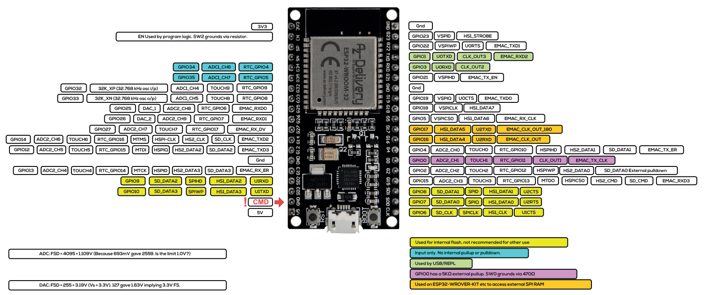

# Getting Started

<figure markdown="span">
        
    </figure>

## What Do We Want to Do?
In this course, we will explore key principles of the Internet of Things (IoT) by developing an **automated plant monitoring and watering system**. Our goal is to create a smart irrigation solution using a microcontroller as the project’s core. In our system, a sensor will continuously measure soil humidity (and temperature) and send these readings via `MQTT` to a central server. There, the data can be processed and visualized using a browser-based dashboard, allowing you to monitor the plant’s status. Furthermore, you will be able to remotely set parameters - such as the optimal humidity level - and these settings will be transmitted back to the microcontroller to trigger a water pump when necessary.

*And let’s face it: not everyone is blessed with a natural green thumb. With this system, even if you have the gardening skills of a cactus 🌵, your plants will still thrive!*

## :material-hammer-wrench: And Therefore We Use...
While `Python` :fontawesome-brands-python: is typically associated with data analysis and software development on PCs, it can also be used to program microcontrollers. In this course, we leverage Python’s flexibility to develop firmware for embedded systems.

We are now in the realm of embedded systems. Embedded systems are essentially 'computers' :fontawesome-solid-computer: integrated into technical systems that combine electronic and often mechanical components. Unlike a typical PC, a microcontroller usually runs either without an operating system or with a highly specialized one, and always relies on firmware. The firmware is generally structured into three main components:

- **Bootloader:** Loads the operating system and the application software.
- **Operating System** (if present): Manages multitasking, memory, and file systems.
- **Application Software:** This is the code you write - in our case, using MicroPython.

### Software: MicroPython
Although the traditional approach for programming embedded systems is to use `C`, this method requires deep hardware knowledge and specialized expertise. Since our focus is on learning IoT concepts without getting lost in low-level programming, we will use MicroPython. MicroPython is a lean implementation of `Python 3`, written in `C` and optimized for microcontrollers. It compiles Python code to bytecode, which is then interpreted at runtime.

???+ tip "CircuitPython"
    For beginners, there’s also CircuitPython - a variant designed with an even friendlier interface - but for this course, we’ll stick with MicroPython.

### Hardware: ESP32

<figure markdown="span">
        
    </figure>

The ESP32 microcontroller is an ideal choice for IoT projects. It comes in various versions and supports wireless communication via Wi-Fi and Bluetooth, as well as wired interfaces like SPI, SDIO, I2C, and UART. Thanks to its power efficiency, robustness, and affordability (basic models are available for around €10), the ESP32 is well suited for a wide range of applications - from simple prototypes to complex systems. While other popular microcontrollers include Arduino, STM32, and Raspberry Pi, the ESP32 strikes a great balance between performance and cost for our smart plant watering project.

???+ question "Get Familiar with ESP32"

    Open the corresponding [ESP32 datasheet](https://cdn.shopify.com/s/files/1/1509/1638/files/ESP_-_32_NodeMCU_Developmentboard_Datenblatt_AZ-Delivery_Vertriebs_GmbH_10f68f6c-a9bb-49c6-a825-07979441739f.pdf?v=1598356497) and answer the following questions:

    - How many cores does the ESP32 have?
    - How much flash memory does the ESP32 have?
    - What kind of Bluetooth does the ESP32 support?
    - What are the electrical characteristics of the ESP32 (voltage, current, etc.)?
    

## Setting up our Project
Before we can start programming our ESP32, we need to install some necessary software first. 

### Firmware Upload

To be able to write code to the microcontroller, the MicroPython firmware must be loaded onto the ESP32. For this, we will use Thonny IDE - a friendly and intuitive Integrated Development Environment that simplifies the process of programming MicroPython on the ESP32.

Below are the step-by-step instructions:

1. **Download Thonny IDE:**  

    - Head over to [thonny.org](https://thonny.org) and download the IDE software appropriate for your operating system.
    - Install thonny by following the instructions. 

2. **Connect the ESP32:** 

    - Plug your ESP32 into your computer using a USB cable.

4. **Configure Thonny IDE:**  

    - Open Thonny IDE and go to **Tools > Options > Interpreter**.  
    - Select **MicroPython (ESP32)** from the interpreter options and ensure the correct port is selected.  
        - *Tip for Windows:* Check **Device Manager > Ports** to verify which port is occupied (look for entries like “USB to UART”).  
        - *Tip for macOS:* Navigate to **About This Mac > System Report** and look under USB to find your device.

5. **Install or Update the Firmware:**  
   - Click the **Install or update firmware** button.  
   - Select the correct port (if not already set) and browse to the downloaded `.bin` file.  
   - Click **Install** to flash the firmware onto the ESP32.

   *Note:* With newer versions of Thonny, you can also click the orange **Install or update MicroPython** button after selecting the interpreter and port. In this case, choose:
   - **Target port:** USB to UART  
   - **MicroPython family:** ESP32  
   - **Variant:** Espressif ESP32 / WROOM  
   - It is recommended to use **version 1.22.1** since the latest version may cause issues.

6. **Verify the Installation:**  
   - In Thonny, ensure that under **Tools > Options** the interpreter is correctly set.  
   - You should see a connection established in the shell at the bottom.  
   - Type `help()` and press Enter to check that the controller is responding correctly.

If any problems occur, you can also use alternative tools such as **esptool.py** from Espressif or **uPyCraft IDE**. For further details, check out this guide: [Flashing MicroPython with esptool.py](https://randomnerdtutorials.com/flashing-micropython-firmware-esptool-py-esp32-esp8266/).

Happy coding and welcome to the world of MicroPython!

Thonny for firmware upload  

### Code Editing and Debugging
PyMakr for code editing and debugging
Node.js is needed therefore

Troubleshooting Port Probleme: Install CP2102 USB Driver

## Try it out!

make led blink

xxxxxxxxxxxxxxxxxxxxxxxxxxxxxxxx

Was ist Micropython

Welche Tools verwenden wir?
Installation

Welche Hardware verwenden wir? 

Projekt setup

Take a look at the pinout chart of our `ESP32-WROOM-32` and make yourself familiar with the pins.

