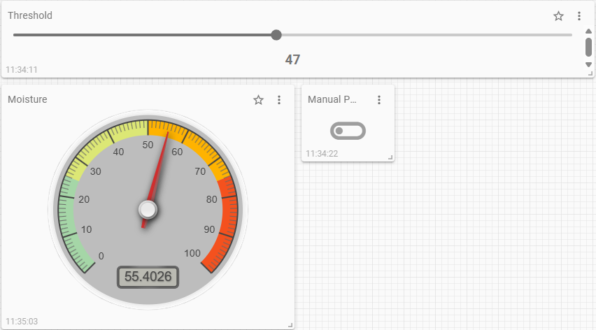

# Plant Watering System

#

Measure Humidity and show in dashboard
slider for controlling the threshold
button for manual trigger of the pump for 5 seconds
Controlloop: Once the moisture is below the threshold, the pump is turned on for 5 seconds. after that wait for 10 seconds to measure again

---

## Example Setup Summary

* ESP32 publishes soil moisture to: `plant/data/moisture`
* ESP32 subscribes to threshold control: `plant/control/threshold`
* MQTT Tiles displays moisture as a gauge and slider to adjust threshold
* ESP32 turns pump on/off based on received threshold vs. sensor data

## Watering Strategy: How Much and When?

Now that your system is able to water plants, the key question becomes: **how much water is needed**, and **what are good threshold values for different types of plants and environments**?

### 🌿 Recommended Moisture Thresholds by Plant Type

| **Plant Type**      | **Moisture Threshold (%)** | **Notes**                                                               |
| ------------------- | -------------------------- | ----------------------------------------------------------------------- |
| Succulents & Cacti  | 10–30%                     | Let soil dry completely between waterings                               |
| Medium-water Plants | 30–50%                     | e.g. pothos, spider plants; let top soil dry                            |
| Tropical Plants     | 50–70%                     | e.g. ferns, peace lilies; maintain consistent moisture, avoid sogginess |
| Herbs & Edibles     | 40–60%                     | Prefer moist, well-drained soil                                         |
| Flowering Plants    | 40–70%                     | e.g. violets, begonias; avoid extreme wet/dry cycles                    |

### 📈 Adjusting Thresholds Based on Environment

* **Light:** In bright, sunny spots, increase moisture thresholds by **5–10%** to compensate for faster drying.
* **Humidity:** In high-humidity rooms, decrease thresholds by **5–10%** to avoid overwatering.
* **Soil Type:**

  * **Sandy soil:** drains quickly → use **lower thresholds**
  * **Clay soil:** retains water → use **higher thresholds**

### 💧 How Much Water to Dispense?

| **Plant Size**         | **Recommended Water Volume** |
| ---------------------- | ---------------------------- |
| Small pots (<15 cm)    | 100–200 ml                   |
| Medium pots (15–30 cm) | 250–500 ml                   |
| Large pots (>30 cm)    | 500–1000 ml                  |

???+ tip "Tip"
    **Note:** Our pump delivers approximately **30–50 ml per second**.
    To determine how long to run the pump, adjust the `pump_on_time` based on your desired volume.

### 🧪 Tip: Calibrate Water vs. Moisture

To make your system smart and reliable, you can empirically measure the **effect of water on soil moisture**.

#### Example Calibration:

* **Pot size:** 1.5 liters of soil
* **Initial moisture:** 30%
* **Add:** 100 ml water
* **New moisture reading:** 40%
* → Change:

  $$
  \frac{\Delta \text{Moisture}}{\text{Water Volume}} = \frac{40\% - 30\%}{100\ \text{ml}} = 0.1\% \text{ per ml}
  $$

Create a table or spreadsheet for your plant type, pot size, and soil. Observe how much moisture rises for a given volume. You’ll also find a point where additional water doesn’t significantly raise the value — this is your **saturation point**.

Use this data to define precise thresholds and optimize your watering cycle.