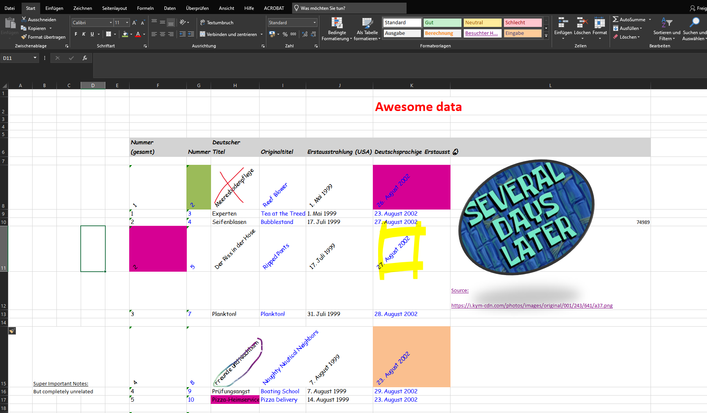

# Tabular data

With a couple of practical examples, we will discover tips on how to work with
tabular data, where to find it, and the various sources and formats you
can explore. This chapter will guide you through working with different types
of structured data, enabling you to extract, transform, and analyze information
from multiple sources.

???+ info
    
    This chapter is an extension to the previous `pandas` chapter. It 
    should equip you with the necessary skills to acquire data from various 
    different sources.

Our journey will cover selected data acquisition methods:

1. Excel: Learn how to read spreadsheets
2. Web Scraping: Extract tables directly from online sources
3. Database: First interaction with a local database

## Prerequisites

For this chapter we recommend to create a new project. Additionally, create 
a new virtual environment and **activate** it.

You should end up with a project structure similar to:

```
📁 tabular/
├── 📁 .venv/
└── 📄 tabular_data.ipynb
```

## :fontawesome-solid-file-excel: Excel

Let's start off with arguably the most common data source: Excel spreadsheets.

<div style="text-align: center;">
    
</div>

Reading Excel files can be straightforward, ==if they are properly structured==.
However, if you see files like these...



... run, or it will take you several days to parse the file. :winking_face:

Although, the example might exaggerate, it is not uncommon to encounter 
spreadsheets that are easily readable by humans but hard to parse by machines.
Like in the example, the title, empty rows and columns, merged cells, 
column names spanning multiple lines, pictures and other formatting can 
make it difficult to extract the data in a structured manner.

### Reading Excel files

Download the following (structured) file to get started:

<div class="center-button" markdown>
[Student data :fontawesome-solid-download:](../../assets/python-extensive/data/tabular/fhsstud.xlsx){ .md-button }
</div>

Data source: Statistik Austria - data.statistik.gv.at[^1]

[^1]:
    [Studien an Fachhochschulen](https://data.statistik.gv.at/web/meta.jsp?dataset=OGD_fhsstud_ext_FHS_S_1)
    At the time of writing (December 2024), the data was last updated on 
    2024-07-25.

Place the file within your project directory. The data set contains the 
number of students enrolled at universities of applied sciences in Austria 
per semester. 

If you are an MCI student, you are part of this data set!

??? info "Interested in the creation of the Excel?"
    
    Since, Statistik Austria provides the data across three files, a
    `Python` :fontawesome-brands-python: script was used to merge everything 
    into a single Excel. Below you can find the code snippet:

    ```python
    # Data from:
    # https://data.statistik.gv.at/web/meta.jsp?dataset=OGD_fhsstud_ext_FHS_S_1
    import pandas as pd
    
    students = pd.read_csv("OGD_fhsstud_ext_FHS_S_1.csv", sep=";")
    semester = pd.read_csv(
        "OGD_fhsstud_ext_FHS_S_1_C-SEMESTER-0.csv",
        sep=";",
        usecols=["code", "name"],
    )
    header = pd.read_csv(
        "OGD_fhsstud_ext_FHS_S_1_HEADER.csv", sep=";", usecols=["code", "name"]
    )
    
    # replace column codes with their corresponding names
    students = students.rename(
        columns={row["code"]: row["name"] for _, row in header.iterrows()}
    )
    # replace semester codes with their descriptions
    students.Berichtssemester = students.Berichtssemester.replace(
        {row["code"]: row["name"] for _, row in semester.iterrows()}
    )
    
    # get term
    students["Semester"] = students.Berichtssemester.str.split(" ").str[0]
    
    # write Excel
    students.to_excel("fhsstud.xlsx", index=False)
    ```

---

To read the Excel file, we will use `pandas` in conjunction with `openpyxl` 
(to read and write Excel files):

```bash
pip install pandas openpyxl
```

???+ tip

    You can install multiple packages with a single command. Simply 
    separate the pacakge name with a space.

To read the file, it's as simple as:

```python
import pandas as pd

data = pd.read_excel("fhsstud.xlsx")
```

As the file is structured, the data loads without any issues. 

#### Reading specific sheets

By default, [`#!python pd.read_excel()`](https://pandas.pydata.org/docs/reference/api/pandas.read_excel.html)
loads the first sheet. If you want to read another sheet, you can specify it 
with the `sheet_name` parameter:

???+ question "Create and read a new sheet"

    1. Open `fhsstud.xlsx` within Excel. 
    2. Manually create a new sheet and fill it with some data of your choice.
    3. Save the file.
    4. Read the new sheet with `pd.read_excel()`.

#### Detour: Visualize enrolled students

<div style="text-align: center;">
    <iframe
        src="/assets/python-extensive/data/tabular/wintersemester.html" 
        width="100%" height="450">
    </iframe>
</div>
