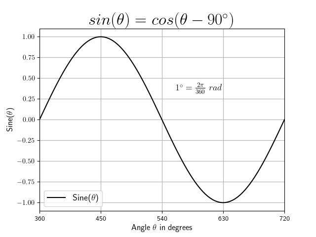
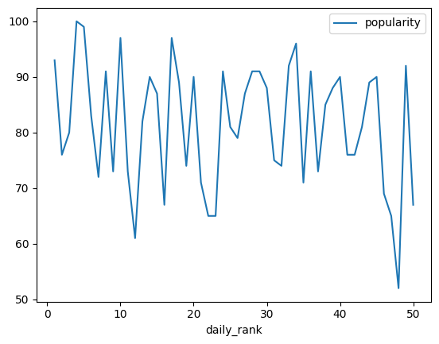
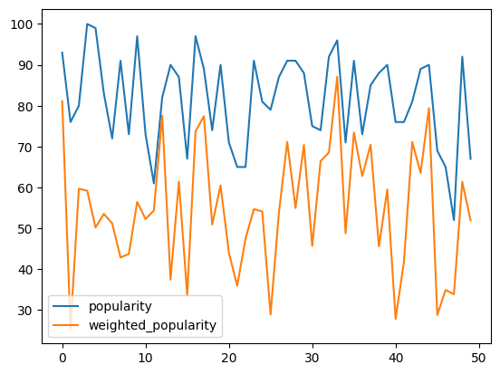
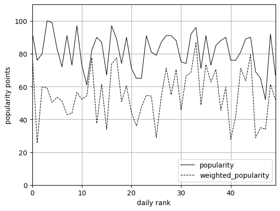
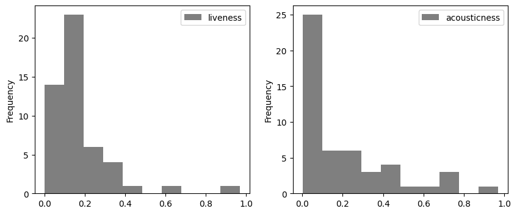
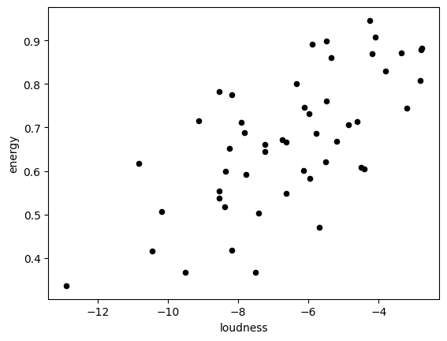
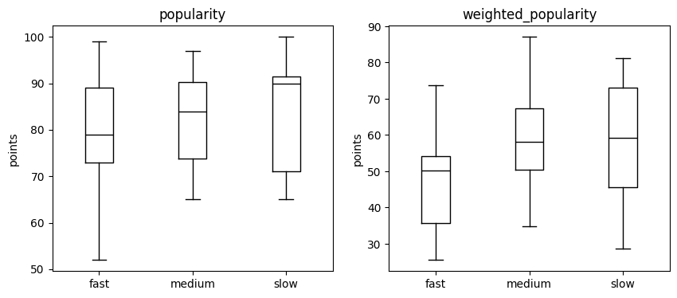
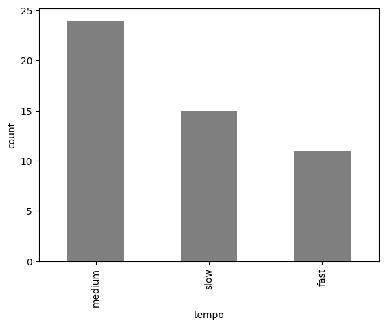
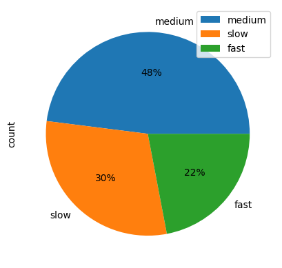

<!-- Header start -->
# Plotting

With a couple of practical examples, we will discover tips on how to generate a plot, and outline the various plotting methods and format styles you
can explore.


<figure markdown="span">
  { width="500" }
</figure>
    

???+ info

    If you're interested in the creation of the sine-graph above, you can find the code 
    below. Note, for the data generation the `numpy` package is used as well as the  `matplotlib` package for data visualization. 

    We will cover some of the used functionalities and formatting styles in this section.

    ??? code "Create Visualization"
    
        ```py
        --8<-- "docs/assets/python-extensive/data/plotting/plotting_sine.py"
        ```


## Introduction

<!-- Header end -->

???+ info
    
    We will give a brief introduction on plotting data with `pandas`, which is built on the package `matplotlib`(the corresponding documentation is available [here](https://matplotlib.org/stable/gallery/pyplots/index.html#module-pyplot)).

    This chapter is an extension to the previous [`pandas`](pandas.md) 
    chapter. Therefore, we will use the Spotify data set and we assume that you have imported the data already (to download the data set and reading the file see [`pandas`](pandas.md)). 
    
    This chapter should equip you with the necessary skills to generate various visualizations for your data analysis.  

<!-- Body start -->


## Getting started

First, we need to import the package. If you want to make certain changes in your graphs, it might be useful to install the `matplotlib` package as well.

```py
import pandas as pd
import matplotlib.pyplot as plt
```


## 2-D plots

Figures can be generated directly using the `plot()` function with `pandas`. The ``x`` and ``y`` attributes refer to the values of the x and y axis. 

```py
data.plot(x='daily_rank', y='popularity')
```

<figure markdown="span">
  { width="500" }
</figure>

If you visualize a DataFrame, you plot all columns as multiple lines. If the ``x`` values are not explicitly stated, the x-value starts with zero and ends with the number of rows minus one (``range(0, number of rows)``). 

```py
# Mathematical operations (see pandas)
data["weighted_popularity"] = data["popularity"].mul(data["energy"]) 
data_plot = data[['popularity', 'weighted_popularity']]
data_plot.plot()
```

<figure markdown="span">
  { width="500" }
</figure>
   

Note: The `plt.show()` function in a `py` script opens one or more interactive wondows to show the graphs. For jupyter notebooks the command is not necessary because the graph is enbedded in the document.


### Formatting

`pandas` offers a a range of pre-configured plotting styles. You can use plot style arguments to perform format changes by simply adding it to the `plot` function. There are some common `plot` arguments that are worth mentioning (for more detail see also the `pandas` [documentation](https://pandas.pydata.org/docs/user_guide/visualization.html) or Google.):

- `style`: Color and style of lines or markers (see table below).
- `linewidth`: Changing thickness of the line. 
- `legend`: Description of the elements in a plot (`loc` for the location using `plt.legend()`).
- `grid`: Adding a grid.
- `xlabel`, `ylabel`: Labeling the x- and y-axis.
- `xticks`, `yticks`: Changig the annotation of the axis.
- `axis`: Changing the range of the axis (`xlim`, `ylim` individually). 
- `secondary_y`: Adding additional plot.
- `subplots`: Generating individual plots for each column (`layout` for the `subplots`).
- `title`: Adding a title (set `fontsize`).
- `figsize`: Changing the size of the plot.

The following table shows additional arguments for different colors, line styles and marker types.

| Initials | Description | Initials | Description | Initials           | Description |
|----------|-------------|----------|-------------|--------------------|-------------|
| `y`      | yellow      | `-`      | solid line  | `+`                | plus-marker | 
| `m`      | magenta     | `--`     | dashed      | `o`                | circle      | 
| `c`      | cyan        | `:`      | dotted      | `*`                | asterisk    | 
| `r`      | red         | `-.`     | dotdashed   | `.`                | point       | 
| `g`      | green       |          |             | `x`                | cross       | 
| `b`      | blue        |          |             | `s`                | square      | 
| `w`      | white       |          |             | `d     `           | diamant     | 
| `k`      | black       |          |             | `>`, `<`, `^`, `v` | triangle    | 

#### MCI | WING: Formatting standards
???+ info
    
    For laboratory reports and final papers formatting standards exist (see ``Academic Walkthrough - Formakriterien für schrifliche Abgaben - Abbildungen und Diagramme``). 
    For example:
    
    - The line colors are usually set to black or gray with different line styles for black/white printing. 
    - The legend is necessary to identify different data series in one graph.
    - For axis labelling the following information is mandatory: the variable name and unit.


```py
data_plot.plot(style=['k-','k--'], xlim = (0,49), ylim=(0, 110), linewidth=0.8, 
               grid=True, xlabel='daily rank', ylabel='popularity points')
plt.legend(loc='lower right')
```

<figure markdown="span">
  { width="500" }
</figure>


???+ question "Formatting line plots"

    We want to analyse the tempo of our tracks.

    Generate a line plot of the tempo (`y` argument) and the `daily_rank` as the horizontal axis (`x` argument).
    Change the format to the following:

    - Set the line color to black
    - Delete the legend (hint: set legend to `False`)
    - Set the labels of the x- and y-axis
    - Set the range of the x-axis from 1 to 50


## Statistical plots

`pandas` supports statistical plots, which present results of the statistical data analysis. 
The following table shows some of these plotting methods, which are provided with the `kind` argument in the `plot()` function or using the mehod `DataFrame.plot.<kind>` instead. 

| Initials  | Description |
|-----------|-----------------------------------------------------------------------------|
| `hist`    | histogram (`bins` change number, `density` for probability?)                |
| `scatter` | scatter plot (two variables representing the x- and y-values)               |
| `bar`     | bar plot for labeled, not time-series data (`stacked` for multiple bars/columns)    | 
| `barh`    | horizontal bar plots (also used for gantt charts)                           |
| `box`     | boxplot shows distribution of values within each column (`by` for grouping) |
| `kde`, `density` | density plot                                                         |
| `area`    | area plot                                                                   |
| `pie`     | pie chart (percent of categorical data)                                     |

Some of the formatting arguments can be used for statistical plots. For a detailed description see the `pandas`[documentation](https://pandas.pydata.org/docs/user_guide/visualization.html).

### Histogram
The histogram counts the number of values in each bin. The range of the bin and the number of bins can be changed using the `range` and `bins` argument. Histograms of multiple columns can be drawn at once using `subplots`. 

```py
data_plot = data[['liveness', 'acousticness']]
data[['liveness', 'acousticness']].plot(kind='hist', layout=(1,2), figsize=(10, 4), subplots=True, 
                                        color='k', alpha=0.5)
```

<figure markdown="span">
  { width="600" }
</figure>


???+ question "Change arguments"
    
    Make the following changes to the histogram above and see what happens.

    - Generate a probability density function (hint: use the argument `density`).
    - Add the argument `bins` and change the number of bins to 20.


### Scatter plot

The scatter plot can be used to show correlations between two variables. Therefore, the horizontal (`x` argument) and vertical (`y` argument) coordinates are defined by two columns of the `DataFrame`.

```py
data.plot.scatter(x='loudness', y='energy', color='k')
```

<figure markdown="span">
  { width="500" }
</figure>

???+ question "Scatter plot "

    Generate a scatter plot to show, if there is a relationship between the variabel `speechiness`and the variable `tempo`.


### Detour: Data categorisation for statistical analysis

`Categorical` data in `pandas` correspond to categorical variables in statistics. This data type has a limited number of possible values, which are called `categories`. 

For example, some artists have more than one song in this list. The calculation of the maximum number of tracks one artist have, can be generated as follows.

```py
number_artists = pd.Categorical(data['artists']).value_counts()
print(number_artists.max())
print(number_artists[number_artists == 3])
```

```title=">>> Output"
3
LACAZETTE    3
Name: count, dtype: int64
```

Let's break the example down:

- The datatype `Categorical` shows a list of unique artists (output: 46 different artists).
- The method `value_counts()` creates a `Series` with the number of counts for each artist.
- The method `max()` calculates the maximum number of tracks for one artist in the data set.
- Lastly, we use boolean indexing to show the name of the artist.

The `cut()` method discretizes data according to intervals (`bins`) and chosen names (`labels`). 
The `DataFrame` can easily be extended by the `Series` with `categorical` data.

```py
data['tempo_cat'] = pd.cut(x=data['tempo'], bins=[0, 110, 140, 200], 
                           labels=['slow', 'medium', 'fast'])
```

`Categorical` data can be used for grouping in box plots, as we will see below.

Further we can generate a `DataFrame` which contains the different categories in the first column and the number of counts in the second column using the `value_counts()` method. 

```py
data_count = pd.DataFrame(data['tempo_cat'].value_counts())
data_count
```

```title=">>> Output"
tempo_cat	count
medium	    24
slow	    15
fast	    11
```

We will see, that this `DataFrame` can be used for statistical graphs like `bar` plots or `pie` charts.

### Box plot

The boxplot is generated to visualize the statistical values for each column of a `DataFrame`. 
`pandas` also supports many arguments of the `matplotlib` package for boxplots (look at the `matplotlib` [documentation](https://matplotlib.org/stable/api/_as_gen/matplotlib.pyplot.boxplot.html#matplotlib-pyplot-boxplot)). 

```py
data.plot.box(column=['popularity','weighted_popularity'], by='tempo_cat', 
              color='k', ylabel='points', figsize=(10,4))
```


<figure markdown="span">
  { width="700" }
</figure>


???+ question "Box plot "

    Generate a box plot to show the difference between the variables `acousticness`, `speechiness` and `liveness`.

### Bar plot

The bar plot presents rectangular bars, which represent the values of the `DataFrame` for different categories (`x` axis).

```py
data_count.plot.bar(color='k', alpha=0.5, legend=False, xlabel='tempo', 
                    ylabel='count')
```

<figure markdown="span">
  { width="500" }
</figure>

### Pie chart

The pie chart shows the percentage of each category from the absolute values of the count table. 
The different formatting styles for the pie chart can be done using the `autopct` argument (for more information see the `matplotlib` [documentation](https://matplotlib.org/stable/api/_as_gen/matplotlib.pyplot.pie.html#matplotlib-pyplot-pie)).  

```py
data_count.plot.pie(y='count', autopct="%1.0f%%")
```

<figure markdown="span">
  { width="400" }
</figure>


???+ question "Danceable tracks"

    <figure markdown="span">
      { width="350" }
    <figcaption>Saturday Night Fever</figcaption>
    </figure>

    We assume that tracks with a danceability score higher than `#!python 0.8`
    are most danceable and the tracks less than `#!python 0.7` are less danceable. 

    - Categorize the data using the categories `less_danceable`, `danceable` and `most_danceable`.
    - Generate a boxplot to explore the relationship between the `tempo` grouped by the different categories for `danceability`.
    - Display the number of tracks for each category in a `DataFrame` (hint: use the `value_counts()` method).
    - Visualize the number of tracks for each category with a `bar` chart.
    - Visualize the number of tracks for each category in a `pie` chart.
    


## Recap

We provided the basis to generate good looking visualization of your data analysis using `pandas`. 
The introduced functionalities and arguments can be used to change the format of your graphs to your liking. 

<!-- Body end -->
