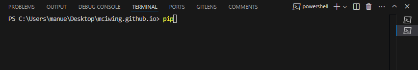
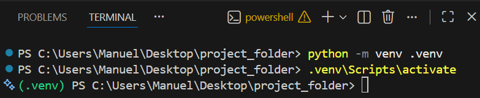

# Package Management :material-package-variant:

## Introduction

One reason, why `Python` is widespread, is its vibrant community. This community
develops code to solve a variety of problems in the widest range of scientific
fields. This code is bundled and shared for free (as open-source) in the
form of packages. You can download and use these packages. The usage of
packages will facilitate your coding process as they offer implementations to
solve common problems. Therefore, you won't have to reinvent the wheel.

For example the package `pandas` is the go-to tool for data manipulation and
analysis. With `pandas` you can read text and Excel files 
:fontawesome-regular-file-excel: among a lot of other
formats and it offers a lot of functionality to manipulate and even plot your
data. Hence, you will rarely see `Python` projects that are not dependent on
`pandas`. Apart from `pandas` there are a wide variety of popular packages:

- [`scipy`](https://scipy.org/) - statistics (which will be covered in the next
  course)
- [`tqdm`](https://tqdm.github.io/) - build progress bars
- [`scikit-learn`](https://scikit-learn.org/stable/) - for machine learning
- [`numpy`](https://numpy.org/) - scientific computing
- ... and many many more

This section serves as a guide on how to install and manage packages.
Additionally, the concept of virtual environments is explained.

## Standard library

`Python` comes with a couple of modules which do not need to be installed and can
be used 'out of the box'. For simplicity, we will call these modules packages
as well. If you're interested in the difference between packages and modules,
Real Python has a nice [article](https://realpython.com/python-modules-packages/)
on the topic. [Here](https://docs.python.org/3/py-modindex.html) is
an extensive list of all the packages that `Python` ships with.

Let's use the `#!python random` package to generate some random numbers. 
First, we have to import the package with the following command:

```py hl_lines="1"
import random

# with the package imported we can use its functions
# e.g., random integer (between 1 and 100)
print(random.randint(1, 100))
```

```title=">>> Output"
42
```

Note, the output will be different when you run the code, since it is random.

The corresponding documentation is
available [here](https://docs.python.org/3/library/random.html#random.randint).
Generally speaking, almost all packages offer an online documentation page. It
is good practice, to consult these documentation sites as they offer a lot of
information on how to use their package and which methods/functions are
available. Usually, functionalities are illustrated with examples that can be a
good starting point for your project.

???+ info

    If you remember, `#!python random` was used in one of the previous 
    sections on [control structures](control-structures/if.md#if) to generate 
    passwords of variable length.


???+ question "Calculate the median"
    
    Use the built-in `#!python statistics` package to calculate the median of 
    the below given values. Use Google to search for the `#!python statistics` 
    documentation page and try to find the appropriate function.

    ```py
    values = [13, 58, 90, 34, 49, 41]
    ```

We will continue with another exercise.

???+ question "Variance of random values"
    
    Generate a list of random values (can be integers and/or floats) and 
    calculate the variance. Hint: Use both the `#!python random` and 
    `#!python statistics` package.

## Installing packages

To get access to all the packages available online, we need to install them
using a package manager. One such manager is `pip` which is 
automatically installed alongside `Python`. To check if `pip` is available 
on your system open a new terminal within VSC by navigating in the menu bar 
`Terminal` :octicons-arrow-right-24: `New Terminal` 

<figure markdown="span">
  { width=100% }
  <figcaption>VSC Terminal</figcaption>
</figure>


and execute the following command:

```
pip
```

... you should see a list of commands and their description:

```
Usage:   
  pip <command> [options]

Commands:
  install                     Install packages.
  download                    Download packages.
  uninstall                   Uninstall packages.
  freeze                      Output installed packages in requirements format.
  inspect                     Inspect the python environment.
  list                        List installed packages.
  show                        Show information about installed packages.
...
```

???+ info
    
    You can run shell commands directly from your notebook by using an 
    exclamation mark (`!`) as a prefix (e.g., `!pip`). However, in some cases,
    such as when uninstalling a package, this approach may cause issues. 
    Therefore, it's often recommended to use the terminal instead.

Now, we'll install our first package, called [`seaborn`](https://seaborn.pydata.org/).
To install a package use pip's `install` command followed by the package name 
(`pip install <package-name>`).
Don't worry, it might take a couple of seconds.

```
pip install seaborn
```

`seaborn` is a quite common package to visualize data. Now, run the following
code to create your first plot. The code snippet was copied from the
`seaborn` documentation
[here](https://seaborn.pydata.org/examples/grouped_boxplot.html).

```py
# taken from https://seaborn.pydata.org/examples/grouped_boxplot.html
import seaborn as sns

sns.set_theme(style="ticks", palette="pastel")

# Load the example tips dataset
tips = sns.load_dataset("tips")

# Draw a nested boxplot to show bills by day and time
sns.boxplot(x="day", y="total_bill",
            hue="smoker", palette=["m", "g"],
            data=tips)
sns.despine(offset=10, trim=True)
```

You don't have to fully understand the code snippet. It's more about the
successful usage of a package. You might have noticed, that you didn't solely
install `seaborn`. Among `seaborn`, `pip` also installed `pandas` (for data
handling). We can 'verify' that by checking the type of `tips` (from the code
snippet above).

```py
print(type(tips))
```

```title=">>> Output"
<class 'pandas.core.frame.DataFrame'>
```

Most of the time, a package does not 'stand on its own'. It uses the
functionalities of other packages as well. In our case, `seaborn` also needs
`pandas` to properly function. Hence, a lot of packages are dependent on each
other.

???+ question "Remove a package"

    Remove the `seaborn` package. Like above, use `pip` within a terminal to 
    list all commands and find the appropriate one. Execute the command 
    to remove the package.

### PyPI

<figure markdown="span">
  { width="75%" }
</figure>

You might wonder where `pip` downloads the packages?! In short, all packages
are downloaded from the [Python Package Index (PyPI)](https://pypi.org/).
That's where the open-source community (usually) publishes their packages.
Simply put, if you type `pip install seaborn`, `pip` looks for a package called
`seaborn` on PyPI and downloads it. `PyPI` is a valuable resource if you're
searching for packages, certain versions, etc.

## Virtual environments

Previously, we have installed the package `seaborn`. The package itself was
available system-wide as we did not create a virtual environment beforehand.
This means, if you open a new folder/project and you select the same python kernel (typically the global python installation), the package will be available and you do not need to install it again.
That might not sound too bad, but it's actually considered bad practice. But
what is good practice and what the heck is a virtual environment?

### Why?

To understand virtual environments, let's use an analogy from everyday life: cooking in a kitchen.
Imagine you are baking two different cakes in the same kitchen.
One is a regular chocolate cake, and the other must be gluten-free because someone has an allergy.

<figure markdown="span">
  
  <figcaption style="text-align: center;">Allergic Reaction (Source: <a href="https://tenor.com/de/view/allergies-allergic-reaction-the-big-bang-theory-howard-wolowitz-peanut-reaction-gif-23277809">Tenor</a>)</figcaption>
</figure>


Even though both cakes are made in the same kitchen, you would not casually reuse the same bowls, spoons, and surfaces without cleaning them carefully. If flour from the regular cake gets into the gluten-free one, the result is ruined - and potentially harmful. :fontawesome-solid-biohazard:

So what do you do? You create separate, clean work areas with the exact ingredients and tools needed for each cake.

A virtual environment in Python works the same way.

- Your computer is the kitchen.
- Each project is a different recipe.
- The packages (like seaborn, numpy, or pandas) are the ingredients.

If all projects share the same global Python installation, it's like throwing all ingredients into one giant bowl. Sooner or later, versions clash, dependencies break, and one project can accidentally ruin another.

A virtual environment gives each project its own clean workspace, with its own set of packages and versions, completely separated from other projects - even though everything still runs on the same computer.

<figure markdown="span">
    
    <figcaption style="text-align: center;">Virtual Environment (Source: <a href="https://docs-beta.kelvininc.com/developer-tools/how-to/workspace/windows/venv/">kelvininc</a>)</figcaption>
</figure>

That is why using virtual environments is considered best practice.


To summarize, the `pip`/virtual environment combination facilitates:

- **Dependency management**: You can keep track of the packages that your
  project needs to function. Packages are typically built on top of other packages. 
  For example, `seaborn` is built on top of `pandas` and `matplotlib`. If you want to use `seaborn`, you need to install `pandas` and `matplotlib` first and sometimes in a specific version.
- **Version management**: You can specify the exact versions of a package that
  your project needs. This is important, because different versions of a 
  package may have different functionalities or bugs.
- **Environment management**: It's easier to work on multiple projects on a
  single machine as you can install multiple versions of a package on a
  per-project basis.
- **Shareable**: Your projects will be shareable with other developers as they
  can easily install all dependencies with a single command. No more "it worked
  on my machine" excuses!

### How?

To work with virtual environments, you need to follow three steps: 

???+ info "The three steps to work with virtual environments"

    1. Create a virtual environment
    2. Activate the virtual environment
    3. Select the virtual environment as your Jupyter or Python kernel

#### Create a virtual environment

To create a virtual environment, open a new command prompt within VSCode (you
can use the shortcut ++ctrl++ + ++shift++ + `ö`). Check if the terminal is opened in the correct folder. This should be your current project folder. If not, you can change the folder by typing `cd <path/folder-name>` in the terminal or by right clicking in the file explorer and selecting "Open in Integrated Terminal".

Then execute the following command:

```bash
python -m venv .venv
```

This command creates a new folder called `.venv` within your project folder.
Instead of `.venv` you can choose any name you want. However, this section
assumes that you named it `.venv`.

???+ warning
    The virtual environment folder should never be touched by the user. Initially a clean copy of your global Python installation will be created. 
    This includes absolute paths to the Python installation and the Python executable. 
    Therefore the virtual environment folder **cannot be moved** or sent to another machine.
    

    Furthermore, your Jupyter or Python files should always be in the project folder. NEVER in the virtual environment folder. A typical structure of a project folder might look like this:

    ```plaintext
    project_folder/
    ├── .venv/
    ├── data/
    └── my_script.ipynb
    ```

#### Activate an environment

So far we have created the virtual environment. But that is not enough. We need to activate it in order to use it.
Depending on your operating system, the command to activate the environment is slightly different.

---

=== "Windows :fontawesome-brands-windows:"
  
    As a Windows user type

    ```
    .venv\Scripts\activate
    ```
    
    ???+ info "If an error occurs"

        If an error occurs ("the execution of scripts is deactivated on this 
        system") run

        
        ```
        Set-ExecutionPolicy Unrestricted -Scope Process
        ```
        
        ... and use the previous command again.

=== "macOS/Linux :fontawesome-brands-apple:/:fontawesome-brands-linux:"

    Type

    ```bash
    source .venv/bin/activate
    ```
    
    to activate your environment.


Once the environment is activated, you can see the name of the environment (here `.venv`) in the terminal.

{ align=center }

From now on, every package you install from this activated terminal (for example with `pip install`) will be installed into the virtual environment. In VS Code or Jupyter you also need to select this virtual environment as the Python/Jupyter kernel for your notebook or script (see next section); this kernel selection is separate from activating the environment in the terminal. Use activation whenever you run terminal commands that should use the virtual environment. Note that once you close the terminal or VS Code, the environment in that terminal will be deactivated, but files that use the virtual-environment kernel will still run with the packages from that environment.

Deactivating the environment is the same on all operating systems.
To deactivate it, simply use

```
deactivate
```

in your command prompt/terminal.

#### Select the virtual environment

So now we have created the virtual environment and activated it in order to install packages. Now the third and last step is to select the virtual environment for your file as Jupyter or Python kernel.


{ align=center }


---

???+ question "Fit a machine learning model"

    Assuming your virtual environment is activated, try to get the following
    code cell running. 
 
    ```py
    from matplotlib import pyplot  # (1)!
    
    from sklearn.datasets import fetch_california_housing  #(2)!
    from sklearn.tree import DecisionTreeRegressor, plot_tree
    
    # load data
    X, y = fetch_california_housing(return_X_y=True, as_frame=True)
    
    # fit a decision tree
    tree = DecisionTreeRegressor(
        random_state=784, max_depth=2, min_samples_leaf=15
    )
    tree.fit(X, y)
    
    # visualize the tree
    plot_tree(tree, filled=True, feature_names=X.columns, proportion=True)
    pyplot.show()
    ```

    1. `pyplot` is a submodule of `matplotlib` and can be directly imported 
        with the `from` statement.
    2. Or you can import functions (like `fetch_california_housing()`) directly 
       from its submodule `datasets`.
  
    Install the packages `matplotlib` and `scikit-learn` with `pip`.
    Then try to execute the code cell.

Congratulations 🎉, you've just fitted a machine learning model (simple decision
tree) on a data set and visualized the model. That's the power of `Python` -
easily accessible packages with a lot of functionality ready to use. 🦾

Don't worry too much about the actual code lines above. Again, the
important thing is to get the code running. With the above exercise, you've 
reproduced the result from the [motivational section](index.md/#machine-learning).

### `requirements.txt`

As we have mentioned before, virtual environments are a great way to isolate project dependencies. However, sharing the whole virtual environment folder (e.g. `.venv`) is impractical. It often contains thousands of files, OS-specific binaries and absolute paths, so copying it to another machine or location usaually breaks. A better approach is to export the environment's installed packages to a simple text file that others can use to recreate the environment no matter if they are working on MacOS, Linux or Windows.

???+ question "Export dependencies"

    Assume you want to share the code snippet from the previous task with 
    someone. First, your colleague might not know which packages you used to 
    get the code running. With no more information, one has to read the code 
    and manually determine which packages are necessary.
    To circumvent such situations, you export all your packages to a file. 
    Open a command prompt/terminal and execute

    ```bash
    pip freeze > requirements.txt
    ```
    
    A `requirements.txt` is written which contains all your used 
    packages.

Your colleague can now take the file and install all packages needed, at once.

```bash
pip install -r requirements.txt
```
... is the corresponding command.

???+ info

    A `requirements.txt` file is a common way to share project dependencies.
    However, it will also help you, to restore your environment, in case 
    something goes wrong. Hence, keep your requirements file up-to-date.

## Other choices?/Outlook 

Apart from `pip` there are a couple of other package managers available.
For example, there are

* [`uv`](https://docs.astral.sh/uv/)
* [`pipenv`](https://pipenv.pypa.io/en/latest/)
* [`poetry`](https://python-poetry.org/docs/)
* [`miniconda`](https://docs.anaconda.com/miniconda/)

... and this is by no means an extensive list.
All of these tools let you install and manage packages. Nevertheless, they have
their differences. In the end, it is up to you, the developer which tool fits
best. `pip` is always a solid choice (and the go-to choice to get the hang of
package/virtual environment management). However, if you're working on larger
scale projects with a couple of other developers, one of these package managers
might offer some functionalities which facilitates the development workflow.

## Recap

In this section, you have learned how to install packages and manage them 
within virtual environments. The topics covered:

* `pip`
* How to install/uninstall packages
* PyPI - the package hub
* Concept and benefits of virtual environments
* Creation and basic usage of a virtual environment
