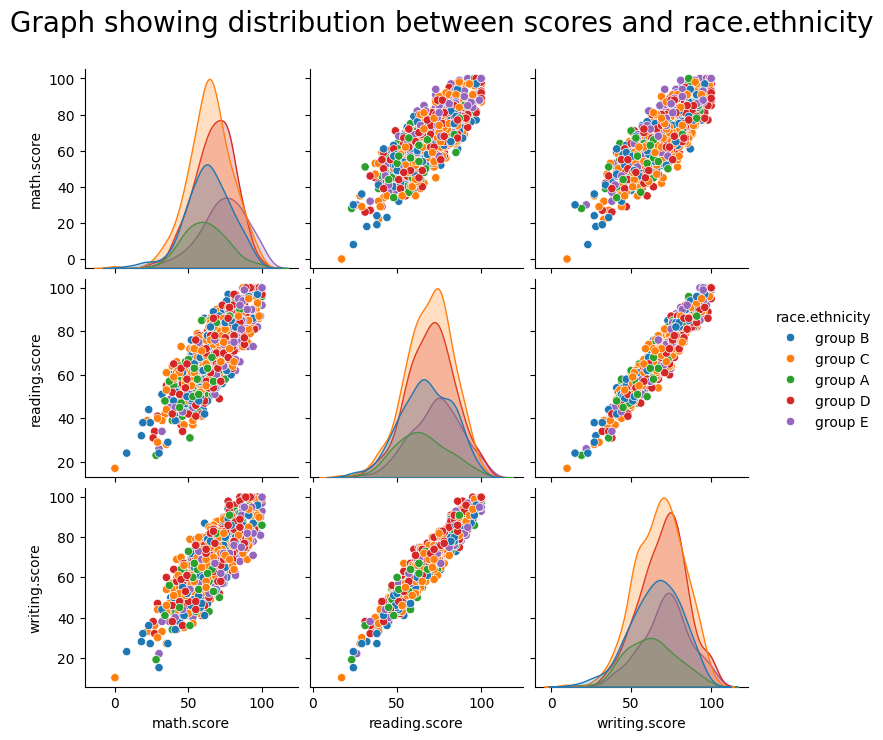

# ANOVA
**ANOVA**, which stands for **Analysis of Variance**, is a statistical method used to determine whether there are statistically significant differences between the means of three or more groups. Unlike the t-test, which examines whether there is a difference between two groups, ANOVA is used to assess differences among multiple group means simultaneously by comparing the variances within each group to the variances between the groups. The primary goal of ANOVA is to determine whether any of those differences are statistically significant.

## Types of ANOVA

<div class="grid cards" markdown>

-   __One-Way ANOVA__

    analyzes the impact of a single independent variable (factor) with three or more levels on a continuous dependent variable.

    ???+ example "Example One-Way ANOVA"
        A factory manager uses One-Way ANOVA to compare the average production times of widgets produced by Machine A, Machine B, and Machine C.

-   __Two-Way ANOVA__

    evaluates the effects of two independent variables (factors) simultaneously and examines the interaction between them on a continuous dependent variable.

    ???+ example "Example Two-Way ANOVA"
        A researcher employs Two-Way ANOVA to study the effects of different fertilizers and watering schedules on plant growth.

-   __Repeated Measures ANOVA__

    assesses the effects of one or more factors when the same subjects are measured multiple times under different conditions.

    ???+ example "Example Repeated Measures ANOVA"
        A psychologist uses Repeated Measures ANOVA to evaluate participants' stress levels before, during, and after a meditation intervention.

-   __MANOVA (Multivariate ANOVA)__

    extends ANOVA by analyzing the effects of one or more independent variables on two or more dependent variables simultaneously.

    ???+ example "Example MANOVA"
        An educator applies MANOVA to investigate how teaching methods and class sizes influence both student performance and engagement levels.

</div>


## One-Way ANOVA

One-Way ANOVA is a statistical method used to determine whether there are any statistically significant differences between the means of three or more independent (unrelated) groups. Unlike the t-test, which compares the means of two groups, One-Way ANOVA can handle multiple groups simultaneously, making it a powerful tool for analyzing variations within and between groups.

The key concepts of the One-Way ANOVA includes: 
- Factor: The independent variable that categorizes the data. In One-Way ANOVA, there is only one factor.
- Levels: The different categories or groups within the factor.
- Dependent Variable: The outcome or response variable that is measured.
- Null Hypothesis (H~0~): Assumes that all group means are equal.
- Alternative Hypothesis (H~1~): Assumes that at least one group mean is different.

### When to Use One-Way ANOVA
One-Way ANOVA is appropriate when you want to:

- Compare the means of three or more independent groups.
- Assess the impact of a single categorical factor on a continuous dependent variable.
- Determine if at least one group mean significantly differs from the others.


### Assumptions of One-Way ANOVA
Before performing One-Way ANOVA, ensure that your data meet the following assumptions:

- Independence of Observations: The samples are independent of each other.
- Normality: The data in each group are approximately normally distributed.
- Homogeneity of Variances: The variance among the groups should be approximately equal.


### Approach
At its core, ANOVA partitions the total variance in the data into components attributable to different sources. Here's a simplified breakdown:

1. **Hypothesis Definition**
    - **Null Hypothesis (\( H_0 \))**: All group means are equal.
    - **Alternative Hypothesis (\( H_a \))**: At least one group mean is different.

2. **Sum of Squares (SS)**

    1. **Total Sum of Squares (SS Total)**

        ???+ defi "Definition: SS Total"
            Measure of the total variability in the data

            \[
            SS_{Total} = \sum_{i=1}^{N} (Y_i - \overline{Y})^2
            \]

            with: 

            - \( Y_i \) = individual observations  
            - \( \overline{Y} \) = grand mean
            - \( N \) = total number of observations  

    2. **Between-Group Sum of Squares (SS Between)**

        ???+ defi "Definition: SS Between"
            Measure of the variability due to the factor (e.g., different treatments).

            \[
            SS_{Between} = \sum_{j=1}^{k} n_j (\overline{Y}_j - \overline{Y})^2
            \]
            
            with:

            - \( \overline{Y}_j \) = mean of group \( j \)  
            - \( n_j \) = number of observations in group \( j \)
            - \( k \) = number of groups  

    3. **Within-Group Sum of Squares (SS Within)**

        ???+ defi "Definition: SS Between"

            Measure of the variability within each group.

            \[
            SS_{Within} = \sum_{j=1}^{k} \sum_{i=1}^{n_j} (Y_{ij} - \overline{Y}_j)^2
            \]

3. **Degrees of Freedom (df)**

    ???+ defi "Definition: Degree of Freedom"

        \[
        df_{Total} = N-1 \quad | \quad df_{Between} = k-1 \quad | \quad df_{Within} = N-k
        \]

        with:

        - \( N \) = total number of observations  
        - \( k \) = number of groups 

4. **Mean Squares (MS)**

    ???+ defi "Definition: Mean Squares"
        \[
        MS_{Between} = \frac{SS_{Between}}{df_{Between}} \quad | \quad MS_{Within} =  \frac{SS_{Within}}{df_{Within}}
        \]

5. **F-Statistic**

    ???+ defi "Definition: ANOVA F-Statistic"
        \[
        F = \frac{MS_{Between}}{MS_{Within}}
        \]

    **Interpretation**: A higher F-value indicates greater evidence against the null hypothesis. The p-value is derived from the F-distribution and determines the statistical significance of the results.

    **Constructing the ANOVA Table**

    | Source of Variation | Sum of Squares (SS) | Degrees of Freedom (df) | Mean Square (MS) | F-Statistic | p-Value |
    |---------------------|---------------------|-------------------------|------------------|-------------|---------|
    | Between Groups      | \( SS_{Between} \)  | \( k - 1 \)             | \( MS_{Between} \)| \( F \)     |         |
    | Within Groups       | \( SS_{Within} \)   | \( N - k \)             | \( MS_{Within} \) |             |         |
    | **Total**           | \( SS_{Total} \)    | \( N - 1 \)             |                  |             |         |


6. **Interpretation of Results**
    As we have have seen before in the T-Test and F-Test, if the p-value is smaller than \( \alpha\) (commonly 0.05) we reject H~0~. If \(p> \alpha\) we fail to reject \( H_0 \).

    If the ANOVA is significant, determine which specific groups differ using post-hoc tests like the **Tukey HSD** test to control for multiple comparisons.


???+ example "Example One-Way ANOVA in Production Scenario"

    Let’s consider a realistic production scenario. A factory uses three different machines (Machine A, Machine B, and Machine C) to assemble electronic components. The production manager wants to know if the machine type affects the assembly time.

    The Production times (in minutes) for 5 widgets from each machine:

    ```py 
    # Production Time in Minutes
    A = [12, 14, 13, 15, 14] # Machine A
    B = [16, 18, 17, 19, 18] # Machine B
    C = [11, 10, 12, 11, 10] # Machine C
    ```

    ??? example "Manual Calculation"

        - **Calculate Group Means**:
            ```py 
            k = 3

            Y_mean_A = np.mean(A)
            Y_mean_B = np.mean(B)
            Y_mean_C = np.mean(C)

            Y_mean = (Y_mean_A + Y_mean_B + Y_mean_C) / k

            print(f"Mean of Machine A: {Y_mean_A} minutes")
            print(f"Mean of Machine B: {Y_mean_B} minutes")
            print(f"Mean of Machine C: {Y_mean_C} minutes")

            print(f"Mean of Production Time: {Y_mean} minutes")
            ```

            ```title=">>> Output"
            Mean of Machine A: 13.6 minutes
            Mean of Machine B: 17.6 minutes
            Mean of Machine C: 10.8 minutes
            Mean of Production Time: 14.0 minutes
            ```
        
        ---

        - **Sum of Squares (SS)**
            ```py 
            # Calculate Sum of Squares Betwen Groups

            SSB = len(A)*(Y_mean_A - Y_mean)**2 + len(B)*(Y_mean_B - Y_mean)**2 + len(C)*(Y_mean_C - Y_mean)**2
            print(f"Sum of Squares Between Groups: {SSB}")

            # Calculate Sum of Squares Within Groups

            SSW = sum((np.array(A) - Y_mean_A)**2) + sum((np.array(B) - Y_mean_B)**2) + sum((np.array(C) - Y_mean_C)**2)
            print(f"Sum of Squares Within Groups: {SSW}")

            # Calculate Sum of Squares Total

            SST = SSB + SSW
            print(f"Sum of Squares Total: {SST}")
            ```

            ```title=">>> Output"
            Sum of Squares Between Groups: 116.8
            Sum of Squares Within Groups: 13.2
            Sum of Squares Total: 130
            ```
        
        ---

        - **Degrees of Freedom**
            ```py 
            # Degrees of Freedom
            N = len(A) + len(B) + len(C)

            df_B = k - 1
            df_W = N - k
            df_T = N - 1

            print(f"df Between Groups: {df_B}")
            print(f"df Within Groups: {df_W}")
            print(f"df Total: {df_T}")
            ```

            ```title=">>> Output"
            df Between Groups: 2
            df Within Groups: 12
            df Total: 14
            ```
        
        ---

        - **Mean Squares**
            ```py 
            # Mean Squares

            MSB = SSB / df_B
            MSW = SSW / df_W

            print(f"Mean Squares Between Groups: {MSB}")
            print(f"Mean Squares Within Groups: {MSW}")
            ```

            ```title=">>> Output"
            Mean Squares Between Groups: 58.4
            Mean Squares Within Groups: 1.1
            ```
        
        ---

        - **F-Statistic**
            ```py 
            # F-Statistic

            F = MSB / MSW
            print(f"F-Statistic: {F}")
            ```

            ```title=">>> Output"
            F-Statistic: 53.1
            ```

        ---

        - **Determine p-Value**
            Using an F-distribution table or statistical software with \( df_1 = df_{Between} = 2 \) and \( df_2 = df_{Within} = 12 \), an F-value of 53.1 is highly significant (p < 0.001).

    ???+ example "Automatic Calculation"
        For calculation the p-value and the f-statistics of the ANOVA we can use the 'f_oneway' method of the 'scipy.stats' library: 

        ```py 
        from scipy.stats import f_oneway

        f,p = f_oneway(A, B, C)

        print(f"F-Statistic: {f}")
        print(f"P-Value: {p}")
        ```

        ```title=">>> Output"
        F-Statistic: 53.09090909090907
        P-Value: 1.0959316602384747e-06
        ```

    ---

    - **Interpretation**

        Since the p-value is less than 0.05, we reject the null hypothesis. There are significant differences in production times among the three machines.

    ---

    - **Post-Hoc Analysis**
        To identify which specific machines differ we can perform a **Tukey HSD Test** revealing that:

        ```py 
        from scipy.stats import tukey_hsd

        tukey_results = tukey_hsd(A,B,C)
        print(tukey_results)
        ```

        ```title=">>> Output"
        Tukey's HSD Pairwise Group Comparisons (95.0% Confidence Interval)
        Comparison  Statistic  p-value  Lower CI  Upper CI
        (0 - 1)     -4.000     0.000    -5.770    -2.230
        (0 - 2)      2.800     0.003     1.030     4.570
        (1 - 0)      4.000     0.000     2.230     5.770
        (1 - 2)      6.800     0.000     5.030     8.570
        (2 - 0)     -2.800     0.003    -4.570    -1.030
        (2 - 1)     -6.800     0.000    -8.570    -5.030
        ```

        - Machine A vs. Machine B: Significant difference
        - Machine A vs. Machine C: Significant difference
        - Machine B vs. Machine C: Significant difference
    
    ---

    - **Conclusion**: All three machines have significantly different production times, with Machine B (`Y_mean_A = 17.6`) being the slowest and Machine C (`Y_mean_A = 10.8`) being the fastest.


???+ question "Task: Student Performance"
    {width=100% }

    Download the following [dataset](https://www.openml.org/search?type=data&status=active&id=43098) and load it into your notebook. Therefore use the python package `openml`. 
    
    ```py
    # Dataset: https://www.openml.org/search?type=data&status=active&id=43098
    import openml

    dataset = openml.datasets.get_dataset(43098)
    df ,_ ,_ ,_  = dataset.get_data(dataset_format="dataframe", target=None)
    df.head()
    ```
    
    It contains the academic performance of 1000 students in different subjects. Answer the following questions using Python:

    1. Are the `math.score` results of different `race.ethnicity` groups significantly different ($\alpha = 5\%$)?
    2. Are the `reading.score` results of different `lunch` groups significantly different?

    For both questions, proceed as follows:

    - Perform an ANOVA to answer both questions. Formulate an H~0~ and perform:
        - Manual calculation of the ANOVA
        - Automatic calculation of the ANOVA using `scipiy.stats`.
    - Are both results matching? Interpret the results.