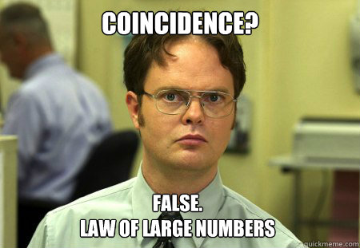

# Law of Large Numbers

## Understanding the Law

The Law of Large Numbers states that as you increase the number of times you repeat an experiment, the average of your sample means will more closely approximate the population mean. In other words, if you conduct the same experiment repeatedly and calculate the mean of each sample, then average those means together, this average will converge toward the true population mean as the number of experiments increases. 

<figure markdown="span">
  {width=70% }
  <figcaption>(Source: <a href="http://www.quickmeme.com/meme/3owxws">QuickMeme</a>) </figcaption>
</figure>

This is crucial because we often don’t know the true population mean, but by conducting multiple trials, we can estimate it more accurately over time.

## Mathematical Representation

Now, let's explore how this law is expressed mathematically.

???+ defi "Definition: Law of Large Numbers"
    \[
    \lim_{n \to \infty} P\left( \left| \bar{x}_n - \mu \right| \geq \epsilon \right) = 0
    \]

    Where:

    - \( n \) is the number of trials (or experiment repetitions) - not the sample size,
    - \( \bar{x}_n \) is the average of the sample means from \( n \) trials,
    - \( \mu \) is the true population mean,
    - \( \epsilon \) is an arbitrarily small positive number.

The essence of the formula is that the probability of our average deviating from the true population mean by more than ε approaches zero as n becomes very large. In simpler terms, the more experiments we conduct, the closer our average gets to the true mean, and the less likely it is to be significantly off.

## Importance of the LLN

So, why is the Law of Large Numbers so important? Because it tells us that any single sample or experiment can be heavily influenced by randomness, variability, and noise. This means relying on a single experiment might not give us an accurate estimate of the true population mean. We shouldn't place too much trust in just one set of results.

<figure markdown="span">
  {width=70% }
  <figcaption>(Source: <a href="https://imgflip.com/memegenerator">Imgflip Meme Generator</a>) </figcaption>
</figure>


However, by repeating the experiment multiple times we can obtain an average that closely approximates the true population mean. Even if we can't measure the population mean directly, averaging multiple samples allows us to estimate it with increasing accuracy.

## How Large is 'Large'?

An important question arises: How large does our number of repetitions ($n$) need to be to get a reasonable estimate? The law doesn't specify a particular number. Unfortunately, there's no one-size-fits-all answer because it depends on various factors like the nature of the data, experimental conditions, and measurement methods.

While we can't name an exact number, we now understand that the Law of Large Numbers operates more qualitatively - it tells us that more repetitions lead to better approximations without specifying exactly how many are needed.

## An Illustrative Example

Let's consider an example. Suppose we take a fair die, 

```py
die_fair = [1, 2, 3, 4, 5, 6]
```

roll it 50 times (sample size)

<iframe src="/assets/statistics/prob_diesample.html" width="100%" height="400px"></iframe>

??? code "Code"
    ``` py
    fig = px.scatter(y=fair, x=np.arange(50), labels={'y': 'Die Number', 'x': 'Roll'})
    fig.update_traces(marker=dict(color='rgba(0, 65, 110, 0.6)'))
    fig.update_layout(
            title=dict(
                text='<b><span style="font-size: 10pt">Results of 50 Die Rolls</span><br> <span style="font-size:5">Data: Fair Die</span></b>',
            ),
        )

    fig.show()
    ```

and calculate the average of the results

```py
fair_mean = np.mean(fair)
print('Mean of 50 rolls of a fair die:', fair_mean)
```
```title=">>> Output"
Mean of 50 rolls of a fair die: 3.64
```


Then, we repeat this entire experiment 500 times ($n$). Here's what happens:

- **Individual Experiment Results**: Each experiment's average varies. Sometimes it's close to the expected value of 3.5 (the average roll of a fair die), and other times it's further away. These averages fluctuate and don't necessarily converge to 3.5 on their own.

<iframe src="/assets/statistics/prob_sampMeans.html" width="100%" height="400px"></iframe>
??? code "Code"
    ``` py
    def mean_of_n_rolls(sample_size, number_of_samples):
        return [np.mean(random.choices([1, 2, 3, 4, 5, 6], k=sample_size)) for _ in range(number_of_samples)]

    sample_size = 50
    number_of_samples = 500

    means_result = mean_of_n_rolls(sample_size, number_of_samples)

    fig = px.line(x=np.arange(number_of_samples), y=means_result,markers=True)
    fig.update_traces(line=dict(color='rgba(0, 65, 110, 0.6)'))

    # Add a vertical line for the population mean
    fig.add_hline(y=3.5, line_dash="dash", annotation_text="Expected Value: 3.5", annotation_position="top right", line_color="#E87F2B")

    fig.update_layout(
            barmode='overlay',
            yaxis_title_text='Sample Mean',
            xaxis_title_text='# Experiment',
            title=dict(
                text='<b><span style="font-size: 10pt">Sample Means (Sample Size: 50)</span><br> <span style="font-size:5">Data: Fair Die</span></b>',
            ),
        )

    fig.show()
    ```
  
- **Cumulative Average**: Instead of looking at individual averages, we calculate the cumulative average up to each point. The first point is just the average of the first experiment. The second point is the average of the first two experiments, and so on, up to the 500th point, which is the average of all 500 experiments.

<iframe src="/assets/statistics/prob_cumulativeAverage.html" width="100%" height="400px"></iframe>
??? code "Code"
    ``` py
    # Cumulative Average
    cumulative_average = np.cumsum(means_result) / np.arange(1, number_of_samples + 1)

    # Plot the cumulative average
    fig = px.line(x=np.arange(number_of_samples), y=cumulative_average,markers=True)
    fig.update_traces(line=dict(color='rgba(0, 65, 110, 0.6)'))

    # Add a horizontal line for the population mean
    fig.add_hline(y=3.5, line_dash="dash", annotation_text="Expected Value: 3.5", annotation_position="top right", line_color="#E87F2B")

    fig.update_layout(
            barmode='overlay',
            yaxis_title_text='Cumulative Average',
            xaxis_title_text='# Experiment',
            title=dict(
                text='<b><span style="font-size: 10pt">Cumulative Average (Sample Size: 50)</span><br> <span style="font-size:5">Data: Fair Die</span></b>',
            ),
        )

    fig.show()
    ```


What's interesting is how quickly the cumulative average converges to the expected value of 3.5. Even after just a few repetitions, the cumulative average is already quite close to 3.5 - much closer than most individual experiment averages. By the time we reach 500 repetitions, the cumulative average is almost exactly 3.5.


## Recap

In this session, we learned about the Law of Large Numbers. We've explored what it is, examined its mathematical formulation, and seen a demonstration of how it works. This fundamental principle is crucial for statistical analysis and scientific research, emphasizing the importance of repeated experimentation to obtain accurate estimates of population parameters.


# Tasks
???+ question "Task: Law Of Large Numbers"
    Use the following dataset: 
    ``` py
    from ucimlrepo import fetch_ucirepo 

    # fetch dataset 
    adult = fetch_ucirepo(id=2)
    # https://archive.ics.uci.edu/dataset/2/adult

    # data (as pandas dataframes) 
    data = adult.data.features 

    # Show the first 5 rows
    data.head()
    ```
    Work on the following tasks: 
    
    1. Calculate the population mean of the variable `age`
    2. Take one sample of 100 entries from the variable `age` and visualize them in a scatter plot
    3. Repeat this experiment 500 times and plot the means of each sample in a line chart. Add a horizontal line for the true population mean
    4. Visualize the cumulative average in a line chart. Does it approach the expected value? 
