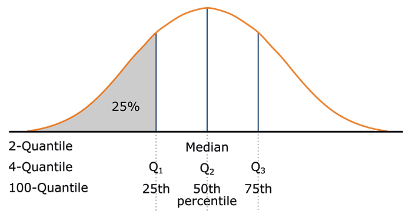

# Measures of Central Tendency

Measures of central tendency characterize a distribution by using an average value. These metrics describe what can be considered a "typical" or "representative" observation within the data set.

## Mean 
(for numeric attributes)
The arithmetic mean \( \bar{x} \) is the most common and effective numerical measure for describing the average value of a distribution. 

???+ defi "Definition: Arithmetic Mean"
    \[
    \bar{x}=\frac{\sum_{i=1}^{N}x_i}{N}=\frac{x_1+x_2+\dots+x_N}{N}
    \]

    with \( x_1, x_2, \dots, x_N \) representing a set of \( N \) values of a metric variable \( X \).

One disadvantage of the mean is its sensitivity to outliers. Even a small number of extreme values can distort the result.

```py
import statistics 

statistics.mean([1,2,1,2,3,4,1,100,1,2,1])
```

```title=">>> Output"
10.73
```

To address this issue, the trimmed mean is used. This method involves removing a percentage of values from both the upper and lower ends of the distribution (e.g., 1%). 

```py
from scipy import stats

#calculate 10% trimmed mean
stats.trim_mean([1,2,1,2,3,4,1,100,1,2,1], 0.1)
```

```title=">>> Output"
1.889
```

However, this approach can lead to a loss of information, especially when a large portion of the data is trimmed.


???+ example "Example: Mean of the Temperature" 
    Given a table with 14 temperature values in °C, the goal is to calculate the mean and the trimmed mean (20% left and right) of the distribution.
    ``` py
    [28.3, 27.2, 27.4, 22.7, 14.3, 11.9, 13.8, 19.8, 9.6, 21.1, 20.8, 19.8, 25.3, 22.8]
    ```
    *Solution* 

    \[
    \begin{eqnarray*}
	\bar{x} &=& \frac{28.3 + 27.2 + 27.4 + 22.7 + 14.3 + 11.9 + 13.8}{14}\\
	    &&+\frac{19.8 + 9.6 + 21.1 + 20.8 + 19.8 + 25.3 + 22.8}{14} \\
	    &=& 20.34
    \end{eqnarray*}
    \]

    \[
    \begin{eqnarray*}
	\bar{x}_{trim} &=& \frac{13.8+ 14.3+ 19.8+ 19.8+20.8 }{14}\\
	    &&+\frac{21.1+ 22.7+ 22.8+ 25.3+ 27.2}{14} \\
	    &=& 20.76
    \end{eqnarray*}
    \]

    The mean temperature is $20.34^\circ C$ and the trimmed mean is $20.76^\circ C$ .

    ??? code "Code"
        ``` py
        import numpy as np
        Temp = [28.3, 27.2, 27.4, 22.7, 14.3, 11.9, 13.8, 19.8, 9.6, 21.1, 20.8, 19.8, 25.3, 22.8]
        print('Mean: ' + str(np.mean(Temp)))

        from scipy import stats
        print('Trimmed Mean: ' + str(stats.trim_mean(Temp, 0.2)))
        ```

## Median
(for numeric and ordinal attributes) The median is more robust against outliers, as it splits the distribution into an upper and a lower half. It corresponds to the 50th percentile or the second quartile. 

```py
import numpy as np
np.sort([1,2,1,2,3,4,1,100,1,2,1])
```

```title=">>> Output"
[1,1,1,1,1,2,2,2,3,4,100]
           ↑
```

```py
statistics.median([1,2,1,2,3,4,1,100,1,2,1])
```

```title=">>> Output"
2
```

However, one downside is that it can be more complex to calculate, especially when dealing with large datasets.

???+ defi "Definition: Median"
    A data set of \( N \) values of an attribute \( X \) is sorted in increasing order

	- If \( N \) is odd, the median is the middle value of the ordered set
	- \( N \) is even, the median is the two middlemost values and any value in between (average of those two for numeric attribute )

???+ example "Example: Median of the Temperature" 
    Given a table with 14 temperature values in °C, the goal is to calculate the median of the distribution.
    ``` py
    [28.3, 27.2, 27.4, 22.7, 14.3, 11.9, 13.8, 19.8, 9.6, 21.1, 20.8, 19.8, 25.3, 22.8]
    ```
    *Solution* 
    ``` py
    [9.6, 11.9, 13.8, 14.3, 19.8, 19.8, 20.8, 21.1, 22.7, 22.8, 25.3, 27.2, 27.4, 28.3]
    ```

    \[
	\bar{x} =\frac{20.8+21.1}{2} = 20.95\\
    \]

    The median temperature is $20.95^\circ C$.

    ??? code "Code"
        ``` py
        import numpy as np
        Temp = [28.3, 27.2, 27.4, 22.7, 14.3, 11.9, 13.8, 19.8, 9.6, 21.1, 20.8, 19.8, 25.3, 22.8]
        print('Median: ' + str(np.median(Temp)))
        ```

## Mode
(for numeric, ordinal and nominal attributes) The mode is the most frequently occurring value in a distribution. It is also more robust against outliers, making it a useful measure in certain cases where extreme values might distort other central tendency metrics.

```py
# Calculate the first Mode
statistics.mode([1,2,1,2,3,4,1,100,1,2,2])
```

```title=">>> Output"
1
```

```py
# Calculate all Modes
statistics.multimode([1,2,1,2,3,4,1,100,1,2,2])
```

```title=">>> Output"
[1, 2]
```

???+ defi "Definition: Mode"
	- Mode is the value that occurs most frequently in a data set.
	- There can be more than one mode (unimodal, bimodal, multimodal)
	- If each data value occurs only once, then there is no mode

???+ example "Example: Mode of the Temperature" 
    Given a table with 14 temperature values in °C, the goal is to calculate the mode of the distribution.
    ``` py
    [28.3, 27.2, 27.4, 22.7, 14.3, 11.9, 13.8, 19.8, 9.6, 21.1, 20.8, 19.8, 25.3, 22.8]
    ```
    *Solution* 
    The mode of the temperature is $19.8^\circ C$ because this value appears twice, making it the only value that occurs more than once. The distribution is unimodal.

    ??? code "Code"
        ``` py
        import numpy as np
        Temp = [28.3, 27.2, 27.4, 22.7, 14.3, 11.9, 13.8, 19.8, 9.6, 21.1, 20.8, 19.8, 25.3, 22.8]
        
        from scipy import stats
        #https://docs.scipy.org/doc/scipy/reference/stats.html
        print('Mode: ' + str(stats.mode(Temp))) # returns the first mode (for unimodal)

        import statistics 
        #https://docs.python.org/3/library/statistics.html
        print('Mode: ' + str(statistics.mode(Temp))) # returns the first mode (for unimodal)
        print('Mode (Multi): ' + str(statistics.multimode(Temp))) # returns a list of all modes (for multimodal)
        ```

## Quantile
(numeric and ordinal attributes)
The \( q \)-quantile divides the data into \( q \) equal-sized parts. There are \( q - 1 \) quantiles (for example, 3 quantiles divide the data into 4 parts). The 2-quantile corresponds to the median. 

```py
import numpy as np
np.sort([1,2,1,2,3,4,1,100,1,2,2])
```

```title=">>> Output"
[1,1,1,1,2,2,2,2,3,4,100]
 |----|----|----|----|
      Q1   Q2   Q3   
```


```py
from scipy import stats

stats.mstats.mquantiles([1,2,1,2,3,4,1,100,1,2,2], prob=[0.25, 0.5, 0.75])
```

```title=">>> Output"
[1. , 2. , 2.8]
```

There are different methods for determining quantiles, especially when \( N \) is even. As a result, it is possible for different libraries to produce a different result than a manual calculation of quantiles.

???+ defi "Definition: Quantile"
    A data set of $N$ values of an attribute $X$ is sorted in increasing order

	- The $k$-th $q$-quantile is the value $x$ where $k/q$ of the data values are less and $(q-k)/q$ values are more than $x$ (with $0 < k < q$)
	- If set of numbers are odd, you have to calculate the middle

<figure markdown="span">
  {width=50% }
</figure>

Most widely used forms

- 2-quantile = **median**: Divides the data set in halves
- 4-quantile = **quartiles**: Three data points split the data into four equal parts
- 100-quantile = **percentiles**: Divide the data into 100 equal-sized sets

???+ example "Example: Quantiles of Temperature Distribution" 
    Given a table with 14 temperature values in °C, the goal is to calculate the quartiles of the distribution.
    ``` py
    [28.3, 27.2, 27.4, 22.7, 14.3, 11.9, 13.8, 19.8, 9.6, 21.1, 20.8, 19.8, 25.3, 22.8]
    ```
    *Solution*
    ``` py
    [9.6, 11.9, 13.8, <<14.3>>, 19.8, 19.8, <<20.8>>, <<21.1>>, 22.7, 22.8, <<25.3>>, 27.2, 27.4, 28.3]
    ``` 
    
    \[
	Q_1 = 14.3^\circ C \qquad Q_2 = 20.95^\circ C \qquad Q_3 = 25.3^\circ C
    \]

    ??? code "Code"
        ``` py
        from scipy import stats
        #https://docs.scipy.org/doc/scipy/reference/stats.html

        print('Quantile: ' + str(stats.mstats.mquantiles(Temp, prob=[0.25, 0.5, 0.75])))
        ```

## Five Number Sumary & Boxplot
A single metric alone is not sufficient to fully characterize a distribution. The Five Number Summary is a useful approach to gain a deeper understanding of a distribution by combining multiple key metrics, offering a more comprehensive view of the data.

???+ defi "Definition: Five Number Summary"
    The Five Number Summary consists of the following metrics in this exact order:

	[Minimum, $Q_1$, Median, $Q_3$, Maximum]

A boxplot is a visualization of a distribution and provides a graphical representation of the Five Number Summary. 

```py
import plotly.express as px

fig = px.box([1,2,1,2,3,4,1,100,1,2,2])
fig.show()
```

The first and third quartiles ($Q_1$ and $Q_3$) mark the ends of the box, while the interquartile range (IQR) represents the length of the box. The median is depicted as a line within the box. Two lines, known as whiskers, extend from the box to the smallest and largest observations, provided these values are no more than $1.5\times$IQR above $Q_3$ or below $Q_1$. Outliers are marked separately.

???+ example "Example: Boxplot of the Temperature" 
    <div class="grid cards" markdown>

    -   __Without Outlier__

        ---
        <iframe src="/assets/statistics/uni_box_ohne_out.html" width="100%" height="400px"></iframe>
        ??? code "Code"
            ``` py
            import plotly.express as px
            import pandas as pd

            Temp = [28.3, 27.2, 27.4, 22.7, 14.3, 11.9, 13.8, 19.8, 9.6, 21.1, 20.8, 19.8, 25.3, 22.8]

            # Generate Box Plot
            fig = px.box(pd.DataFrame(Temp))

            # Adjust the plot
            fig.update_layout(
                xaxis_title_text=' ',
                yaxis_title_text='Temperature',
                title=dict(
                        text='<b><span style="font-size: 10pt">Boxplot - no Outlier</span> <br> <span style="font-size:5">variable: Temperature</span></b>',
                    ),
            )

            # Show the plot
            fig.show()
            ```

    -   __With Outlier__

        ---
        <iframe src="/assets/statistics/uni_box_mit_out.html" width="100%" height="400px"></iframe>
        ??? code "Code"
            ``` py
            import plotly.express as px
            import pandas as pd

            Temp2 = [28.3, 27.2, 27.4, 22.7, 14.3, 11.9, 13.8, 19.8, 9.6, 21.1, 20.8, 19.8, 25.3, 22.8, 50, 60]

            # Generate Box Plot
            fig = px.box(pd.DataFrame(Temp2))

            # Adjust the plot
            fig.update_layout(
                xaxis_title_text=' ',
                yaxis_title_text='Temperature',
                title=dict(
                        text='<b><span style="font-size: 10pt">Boxplot - Outlier</span> <br> <span style="font-size:5">variable: Temperature</span></b>',
                    ),
            )

            # Show the plot
            fig.show()
            ```
    </div>


## Recap
- Measures of central tendency characterize a distribution by using an average value.
- Common metrics include the mean, median, mode, and quantiles.
- Individual metrics alone are not sufficient to provide a full understanding.
- The Five Number Summary combines multiple values to offer a more comprehensive characterization of the distribution.
- The boxplot is the graphical representation of the Five Number Summary.
- However, the informative value of the Five Number Summary is limited.
- It can be misleading to describe a distribution solely through measures of central tendency. 

The following distributions have the same mean, median and mode

<div class="grid cards" markdown>

-   __Without Outlier__

    ---
    <iframe src="/assets/statistics/uni_misleading1.html" width="100%" height="400px"></iframe>

-   __With Outlier__

    ---
    <iframe src="/assets/statistics/uni_misleading2.html" width="100%" height="400px"></iframe>

</div>

??? code "Code"
    ``` py
    a = [2,2,2,2,2,3,3,3,3,3,3,3,3,3,3,3,3,3,3,3,3,3,3,3,3,4,4,4,4,4]
    b = [1,1,1,1,1,2,2,2,2,2,2,2,3,3,3,3,3,3,3,3,3,4,5,5,5,5,5,5,5,5]

    import plotly.express as px
    import pandas as pd
    from scipy import stats
    import numpy as np

    # Distribution a
    # Generate Histogram
    fig = px.histogram(pd.DataFrame(a))

    # Adjust the plot
    fig.update_layout(
        xaxis_title_text='Value',
        yaxis_title_text='Absolute Frequency',
        showlegend=False,
    )

    # Show the plot
    fig.show()

    # Calculate Measures
    print('Mean: ' + str(np.mean(a)))
    print('Median: ' + str(np.median(a)))
    print('Mode: ' + str(stats.mode(a)))

    # Distribution b
    # Generate Histogram
    fig = px.histogram(pd.DataFrame(b))

    # Adjust the plot
    fig.update_layout(
        xaxis_title_text='Value',
        yaxis_title_text='Absolute Frequency',
        showlegend=False,
    )

    # Show the plot
    fig.show()

    # Calculate Measures
    print('Mean: ' + str(np.mean(b)))
    print('Median: ' + str(np.median(b)))
    print('Mode: ' + str(stats.mode(b)))
    ```

## Tasks
???+ question "Task: Measures of Central Tendency"
    Use the following dataset:
    ``` py
    from ucimlrepo import fetch_ucirepo 
    
    # fetch dataset 
    cars = fetch_ucirepo(id=9) 
    # https://archive.ics.uci.edu/dataset/9/auto+mpg
    
    # data (as pandas dataframes) 
    data = cars.data.features
    data = data.join(cars.data.ids)

    # Show the first 5 rows
    data.head()
    ```
    Work on the following task: 

    1. Calculate all useful and meaningful measure of central tendency (mean, median, mode) for the following attributes (think about attribute types)
        - `car_name`
        - `origin`
        - `displacement`
    2. Calculate the quartiles and plot a Boxplot fo the attribute `acceleration`