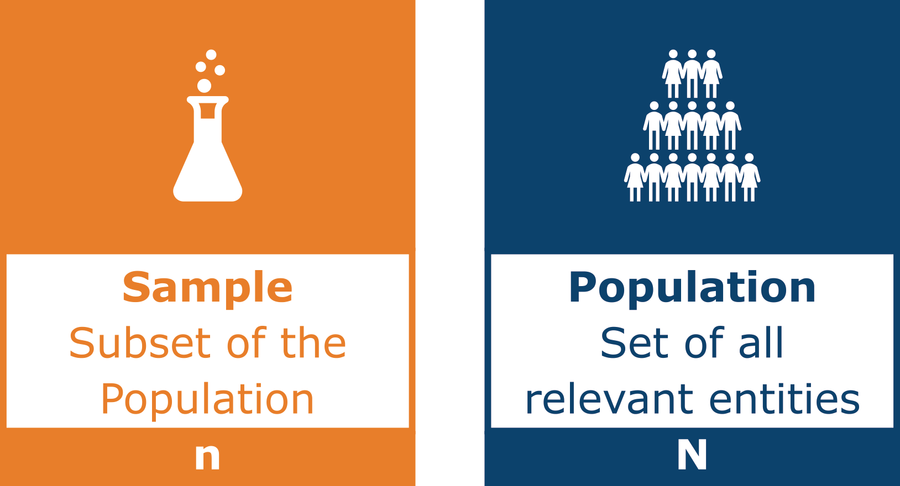

# Measure of Dispersion 
Measures of dispersion characterize a distribution by indicating how data is spread around an average value. These metrics describe the variability or heterogeneity of the data.

???+ info "Note"

    Some formulas differ between samples and populations (e.g., variance), which may result in slight variations in the calculations. 
    
    <figure markdown="span">
    {width=50% }
    </figure>

## Range
The range, denoted as \( R \), is the difference between the largest and smallest value in a dataset. However, in the presence of extremely large or small outliers, the range can provide a distorted view of the data's variability.

```py
import numpy as np
np.ptp([1,2,1,2,3,4,1,100,1,2,2])
```

```title=">>> Output"
99
```


???+ defi "Definition"
    \[
    R = \text{max}(X)-\text{min}(X)
    \]

    with \( x_1, x_2, \dots, x_N \) representing a set of \( N \) values of a metric variable \( X \). 

???+ example
    Given a table with 14 temperature values in °C, the goal is to calculate the range of the distribution.
    ``` py
    [28.3, 27.2, 27.4, 22.7, 14.3, 11.9, 13.8, 19.8, 9.6, 21.1, 20.8, 19.8, 25.3, 22.8]
    ```
    *Solution* 

    \[
    R = 28.3-9.6 = 18.7
    \]


    The temperature range is $18.7^\circ C$.

    ??? code "Code"
        ``` py
        Temp = [28.3, 27.2, 27.4, 22.7, 14.3, 11.9, 13.8, 19.8, 9.6, 21.1, 20.8, 19.8, 25.3, 22.8]

        import numpy as np
        print('Range:', np.ptp(Temp))
        ```

## Interquartile Range
The interquartile range (IQR) is the difference between the third and first quartile. 

```py
from scipy import stats
stats.iqr([1,2,1,2,3,4,1,100,1,2,2], interpolation = 'nearest')
```

```title=">>> Output"
2
```

It describes the spread of the middle 50% of the data, providing a measure of variability that is less sensitive to outliers

???+ defi "Definition"
    \[
    IQR = Q_3-Q_1
    \]

    Q1 and Q3 are the first and third quartiles of a dataset with \( N \) values of a variable \( X \).


???+ example
    Given a table with 14 temperature values in °C, the goal is to calculate the IQR of the distribution.
    ``` py
    [28.3, 27.2, 27.4, 22.7, 14.3, 11.9, 13.8, 19.8, 9.6, 21.1, 20.8, 19.8, 25.3, 22.8]
    ```
    *Solution* 
    ``` py
    [9.6, 11.9, 13.8, <<14.3>>, 19.8, 19.8, <<20.8>>, <<21.1>>, 22.7, 22.8, <<25.3>>, 27.2, 27.4, 28.3]
    ``` 

    \[
	$Q_1 = 14.3^\circ C \qquad Q_2 = 20.95^\circ C \qquad Q_3 = 25.3^\circ C $
    \]

    \[
    IQR = 25.3 - 14.3 = 11^\circ C
    \]

    The IQR of the temperature is $11^\circ C$.

    ??? code "Code"
        ``` py
        Temp = [28.3, 27.2, 27.4, 22.7, 14.3, 11.9, 13.8, 19.8, 9.6, 21.1, 20.8, 19.8, 25.3, 22.8]

        from scipy import stats
        print('IQR: ', stats.iqr(Temp, interpolation = 'nearest'))
        ```

## Variance
Variance \( \sigma^2 \) is the mean of the squared deviations from the average. It indicates how spread out a distribution is.

```py
import statistics 
print('Variance: ', statistics.variance([1,2,1,2,3,4,1,100,1,2,2]))
print('Population Variance: ', statistics.pvariance([1,2,1,2,3,4,1,100,1,2,2]))
```

```title=">>> Output"
Variance:  875.76
Population Variance:  796.15
```

???+ defi "Definition"
    \[
    \sigma^2 = \frac{1}{N}\sum_{i=1}^{N}(x_i-\bar{x})^2
    \]

    with \( x_1, x_2, \dots, x_N \) representing a set of \( N \) values of a metric variable \( X \).
    This formula applies to the entire population. For samples, it differs slightly, as the division is by \( N - 1 \) instead of \( N \).

???+ example
    Given a table with 14 temperature values in °C, the goal is to calculate the variance of the distribution.
    ``` py
    [28.3, 27.2, 27.4, 22.7, 14.3, 11.9, 13.8, 19.8, 9.6, 21.1, 20.8, 19.8, 25.3, 22.8]
    ```
    *Solution* 

    \[
	\sigma^2 = \frac{463.7}{14} = 33.12
    \]

    The variance of the temperature is $33.12^\circ C^2$.

    ??? code "Code"
        ``` py
        Temp = [28.3, 27.2, 27.4, 22.7, 14.3, 11.9, 13.8, 19.8, 9.6, 21.1, 20.8, 19.8, 25.3, 22.8]

        import statistics 
        print('Variance: ', statistics.variance(Temp))
        print('Population Variance: ', statistics.pvariance(Temp))
        ```

## Standard Deviation
The standard deviation \( \sigma \) describes a "typical" deviation from the mean. It indicates how spread out a distribution is.

```py
import statistics 
print('Standard Deviation: ', statistics.stdev([1,2,1,2,3,4,1,100,1,2,2]))
print('Population Standard Deviation: ', statistics.pstdev([1,2,1,2,3,4,1,100,1,2,2]))
```

```title=">>> Output"
Standard Deviation:  29.59
Population Standard Deviation:  28.22
```

A small \( \sigma \) suggests that the data tends to be close to the mean, while a large \( \sigma \) indicates that the data is spread over a wide range of values.

???+ defi "Definition"
    \[
    \sigma=\sqrt{\sigma^2}
    \]

    With \( x_1, x_2, \dots, x_N \) representing a set of \( N \) values of a metric variable \( X \), and \( \sigma^2 \) being the corresponding variance.

???+ example
    Given a table with 14 temperature values in °C, the goal is to calculate the standard deviation of the distribution.
    ``` py
    [28.3, 27.2, 27.4, 22.7, 14.3, 11.9, 13.8, 19.8, 9.6, 21.1, 20.8, 19.8, 25.3, 22.8]
    ```
    *Solution* 

    \[
	\sigma^2 = \frac{463.7}{14} = 33.12
    \]

    \[
    \sigma = \sqrt{\sigma^2} = \sqrt{33.12} = 5.76
    \]

    The temperature values deviate, on average, by $5.76^\circ C$ from the mean.

    ??? code "Code"
        ``` py
        Temp = [28.3, 27.2, 27.4, 22.7, 14.3, 11.9, 13.8, 19.8, 9.6, 21.1, 20.8, 19.8, 25.3, 22.8]

        import statistics 
        print('Standard Deviation: ', statistics.stdev(Temp))
        print('Population Standard Deviation: ', statistics.pstdev(Temp))
        ```


## Coefficient of Variation
We previously encountered the issue that variance and standard deviations of different data series were difficult to compare. The coefficient of variation ($c_v$) can be used to solve this problem. It is often referred to as the relative standard deviation.

```py
stats.variation([1,2,1,2,3,4,1,100,1,2,2])
```

```title=">>> Output"
2.61
```

???+ defi "Definition"
    \[
    c_v = \frac{\sigma}{\bar{x}}
    \]

    With \( x_1, x_2, \dots, x_N \) representing a set of \( N \) values of a metric variable \( X \), \( \sigma \) being the corresponding standard deviation, and \( \bar{x} \) the mean.

???+ example
    You are given a table of pizza prices in New York listed in various currencies.
    ``` py
    dollar = [1, 2, 3, 3, 5, 6, 7, 8, 9, 11]
	Pesos = [18.81, 37.62, 56.43, 56.43, 94.05, 112.86, 131.67, 150.48, 169.29]
    ```

    \[
	\begin{eqnarray*}
        \sigma_{Dollar} = 3.1 &\qquad & \sigma_{Pesos} = 58.43\\
        \bar{x}_{Dollar} = 5.5 &\qquad & \bar{x}_{Pesos} = 103.46\\
    \end{eqnarray*}
    \]

    The goal is to calculate the coefficient of variation for both data series.

    *Solution* 

    \[
    \begin{eqnarray*}
        c_{v,dollar} = \frac{3.1}{5.5} = 0.56 &\qquad& c_{v,pesos} = \frac{58.43}{103.46} = 0.56
    \end{eqnarray*}
    \]


    ??? code "Code"
        ``` py
        Dollar = [1,2,3,3,5,6,7,8,9,11]
        Pesos = [x * 18.81 for x in Dollar]

        from scipy import stats
        print('CoV Dollar: ' + str(stats.variation(Dollar)))
        print('CoV Pesos: ' + str(stats.variation(Pesos)))
        ```


## Recap
- Measures of dispersion characterize a distribution by describing how data is spread around a central value.
- The IQR represents the middle 50% of the data.
- Variance indicates how wide a distribution is.
- Interpreting variance can be challenging because its units are squared.
- For this reason, standard deviation is a more suitable measure for interpretation.
- To better compare standard deviations across datasets, the coefficient of variation is used.
- There are different formulas for variance depending on whether the entire population or a sample is being analyzed

## Tasks
???+ question "Task"
    Use the following dataset:
    ``` py
    from ucimlrepo import fetch_ucirepo 
    
    # fetch dataset 
    cars = fetch_ucirepo(id=9) 
    # https://archive.ics.uci.edu/dataset/9/auto+mpg
    
    # data (as pandas dataframes) 
    data = cars.data.features
    data = data.join(cars.data.ids)

    # Show the first 5 rows
    data.head()
    ```
    Work on the following task: 

    1. For the attribute `acceleration` calculate the following measures (use the sample formula - not population):
        - Range
        - IQR --> compare to the boxplot from the section *Measures of Central Tendency*
        - Variance
        - Standard Deviation
        - CV