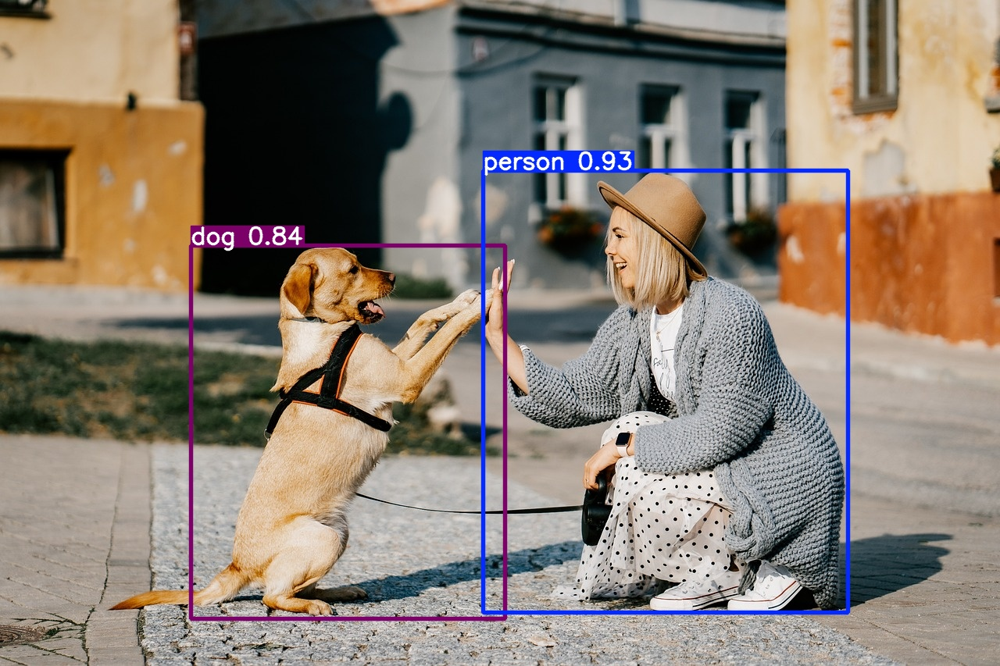

# Approaches in CV

???+ info "Running the Code"
    In this chapter, we'll explore different approaches in computer vision. We'll delve into traditional methods and then move on to deep learning techniques. We'll provide code snippets along the way, so feel free to run them on your own machine!

    To get started, ensure you have the necessary packages installed. If you haven't already, set up a new project folder with a Jupyter notebook and activate a new [virtual environment](../python/packages.md#virtual-environments). Then, [install the required packages](../python/packages.md#installing-packages):

    ```bash
    pip install torch torchvision matplotlib ultralytics opencv-python scikit-image
    ```

    Your project structure should look like this:

    ```
    📁 vision_approaches/
    ├── 📁 .venv/
    ├── 📄 input.jpg
    └── 📄 cv_approaches.ipynb
    ```

To tackle the complex problems in computer vision, various approaches have been developed over the years. In this chapter, we'll journey from traditional methods to the cutting-edge deep learning techniques that are revolutionizing the field.

## Traditional Approaches in Object Detection

Before the rise of deep learning, object detection relied heavily on handcrafted features and traditional machine learning techniques. Let's explore some of these foundational methods.

#### Haar Cascades

Introduced by Viola and Jones in 2001, Haar-like features were used for rapid face detection by scanning an image at multiple scales and positions.
Haar Cascades work by training a model with positive and negative images, where the positive images contain the object to detect (e.g., faces), and the negative images do not. 

???+ process

    - The model scans the entire image at different sizes (scales) and positions.
    - It uses simple patterns (called Haar-like features) to look for areas that resemble the object.
    - By combining these simple features, the model can decide whether the object is present in a particular area of the image.

<div class="grid cards" markdown>

-   
    ???+ adv "Advantage"
        - **Real-Time Detection**: Haar Cascades offer fast detection speeds, making them suitable for real-time applications.
        - **Low Computational Resources**: They require relatively low computational power compared to more complex algorithms.
-   
    ???+ disadv "Disadvantage"
        - **Limited Accuracy**: They may produce a high rate of false positives and are less accurate in detecting objects under varying lighting and orientations.
        - **Rigid Training Process**: Training Haar Cascades requires a large amount of positive and negative images, and they are not easily adaptable to new object classes without retraining.
</div>


There are already available pretrained models which we can try right away. Let's try them out!

???+ example "Example: Haar Cascades"
    
    <figure markdown="span"> {width=70% } </figure>

    ??? code "Code"
    
        ``` py
        #Source: https://medium.com/analytics-vidhya/haar-cascades-explained-38210e57970d

        #-- Load Packages
        import cv2
        from skimage import data

        #-- Load Image and Convert to RGB
        image = data.astronaut()
        image = cv2.cvtColor(image, cv2.COLOR_BGR2RGB) # Convert to RGB

        #-- Load Haar Cascades
        f_cascade = cv2.CascadeClassifier(cv2.data.haarcascades + 'haarcascade_frontalface_default.xml')
        e_cascade = cv2.CascadeClassifier(cv2.data.haarcascades + 'haarcascade_eye.xml')

        #-- Detect Faces and Eyes
        faces = f_cascade.detectMultiScale(image, 1.3, 5)
        for (x,y,w,h) in faces:
            img = cv2.rectangle(image,(x,y),(x+w,y+h),(255,0,0),2)
            roi_color = img[y:y+h, x:x+w]
            eyes = e_cascade.detectMultiScale(roi_color)
            for (ex,ey,ew,eh) in eyes:
                cv2.rectangle(roi_color,(ex,ey),(ex+ew,ey+eh),(0,255,0),2)

        #-- Display and Save Image
        cv2.imwrite('output_haar_cascade.jpg',image)
        cv2.imshow('Haar Cascade',image)
        cv2.waitKey(0)
        cv2.destroyAllWindows()
        ```

#### HOG

Proposed for human detection, Histogram of Oriented Gradients (HOG) features capture edge orientations and are combined with Support Vector Machines (SVMs) for classification.

???+ process

    - Edge Direction Detection: HOG focuses on the edges within an image. It looks at the direction in which the edges or lines in the image are pointing. Think of it as analyzing the outline or shape of objects by observing where the edges go.
    - Counting Edge Directions Locally: The image is divided into small regions or cells. In each of these small areas, HOG counts how many edges point in each direction. It's like keeping track of the directions of all the tiny lines within that small patch.
    - Creating a Histogram: For each cell, HOG creates a histogram (a simple bar chart) that represents the number of edges pointing in various directions. This captures the local shape information.
    - Combining Information: These histograms from all the cells are combined to form a detailed description of the entire image's shape and structure.
    - Object Detection with SVM: This combined information is then fed into a machine learning algorithm called a Support Vector Machine (SVM). The SVM uses this data to classify the image - for example, determining whether a human is present in the image or not.

    In essence, HOG helps computers understand and recognize objects by analyzing the directions of edges in an image, much like how we might recognize a shape by its outline.

<div class="grid cards" markdown>

-   
    ???+ adv "Advantage"
        - **Effective Feature Representation**: HOG descriptors are robust in capturing shape and appearance information, improving object detection performance.
        - **Invariance to Illumination and Geometric Transformations**: They are relatively invariant to changes in illumination and small geometric transformations.
-   
    ???+ disadv "Disadvantage"
        - **Computationally Intensive**: Calculating HOG features can be time-consuming, which may not be ideal for real-time applications.
        - **Not Deep Learning-Based**: HOG relies on manual feature extraction and may not capture complex patterns as effectively as deep learning methods.
</div>

Let's see it in action.

???+ example "Example: HOG"
    
    <figure markdown="span"> {width=70% } </figure>

    ??? code "Code"
    
        ``` py
        #Source: https://scikit-image.org/docs/stable/auto_examples/features_detection/plot_hog.html

        #-- Load Packages
        import cv2
        from skimage.feature import hog
        from skimage import data, exposure

        #-- Load Image
        image = data.astronaut()

        #-- Compute HOG
        fd, hog_image = hog(
            image,
            orientations=8,
            pixels_per_cell=(16, 16),
            cells_per_block=(1, 1),
            visualize=True,
            channel_axis=-1,
        )
        # Rescale histogram for better display
        hog_image= exposure.rescale_intensity(hog_image, in_range=(0, 10))
        hog_image = cv2.normalize(hog_image, dst=None, alpha=0, beta=255,norm_type=cv2.NORM_MINMAX, dtype=cv2.CV_8U)

        #-- Display and Save Image
        cv2.imwrite('output_hog.jpg',hog_image)
        cv2.imshow('HOG',hog_image)
        cv2.waitKey(0)
        cv2.destroyAllWindows()
        ```


???+ question "Task: Haar Cascades & HOG"
    Now it's your turn! Try running the code from above for 

    - Haar Cascade  
    - HOG 

    Can you detect faces and eyes in a different image? Replace `data.astronaut()` with your own image and see how it works!

If you're interested in learning more about Haar Cascades and HOG, check out this [comparative article](https://medium.com/@goutam0157/haar-cascade-classifier-vs-histogram-of-oriented-gradients-hog-6f4373ca239b)


## Deep Learning Approaches

As datasets grew and computational power increased, deep learning methods began to outperform traditional techniques, especially in complex tasks like object detection.

<figure markdown="span">
  
  <figcaption style="text-align: center;">Convolutional Neural Network Architecture (Source: <a href="https://www.geeksforgeeks.org/introduction-convolution-neural-network/">Geeksforgeeks.org</a>)</figcaption>
</figure>

Deep learning models, particularly Convolutional Neural Networks (CNNs), automatically learn hierarchical feature representations from images, eliminating the need for manual feature extraction. In this section, we'll explore deep learning approaches to object detection, focusing on both multi-stage and one-stage detectors.

???+ info

    Deep learning models can learn complex patterns directly from data. This ability has significantly improved the performance of object detection systems, making them more accurate and robust.

### Multi-Stage Object Detection

Multi-stage object detection approaches the detection problem in sequential steps, typically starting with region proposals followed by classification. This methodology emerged from the need to combine localization and classification effectively. Let's explore some key models in this category.

#### R-CNN
R-CNN, introduced in 2014, was a breakthrough in applying deep learning to object detection. It follows a three-step process:

???+ process

    1. **Region Proposal**: The algorithm starts by scanning the image to find areas that might contain an object. It creates a bunch of boxes (called region proposals) that potentially surround objects in the image. Think of it as highlighting all the spots where something interesting might be.
    2. **Feature Extraction**: Each proposed region is warped to a fixed size and passed through a pre-trained CNN (often AlexNet at the time) to extract a feature vector.
    3. **Classification**: The extracted features are fed into Support Vector Machines (SVMs) to classify the presence of objects in each region. A separate regression model refines the bounding box coordinates.


<figure markdown="span">
    
    <figcaption style="text-align: center;">R-CNN Architecture (Source: <a href="https://www.geeksforgeeks.org/r-cnn-region-based-cnns/">Geeksforgeeks.org</a>)</figcaption>
</figure>

<div class="grid cards" markdown>

-   
    ???+ adv "Advantage"
        - **Improved Accuracy**: Leveraging CNNs for feature extraction significantly enhances detection accuracy over traditional methods.
        - **Modular Design**: Allows the use of different region proposal methods and classifiers, providing flexibility in the pipeline.
-   
    ???+ disadv "Disadvantage"
        - **Slow Processing Time**: Each region proposal is processed individually through the CNN, leading to long training and inference times.
        - **High Storage Requirements**: Requires a large amount of storage for caching features extracted from region proposals.
</div>

#### Fast R-CNN

Fast R-CNN, published in 2015, addressed several inefficiencies of R-CNN while maintaining its accuracy. Key improvements include:

???+ process

    1. **Single CNN Pass**: Instead of running the CNN thousands of times on each region proposal, Fast R-CNN processes the entire image once to create a feature map, then projects the region proposals onto this map.
    2. **RoI Pooling**: This layer transforms regions of different sizes into fixed-size feature vectors efficiently, enabling end-to-end training.
    3. **Multi-task Learning**: The network simultaneously predicts object class probabilities and bounding box coordinates, eliminating the need for separate SVM classifiers

<figure markdown="span">
    
    <figcaption style="text-align: center;">Fast R-CNN Architecture (Source: <a href="https://www.geeksforgeeks.org/fast-r-cnn-ml/">Geeksforgeeks.org</a>)</figcaption>
</figure>

<div class="grid cards" markdown>

-   
    ???+ adv "Advantage"
        - **Faster Training and Inference**: Reduces computation by sharing convolutions across proposals, making it significantly faster than R-CNN.
        - **End-to-End Training**: Simplifies the training process by allowing the entire network to be trained jointly.
-   
    ???+ disadv "Disadvantage"
        - **Dependency on External Proposals**: Still relies on external region proposal algorithms like Selective Search, which can be slow.
        - **Memory Intensive**: Processing large images with many proposals can consume substantial memory resources.
</div>

#### Faster R-CNN

Faster R-CNN, also from 2015, introduced the Region Proposal Network (RPN), making the entire object detection pipeline trainable end-to-end. This architecture consists of two main networks:

???+ process 

    1. **Region Proposal Network** (RPN):
        - Slides a small network over the CNN feature map
        - At each location, predicts multiple potential object regions using anchor boxes
        - Outputs "objectness" scores and box coordinates for each proposal
    2. **Detection Network**:
        - Similar to Fast R-CNN
        - Uses RoI Pooling on proposals from RPN
        - Outputs final classifications and refined box coordinates
    
    Both the RPN (which proposes potential object regions) and the part of the network that classifies these regions use the same underlying data from the image. In other words, they share the same convolutional features extracted from the image. This means the heavy processing of the image is done only once, and both tasks use this shared information.


<figure markdown="span">
    
    <figcaption style="text-align: center;">Faster R-CNN Architecture (Source: <a href="https://towardsdatascience.com/faster-r-cnn-for-object-detection-a-technical-summary-474c5b857b46">Geeksforgeeks.org</a>)</figcaption>
</figure>

<div class="grid cards" markdown>

-   
    ???+ adv "Advantage"
        - **Significant Speed Improvement**: Eliminates the need for external proposal algorithms, making detection faster.
        - **High Accuracy**: Maintains high detection accuracy while improving computational efficiency.
-   
    ???+ disadv "Disadvantage"
        - **Complex Architecture**: The addition of the RPN adds complexity, making the model harder to implement and tune.
        - **Hardware Requirements**: May require powerful GPUs to achieve real-time performance due to computational demands.
</div>

???+ example "Example: Object Detection with Faster R-CNN"

    <div class="grid cards" markdown>

    -   __Input__

        ---

        <figure markdown="span"> {width=100% } </figure>

    -   __Output__

        ---

        <figure markdown="span"> {width=100% } </figure>

    </div>

    ??? code "Code"

        ```python
        import torch
        from torchvision import models, transforms
        from PIL import Image
        import matplotlib.pyplot as plt

        # Load a pre-trained Faster R-CNN model
        model = models.detection.fasterrcnn_resnet50_fpn(pretrained=True)
        model.eval()

        # Transform the input image
        transform = transforms.Compose([
            transforms.ToTensor(),
        ])

        # Load and transform the image
        image = Image.open('dog.jpg')
        image_tensor = transform(image)

        # Perform object detection
        with torch.no_grad():
            outputs = model([image_tensor])

        # Visualize the results
        labels = outputs[0]['labels'].numpy()
        scores = outputs[0]['scores'].detach().numpy()
        boxes = outputs[0]['boxes'].detach().numpy()

        # COCO dataset label names (for mapping label IDs to names)
        COCO_INSTANCE_CATEGORY_NAMES = [
            '__background__', 'person', 'bicycle', 'car', 'motorcycle', 'airplane', 'bus',
            'train', 'truck', 'boat', 'traffic light', 'fire hydrant', 'N/A', 'stop sign',
            'parking meter', 'bench', 'bird', 'cat', 'dog', 'horse', 'sheep', 'cow',
            'elephant', 'bear', 'zebra', 'giraffe', 'N/A', 'backpack', 'umbrella', 'N/A',
            'N/A', 'handbag', 'tie', 'suitcase', 'frisbee', 'skis', 'snowboard', 'sports ball',
            'kite', 'baseball bat', 'baseball glove', 'skateboard', 'surfboard', 'tennis racket',
            'bottle', 'N/A', 'wine glass', 'cup', 'fork', 'knife', 'spoon', 'bowl',
            'banana', 'apple', 'sandwich', 'orange', 'broccoli', 'carrot', 'hot dog', 'pizza',
            'donut', 'cake', 'chair', 'couch', 'potted plant', 'bed', 'N/A', 'dining table',
            'N/A', 'N/A', 'toilet', 'N/A', 'TV', 'laptop', 'mouse', 'remote', 'keyboard',
            'cell phone', 'microwave', 'oven', 'toaster', 'sink', 'refrigerator', 'N/A',
            'book', 'clock', 'vase', 'scissors', 'teddy bear', 'hair drier', 'toothbrush'
        ]

        # Plot the image with bounding boxes and labels
        fig, ax = plt.subplots(1)
        ax.imshow(image)
        ax.axis('off')  # Turn off the axes
        for idx, box in enumerate(boxes):
            if scores[idx] > 0.8:
                xmin, ymin, xmax, ymax = box
                width, height = xmax - xmin, ymax - ymin
                rect = plt.Rectangle((xmin, ymin), width, height, fill=False, color='red', linewidth=2)
                ax.add_patch(rect)
                # Add label with score
                label_text = f"{COCO_INSTANCE_CATEGORY_NAMES[labels[idx]]}: {scores[idx]:.2f}"
                ax.text(xmin, ymin - 5, label_text, color='red', fontsize=10, backgroundcolor='white')
        plt.tight_layout()
        plt.show()

        ```


???+ question "Task: Faster R-CNN"
    Again it's your turn! Try running the code from above. Perform following tasks: 
        
    - Can you detect faces and eyes in a different image? Replace `data.astronaut()` with your own image and see how it works!
    - What is the `COCO_INSTANCE_CATEGORY_NAMES` variable? Do some research.


### One-Stage Object Detection

One-stage detectors aim to predict object classes and bounding boxes directly from image pixels in a single network forward pass, without the region proposal step. This approach trades some accuracy for significant speed improvements.

#### SSD 

SSD, introduced in 2016, is a one-stage object detection model that performs object localization and classification in a single forward pass of the network, using default boxes of different scales and aspect ratios.

???+ process 

    - One-Step Detection: SSD performs object detection in a single pass through the neural network. This means it looks at the image once and simultaneously figures out where objects are (localization) and what they are (classification). There's no separate step for proposing regions where objects might be.
    - Default Boxes of Various Sizes: SSD uses a set of predefined boxes called default boxes or anchor boxes. These boxes come in different sizes and shapes (scales and aspect ratios) and are spread out across the image at various locations. The network checks each of these boxes to see if there's an object inside and determines the object's class (like a car, person, or dog).


<figure markdown="span">
  
  <figcaption style="text-align: center;">SSD Architecture (Source: <a href="https://towardsdatascience.com/understanding-ssd-multibox-real-time-object-detection-in-deep-learning-495ef744fab">Medium</a>)</figcaption>
</figure>

<div class="grid cards" markdown>

-   
    ???+ adv "Advantage"
        - **Real-Time Detection**: Capable of high-speed detection suitable for real-time applications.
        - **Simplified Architecture**: Combines localization and classification tasks into one network, simplifying deployment.
-   
    ???+ disadv "Disadvantage"
        - **Difficulty with Small Objects**: Tends to have lower accuracy in detecting small objects compared to two-stage detectors.
        - **Trade-Off Between Speed and Accuracy**: While faster, it may not achieve the same accuracy levels as more complex models like Faster R-CNN.
</div>

???+ example "Example: Object Detection with SSD"

    <div class="grid cards" markdown>

    -   __Input__

        ---

        <figure markdown="span"> {width=100% } </figure>

    -   __Output__

        ---

        <figure markdown="span"> {width=100% } </figure>

    </div>

    ??? code "Code"

        ```python
        import torch
        from torchvision import models, transforms
        from PIL import Image
        import matplotlib.pyplot as plt

        # Load a pre-trained SSD model
        model = models.detection.ssd300_vgg16(pretrained=True)
        model.eval()

        # Transform the input image
        transform = transforms.Compose([
            transforms.Resize((300, 300)),
            transforms.ToTensor(),
        ])

        # Load and transform the image
        image = Image.open('dog.jpg')
        original_width, original_height = image.size
        image_tensor = transform(image)

        # Perform object detection
        with torch.no_grad():
            outputs = model([image_tensor])

        # Extract results
        labels = outputs[0]['labels'].numpy()
        scores = outputs[0]['scores'].detach().numpy()
        boxes = outputs[0]['boxes'].detach().numpy()

        # Scale boxes back to original image size
        boxes[:, [0, 2]] *= original_width / 300  # Scale x-coordinates
        boxes[:, [1, 3]] *= original_height / 300  # Scale y-coordinates

        # Plot the image with bounding boxes and labels
        fig, ax = plt.subplots(1)
        ax.imshow(image)
        ax.axis('off')  # Turn off the axes
        fig.subplots_adjust(left=0, right=1, top=1, bottom=0)  # Remove padding/margins
        for idx, box in enumerate(boxes):
            if scores[idx] > 0.5:
                xmin, ymin, xmax, ymax = box
                width, height = xmax - xmin, ymax - ymin
                rect = plt.Rectangle((xmin, ymin), width, height, fill=False, color='red', linewidth=2)
                ax.add_patch(rect)
                # Add label with score
                label_text = f"{COCO_INSTANCE_CATEGORY_NAMES[labels[idx]]}: {scores[idx]:.2f}"
                ax.text(xmin, ymin - 5, label_text, color='red', fontsize=10, backgroundcolor='white')

        # Save the plot to remove additional padding (optional)
        plt.savefig("output_ssd.png", bbox_inches='tight', pad_inches=0, dpi=300)
        plt.show()

        ```

???+ question "Task: SSD"

    Now try to perform a SSD. Perform following tasks: 
    
    - Can you detect obects in a different image? Replace with your own image and see how it works! 
    - Also try adjusting the confidence threshold in the code to see how it affects the detection results. (Hint: take a look at `scores`)

#### YOLO 

YOLO (You Only Look Once), introduced by Redmon et al., is an object detection algorithm that treats detection as a regression problem, directly predicting bounding boxes and class probabilities from full images in one evaluation, enabling end-to-end real-time detection.
Since we will focus on YOLO in the next couple sections, we will not further discuss the process here. 

<div class="grid cards" markdown>

-   
    ???+ success "Advantage"
        - **Extremely Fast Performance**: Designed for real-time detection with high frame rates.
        - **Unified Model Architecture**: Simplifies the detection pipeline by using a single neural network.
-   
    ???+ failure "Disadvantage"
        - **Struggles with Small Objects**: May miss small objects or closely packed objects due to spatial constraints in its grid system.
        - **Localization Errors**: Can be less accurate in localizing objects precisely compared to two-stage detectors.
</div>

???+ example "Example: Object Detection with YOLOv8"

    <div class="grid cards" markdown>

    -   __Input__

        ---

        <figure markdown="span"> {width=100% } </figure>

    -   __Output__

        ---

        <figure markdown="span"> {width=100% } </figure>

    </div>

    ??? code "Code"

        ```python
        from ultralytics import YOLO

        # Load a pre-trained YOLOv8 model
        model = YOLO("yolov8n.pt")

        # Perform object detection on an image
        results = model("input.jpg", save=True, conf=0.5)

        # Display the results
        results[0].show()
        ```


### Comparison

| Method        | Speed         | Accuracy       | Complexity | Suitable For                     |
|---------------|---------------|----------------|------------|----------------------------------|
| R-CNN         | Slow          | High           | High       | Research, small datasets         |
| Fast R-CNN    | Moderate      | High           | Moderate   | Applications requiring accuracy  |
| Faster R-CNN  | Moderate      | Very High      | Moderate   | Balanced speed and accuracy      |
| SSD           | Fast          | Moderate-High  | Low        | Real-time applications           |
| YOLO          | Very Fast     | High           | Low        | Real-time applications           |

:material-key: **Key Takeaways**:

- **Multi-Stage Detectors**: Offer higher accuracy but at the cost of speed and computational complexity.
- **One-Stage Detectors**: Provide faster inference suitable for real-time applications, with a trade-off in accuracy.

---

## Conclusion

You've journeyed through the evolution of object detection methods, from traditional techniques like Haar Cascades and HOG to advanced deep learning models like Faster R-CNN, SSD, and YOLO.

Object detection has evolved significantly, with deep learning methods pushing the boundaries of what's possible. Multi-stage detectors like Faster R-CNN provide high accuracy but can be computationally intensive. One-stage detectors like SSD and YOLO offer faster detection suitable for real-time applications.

???+ info "🎉 Congratulations"

    You've gained an understanding of deep learning approaches in object detection!

    <blockquote class="reddit-embed-bq" style="height:500px" data-embed-height="740"><a href="https://www.reddit.com/r/datascience/comments/tq93vt/data_without_context_is_noise_with_zoom/">Data without context is noise! (With Zoom)</a><br> by<a href="https://www.reddit.com/user/Anxious_City_7864/">u/Anxious_City_7864</a> in<a href="https://www.reddit.com/r/datascience/">datascience</a></blockquote><script async="" src="https://embed.reddit.com/widgets.js" charset="UTF-8"></script>

## What's Next?

In the upcoming sections, we'll delve deeper into YOLO, explore training custom models, and discuss real-world applications.

---

**References**:

- Liu, W. et al. (2016). "SSD: Single Shot MultiBox Detector". *European Conference on Computer Vision (ECCV)*.
- Girshick, R. (2015). "Fast R-CNN". *IEEE International Conference on Computer Vision (ICCV)*.
- Ren, S. et al. (2016). "Faster R-CNN: Towards Real-Time Object Detection with Region Proposal Networks". *IEEE Transactions on Pattern Analysis and Machine Intelligence*.
- Redmon, J. et al. (2016). "You Only Look Once: Unified, Real-Time Object Detection". *IEEE Conference on Computer Vision and Pattern Recognition (CVPR)*.

**Further Reading**:

- [Understanding SSD MultiBox—Real-Time Object Detection In Deep Learning](https://towardsdatascience.com/understanding-ssd-multibox-real-time-object-detection-in-deep-learning-495ef744fab)
- [R-CNN, Fast R-CNN, Faster R-CNN, YOLO — Object Detection Algorithms](https://towardsdatascience.com/r-cnn-fast-r-cnn-faster-r-cnn-yolo-object-detection-algorithms-36d53571365e)
- [YOLOv8 vs SSD: Choosing the Right Object Detection Model](https://keylabs.ai/blog/yolov8-vs-ssd-choosing-the-right-object-detection-model/)