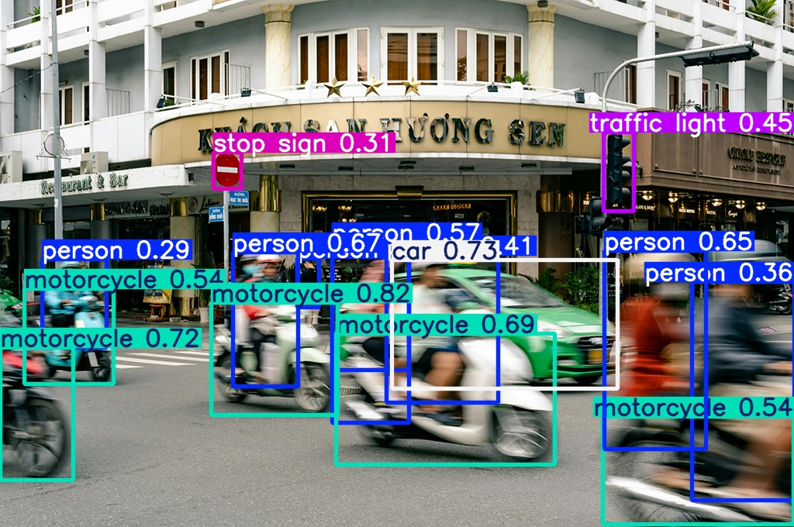
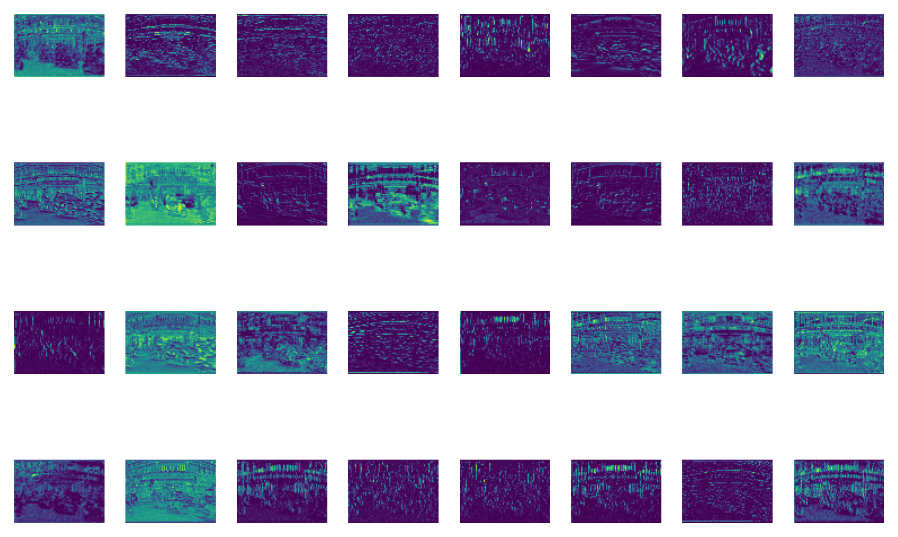
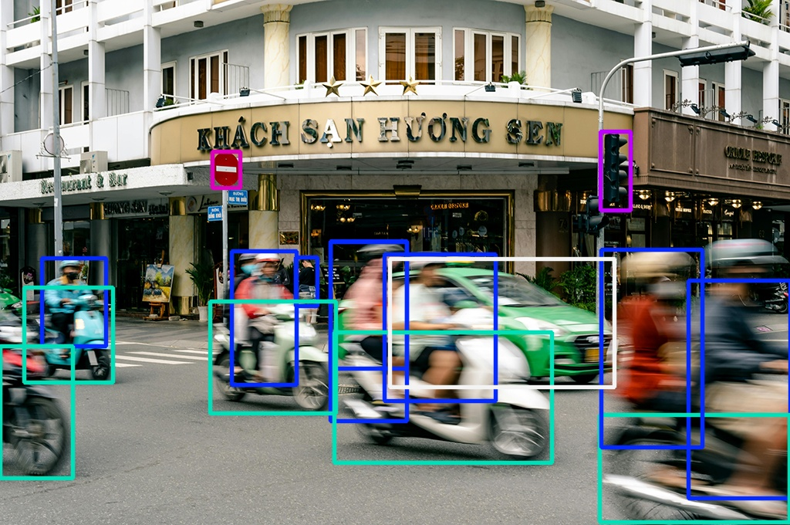

#  Detection
After learning about computer vision in general and how YOLO works, we can start using YOLO for our purposes. We will see, how much we can do with little code. 

## Project Setup
We start with the project structur from [before](../yolo.md#installation-and-setup) and create a new jupyter notebook `yolo_image_ipynb`
```hl_lines="4"
📁 computer_vision/
    ├── 📁 .venv/
    ├── 📁 pics/
    └── 📄 yolo_image.ipynb
```
Make sure the virtual environment (here `.venv`) is selected and all needed packages (`ultralytics`) are installed. 

Now we can download our test pictures, extract the ZIP file and save it in the `📁 pics/` folder.

<div class="center-button" markdown>

[Test Pictures :material-camera:](../../assets/yolo/pictures.zip){ .md-button }

</div>


Now we are all set for our first detection 🎉

We will start with the picture `pic2.jpg` which is quite challenging due to motion blur. 

<figure markdown="span"> {width=50% } </figure>

## Inference :material-run:

???+ tip "Inference"
    In machine learning, inference refers to the process of using a trained model to make predictions or decisions on new, unseen data. It's the production phase where the model applies what it learned during training to analyze new inputs and generate outputs, like when a trained image recognition model identifies objects in a new photo.

### Pretrained Models

Fortunately, so that we don't have to start from scratch, there are already pre-trained models from YOLO that we can use. These pre-trained models have been trained with the help of a lot of data (for detection e.g. on the [COCO](https://github.com/ultralytics/ultralytics/blob/main/ultralytics/cfg/datasets/coco.yaml) dataset) and are now available to us without any further effort. For example for detection: 

| Model   | size<br><sup>(pixels) | mAP<sup>val<br>50-95 | Speed<br><sup>CPU ONNX<br>(ms) | Speed<br><sup>T4 TensorRT10<br>(ms) | params<br><sup>(M) | FLOPs<br><sup>(B) |
| ------- | --------------------- | -------------------- | ------------------------------ | ----------------------------------- | ------------------ | ----------------- |
| YOLO11n | 640                   | 39.5                 | 56.1 ± 0.8                     | 1.5 ± 0.0                           | 2.6                | 6.5               |
| YOLO11s | 640                   | 47.0                 | 90.0 ± 1.2                     | 2.5 ± 0.0                           | 9.4                | 21.5              |
| YOLO11m | 640                   | 51.5                 | 183.2 ± 2.0                    | 4.7 ± 0.1                           | 20.1               | 68.0              |
| YOLO11l | 640                   | 53.4                 | 238.6 ± 1.4                    | 6.2 ± 0.1                           | 25.3               | 86.9              |
| YOLO11x | 640                   | 54.7                 | 462.8 ± 6.7                    | 11.3 ± 0.2                          | 56.9               | 194.9             |
<figure markdown="span">
<figcaption>Available pretrained YOLO models for detection (Source: <a href="https://docs.ultralytics.com/tasks/detect/#models">Ultralytics</a>) </figcaption>
</figure>


### Running the Detection

Based on these pretrained models, to detect objects in an image with YOLO, only a few lines of code are required:

```py
# Import required librarys
from ultralytics import YOLO

# Define the path to the source picture
picpath = "pics/pic2.jpg"

# Load a pretrained YOLO11 Model (Size: Nano)
model_det = YOLO("yolo11n.pt")

# Apply the model to our source picture
results = model_det(picpath)
```
```title=">>> Output"
image 1/1 c:\path\to\pics\pic2.jpg: 448x640 6 persons, 1 car, 5 motorcycles, 1 traffic light, 1 stop sign, 40.3ms
Speed: 2.0ms preprocess, 40.3ms inference, 0.0ms postprocess per image at shape (1, 3, 448, 640)
```

And that's it! Your performed your first detection. 

<figure markdown="span">
  {width=70% }
  <figcaption>(Source: <a href="https://imgflip.com/memegenerator">Imgflip Meme Generator</a>) </figcaption>
</figure>


## Analyzing the Output

Now we can take a closer look at the different parts of the output:

- Information about the image:
    - `image 1/1 c:\path\to\pics\pic2.jpg: 448x640`

        This includes the path to the image and the image size YOLO uses for the detection (this is not the original image size)

    - `shape (1, 3, 448, 640)`

        batch size (number of pictures): `1`

        picture channels: `3` (RGB)

        picture hight: `448`

        picture width: `640`


- Detected objects: 
    - `6 persons, 1 car, 5 motorcycles, 1 traffic light, 1 stop sign`

- Speed Metrics:
    - `Speed: 2.0ms preprocess, 40.3ms inference, 0.0ms postprocess per image`


But are those all of the results? Where are those objects in the image? How sure are we, that there are six persons? We need to go deeper into the results. 

## Understanding the results

The before seen output of the detection is just a brief overview. All the information is stored in `results`

```py
# Get the first (and only) image's results
result = results[0]

print(result)
```

???+ question "Task: Analyze the Results"
    Take a look at the `result` and answer the following questions (don't forget to use google and the [docs](../yolo.md#reading-the-docs))

    - What is the original shape of the image?
    - How many different classes are available and what are they?
    - Why is `keypoints`, `masks` and `obb` `#!python None`? What do you think?

    Now go deeper and analyze `result.boxes`

    - What are the detected classes? How do they respond to the labels (person, car,...)
    - How sure is YOLO about the detected objects? (hint: the right wording is confidence)
    - What are the differences between `xywh`, `xywhn`, `xyxy` and `xyxyn`
    - `data` is the collection of what? 
    - How are `data` and `shape` are connected? 


???+ tip "Multiple Images"
    You can also pass multiple images at once. To access the results for a specific image, you need to choose one from the results list.

    ```py 
    results = model_det(['pics/pic1.jpg','pics/pic1.jpg'])
    first_pic_result = results[0]
    second_pic_result = results[1]
    ```


Now, that we are familiar with the results, we can write a little function to print a more detailed overview:

```py
def print_overview(result): 
    # Print object count
    print(f"Detected {len(result.boxes)} objects")

    # Examine each detection
    for box in result.boxes:
        # Get class name
        class_id = int(box.cls)
        class_name = model_det.names[class_id]
        
        # Get confidence
        confidence = float(box.conf)
        
        # Get coordinates (x1, y1, x2, y2 format)
        x1, y1, x2, y2 = box.xyxy[0].tolist()
        
        print(f"\nDetection:")
        print(f"- Class: {class_name}")
        print(f"- Confidence: {confidence:.2f}")
        print(f"- Coordinates: ({x1:.1f}, {y1:.1f}) to ({x2:.1f}, {y2:.1f})")

print_overview(result)
```

```title=">>> Output"
Detected 14 objects

Detection:
- Class: motorcycle
- Confidence: 0.81
- Coordinates: (2177.1, 3142.4) to (3490.8, 4281.8)

Detection:
- Class: motorcycle
- Confidence: 0.75
- Coordinates: (0.0, 3574.5) to (755.0, 4952.4)

...

```

So far we have everything we need to detect objects in images and work with the results. 

*But sometimes a picture is worth a thousand words!*

## Visualize the Results :octicons-image-16:

In some cases, the 'simple' extraction of the results is not sufficient and a visualization is needed.

<figure markdown="span"> {width=70% } </figure>


For visualizing the results there are two options available: showing and saving the picture. 

### Showing the Resulting Image

YOLO makes it really easy to show the resulting image. With the method `#!python .show()` the result can be visualized: 

```py
result.show()
```

This should result in the above shown image. 

### Saving the Resulting Image

There are multiple ways to save the resulting image. 
???+ code "Saving Images"

    === "Option 1: YOLO"
        YOLO offers various visualization arguments, which can be used directly in the inference command. One of them is `save=True`
        ```py
        results = model_det(picpath, save=True)
        ```

        Unless other specified, the file will be saved in a new folder `📁 runs/detect/predict/`. Use the argument `save_dir='your/custom/path'` to specify a different folder.

    === "Option 2: openCV"
        When you install `ultralytics` the package `opencv-python` will be installed automatically as dependency. `openCV` is a powerful tool for image and video processing and can also be used for saving the image

        ```py
        annotated_image = result.plot()

        # Display using OpenCV
        import cv2

        # Save the image
        cv2.imwrite("output_detection.jpg", annotated_image)
        ```
        Unless other specified, the file will be saved directly into the working directory `📁 computer_vision`. 


### See the Magic Happen :fontawesome-solid-wand-magic-sparkles:

If you are interessted in seeing, what the model is seeing and doing, you can use another visualization argument 
```py
results = model_det(picpath, visualize=True)
```
<figure markdown="span"> {width=70% } </figure>

The resulting pictures in the folder `📁 runs/detect/predict/pic2` are a 'Intermediate Features Visualization'

- This parameter saves visualizations of the intermediate feature maps or activations from the YOLO model.
- These feature maps show what parts of the image the model focuses on during different stages of the neural network.
- These outputs help in debugging and understanding the model's inner workings.

## Inference Arguments

After we worked on the output side of the Yolo, it's now time to focus more on the input side. Besides those visualization arguments we have used before, there are numerous inference arguments, which can be handed over to the model. An overview can be found in the [documentation](https://docs.ultralytics.com/modes/predict/#inference-arguments)

???+ question "Task: Inference Arguments"

    1. Confidence
        - Run a detection with confidence threshold 0.5.
        - Save this image as `high_conf.jpg`
        - Now try confidence 0.25, save as `low_conf.jpg`
        - Compare both images - what differences do you notice?
        - What is the default value? 
    2. Classes
        - Limit your detection to just detect `motorcycle` and `car`
        - Save the results as `class_limit.jpg`
    3. Adjusting the output path
        - Use the two inference arguments `project` and `name` to adjust the output folder to `📁 output_pics/detection_pics/`. 
    4. Adjust the visual outcome
        - Run a detection for our `pic2.jpg` image and adjust:
            - no label should be shown
            - no confidence should be shown
            - line width of the boxes should be 3
        <figure markdown="span"> {width=50% } </figure>


## Further Adjustments

As we have discussed before, YOLO comes in different [model sizes](#model-size), trading speed for accuracy.

???+ question "Task: Model Comparison"
    For each model size determine the following characteristics by running a detection on the `pic2.jpg`:

    1. Time the detection speed
    2. Count detected objects
    3. Compare confidence scores
    4. Create a table with your findings:

    | Model         | Detection Time | Objects Found | Avg Confidence |
    |---------------|----------------|---------------|----------------|
    | nano          |                |               |                |
    | small         |                |               |                |
    | medium        |                |               |                |
    | large         |                |               |                |
    | extra large   |                |               |                |


???+ info "🎉 Congratulations"

    You are now able to perform object detection on images and work with the results! 
    <figure markdown="span"> {width=70% } 
    <figcaption> Detection Fail (Source: Visualizing Object Detection Features on <a href="https://link.springer.com/article/10.1007/s11263-016-0884-7">Springer Nature Link</a>) </figcaption>
    </figure>