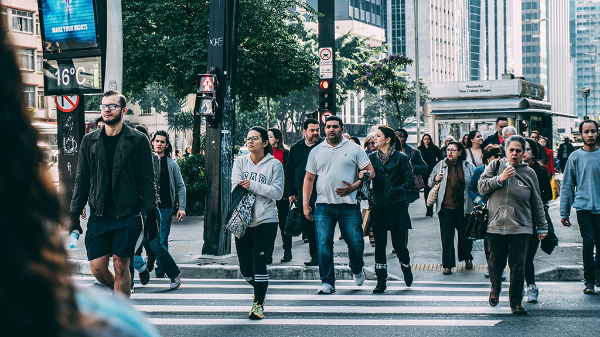
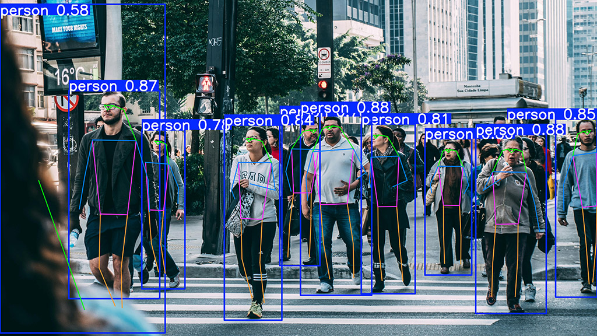

# Keypoint Extraction

The next step in computer vision is the extraction of keypoints in images. YOLO also has a solution for this and its own models. 
YOLO can detect and track specific points of interest in images, which is particularly useful for pose estimation, facial landmark detection, and custom keypoint tracking.

## Project Setup

We'll continue with the project structure from [before](detection.md#project-setup) and create a new jupyter notebook `yolo_keypoint.ipynb`:

```hl_lines="6"
📁 computer_vision/
    ├── 📁 .venv/
    ├── 📁 pics/
    ├── 📄 yolo_detect.ipynb
    ├── 📄 yolo_segment.ipynb
    └── 📄 yolo_keypoints.ipynb
```

Ensure your virtual environment is active, and the required packages (`ultralytics`) are installed.

We will start with the picture `pic1.jpg` which we already downloaded [before](detection.md#project-setup). 

<figure markdown="span"> {width=50% } </figure>


## YOLO Keypoint Detection :material-key:

YOLO's keypoint detection is primarily used for human **pose estimation**, where it can identify specific points on objects or bodies. This is particularly useful for:

- Human pose estimation
- Facial landmark detection
- Custom keypoint tracking
- Sports motion analysis
- Animal pose tracking

Therefore, the pre-trained models provided by YOLO are only trained for humans and do not recognize anything else. We can also train models ourselves to recognize various types of key points besides humans. We will look at this topic a little later. 

## Inference :material-run:

???+ info "Pretrained Models"
    Again, just like with detection and segmentation, YOLO provides pre-trained models specifically for keypoint detection. These models have been trained on various datasets to recognize different types of keypoints.

### Running Keypoint Detection

The code for keypoint detection and the results are similar to other YOLO tasks - we just need to use a keypoint-specific model:

```python
# Import required libraries
from ultralytics import YOLO

# Define the path to the source picture
picpath = "pics/pic1.jpg"

# Load a pretrained YOLO11 Keypoint Model (Size: Nano)
model_kp = YOLO("yolo11n-pose.pt") # (1)!

# Apply the model to our source picture
results = model_kp(picpath)
```

1. As with detection and segmentation, there are also different models for keypoint extraction: `YOLO11n-pose`, `YOLO11s-pose`, `YOLO11m-pose`, `YOLO11l-pose`, `YOLO11x-pose`

```title=">>> Output"
image 1/1 c:\path\to\pics\pic_keypoints.jpg: 384x640 10 persons, 63.4ms
Speed: 3.0ms preprocess, 63.4ms inference, 4.6ms postprocess per image at shape (1, 3, 384, 640)
```

### Visualizing Keypoint Results

<figure markdown="span"> {width=50% } </figure>

Like inference, the visualization of keypoints is equivalent to segmentation and detection.
You can customize how the keypoint results are displayed. For more control over the visualization:

```python
fname = "output_kp.jpg"

result.plot(
    show = True,        # Display the plot immediately

    save = True,        # Save the plotted image to a file
    filename = fname,    # Specify the filename for the saved image

    conf=True,           # Show confidence scores
    line_width=2,        # Line thickness for connections
    font_size=14,        # Font size for labels
    boxes=True,          # Show bounding boxes
    labels=True          # Show keypoint labels
)
```

### Inference Arguments
Many of the same inference arguments from detection and segmentation also work with keypoint extraction, plus some additional ones specific to masks. Therefore check the [documentation](https://docs.ultralytics.com/modes/predict/#inference-arguments).


???+ question "Task: Perform a Keypoint Extraction"
    Perform a keypoint extraction on the above shown image `pic1.jpg`. Take a closer look at the results and answer these questions:

    1. How do the results differ from those of the detection/segmentation?
    2. Take a look at the names attribute. How many different classes can be detected?
    3. How many poses are detected?
    4. What parts does the keypoints object consist of?
    5. Whats the difference between conf, data and xy?
    6. Do some research about which keypoint represents what body part. 
    7. Now visualize the results by saving the image. 


???+ info "🎉 Congratulations"
    You've learned how to use YOLO for image processing! Try applying these concepts to your own projects and explore more advanced applications.

    <figure markdown="span">
        
        <figcaption style="text-align: center;">(Source: <a href="https://www.reddit.com/r/HelpMeFind/comments/157pu1x/can_someone_help_me_find_the_original_of_this_i/?rdt=41769">Reddit</a>) </figcaption>
    </figure>

Stay tuned for more advanced techniques and use cases in the next chapters!