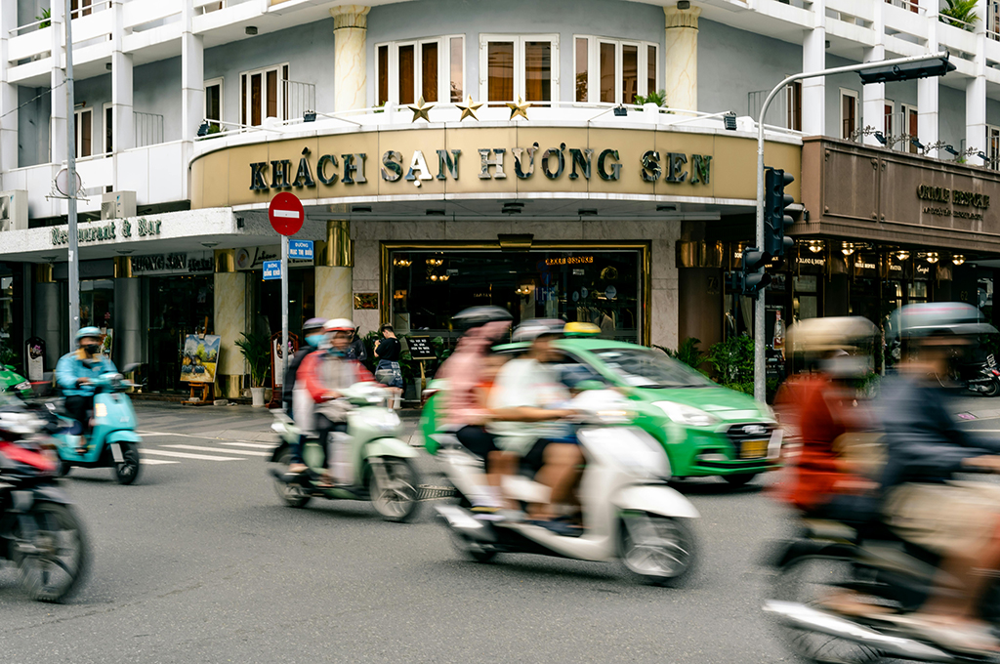

# Segmentation

After learning how to detect objects in images, we can now go one step further: Instead of just detecting where objects are located using bounding boxes, we can identify exactly which pixels belong to each object. This is called segmentation.

## Project Setup
We'll continue with the project structure from [before](../detection.md#project-setup) and create a new jupyter notebook `yolo_segment.ipynb`:
```hl_lines="4"
📁 computer_vision/
    ├── 📁 .venv/
    ├── 📁 pics/
    └── 📄 yolo_segment.ipynb
```
Make sure your virtual environment is still active. We'll use the same test pictures as before.

We'll start with the picture `pic2.jpg` that we used for detection:

<figure markdown="span"> {width=50% } </figure>

## Inference :material-run:

???+ info "Pretrained Models"
    Just like with detection, YOLO provides pre-trained models specifically for segmentation. These models have been trained on the COCO dataset but with segmentation masks instead of just bounding boxes.

### Running the Segmentation

The code for segmentation is very similar to detection - we just need to use a segmentation model instead:

```python
# Import required libraries
from ultralytics import YOLO

# Define the path to the source picture
picpath = "pics/pic2.jpg"

# Load a pretrained YOLO11 Segmentation Model (Size: Nano)
model_seg = YOLO("yolo11n-seg.pt")

# Apply the model to our source picture
results = model_seg(picpath)
```
```title=">>> Output"
image 1/1 c:\path\to\pics\pic2.jpg: 448x640 4 persons, 1 car, 5 motorcycles, 3 traffic lights, 1 stop sign, 52.7ms
Speed: 2.0ms preprocess, 52.7ms inference, 4.0ms postprocess per image at shape (1, 3, 448, 640)
```

The output looks similar to detection, but behind the scenes YOLO has created detailed segmentation masks for each object!

???+ question "Task: Analyze the Segmentation Results"
    Now it's time to analyze the segmentation results and compare them to the results from our detection. Take a closer look at the `results` and answer the following questions:

    1. What's the difference between the detection results and the segmentation results now? 
    2. What's the difference between `boxes` and `masks`? What information is stored in these variables?
    3. What's the shape of a mask and what does each dimension represent?
    4. How are the coordinates in masks different from bounding boxes?
    5. Visualize the results by saving the resulting image. 


### Visualizing Segmentation Results

You can customize how the segmentation results are displayed to better suit your analysis or presentation needs, allowing you to highlight specific features like bounding boxes, segmentation masks, confidence scores, or class labels.

```python
fname = "output_segmentation.jpg"

result.plot(
    show = True,        # Display the plot immediately

    save = True,        # Save the plotted image to a file
    filename = fname    # Specify the filename for the saved image

    boxes = True,       # Include bounding boxes around detected objects
    masks = True,       # Overlay segmentation masks on the image
    conf = False,       # Do not display confidence scores for the predictions
    labels = True,      # Display class labels for each detected object
)
```

???+ info "Inference Arguments"
    Many of the same inference arguments from detection also work with segmentation, plus some additional ones specific to masks. Therefore check the [documentation](https://docs.ultralytics.com/modes/predict/#inference-arguments).
    

???+ question "Task: Segmentation Practice"
    Try these exercises to better understand image segmentation:

    1. Mask Quality (Inference Argument)
        - Run segmentation with `retina_masks=True`
        - Compare the output with default masks
        - What differences do you notice in quality and speed?
    2. Compare different model sizes (nano vs. small vs. medium) for segmentation
    3. Experiment with different confidence thresholds
    4. Try segmenting different types of images

--- 
???+ info "🎉 Congratulations"
    You've learned the basics of image segmentation! Try applying these concepts to your own projects and explore more advanced techniques.
