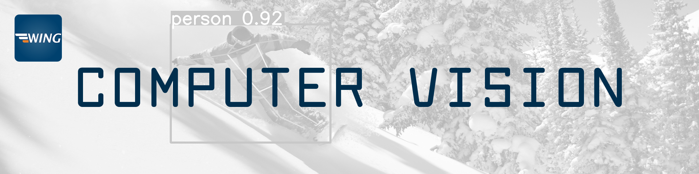

# Introduction
???+ danger "Under Construction"

    The `Computer Vision` section is currently under construction. 
    :fontawesome-solid-person-digging:

    Please check back later for updates.



???+ info "Project Setup"
    This chapter serves as an introduction to the topic of computer vision. We'll explore various tasks, demonstrating their use with code snippets. Even though this is just an introductory chapter and you might not grasp all the details yet, we encourage you to run the code on your own computer.

    To follow along, we recommend setting up a new project folder with a Jupyter notebook. Additionally, create a new [virtual environment ](../python/packages.md#virtual-environments) and **activate** it. [Install the required packages](../python/packages.md#installing-packages):

    ```bash
    pip install ultralytics opencv-python pytesseract face-recognition
    ```

    Your project structure should look like this:

    ```
    📁 vision_intro/
    ├── 📁 .venv/
    ├── 📄 input.jpg
    └── 📄 cv_intro.ipynb
    ```


Computer Vision is a field of artificial intelligence that enables machines to interpret and understand the visual world. By using digital images from cameras and videos along with deep learning models, machines can accurately identify and classify objects - and then react to what they "see."

In this introduction, we'll delve into the basics of computer vision, its challenges, and how it's interconnected with other fields. Let's embark on this visual journey together!

## What Is Computer Vision? :material-eye:

Before diving into computer vision, let's briefly touch upon artificial intelligence (AI). AI is a broad field aiming to create systems capable of performing tasks that typically require human intelligence. As one of the pioneers of AI, John McCarthy, described it:

> "An attempt will be made to find how to make machines use language, form abstractions and concepts, solve kinds of problems now reserved for humans, and improve themselves."
>
> -- *John McCarthy*

Artificial Intelligence is a multidisciplinary field divided into several subfields, each contributing to simulating intelligent behavior in machines. These include:

- **Machine Learning**
- **Natural Language Processing**
- **Robotics**
- **Computer Graphics**
- **Computer Vision**

These subfields are interconnected; advancements in one often benefit the others. For instance, computer vision is essential in robotics for environment perception and in natural language processing for image captioning.

But now we still want to know: **What is computer vision exactly?**

At its core, computer vision seeks to automate tasks that the human visual system can do. It involves techniques for acquiring, processing, analyzing, and understanding images to produce numerical or symbolic information.

<figure markdown="span">
    <div style="background-color: white; display: flex; justify-content: center;">
        
    </div>
    <figcaption style="text-align: center;">Biological Vision (Source: Ai	Miquel Perello Nieto on <a href="https://en.wikipedia.org/wiki/File:Human_visual_pathway.svg">Wikipedia</a>) </figcaption>
</figure>

???+ tip "Interesting Fact"   
    Did you know, that over 50% of the processing in the human brain is devoted directly or indirectly to visual information (Source: [MIT News](https://news.mit.edu/1996/visualprocessing))

In other words, computer vision transforms visual data into meaningful information. Now, let's explore some typical computer vision :material-eye: tasks and see how they come to life through examples you can try yourself!

### Typical Computer Vision Tasks


#### Classification
Assigning objects within an image to predefined categories or classes.

???+ example "Example: Classification"

    <div class="grid cards" markdown>

    -   __Input__

        ---

        <figure markdown="span"> {width=100% } </figure>

    -   __Output__

        ---

        ```title=">>> Output"
        1 person, 1 dog
        ```
    </div>

    ??? code "Code"
    
        ``` py
        from ultralytics import YOLO

        # Load a model
        model = YOLO("yolo11n.pt")  # load an official model

        # Predict with the model
        results = model("dog.jpg")  # predict on an image
        ```


#### Localization
Determining the exact location of an object within an image.

#### Detection
Identifying and locating multiple objects within an image, effectively combining classification and localization.

???+ example "Example: Detection"

    <div class="grid cards" markdown>

    -   __Input__

        ---

        <figure markdown="span"> {width=100% } </figure>

    -   __Output__

        ---

        <figure markdown="span"> {width=100% } </figure>

    </div>

    ??? code "Code"
    
        ``` py
        from ultralytics import YOLO

        # Load a model
        model = YOLO("yolo11n.pt")  # load an official model

        # Predict with the model
        results = model("dog.jpg", save=True)  # predict on an image
        results[0].show()  # display the image
        ```

#### Segmentation
Precisely delineating the pixels that belong to an object, separating it from the background.

???+ example "Example: Segmentation"

    <div class="grid cards" markdown>

    -   __Input__

        ---

        <figure markdown="span"> {width=100% } </figure>

    -   __Output__

        ---

        <figure markdown="span"> {width=100% } </figure>

    </div>

    ??? code "Code"
    
        ``` py
        from ultralytics import YOLO

        # Load a model
        model = YOLO("yolo11n-seg.pt")  # load an official model

        # Predict with the model
        results = model("dog.jpg", save=True)  # predict on an image
        results[0].show()  # display the image
        ```


#### Tracking
Monitoring the movement of objects over time in videos or live streams, analyzing factors like velocity and relative position.

???+ example "Example: Tracking"

    <div class="grid cards" markdown>

    -   __Input__

        ---

        <div style="text-align: center;">
            
        </div>

    -   __Output__

        ---

        <div style="text-align: center;">
            
        </div>

    </div>

    ??? code "Code"
    
        ``` py
        from collections import defaultdict
        import cv2
        import numpy as np

        from ultralytics import YOLO

        # Load the YOLO11 model
        model = YOLO("yolo11n.pt")

        # Open the video file
        video_path = "street2.mp4"
        cap = cv2.VideoCapture(video_path)

        # Store the track history
        track_history = defaultdict(lambda: [])

        video = cv2.VideoWriter("output.mp4", 0, 25, (960,540))

        # Loop through the video frames
        while cap.isOpened():
            # Read a frame from the video
            success, frame = cap.read()

            if success:
                # Run YOLO11 tracking on the frame, persisting tracks between frames
                results = model.track(frame, persist=True, classes=[2])

                # Get the boxes and track IDs
                boxes = results[0].boxes.xywh.cpu()
                track_ids = results[0].boxes.id.int().cpu().tolist()

                # Visualize the results on the frame
                annotated_frame = results[0].plot()

                # Plot the tracks
                for box, track_id in zip(boxes, track_ids):
                    x, y, w, h = box
                    track = track_history[track_id]
                    track.append((float(x), float(y)))  # x, y center point
                    if len(track) > 30:  # retain 90 tracks for 90 frames
                        track.pop(0)

                    # Draw the tracking lines
                    points = np.hstack(track).astype(np.int32).reshape((-1, 1, 2))
                    cv2.polylines(annotated_frame, [points], isClosed=False, color=(230, 230, 230), thickness=10)

                # Display the annotated frame
                cv2.imshow("YOLO11 Tracking", annotated_frame)
                video.write(annotated_frame)
                # Break the loop if 'q' is pressed
                if cv2.waitKey(1) & 0xFF == ord("q"):
                    break
            else:
                # Break the loop if the end of the video is reached
                break

        # Release the video capture object and close the display window
        cap.release()
        cv2.destroyAllWindows()
        video.release()
        ```

#### Optical Character Recognition
Recognizing and extracting printed or handwritten text from images, enabling machines to read and process written information.

???+ example "Example: OCR"

    <div class="grid cards" markdown>

    -   __Input__

        ---

        <figure markdown="span"> {width=100% } </figure>

    -   __Output__

        ---

        ```title=">>> Output"
        LAN DOR.

        CHAPTER IL

        BIRTH AND PARENTAGE—SCHOOL — COLLEGE.
        (1775 —1794.)

        Few men have ever impressed their peers so much, or the
        general public so little, as Watrer Savage Lanpor. Of
        all celebrated authors, he has hitherto been one of the
        least popular. Nevertheless he is among the most strik-
        ing figures in the history of English literature ; striking
        alike by his character and his powers. Personally, Landor
        exercised the spell of genius upon every one who came
        near him. His gifts, attainments, impetuosities, his
        originality, his force, his charm, were all of the same
        conspicuous and imposing kind. Not to know what is
        to be known of so remarkable a man is evidently to be a
        loser. Not to be familiar with the works of so noble
        ```
    </div>

    ??? code "Code"
    
        ``` py
        # Need to install tesseract on your PC https://www.nutrient.io/blog/how-to-use-tesseract-ocr-in-python/
        from PIL import Image
        import pytesseract

        print(pytesseract.image_to_string(Image.open('scan.png')))
        ```

#### Facial Recognition
Identifying individuals based on their facial features and recognizing various facial expressions.

???+ example "Example: Facial Recognition"

    <div class="grid cards" markdown>

    -   __Input__

        ---

        <figure markdown="span"> {width=100% } </figure>

    -   __Output__

        ---

        <figure markdown="span"> {width=100% } </figure>

    </div>
    (Source: <a href="https://unsplash.com/de/@libraryofcongress?utm_content=creditCopyText&utm_medium=referral&utm_source=unsplash">Library of Congress</a> on <a href="https://unsplash.com/de/fotos/prasident-donald-trump-jPN_oglAjOU?utm_content=creditCopyText&utm_medium=referral&utm_source=unsplash">Unsplash</a>)

    ??? code "Code"
    
        ``` py
        # You need to install cmake on your PC first
        # https://github.com/ageitgey/face_recognition?tab=readme-ov-file

        import face_recognition
        import cv2
        import numpy as np

        # Load a sample picture and learn how to recognize it.
        obama_image = face_recognition.load_image_file("obama.jpg")
        obama_face_encoding = face_recognition.face_encodings(obama_image)[0]

        # Load a sample picture and learn how to recognize it.
        trump_image = face_recognition.load_image_file("trump.jpg")
        trump_face_encoding = face_recognition.face_encodings(trump_image)[0]

        # Load a second sample picture and learn how to recognize it.
        biden_image = face_recognition.load_image_file("biden.jpg")
        biden_face_encoding = face_recognition.face_encodings(biden_image)[0]

        # Create arrays of known face encodings and their names
        known_face_encodings = [
            obama_face_encoding,
            trump_face_encoding,
            biden_face_encoding
        ]
        known_face_names = [
            "Barack Obama",
            "Donald Trump",
            "Joe Biden"
        ]

        # Initialize some variables
        face_locations = []
        face_encodings = []
        face_names = []
        process_this_frame = True

        rgb_small_frame = face_recognition.load_image_file("trump2.jpg")

        face_locations = face_recognition.face_locations(rgb_small_frame)
        face_encodings = face_recognition.face_encodings(rgb_small_frame, face_locations)

        face_names = []
        for face_encoding in face_encodings:
            # See if the face is a match for the known face(s)
            matches = face_recognition.compare_faces(known_face_encodings, face_encoding)
            name = "Unknown"

            # Or instead, use the known face with the smallest distance to the new face
            face_distances = face_recognition.face_distance(known_face_encodings, face_encoding)
            best_match_index = np.argmin(face_distances)
            if matches[best_match_index]:
                name = known_face_names[best_match_index]

            face_names.append(name)

        # Display the results
        for (top, right, bottom, left), name in zip(face_locations, face_names):

            # Draw a box around the face
            cv2.rectangle(rgb_small_frame, (left, top), (right, bottom), (0, 0, 255), 2)

            # Draw a label with a name below the face
            cv2.rectangle(rgb_small_frame, (left, bottom - 35), (right, bottom), (0, 0, 255), cv2.FILLED)
            font = cv2.FONT_HERSHEY_DUPLEX
            cv2.putText(rgb_small_frame, name, (left + 6, bottom - 6), font, 1.0, (255, 255, 255), 1)

        # Display the resulting image
        cv2.imshow('Video', cv2.cvtColor(rgb_small_frame, cv2.COLOR_BGR2RGB))
        cv2.waitKey(0)
        cv2.destroyAllWindows()
        cv2.imwrite('trump_out.jpg', cv2.cvtColor(rgb_small_frame, cv2.COLOR_BGR2RGB))
        ```

####  Pose Estimation
Determining the position and orientation of an object or person relative to a reference point or coordinate system.

???+ example "Example: Pose Estimation"

    <div class="grid cards" markdown>

    -   __Input__

        ---

        <figure markdown="span"> {width=100% } </figure>

    -   __Output__

        ---

        <figure markdown="span"> {width=100% } </figure>

    </div>

    ??? code "Code"
    
        ``` py
        from ultralytics import YOLO

        # Load a model
        model = YOLO("yolo11n-pose.pt")  # load an official model

        # Predict with the model
        results = model("dog.jpg", save=True)  # predict on an image
        results[0].show()  # display the image
        ```

These tasks represent the core of computer vision, each contributing to its wide-ranging real-world applications. From enabling machines to read and understand handwritten documents to enhancing interactive gaming experiences through accurate motion tracking, the advancements in computer vision are transforming industries and everyday life.

And: as you can see, they're not just theoretical concepts - you can try them out yourself :octicons-file-code-16:!


### Applications

Computer vision has a wide range of applications across various industries.

???+ example "Possible Applications for Computer Vision"

    === "Robotics"

        Robots use computer vision to navigate and interact with their environment.

        <figure markdown="span"> {width=100% } </figure>

    === "Autonomous Vehicles"

        Self-driving cars rely heavily on computer vision to perceive the road and make driving decisions.

        <figure markdown="span"> {width=100% } </figure>

    === "Medical"

        Computer vision aids in medical imaging for diagnostics and treatment planning.

        <figure markdown="span">
            
            <figcaption style="text-align: center;">(Source: Newe A, Ganslandt T on <a href="https://de.wikipedia.org/wiki/Datei:Model_of_a_segmented_femur_-_journal.pone.0079004.g005.png">Wikipedia</a>)</figcaption>
        </figure>

    === "Quality Control"

        Automated inspection systems detect defects in manufacturing processes.

        <figure markdown="span">
            
            <figcaption style="text-align: center;">(Source: <a href="https://www.elunic.com/de/showcase/automatisierte-risserkennung/">elunic</a>)</figcaption>
        </figure>

    === "Retail"

        Augmented reality shopping experiences enhance customer engagement.

        <figure markdown="span">
            
            <figcaption style="text-align: center;">(Source: SNAP INC via <a href="https://www.forbes.com/sites/lelalondon/2021/05/20/virtual-try-on-is-more-than-a-pandemic-trendand-these-brands-are-reaping-the-rewards/">Forbes</a>)</figcaption>
        </figure>

    === "Facial Recognition"

        Used for security and authentication purposes.

        <figure markdown="span">
            
            <figcaption style="text-align: center;">(Source: Sylenius on <a href="https://commons.wikimedia.org/wiki/File:Face_detection.jpg">Wikipedia</a>)</figcaption>
        </figure>


### How can Machines "See"? :eyes:

When we look at the world, our eyes receive light reflected from objects. Similarly, cameras capture light to create images. 

<figure markdown="span">
    
    <figcaption style="text-align: center;">
        Camera sensor prinicpal (Source: <a href="https://www.neg.co.jp/en/rd/topics/product-cover-glass/">Neg</a>) 
    </figcaption>
</figure>

However, interpreting these images to understand the scene involves complex algorithms that can discern patterns, shapes, and colors. This process involves several steps:

1. **Image Acquisition**: Capturing the visual data using cameras or sensors.
2. **Preprocessing**: Enhancing image quality and correcting distortions.
3. **Feature Extraction**: Identifying edges, textures, and other significant parts of the image.
4. **High-Level Processing**: Recognizing objects, understanding scenes, and making decisions.


### Challenges in Computer Vision
Despite the advancements, computer vision faces several challenges. Let's explore them.

<div class="grid cards" markdown>

-   __Inverse Problem__ 

    --- 
    One of the fundamental challenges in computer vision is the inverse problem: Reconstructing a 3D scene from a 2D image is challenging because multiple 3D scenes can produce the same 2D projection.

-   <figure markdown="span">
        
    <figcaption style="text-align: center;">(Source: mosso on <a href="https://commons.wikimedia.org/wiki/File:Ames_room_forced_perspective.jpg">Wikipedia</a>) </figcaption>
    </figure>

-   <figure markdown="span">
        
    <figcaption style="text-align: center;">(Source: Palazzi et al at <a href="https://www.computer.org/csdl/journal/tp/2022/04/09222285/1nTpT7bj1qU">Computer.org</a>) </figcaption>
    </figure>

-   __Variability Due to Viewpoint__ 

    --- 
    An object can look vastly different from various angles. For example, a car viewed from the front, side, or top presents different shapes and features, complicating recognition tasks.

-   __Deformation__ 

    --- 
    Non-rigid objects, like clothing or human bodies, can change shape, making it challenging to maintain consistent recognition.

-   <figure markdown="span"> {width=100% } </figure>

-   <figure markdown="span"> {width=100% } </figure>

-   __Occlusion__ 

    --- 
    Objects in images often block parts of other objects. Detecting partially visible objects requires algorithms to infer the hidden parts.

-   __Illumination__ 

    --- 
    Lighting conditions can alter the appearance of objects. An apple under bright sunlight looks different from one under indoor lighting.

-   <figure markdown="span">
        
    <figcaption style="text-align: center;">(Source: <a href="https://www.flocutus.de/besser-fotografieren-belichtungbetter-photography-exposure/">Flocutus</a>) </figcaption>
    </figure>

-   <figure markdown="span">
        
    <figcaption style="text-align: center;">(Source: Osi on <a href="https://commons.wikimedia.org/wiki/File:Radsport.jpg">Wikipedia</a>) </figcaption>
    </figure>

-   __Motion Blur__ 

    --- 
    Movement during image capture can blur images, obscuring details necessary for recognition.

-   __Optical Illusions__ 

    --- 
    Our perception can be deceived by optical illusions, where our brain interprets images differently from the actual measurements.

-   <figure markdown="span">
        
    </figure>

-   <figure markdown="span">
        
    <figcaption style="text-align: center;">(Source: Nizar Massouh on <a href="https://www.researchgate.net/figure/shows-an-example-of-Intra-Class-variation-on-the-Chair-class-But-how-will-a-machine_fig1_325311506">ResearchGate</a>) </figcaption>
    </figure>

-   __Intra Class Variation__ 

    --- 
    Objects within the same category can look very different.Chairs come in numerous designs—armchairs, stools, recliners—but they all serve the same function. Recognizing all variations as "chairs" is challenging for computer vision systems.


-   __Number of Categories__ 

    --- 
    There are thousands of object categories, each with its own variations. Building systems that can recognize all of them requires extensive data and sophisticated algorithms.

-   <figure markdown="span">
        
    <figcaption style="text-align: center;">(Source: Cees Snoek on <a href="https://www.researchgate.net/figure/Object-categories-of-the-PASCAL-Visual-Object-Challenge-2007-5-used-in-the-image_fig1_224577638">ResearchGate</a>) </figcaption>
    </figure>

</div>

By understanding these challenges, you're better equipped to appreciate the complexities involved in teaching machines to see.

---

Congratulations! You've taken your first steps into the world of computer vision. Feel free to experiment with the code examples provided and explore further. In the next chapters, we'll delve deeper into specific algorithms and techniques.

See you in the next chapter! 👋