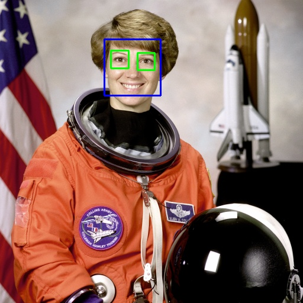

# Computer Vision

Computer Vision is a field of artificial intelligence that enables machines to interpret and understand the visual world. By using digital images from cameras and videos and deep learning models, machines can accurately identify and classify objects - and then react to what they "see." This introduction aims to provide an overview of computer vision, its challenges, and its interconnections with other fields.

## What Is Computer Vision?

Befor we take a closer look at computer vision, we need to introduce artificial intelligence (AI). AI is a broad field that aims to create systems capable of performing tasks that typically require human intelligence. As one of the pioneers of AI, described it:

> "An attempt will be made to find how to make machines use language, form abstractions and concepts, solve kinds of problems now reserved for humans, and improve themselves."
>
> -- *John McCarthy*

Artificial Intelligence is a multidiciplinary field that can be divided into several subfields, each contributing to the overarching goal of simulating intelligent behavior in machines. These subfields include:

- **Machine Learning**
- **Natural Language Processing**
- **Robotics**
- **Computer Graphics**
- **Computer Vision**


These subfields are interconnected; advancements in one often benefit the others. For instance, computer vision is essential in robotics for environment perception and in natural language processing for image captioning.

But now we still want to know: **What is computer vision itself?**

At its core, computer vision seeks to automate tasks that the human visual system can do. It involves techniques for acquiring, processing, analyzing, and understanding images to produce numerical or symbolic information.

<figure markdown="span">
    <div style="background-color: white; display: flex; justify-content: center;">
        
    </div>
    <figcaption style="text-align: center;">Biological Vision (Source: Ai	Miquel Perello Nieto on <a href="https://en.wikipedia.org/wiki/File:Human_visual_pathway.svg">Wikipedia</a>) </figcaption>
</figure>

???+ tip "Interesting Fact"   
    Did you know, that over 50% of the processing in the human brain is devoted directly or indirectly to visual information (Source: [MIT News](https://news.mit.edu/1996/visualprocessing))

So in other words, computer vision transforms visual data into meaningful information. 

### Typical Computer Vision Tasks


- **Object Classification**: Assigning objects within an image to predefined categories or classes.

???+ example "Example: Classification"

    <div class="grid cards" markdown>

    -   __Input__

        ---

        <figure markdown="span"> {width=100% } </figure>

    -   __Output__

        ---

        ```title=">>> Output"
        1 person, 1 dog
        ```
    </div>

    ??? code "Code"
    
        ``` py
        from ultralytics import YOLO

        # Load a model
        model = YOLO("yolo11n.pt")  # load an official model

        # Predict with the model
        results = model("dog.jpg")  # predict on an image
        ```


- **Object Localization**: Determining the exact location of an object within an image.

- **Object Detection**: Identifying and locating multiple objects within an image, effectively combining classification and localization.

???+ example "Example: Detection"

    <div class="grid cards" markdown>

    -   __Input__

        ---

        <figure markdown="span"> {width=100% } </figure>

    -   __Output__

        ---

        <figure markdown="span"> {width=100% } </figure>

    </div>

    ??? code "Code"
    
        ``` py
        from ultralytics import YOLO

        # Load a model
        model = YOLO("yolo11n.pt")  # load an official model

        # Predict with the model
        results = model("dog.jpg", save=True)  # predict on an image
        results[0].show()  # display the image
        ```

- **Object Segmentation**: Precisely delineating the pixels that belong to an object, separating it from the background.
???+ example "Example: Segmentation"

    <div class="grid cards" markdown>

    -   __Input__

        ---

        <figure markdown="span"> {width=100% } </figure>

    -   __Output__

        ---

        <figure markdown="span"> {width=100% } </figure>

    </div>

    ??? code "Code"
    
        ``` py
        from ultralytics import YOLO

        # Load a model
        model = YOLO("yolo11n-seg.pt")  # load an official model

        # Predict with the model
        results = model("dog.jpg", save=True)  # predict on an image
        results[0].show()  # display the image
        ```


- **Object Tracking**: Monitoring the movement of objects over time in videos or live streams, analyzing factors like velocity and relative position.

???+ example "Example: Tracking"

    <div class="grid cards" markdown>

    -   __Input__

        ---

        <div style="text-align: center;">
            
        </div>

    -   __Output__

        ---

        <div style="text-align: center;">
            
        </div>

    </div>

    ??? code "Code"
    
        ``` py
        from collections import defaultdict
        import cv2
        import numpy as np

        from ultralytics import YOLO

        # Load the YOLO11 model
        model = YOLO("yolo11n.pt")

        # Open the video file
        video_path = "street2.mp4"
        cap = cv2.VideoCapture(video_path)

        # Store the track history
        track_history = defaultdict(lambda: [])

        video = cv2.VideoWriter("output.mp4", 0, 25, (960,540))

        # Loop through the video frames
        while cap.isOpened():
            # Read a frame from the video
            success, frame = cap.read()

            if success:
                # Run YOLO11 tracking on the frame, persisting tracks between frames
                results = model.track(frame, persist=True, classes=[2])

                # Get the boxes and track IDs
                boxes = results[0].boxes.xywh.cpu()
                track_ids = results[0].boxes.id.int().cpu().tolist()

                # Visualize the results on the frame
                annotated_frame = results[0].plot()

                # Plot the tracks
                for box, track_id in zip(boxes, track_ids):
                    x, y, w, h = box
                    track = track_history[track_id]
                    track.append((float(x), float(y)))  # x, y center point
                    if len(track) > 30:  # retain 90 tracks for 90 frames
                        track.pop(0)

                    # Draw the tracking lines
                    points = np.hstack(track).astype(np.int32).reshape((-1, 1, 2))
                    cv2.polylines(annotated_frame, [points], isClosed=False, color=(230, 230, 230), thickness=10)

                # Display the annotated frame
                cv2.imshow("YOLO11 Tracking", annotated_frame)
                video.write(annotated_frame)
                # Break the loop if 'q' is pressed
                if cv2.waitKey(1) & 0xFF == ord("q"):
                    break
            else:
                # Break the loop if the end of the video is reached
                break

        # Release the video capture object and close the display window
        cap.release()
        cv2.destroyAllWindows()
        video.release()
        ```

- **Optical Character Recognition (OCR)**: Recognizing and extracting printed or handwritten text from images, enabling machines to read and process written information.

???+ example "Example: OCR"

    <div class="grid cards" markdown>

    -   __Input__

        ---

        <figure markdown="span"> {width=100% } </figure>

    -   __Output__

        ---

        ```title=">>> Output"
        LAN DOR.

        CHAPTER IL

        BIRTH AND PARENTAGE—SCHOOL — COLLEGE.
        (1775 —1794.)

        Few men have ever impressed their peers so much, or the
        general public so little, as Watrer Savage Lanpor. Of
        all celebrated authors, he has hitherto been one of the
        least popular. Nevertheless he is among the most strik-
        ing figures in the history of English literature ; striking
        alike by his character and his powers. Personally, Landor
        exercised the spell of genius upon every one who came
        near him. His gifts, attainments, impetuosities, his
        originality, his force, his charm, were all of the same
        conspicuous and imposing kind. Not to know what is
        to be known of so remarkable a man is evidently to be a
        loser. Not to be familiar with the works of so noble
        ```
    </div>

    ??? code "Code"
    
        ``` py
        # Need to install tesseract on your PC https://www.nutrient.io/blog/how-to-use-tesseract-ocr-in-python/
        from PIL import Image
        import pytesseract

        print(pytesseract.image_to_string(Image.open('scan.png')))
        ```

- **Facial Recognition**: Identifying individuals based on their facial features and recognizing various facial expressions.

???+ example "Example: Facial Recognition"

    <div class="grid cards" markdown>

    -   __Input__

        ---

        <figure markdown="span"> {width=100% } </figure>

    -   __Output__

        ---

        <figure markdown="span"> {width=100% } </figure>

    </div>
    (Source: <a href="https://unsplash.com/de/@libraryofcongress?utm_content=creditCopyText&utm_medium=referral&utm_source=unsplash">Library of Congress</a> on <a href="https://unsplash.com/de/fotos/prasident-donald-trump-jPN_oglAjOU?utm_content=creditCopyText&utm_medium=referral&utm_source=unsplash">Unsplash</a>)

    ??? code "Code"
    
        ``` py
        # You need to install cmake on your PC first
        # https://github.com/ageitgey/face_recognition?tab=readme-ov-file

        import face_recognition
        import cv2
        import numpy as np

        # Load a sample picture and learn how to recognize it.
        obama_image = face_recognition.load_image_file("obama.jpg")
        obama_face_encoding = face_recognition.face_encodings(obama_image)[0]

        # Load a sample picture and learn how to recognize it.
        trump_image = face_recognition.load_image_file("trump.jpg")
        trump_face_encoding = face_recognition.face_encodings(trump_image)[0]

        # Load a second sample picture and learn how to recognize it.
        biden_image = face_recognition.load_image_file("biden.jpg")
        biden_face_encoding = face_recognition.face_encodings(biden_image)[0]

        # Create arrays of known face encodings and their names
        known_face_encodings = [
            obama_face_encoding,
            trump_face_encoding,
            biden_face_encoding
        ]
        known_face_names = [
            "Barack Obama",
            "Donald Trump",
            "Joe Biden"
        ]

        # Initialize some variables
        face_locations = []
        face_encodings = []
        face_names = []
        process_this_frame = True

        rgb_small_frame = face_recognition.load_image_file("trump2.jpg")

        face_locations = face_recognition.face_locations(rgb_small_frame)
        face_encodings = face_recognition.face_encodings(rgb_small_frame, face_locations)

        face_names = []
        for face_encoding in face_encodings:
            # See if the face is a match for the known face(s)
            matches = face_recognition.compare_faces(known_face_encodings, face_encoding)
            name = "Unknown"

            # Or instead, use the known face with the smallest distance to the new face
            face_distances = face_recognition.face_distance(known_face_encodings, face_encoding)
            best_match_index = np.argmin(face_distances)
            if matches[best_match_index]:
                name = known_face_names[best_match_index]

            face_names.append(name)

        # Display the results
        for (top, right, bottom, left), name in zip(face_locations, face_names):

            # Draw a box around the face
            cv2.rectangle(rgb_small_frame, (left, top), (right, bottom), (0, 0, 255), 2)

            # Draw a label with a name below the face
            cv2.rectangle(rgb_small_frame, (left, bottom - 35), (right, bottom), (0, 0, 255), cv2.FILLED)
            font = cv2.FONT_HERSHEY_DUPLEX
            cv2.putText(rgb_small_frame, name, (left + 6, bottom - 6), font, 1.0, (255, 255, 255), 1)

        # Display the resulting image
        cv2.imshow('Video', cv2.cvtColor(rgb_small_frame, cv2.COLOR_BGR2RGB))
        cv2.waitKey(0)
        cv2.destroyAllWindows()
        cv2.imwrite('trump_out.jpg', cv2.cvtColor(rgb_small_frame, cv2.COLOR_BGR2RGB))
        ```

- **Pose Estimation**: Determining the position and orientation of an object or person relative to a reference point or coordinate system.

???+ example "Example: Pose Estimation"

    <div class="grid cards" markdown>

    -   __Input__

        ---

        <figure markdown="span"> {width=100% } </figure>

    -   __Output__

        ---

        <figure markdown="span"> {width=100% } </figure>

    </div>

    ??? code "Code"
    
        ``` py
        from ultralytics import YOLO

        # Load a model
        model = YOLO("yolo11n-pose.pt")  # load an official model

        # Predict with the model
        results = model("dog.jpg", save=True)  # predict on an image
        results[0].show()  # display the image
        ```

These categories represent the core tasks in computer vision, each contributing to its wide-ranging real-world applications. From enabling machines to read and understand handwritten documents to enhancing interactive gaming experiences through accurate motion tracking, the advancements in computer vision are transforming industries and everyday life.

### Applications

Computer vision has a wide range of applications across various industries.

???+ example "Possible Applications for Computer Vision"

    === "Robotics"

        <figure markdown="span"> {width=100% } </figure>

    === "Autonomous Vehicles"

        <figure markdown="span"> {width=100% } </figure>


    === "Medical"

        <figure markdown="span">
            
        <figcaption style="text-align: center;">(Source: Newe A, Ganslandt T on <a href="https://de.wikipedia.org/wiki/Datei:Model_of_a_segmented_femur_-_journal.pone.0079004.g005.png">Wikipedia</a>) </figcaption>
        </figure>

    === "Quality Control"

        <figure markdown="span">
            
        <figcaption style="text-align: center;">(Source: <a href="https://www.elunic.com/de/showcase/automatisierte-risserkennung/">elunic</a>) </figcaption>
        </figure>

    === "Retail"

        <figure markdown="span">
            
        <figcaption style="text-align: center;">(Source: SNAP INC via <a href="https://www.forbes.com/sites/lelalondon/2021/05/20/virtual-try-on-is-more-than-a-pandemic-trendand-these-brands-are-reaping-the-rewards/">Forbes</a>) </figcaption>
        </figure>

    === "Facial Recognition"

        <figure markdown="span">
            
        <figcaption style="text-align: center;">(Source: Sylenius on <a href="https://commons.wikimedia.org/wiki/File:Face_detection.jpg">Wikipedia</a>) </figcaption>
        </figure>


### How can Machines "See"?

When we look at the world, our eyes receive light reflected from objects. Similarly, cameras capture light to create images. 

<figure markdown="span">
    
    <figcaption style="text-align: center;">
        Camera sensor prinicpal (Source: <a href="https://www.neg.co.jp/en/rd/topics/product-cover-glass/">Neg</a>) 
    </figcaption>
</figure>

However, interpreting these images to understand the scene involves complex algorithms that can discern patterns, shapes, and colors. This process involves several steps:

1. **Image Acquisition**: Capturing the visual data using cameras or sensors.
2. **Preprocessing**: Enhancing image quality and correcting distortions.
3. **Feature Extraction**: Identifying edges, textures, and other significant parts of the image.
4. **High-Level Processing**: Recognizing objects, understanding scenes, and making decisions.


### Challenges in Computer Vision

<div class="grid cards" markdown>

-   __Inverse Problem__ 

    --- 
    One of the fundamental challenges in computer vision is the inverse problem: reconstructing a 3D scene from a 2D image. Since multiple 3D scenes can produce the same 2D projection, the problem is ill-posed.

-   <figure markdown="span">
        
    <figcaption style="text-align: center;">(Source: mosso on <a href="https://commons.wikimedia.org/wiki/File:Ames_room_forced_perspective.jpg">Wikipedia</a>) </figcaption>
    </figure>

-   <figure markdown="span">
        
    <figcaption style="text-align: center;">(Source: Palazzi et al at <a href="https://www.computer.org/csdl/journal/tp/2022/04/09222285/1nTpT7bj1qU">Computer.org</a>) </figcaption>
    </figure>

-   __Variability Due to Viewpoint__ 

    --- 
    An object can look vastly different from various angles. For example, a car viewed from the front, side, or top presents different shapes and features, complicating recognition tasks.

-   __Deformation__ 

    --- 
    Non-rigid objects, like clothing or human bodies, can change shape, making it challenging to maintain consistent recognition.

-   <figure markdown="span"> {width=100% } </figure>

-   <figure markdown="span"> {width=100% } </figure>

-   __Occlusion__ 

    --- 
    Objects in images often block parts of other objects. Detecting partially visible objects requires algorithms to infer the hidden parts.

-   __Illumination__ 

    --- 
    Lighting conditions can alter the appearance of objects. An apple under bright sunlight looks different from one under indoor lighting.

-   <figure markdown="span">
        
    <figcaption style="text-align: center;">(Source: <a href="https://www.flocutus.de/besser-fotografieren-belichtungbetter-photography-exposure/">Flocutus</a>) </figcaption>
    </figure>

-   <figure markdown="span">
        
    <figcaption style="text-align: center;">(Source: Osi on <a href="https://commons.wikimedia.org/wiki/File:Radsport.jpg">Wikipedia</a>) </figcaption>
    </figure>

-   __Motion Blur__ 

    --- 
    Movement during image capture can blur images, obscuring details necessary for recognition.

-   __Optical Illusions__ 

    --- 
    Our perception can be deceived by optical illusions, where our brain interprets images differently from the actual measurements.

-   <figure markdown="span">
        
    </figure>

-   <figure markdown="span">
        
    <figcaption style="text-align: center;">(Source: Nizar Massouh on <a href="https://www.researchgate.net/figure/shows-an-example-of-Intra-Class-variation-on-the-Chair-class-But-how-will-a-machine_fig1_325311506">ResearchGate</a>) </figcaption>
    </figure>

-   __Intra Class Variation__ 

    --- 
    Objects within the same category can look very different.Chairs come in numerous designs—armchairs, stools, recliners—but they all serve the same function. Recognizing all variations as "chairs" is challenging for computer vision systems.


-   __Number of Categories__ 

    --- 
    There are thousands of object categories, each with its own variations. Building systems that can recognize all of them requires extensive data and sophisticated algorithms.

-   <figure markdown="span">
        
    <figcaption style="text-align: center;">(Source: Cees Snoek on <a href="https://www.researchgate.net/figure/Object-categories-of-the-PASCAL-Visual-Object-Challenge-2007-5-used-in-the-image_fig1_224577638">ResearchGate</a>) </figcaption>
    </figure>

</div>


## Approaches in Computer Vision
To tackle those complex problems, over the years, various approaches have been developed.

### Traditional Approaches in Object Detection

Before the rise of deep learning, object detection relied heavily on handcrafted features and traditional machine learning techniques.

- **Haar Cascades**: Introduced by Viola and Jones in 2001, Haar-like features were used for rapid face detection by scanning an image at multiple scales and positions.
???+ example "Example: Haar Cascades"
    
    <figure markdown="span"> {width=70% } </figure>

    ??? code "Code"
    
        ``` py
        #Source: https://medium.com/analytics-vidhya/haar-cascades-explained-38210e57970d

        #-- Load Packages
        import cv2
        from skimage import data

        #-- Load Image and Convert to RGB
        image = data.astronaut()
        image = cv2.cvtColor(image, cv2.COLOR_BGR2RGB) # Convert to RGB

        #-- Load Haar Cascades
        f_cascade = cv2.CascadeClassifier(cv2.data.haarcascades + 'haarcascade_frontalface_default.xml')
        e_cascade = cv2.CascadeClassifier(cv2.data.haarcascades + 'haarcascade_eye.xml')

        #-- Detect Faces and Eyes
        faces = f_cascade.detectMultiScale(image, 1.3, 5)
        for (x,y,w,h) in faces:
            img = cv2.rectangle(image,(x,y),(x+w,y+h),(255,0,0),2)
            roi_color = img[y:y+h, x:x+w]
            eyes = e_cascade.detectMultiScale(roi_color)
            for (ex,ey,ew,eh) in eyes:
                cv2.rectangle(roi_color,(ex,ey),(ex+ew,ey+eh),(0,255,0),2)

        #-- Display and Save Image
        cv2.imwrite('output_haar_cascade.jpg',image)
        cv2.imshow('Haar Cascade',image)
        cv2.waitKey(0)
        cv2.destroyAllWindows()
        ```

- **Histogram of Oriented Gradients (HOG)**: Proposed for human detection, HOG features capture edge orientations and are combined with Support Vector Machines (SVMs) for classification.
???+ example "Example: Haar Cascades"
    
    <figure markdown="span"> {width=70% } </figure>

    ??? code "Code"
    
        ``` py
        #Source: https://scikit-image.org/docs/stable/auto_examples/features_detection/plot_hog.html

        #-- Load Packages
        import cv2
        from skimage.feature import hog
        from skimage import data, exposure

        #-- Load Image
        image = data.astronaut()

        #-- Compute HOG
        fd, hog_image = hog(
            image,
            orientations=8,
            pixels_per_cell=(16, 16),
            cells_per_block=(1, 1),
            visualize=True,
            channel_axis=-1,
        )
        # Rescale histogram for better display
        hog_image= exposure.rescale_intensity(hog_image, in_range=(0, 10))
        hog_image = cv2.normalize(hog_image, dst=None, alpha=0, beta=255,norm_type=cv2.NORM_MINMAX, dtype=cv2.CV_8U)

        #-- Display and Save Image
        cv2.imwrite('output_hog.jpg',hog_image)
        cv2.imshow('HOG',hog_image)
        cv2.waitKey(0)
        cv2.destroyAllWindows()
        ```
    
If you want to learn more about Haar Cascades and HOG, look [here](https://medium.com/@goutam0157/haar-cascade-classifier-vs-histogram-of-oriented-gradients-hog-6f4373ca239b)


### Deep Learning Approaches
The advent of deep learning revolutionized computer vision by enabling models to learn features directly from data. Convolutional Neural Networks (CNNs) can automatically learn hierarchical feature representations from images, eliminating the need for manual feature extraction.

**ImageNet Challenge**: In 2012, AlexNet significantly reduced error rates in image classification, demonstrating the power of CNNs.

Extending CNNs to object detection led to the development of region-based methods that combine localization and classification.

#### Multi-Stage Object Detection

- R-CNN (Regions with CNN Features)
- Fast R-CNN
- Faster R-CNN

#### One-Stage Object Detection
- SSD (Single Shot MultiBox Detector)
- YOLO

xxxxxxxxxxxxxxxxxxxxxxxxxxxxx
xxxxxxxxxxxxxxxxxxxxxxxxxxxx
yolo vs ssd
https://keylabs.ai/blog/yolov8-vs-ssd-choosing-the-right-object-detection-model/

ssd
https://towardsdatascience.com/understanding-ssd-multibox-real-time-object-detection-in-deep-learning-495ef744fab
https://developers.arcgis.com/python/latest/guide/how-ssd-works/

rcnn vs fast-rcnn vs faster-rcnn vs yolo
https://towardsdatascience.com/r-cnn-fast-r-cnn-faster-r-cnn-yolo-object-detection-algorithms-36d53571365e

faster-rcnn vs yolo vs ssd
https://medium.com/ibm-data-ai/faster-r-cnn-vs-yolo-vs-ssd-object-detection-algorithms-18badb0e02dc
https://pro.arcgis.com/en/pro-app/latest/tool-reference/image-analyst/object-detection.htm


### Limitations of Previous Methods

Despite advancements, these methods faced challenges:

- **Complex Pipelines**: Multiple stages increased system complexity and potential error points.
- **Speed vs. Accuracy Trade-off**: Achieving real-time performance often meant sacrificing detection accuracy.
- **Resource Demands**: High computational and memory requirements limited deployment on devices with constrained resources.
