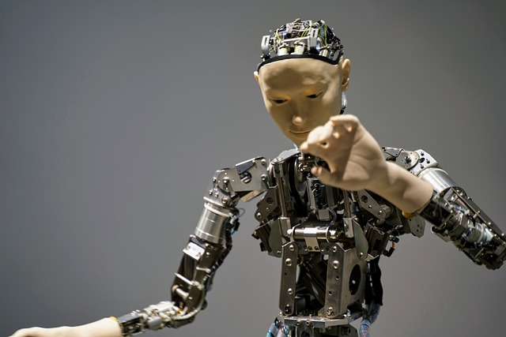

# Computer Vision

Computer Vision is a field of artificial intelligence that enables machines to interpret and understand the visual world. By using digital images from cameras and videos and deep learning models, machines can accurately identify and classify objects - and then react to what they "see." This introduction aims to provide an overview of computer vision, its challenges, and its interconnections with other fields.

## What Is Computer Vision?

Befor we take a closer look at computer vision, we need to introduce artificial intelligence (AI). AI is a broad field that aims to create systems capable of performing tasks that typically require human intelligence. As one of the pioneers of AI, described it:

> "An attempt will be made to find how to make machines use language, form abstractions and concepts, solve kinds of problems now reserved for humans, and improve themselves."
>
> -- *John McCarthy*

Artificial Intelligence is a multidiciplinary field that can be divided into several subfields, each contributing to the overarching goal of simulating intelligent behavior in machines. These subfields include:

- **Machine Learning** (1) 
- **Natural Language Processing**
- **Robotics**
- **Computer Graphics**
- **Computer Vision**

1.  <figure markdown="span"> {width=100% } </figure>

These subfields are interconnected; advancements in one often benefit the others. For instance, computer vision is essential in robotics for environment perception and in natural language processing for image captioning.

But now we still want to know: **What is computer vision itself?**

At its core, computer vision seeks to automate tasks that the human visual system can do. It involves techniques for acquiring, processing, analyzing, and understanding images to produce numerical or symbolic information.

<figure markdown="span">
    

        
    

    <figcaption style="text-align: center;">Biological Vision (Source: Ai	Miquel Perello Nieto on <a href="https://en.wikipedia.org/wiki/File:Human_visual_pathway.svg">Wikipedia</a>) </figcaption>
    </figure>

???+ tip "Interesting Fact"   
    Did you know, that over 50% of the processing in the human brain is devoted directly or indirectly to visual information (Source: [MIT News](https://news.mit.edu/1996/visualprocessing))

So in other words, computer vision transforms visual data into meaningful information. This process involves two main aspects:

- **Geometry**: Reconstructing the 3D structure of a scene from 2D images.
- **Semantics**: Understanding what objects are present and their roles within the scene.

### Converting Light into Meaning

When we look at the world, our eyes receive light reflected from objects. Similarly, cameras capture light to create images. However, interpreting these images to understand the scene involves complex algorithms that can discern patterns, shapes, and colors.

## The Process of Visual Perception

Visual perception in machines involves several steps:

1. **Image Acquisition**: Capturing the visual data using cameras or sensors.
2. **Preprocessing**: Enhancing image quality and correcting distortions.
3. **Feature Extraction**: Identifying edges, textures, and other significant parts of the image.
4. **High-Level Processing**: Recognizing objects, understanding scenes, and making decisions.

## The Ill-Posed Inverse Problem

One of the fundamental challenges in computer vision is the inverse problem: reconstructing a 3D scene from a 2D image. Since multiple 3D scenes can produce the same 2D projection, the problem is ill-posed.

### Multiple Solutions for the Same Image

For example, consider a shadow cast on a wall. The shadow's shape might correspond to various objects placed in different positions and orientations relative to the light source. Without additional information, it's impossible to determine the exact 3D configuration.

## Connections to Other Fields

### Neuroscience and Biological Vision

Understanding how humans and animals process visual information can inspire new algorithms in computer vision. The human brain dedicates a significant portion of its processing power to visual tasks, highlighting the complexity of the problem.

### Computer Graphics

While computer graphics involves generating images from models, computer vision aims to create models from images. This inverse relationship means techniques in one field often benefit the other.

### Image Processing

Image processing focuses on enhancing and manipulating images, such as noise reduction and color adjustments. These techniques are crucial preprocessing steps in computer vision pipelines.

### Machine Learning

Machine learning, especially deep learning, has revolutionized computer vision. Neural networks can learn complex patterns and representations from large datasets, improving tasks like image classification and object detection.

## The Impact of Deep Learning

Deep learning models, particularly convolutional neural networks (CNNs), have significantly advanced computer vision. For instance, in the ImageNet Large Scale Visual Recognition Challenge (ILSVRC), error rates in image classification tasks dropped dramatically with the introduction of deep learning models.

### Growth of the Field

The success of deep learning has led to rapid growth in computer vision research and applications. Conferences like CVPR (Conference on Computer Vision and Pattern Recognition) have seen exponential increases in paper submissions and attendees.

## Challenges in Computer Vision

### Variability Due to Viewpoint

An object can look vastly different from various angles. For example, a car viewed from the front, side, or top presents different shapes and features, complicating recognition tasks.

### Deformation

Non-rigid objects, like clothing or human bodies, can change shape, making it challenging to maintain consistent recognition.

### Occlusion

Objects in images often block parts of other objects. Detecting partially visible objects requires algorithms to infer the hidden parts.

### Illumination

Lighting conditions can alter the appearance of objects. An apple under bright sunlight looks different from one under indoor lighting.

### Motion Blur

Movement during image capture can blur images, obscuring details necessary for recognition.

### Own Example: Recognizing a Friend

Imagine trying to recognize a friend in a photo. If the picture is taken from an unusual angle, in poor lighting, or if your friend is wearing different clothes, you might struggle to identify them. Similarly, computer vision systems must handle these variations.

## The Complexity of Visual Perception

### Optical Illusions

Our perception can be deceived by optical illusions, where our brain interprets images differently from the actual measurements.

#### Example: The Checker Shadow Illusion

A famous illusion where two squares labeled A and B appear to be different shades but are, in fact, the same color. Our brain adjusts for the shadow, influencing our perception.

### Local Ambiguities and Holistic Interpretation

A small region of an image might not provide enough information to identify an object. Context is crucial.

#### Example: The Dalmatian Dog Image

An image with scattered black and white spots might seem random until one recognizes the outline of a Dalmatian dog sniffing the ground. Once seen, it's hard to "unsee" it.

## The Diversity of Object Categories

### Intra-Class Variation

Objects within the same category can look very different.

#### Example: Chairs

Chairs come in numerous designs—armchairs, stools, recliners—but they all serve the same function. Recognizing all variations as "chairs" is challenging for computer vision systems.

### Sheer Number of Categories

There are thousands of object categories, each with its own variations. Building systems that can recognize all of them requires extensive data and sophisticated algorithms.

## Conclusion

Computer vision is a complex and evolving field with significant challenges. The ability to interpret and understand visual data has profound implications for technology and society, from autonomous vehicles to medical diagnostics. As we continue to develop more advanced algorithms and models, the potential applications of computer vision will expand, bringing us closer to machines that can truly "see" the world as we do.

---

*This introduction provides a foundation for understanding computer vision, setting the stage for more advanced topics like the YOLO (You Only Look Once) object detection algorithm.*

## Traditional Object Detection Systems

YOLO, which stands for ”You Only Look Once,” is a revolutionary approach in the field of computer
vision, specifically in object detection. Its methodology differs significantly from traditional object
detection systems. Before YOLO, most object detection systems used a two-step approach:

1. Region Proposal: First, these systems would generate potential bounding boxes in an image
where there might be objects.
2. Classification: Then, they would classify the contents of these bounding boxes.

This process was often computationally expensive and slow because it involved multiple passes over
the same image to generate proposals and then classify them.

## Different Tasks in Object Recognition

Within the Object Recognition there are different tasks that can be performed.

BILD

1. Classification
    - Purpose: The goal is to categorize an entire image into a specific class or category. For example, determining whether an image is of a cat, a dog, a car, etc.
    - Use Case: Sorting images into categories, like identifying the breed of a dog in a photo.
2. Detection
    - Purpose: Object detection not only categorizes objects within an image but also locates them using bounding boxes. It can detect multiple objects and their types in a single image.
    - Use Case: Identifying and locating different objects in a street scene, like cars, pedestrians, and traffic signs.
3. Segmentation
    - Purpose: Image segmentation is used to understand and analyze the shape and location of objects at a pixel level.
    - Use Case: Medical imaging to delineate different tissue types, autonomous vehicles for understanding the road environment.
4. Pose Estimation
    - Purpose: Pose estimation is about determining the position and orientation of objects or beings (usually humans). In human pose estimation, it involves identifying the position of body joints.
    - Use Case: Analyzing human activities in sports, monitoring exercises for physiotherapy, or in gaming for motion capture.