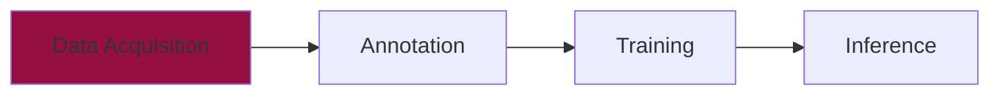

# Data Acquisition


???+ info "Used Task"
    In the following sections we will train a YOLO model for the task of [object detection](../index.md#detection). If you want to train a YOLO model for a different task (Segmentation, Keypoint Extraction, etc.), the process is quite similar. At some point you will need to make some changes to the annotation and the configuration file.


After learning about different computer vision tasks with YOLO, you might want to train your own model for specific use cases. The first step in training a custom YOLO model is acquiring a suitable dataset. A well-curated and diverse dataset is key to achieving high performance and generalization in computer vision tasks. This chapter will guide you through various methods of collecting training data.

We'll start by adding a new folder for our dataset and a new Jupyter notebook for data acquisition:

```plaintext hl_lines="3 4"
📁 yolo_training/
├── 📁 .venv/
├── 📁 rawdata/
└── 📄 data_acquisition.ipynb
```

## The Need for Data :material-database:

Training an effective YOLO model requires a substantial amount of data. Here's why:

- **Better Generalization**: A diverse dataset helps the model learn features that generalize to new, unseen data.
- **Handling Variability**: Capturing different lighting conditions, perspectives, and object appearances ensures robust performance.
- **Avoiding Overfitting**: A small dataset can cause the model to memorize specific examples rather than learning general patterns, leading to overfitting.

The amount of data needed depends on several factors like **Task Complexity**, **Required Accuracy**, **Object Variation** and **Background Variation**

| Task Complexity | Recommended Images |
|-----------------:|:-------------------|
| Simple (e.g., logo detection) | 100 - 2,000 |
| Moderate (e.g., car types) | 2,000 - 10,000 |
| Complex (e.g., defect detection) | 5,000 - 20,000+ |

Building a large dataset can be a challenging task, but there are several strategies to gather the required data efficiently. 
When collecting your dataset think about the following best practices:

???+ tip "Best Practices for Data Collection"

    1. **Diversity**
        - Include negative samples (no object)
        - Vary lighting conditions
        - Include different backgrounds
        - Capture different angles

    2. **Quality Control**
        - Check image resolution
        - Remove blurry images
        - Ensure correct labeling
        - Verify class balance

    3. **Organization**
        - Use clear folder structure
        - Maintain consistent naming

## Automatic Image Collection :material-image:

With this knowledge in mind, we can start to collect images for our training dataset. Web scraping can be used to download large amounts of images for training datasets. Python libraries like `requests` and `BeautifulSoup` are common tools for this purpose. An even more comfortable way is to use an API of a search engine like **Bing :material-microsoft-bing:**, **Google :material-google:** or **DuckDuckGo :simple-duckduckgo:**. 

The [`ImageEngine`](https://pypi.org/project/ImageEngine/) package can be used to search all three search engines at ones. 
You can run a search :simple-searxng: with just a couple of lines: 

```python
from ImageEngine import searchDDG       # Only search DDG
from ImageEngine import searchBing      # Only search Bing
from ImageEngine import searchGoogle    # Only search Google
from ImageEngine import searchWeb       # Search all three engines

# Search images from DuckDuckGo
# "Homer Simpson" is the search string and "homer" is the directory where images will be stored
searchDDG(term="Homer Simpson", path="rawdata/homer", max_images=5)
# Search images from Bing
searchBing(term="Marge Simpson ", path="rawdata/marge", max_images=5)
# Search images from Google
searchGoogle(term="Bart Simpson", path="rawdata/bart", max_images=5)
# Search images from all three engines
searchWeb(term="Lisa Simpson", path="rawdata/lisa", max_images=5)

```

### Data Cleaning Tips

After downloading, it's important to clean your dataset by going through the following steps:

???+ tip "Dataset Cleaning Checklist"
    - [ ] Check copyright restrictions (if you plan to use the model for commercial purposes)
    - [ ] Remove corrupted images
    - [ ] Remove duplicates
    - [ ] Verify image quality
    - [ ] Check image relevance
    - [ ] Ensure consistent format (not allways needed)


Those steps can be done manually by looking through the pictures. Finding duplicates and corrupted images can also be automated by using this custom function

??? code "Remove Corrupted Images and Duplicates"

    ```python
    import os
    from PIL import Image
    import hashlib

    def clean_dataset_by_subfolder(directory):
        """
        Cleans all subfolders in 'directory' by removing corrupted files and
        duplicates *only* within each subfolder.

        Args:
            directory (str): Path to a top-level directory that contains subfolders.
        """
        # 1) Loop through all entries in the top-level directory
        for entry in os.listdir(directory):
            subpath = os.path.join(directory, entry)

            # Check if the entry is a directory (i.e., a subfolder)
            if os.path.isdir(subpath):
                print(f"\n--- Checking subfolder: {subpath} ---")

                # Create a new hash dictionary for each subfolder
                hash_dict = {}

                # 2) Recursively walk through all files in the subfolder
                for root, dirs, files in os.walk(subpath):
                    for filename in files:
                        filepath = os.path.join(root, filename)

                        try:
                            # Attempt to open the image file
                            with Image.open(filepath) as img:
                                # Compute the MD5 hash of the image bytes
                                img_hash = hashlib.md5(img.tobytes()).hexdigest()

                                # Check if this hash already exists (i.e., a duplicate)
                                if img_hash in hash_dict:
                                    print(f"Removing duplicate: {filepath}")
                                    os.remove(filepath)
                                else:
                                    # If not a duplicate, store it in the dictionary
                                    hash_dict[img_hash] = filepath

                        except Exception as e:
                            # If there's any error (e.g., corrupted file), remove it
                            print(f"Removing corrupted file {filepath}: {e}")
                            os.remove(filepath)

    # Example call, if 'dataset/homer' contains multiple subfolders
    clean_dataset_by_subfolder("data")

    ```

???+ question "Task: Download Images"
    Now it's your turn. We want to collect images of different Euro notes. 

    - Try to use the `ImageEngine` package to download 100 suitable images of a `5€` and a `10€` note and save them into the folder `rawdata/five` and `rawdata/ten` (in total 200 images).
    - Go through the data cleaning checklist (you can use the function from above)

    <figure markdown="span"> {width=60% }</figure>


## Video Frame Extraction :material-video:

Another effective way to collect a vast amount of images is by extracting and saving each single frame from a video :material-video:. This video can be a live stream from the webcam or a saved video from your hard drive. There are some benefits of using video data:

- **Efficiency**: Videos can capture many frames in one recording session, saving time compared to capturing individual photos.
- **Diverse Scenarios**: Recording videos in various environments ensures that frames capture different conditions and perspectives.

### Frame Extraction

We already introduced OpenCV in the [previous chapter](../video/index.md#complete-program). We can use this package to access the video (saved or webcam) and instead of showing the image, we can save it as an image in a folder

```python
cv2.imwrite(f'rawdata/video/frame_{frameNr}.jpg', frame)
```
???+ info "Unique File Name"
    `frameNr` is simply a **frame counter**. It starts at 0 before entering the loop and increments by 1 every time a frame is successfully read from the video. This counter is used to give each extracted frame a unique filename (e.g., `frame_0.jpg`, `frame_1.jpg`, etc.).

???+ question "Task: Frame Extraction"
    Now we continue from before and try to collect data by recording a video of Euro notes.
     
    - Record a video of a `5€` and a `10€` note. The video should be at least 25 seconds long and including the following parts:
        - `5€` note in different angles
        - `10€` note in different angles
        - `5€` and `10€` note together in different angles
        - negative samples (no note in the frame)
    - You can use the `VideoCapture` function of OpenCV from the previous chapter and add `imwrite` to save (and not only show) the frames. Save each 4th frame seperately in the folder `rawdata/video`.
    - Keep the recording guidelines in your mind.

    <figure markdown="span"> {width=60% }</figure>

## What's Next?

After collecting the data, the next step is to annotate it with labels or bounding boxes for training the model. Continue to the next section, [Image Annotation](annotation.md), to learn how to prepare your dataset for training!


