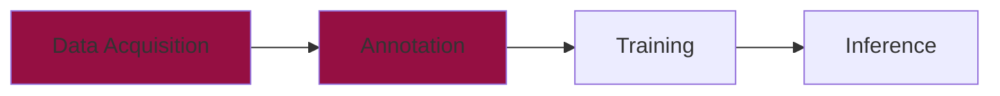
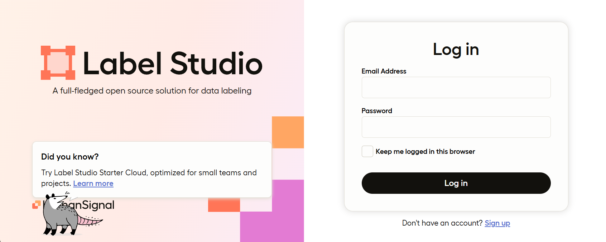
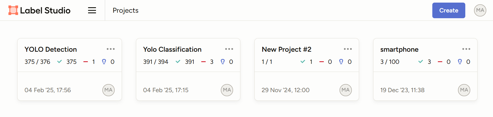
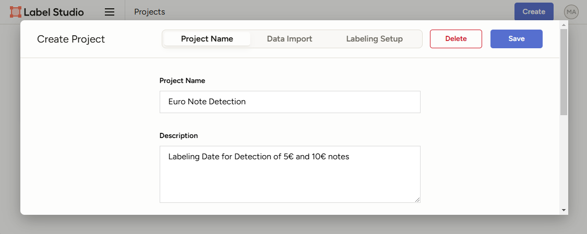
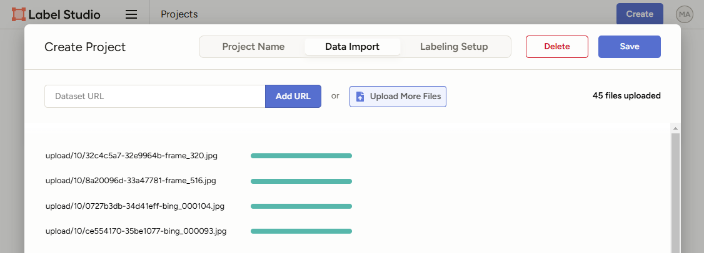
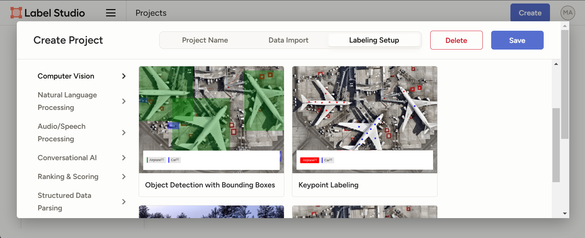
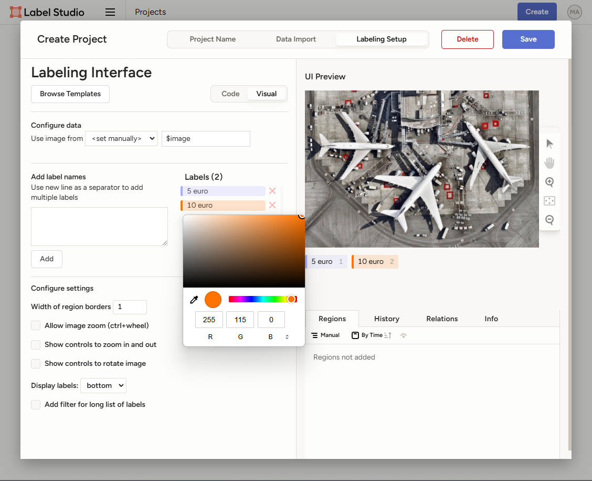
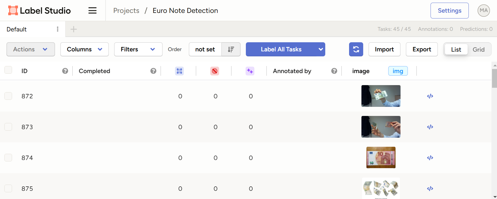
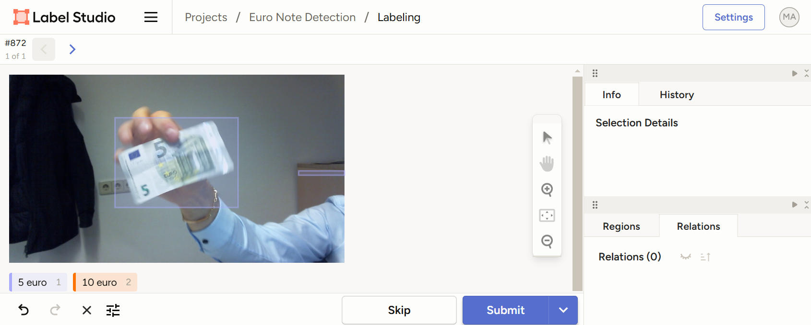

# Image Annotation



Now that we've collected a dataset, the next step is **image annotation** - marking objects in images so that our model knows what to learn. Without properly labeled data, even the most advanced models won't be able to correctly detect objects.

There are many tools for image annotation like [Label Studio](https://labelstud.io/), [Roboflow](https://roboflow.com/), [CVAT](https://www.cvat.ai/), and more. Each tool has its own features and advantages. In this chapter, we'll explore **Label Studio**, which is open-source and can be easily installed on your computer. Therefore your data stays on your own computer and you don't need to open your dataset to the public.

---

## What is Annotation? 🏷️  

**Annotation** in computer vision is the process of **labeling data** so that a machine learning model can understand what to learn. In the case of object detection, annotation involves marking objects in images by drawing **bounding boxes** around them and assigning labels to specify what they represent.

### Why is Annotation Important?  
For a model to recognize objects, it needs **examples** to learn from. Annotation provides these examples by telling the model:  

- [x]  **What objects exist in the image?**  
- [x]  **Where are they located?**  
- [x]  **Which category do they belong to?**  

For example, if we're training a model to recognize euro notes, we need to **manually label** images by drawing boxes around `5€` and `10€` notes, so the model can later detect them automatically. 

???+ tip "Commercial Tools"
    Annotation is a time-consuming  process, which is why commercial tools like [Roboflow](https://roboflow.com/) with AI assistance are becoming more popular. Furthermore, there are companies that offer annotation services, which can be a good option if you don't have the time or resources to annotate the data yourself.


### Types of Annotations in Computer Vision  
| Annotation Type  | Description | Example |
|-----------------|-------------|---------|
| **Bounding Boxes** | Draw rectangular boxes around objects | Detecting a euro note |
| **Polygons** | Outline objects with irregular shapes | Annotating a curved object |
| **Keypoints** | Mark specific points | Facial feature detection |
| **Segmentation Masks** | Assign pixel-level labels | Separating an object from the background |


💡 **Think of annotation as teaching a model how to "see" by giving it labeled examples!**

---

## Annotation with Label Studio

### Step 1: Install Label Studio

Label Studio runs as a web application on your computer. We already installed it in the [introduction](../index.md) chapter. To start Label Studio, simply run the following command in your terminal:

```bash
label-studio
```

This will open **Label Studio in your browser** at `http://localhost:8080/` 

<figure markdown="span"> {width=60% }</figure>

???+ info "Label Studio Port"
    Sometimes the default port is already taken, then a new one is chosen automatically.

    ```bash
    *** WARNING! ***
    * Port 8080 is in use.
    * Trying to start at 8081
    ****************
    ```

---

### Step 2: Sign Up & Log In

To use Label Studio, you need to sign up first. You can do this by clicking on **Sign Up** under the login button.
After signing up, you can login with your new credentials.

<figure markdown="span"> {width=100% }</figure>

---

### Step 3: Setting Up a New Annotation Project

#### Step 3.1: Create a New Project

Once Label Studio is running:

1. Click **Create** (upper right corner).
2. Enter a **Project Name** (e.g., "Euro Note Detection") and **Description** if you want.

<figure markdown="span"> {width=100% }</figure>
---

#### Step 3.2: Uploading Your Images

Now we need to upload the images we've collected before. Label Studio supports multiple ways to do this:

- **Upload from your computer**: Drag and drop images.
- **Load from a folder**: Connect a dataset directory.
- **Use a cloud storage provider**: Connect AWS S3, Google Cloud, or other services.

To upload the data by drag and drop:

1. Click **Data Import** in your 'Create Project' module.
2. Select your **collected euro note images** (from `rawdata/five`, `rawdata/ten`, and `rawdata/video`) and drag and drop them into the upload area.

???+ info "Uploading Data"
    Label Studio only allows to drag and drop 100 images at a time. If you have more than 100 images, you need to drag and drop them in batches. 

    Furthermore, you can also upload images after the project is created. Therefore open your project and click on the **Import** button in the upper right corner.

<figure markdown="span"> {width=100% }</figure>

---

#### Step 3.3: Labeling Setup

The last step in the project setup ist to configure the labeling interface (define, what we want to label). There are a bunch of different templates available. In our example we want to label euro notes with bounding boxes for detection.

1. Click **Labeling Setup** in your 'Create Project' module.
2. Select **Object Detection with Bounding Box** in the **Computer Vision** section.
3. Define your object labels in the **Labeling Interface** by adding the labels you want to label:
    - `5 euro`
    - `10 euro`
4. You should also change the colors of the labels to make them more visible. Therefore click on the label once you added it and click on the color picker.
5. Save the settings.

<figure markdown="span"> {width=100% }</figure>
<figure markdown="span"> {width=100% }</figure>


???+ info "Project Setup"
    You can always change the labeling interface later, if you want to label different objects or use a different annotation type. Therefore open your project and click on the **Setting** button in the upper right corner.

---

### Step 4: Annotating Your Images

Now we are all set and we can start labeling:

1. In your project landing page click on the **Label All Tasks** button.
2. Select the **bounding box tool** (`5 euro` or `10 euro`) from below the image.
3. Draw a box around each note in the image.
5. Click **Submit** and move to the next image (even if no note is in the image, click on **submit** and NOT **skip**).

???+ tip "Labeling Tips"
    - Use the shortcuts for the bounding box tool. E.g. `1` for `5 euro` and `2` for `10 euro`. The corresponding shortcut is shown besids the label name.
    - Be consistent in your labeling to ensure high-quality training data.
    - You can always undo your last action by clicking on the **Undo** button.

<figure markdown="span"> {width=100% }</figure>
<figure markdown="span"> {width=100% }</figure>

---

### Step 5: Exporting Annotations for YOLO Training

Once all images are labeled, export your annotations in a format compatible with YOLO:

1. Click **Export** in your project landing page.
2. Select **YOLO** (`.txt` files).
3. Download the exported dataset.


---

Congratulation 🎉, you have just annotated your first dataset!

<figure markdown="span">
  {width=70% }
  <figcaption>(Source: <a href="https://imgflip.com/memegenerator">Imgflip Meme Generator</a>) </figcaption>
</figure>


## Annotation Format
Once you have downloaded the exported dataset, you can use it to train your YOLO model. But first, let's take a look at the annotation format.

After the export, Label Studio will hand over a zip file with two folders: `images` and `labels` as well as a `notes.json` and a `classes.txt` file. The folders contain the annotated images (`images/`) and the corresponding annotations in YOLO format (`labels/`). 
We will copy those folders into our project folder. 

```plaintext hl_lines="4 5 6"
📁 yolo_training/
├── 📁 .venv/
├── 📁 rawdata/
├── 📁 annotations/
|   ├── 📁 images/
|   └── 📁 labels/
└── 📄 data_acquisition.ipynb
```

We will then navigate to `annotations` and open the `labels` folder. Inside this folder, you will find a text file for each image. Each text file contains the annotation in the [YOLO format](https://docs.ultralytics.com/datasets/detect/#ultralytics-yolo-format) like:
```
0 0.5029612756264237 0.5018223234624145 0.9858769931662869 0.980410022779043
```

The structure of the annotation can be described as follows:
```
<CLASS_ID> <X_CENTER> <Y_CENTER> <WIDTH> <HEIGHT>
```

For our example the class ID is `0` for `five_euro` and `1` for `ten_euro`. This information can be looked up in `notes.json` in the zip file. The coordinates are the normalized center of the bounding box and the width and height of the bounding box relative to the image size (xywh format).

???+ warning "Labels / Images"
    It is important to note, that the for each image there needs to be a corresponding label file with the same name. For example, if you have an image `images/image_1.jpg`, there needs to be a label file `labels/image_1.txt`.

???+ question "Task: YOLO Format"
    Take a closer look at the label file for an image where both - a `5€` and a `10€` note - are present. What do you observe? How is the label file structured?
    


## Next Steps

Now that you have **annotated data**, you're ready to [train](training.md) your YOLO model! In the next chapter, we'll explore how to **train YOLO with your labeled dataset**.