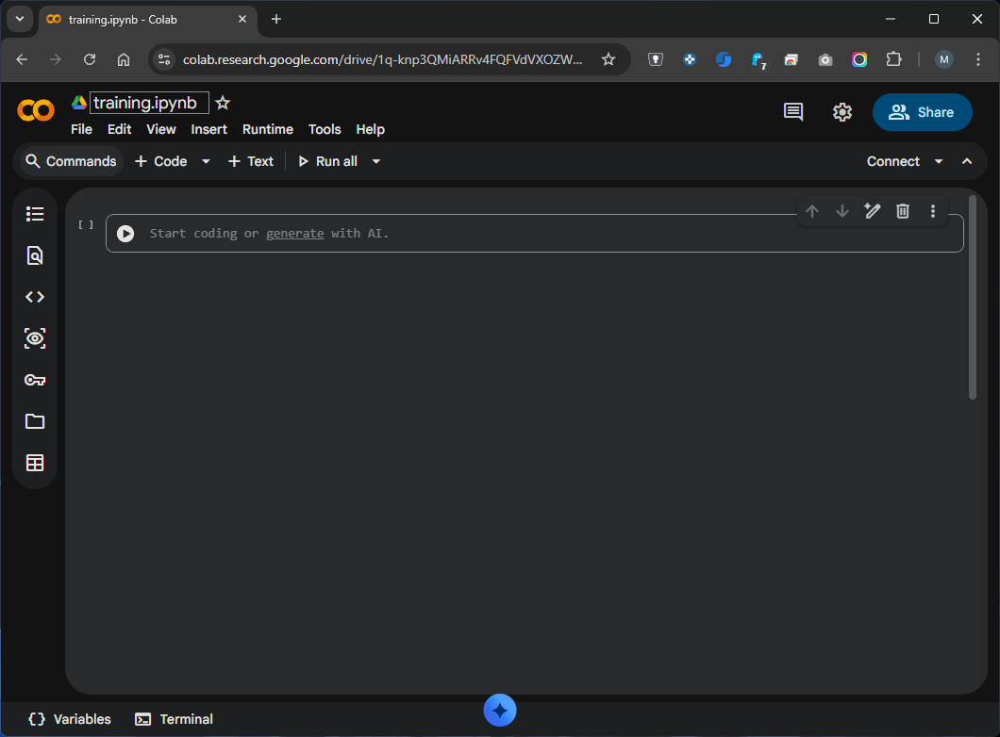
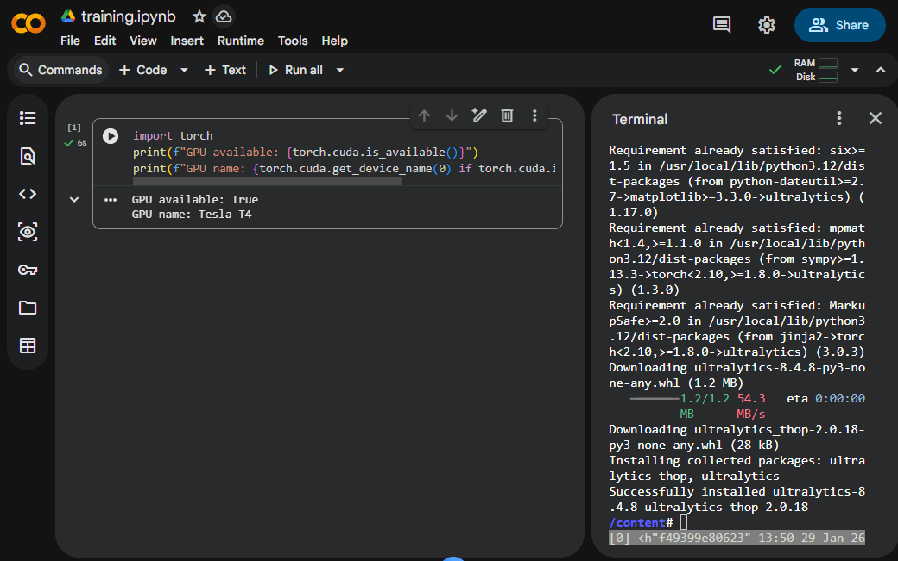
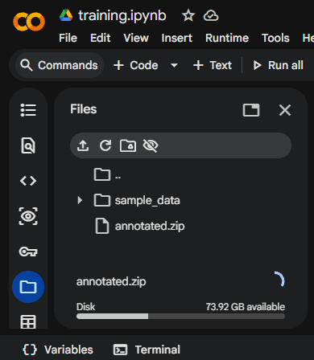

# Bonus: Training on Google Colab

<figure markdown="span">
  { width="250" }
</figure>


Training a YOLO model can be computationally demanding, especially when working with large datasets or running multiple training iterations. This bonus chapter explains how to use **Google Colab** as an alternative to local training and why cloud-based solutions can be advantageous.

---

## Why Use Cloud-Based Training?

Training machine learning models locally is not always practical. Most laptops and desktop computers do not have a dedicated GPU suitable for deep learning. Training on a CPU can take **10-50 times longer** than on a GPU. For our Euro note detection model, what takes 5 minutes on a GPU could take over an hour on a CPU.

While local training on GPU is possible, it requires a lot of setup and maintenance. You need to install the CUDA driver, cuDNN libraries, PyTorch with CUDA support, and manage dependency conflicts. Google Colab comes **pre-configured** with all necessary deep learning libraries and GPU drivers. You can start training within minutes without any installation hassle.

Local development still has advantages in some scenarios:

- **Data privacy**: Sensitive data should not be uploaded to cloud services
- **Large datasets**: Uploading/downloading gigabytes of data can be slow
- **Long training runs**: Free Colab sessions have time limits (~12 hours)
- **Production deployment**: Final models often need local testing

After we have already learned how to train a YOLO model locally, we will now use Google Colab to train our model.

---

???+ info "Video Tutorial"
    If you prefer a visual guide, here is a video tutorial on how to train a YOLO model on Google Colab:

    <div style="text-align: center;">
        <iframe width="560" height="315" src="https://www.youtube.com/embed/r0RspiLG260?start=465" title="YouTube video player" frameborder="0" allow="accelerometer; autoplay; clipboard-write; encrypted-media; gyroscope; picture-in-picture; web-share" referrerpolicy="strict-origin-when-cross-origin" allowfullscreen></iframe>
    </div>

## Google Colab
### Setup

Navigate to [Google Colab](https://colab.research.google.com/) and sign in (right upper corner) with your Google account. Create a new notebook by clicking **New notebook**.

On the top left you see the name of the current notebook. You can also change the name by clicking on it and typing a new name.

<figure markdown="span"> {width=100% }</figure>

By default, Colab uses a CPU to run your code. To enable GPU acceleration - which is the reason we are using Colab in the first place - you need to change the runtime type to a GPU runtime. Therefore:

1. Go to **Runtime > Change runtime type**
2. Select **T4 GPU** (or any available GPU option)
3. Click **Save**

<figure markdown="span"> {width=60% }</figure>

You can verify the GPU availability by running the following code in a new code cell in colab:

```python
import torch
print(f"GPU available: {torch.cuda.is_available()}")
print(f"GPU name: {torch.cuda.get_device_name(0) if torch.cuda.is_available() else 'N/A'}")
```

<div class="grid cards" markdown>

-   :white_check_mark: __Correct Setup__

    ---

    ```title=">>> Output"
    GPU available: True
    GPU name: Tesla T4
    ```

-   :x: __Faulty Setup__

    ---

    ```title=">>> Output"
    GPU available: False
    GPU name: N/A
    ```


</div>

The last setup step is to install the YOLO library. There are two ways to do this:

=== "Terminal"

    To install the YOLO library, you can use the terminal (left button of the page) by running the following command:
    
    ```bash
    pip install ultralytics
    ```

    <figure markdown="span"> {width=100% }</figure>

=== "Inline Code"

    You can also install the YOLO library by running the following code in a new code cell in colab:
    
    ```python
    !pip install ultralytics
    ```

    Note that the `!` is used to run shell commands in the terminal.

---

### Preparing the files

Before training, you need to upload your dataset and the configuration file to Colab. There are multiple options available to do this, like mounting Google Drive (especially for larger datasets), or downloading from an URL link. We take a closer look on the easiest option: to directly upload the files to the Colab session.

On the left side of colab you see the files icon :material-folder-outline:. By clicking on it, something like a file explorer will open. We can now upload the files by simply dragging and dropping the files into this area. In our case, we want to upload the `annotations` folder and the `config.yaml` file. For both we need to make small changes compared to the local training.

Since the upload only allows files, the `annotations` folder can not be uploaded directly. Therefore we need to create a zip file (here called `annotated.zip`) of the folder and upload this file instead.
The upload can take a few minutes. The progress is shown in the bottom of the file explorer.

<figure markdown="span"> {width=60% }</figure>

In order to unzip the file, we need to run the following code in a new code cell in colab:

```python
# Unzip images to a custom data folder
!unzip -q /content/annotated.zip -d /content/dataset
```

After the unzipping, the `annotations` folder should be available in the file explorer.

???+ warning "Session Storage"
    Files uploaded directly to Colab are **temporary** and will be deleted when the session ends. Use Google Drive for persistent storage.


The second file we need to upload is the `config.yaml` file. We already created this file in the [training chapter](training.md#configuration-file). We need to make small changes to the dataset path.

```yaml hl_lines="2"
# Data
path: '/content/dataset' # path to your project folder
train: images/train # train images (relative to 'path')
val: images/val # val images (relative to 'path')
#test: # test images (optional) (relative to 'path')

nc: 2 # number of classes

# Classes
names:
  0: 10euro # Name of the Object
  1: 5euro
```

After uploading both things - the annotations and the config file - we are ready to start training.

---

### Training in Colab

Now you can train your model exactly as you would locally:

```python hl_lines="10"
from ultralytics import YOLO

# Load a pre-trained model
model = YOLO('yolov8n.pt')

# Train the model
results = model.train(
    data='/content/config.yaml',
    epochs=10,
    device=0  # Explicitly tells YOLO to use the GPU
)
```

???+ info "Time Consumption"
    Some self-performed tests to train the model for 10 epochs on ~300 images showed the following time consumption: 

    - locally on a CPU (in this case an Intel Core i9-12900): ~8.5 minutes.
    - locally on a GPU (in this case a NVIDIA GeForce RTX 3060): ~1.5 minutes.
    - in Colab on a Tesla T4 GPU: ~1.5 minutes.

    What we can see here is that the performance of the training depends massively on the hardware. If you are not in possession of a GPU, it is a good idea to use Colab to train your model.


### Working with the results

After the training is finished, we can work with the results just as we did locally. In the Colab file explorer you can see the `runs` folder with the same results as explained in the [training chapter](training.md#training-results).
Everything - including the model weights - can be downloaded by right clicking on the file and selecting "Download".

How to download all files? You can use the following code in a new code cell in Colab:

```bash
!zip -r runs.zip runs/detect/trainX
```

This will create a zip file of the `runs/detect/trainX` folder which you can then download by right clicking on the file and selecting "Download".


Now you are all set! You can download your model and try to start the [inference process](inference.md).

---


???+ success "🎉 Congratulations"
    You have now trained your own YOLO model on Google Colab. If you to not have a GPU, this is a really good way to speed up the training process.

    <div style="text-align: center; display: flex; flex-direction: column; align-items: center; margin-bottom: 2rem;">
    <div class="tenor-gif-embed" data-postid="12090663477161380777" data-share-method="host" data-aspect-ratio="1" data-width="50%"><a href="https://tenor.com/view/going-fast-fast-riding-fast-riding-fast-bike-gif-12090663477161380777">Going Fast Riding Fast GIF</a>from <a href="https://tenor.com/search/going+fast-gifs">Going Fast GIFs</a></div> <script type="text/javascript" async src="https://tenor.com/embed.js"></script>
        <figcaption style="margin-top: 0.5rem;"><i>"Hold on tight!"</i></figcaption>
    </div>
