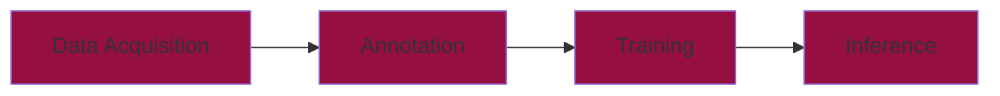

# Inference

``` mermaid
graph LR
  A[Data Acquisition]:::active --> B[Annotation];
  B:::active --> C[Training];
  C:::active --> D[Inference]:::active;
  click A "../acquisition" _self
  click B "../annotation" _self
  click C "../training" _self
  click D "../inference" _self
  classDef active fill:#950f42
```

