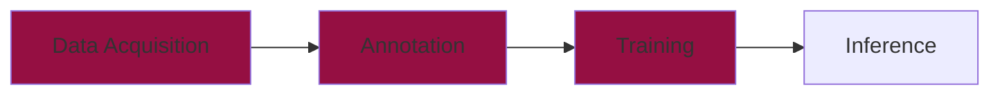

# Training




Now that we have collected and annotated our dataset, it's time to train our very own **YOLO** model. This chapter will guide you through the complete **training process**, from setting up the configuration file to interpreting results and fine-tuning the model.  

---

## Preparation

Before we can start the training of the model, we need to get a few things done. 


### 📂 Dataset Structure

In machine learning, datasets are divided into:

- **Training Set** (Train) → Used to teach the model by adjusting its parameters.
- **Validation Set** (Val) → Used to evaluate how well the model is learning.
- **Test Set** (Test) → Used to test the model after training.

Both the training and the validation set are passed to the training algorithm in advance. The model is then trained using the training set and then validated using the validation set. 
The results of the validation are then used to optimize the hyperparameters of the model. Furthermore, the results are saved and can be used for further analysis. We will look at this topic in more detail a little later.
The test dataset is then used to test the performance of the model in real-world use. In our case, we will not use this data set and instead record new images via webcam to test the performance of our model in the [inference chapter](./inference.md).

<figure markdown="span">
  {width=70% }
  <figcaption>(Source: <a href="https://algotrading101.com/learn/train-test-split/">AlgoTrading101</a>) </figcaption>
</figure>


A typical split ratio which is used in the machine learning community is **80% for training** and **20% for validation**. We split our dataset by moving the images and the corresponding labels into a `train` and `val` folders.

``` hl_lines="4 5 7 8"
📁 yolo_training/
└── 📁 annotations/
    ├── 📁 images/
    |   ├── 📁 train/
    |   └── 📁 val/
    └── 📁 labels/
        ├── 📁 train/
        └── 📁 val/
```

???+ warning "Splitting Images and Labels"
    It is important to note, that the images and labels need to be split in the same way. For example, if you want to use the image `image_1.jpg` for training, you need to copy the label `image_1.txt` in the trainging folder as well.


### 📝 Configuration File

Now that we have the data in the correct structure, we can create a **configuration file** that tells YOLO where to find the dataset and how to train the model. This file contains the following information:  

- **Dataset paths** – Where the images and annotations are stored.  
- **Class labels** – The names of the object categories.  

The easiest way to create the configuration file is to use the `config.yaml` file and save it in the `yolo_training` folder.

```yaml
# Data
path: C:/path/to/your/project_folder/annotated # path to your project folder
train: images/train # training images (relative to 'path')
val: images/val # validation images (relative to 'path')
#test: # test images (optional) (relative to 'path')

# Classes
names:
  0: Class1 # Name of the Object # (1)!
  1: Class2
```

1. The class numbers are defined in the `notes.json` file from the annotation chapter.


---

## Starting the Training Process  

Once we have our dataset and configuration ready, we can start training the YOLO model.  

### 🚀 Running YOLO Training  

First, install YOLOv8 (if you haven't already):  

```bash
pip install ultralytics
```

Then, run the training command:  

```python
from ultralytics import YOLO

# Load the YOLO model
model = YOLO("yolov8n.pt")  # Start with a pre-trained YOLOv8 model

# Train the model on the dataset
results = model.train(data="config.yaml", epochs=50, imgsz=640)
```

### 🔧 Key Training Parameters:  
- `data="config.yaml"` – Specifies the dataset configuration file.  
- `epochs=50` – Defines the number of training cycles (adjustable).  
- `imgsz=640` – Resizes images to 640x640 for training.  
- `yolov8n.pt` – Uses YOLOv8's small pre-trained model as a starting point.  

Training will take some time, depending on the dataset size and hardware.

---

## 3️⃣ Learning About Metrics  

After training, we need to **evaluate** our model’s performance using key **metrics**. Let’s break them down:

### 📊 Key Object Detection Metrics  

| Metric          | Meaning |
|----------------|---------|
| **Loss**       | Measures how much the model's predictions differ from the actual labels. |
| **Precision**  | How many detected objects were actually correct? |
| **Recall**     | How many actual objects were correctly detected? |
| **mAP (mean Average Precision)** | A combined measure of **precision & recall** over all object classes. |

### 🔍 Understanding the Metrics  

✅ **Precision**: Of all the detections, how many were correct?  
✅ **Recall**: Of all the objects that should have been detected, how many were found?  
✅ **mAP**: A **summary score** that considers both **precision** and **recall**.  

💡 **A good YOLO model should have high precision, recall, and mAP.**

---

## 4️⃣ Interpreting the Results  

Once training is complete, YOLO provides **metrics and plots** to help analyze performance.

Run the following command to display the results:

```python
import matplotlib.pyplot as plt

# Load training results
results = model.load("runs/detect/train")

# Show training curves
results.plot()
plt.show()
```

🔎 **What to look for?**
- **Loss decreasing** → The model is learning properly.  
- **High mAP (~0.5 or higher)** → Good object detection performance.  
- **Balanced precision and recall** → Model detects objects correctly without too many false positives or negatives.

---

## 5️⃣ Fine-Tuning the Model  

If your model isn't performing well, you can **fine-tune** it by adjusting key parameters.

### 🔧 Things to Try:

1️⃣ **Increase the number of epochs**:
   - Try training for `100+` epochs instead of `50`.
   - Example:  
     ```python
     model.train(data="config.yaml", epochs=100)
     ```

2️⃣ **Use a larger YOLO model**:
   - Instead of `yolov8n.pt` (small model), try `yolov8m.pt` or `yolov8l.pt` (medium/large models).
   - Example:  
     ```python
     model = YOLO("yolov8m.pt")  # Medium model
     ```

3️⃣ **Improve data augmentation**:
   - Apply **random flips, rotations, or brightness adjustments** to your dataset.
   - This helps the model **generalize** better.

4️⃣ **Train on a larger dataset**:
   - More labeled images can significantly boost performance.
   - Try adding **more angles, backgrounds, and lighting conditions**.

---

## ✅ Next Steps  

After fine-tuning, you can **test your trained YOLO model** on new images or videos!  

```python
# Run inference on a test image
results = model("test_image.jpg", show=True)
```

Now you have a fully trained **custom YOLO model**! 🚀

---

🔜 **Up Next: Model Deployment & Real-World Testing** 🎯