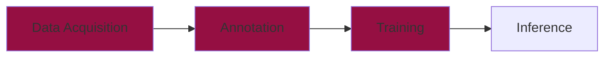
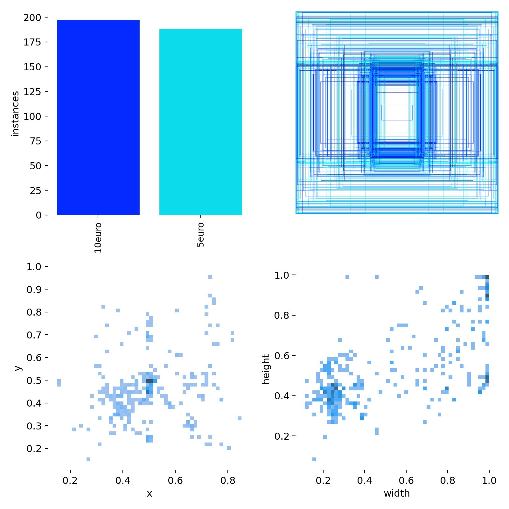
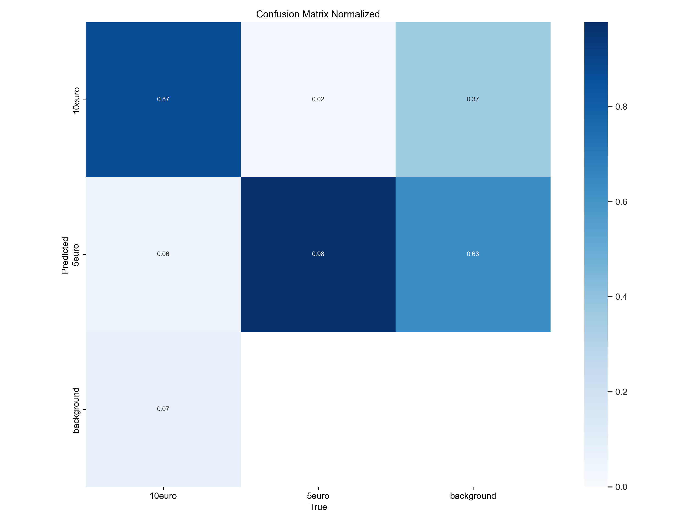
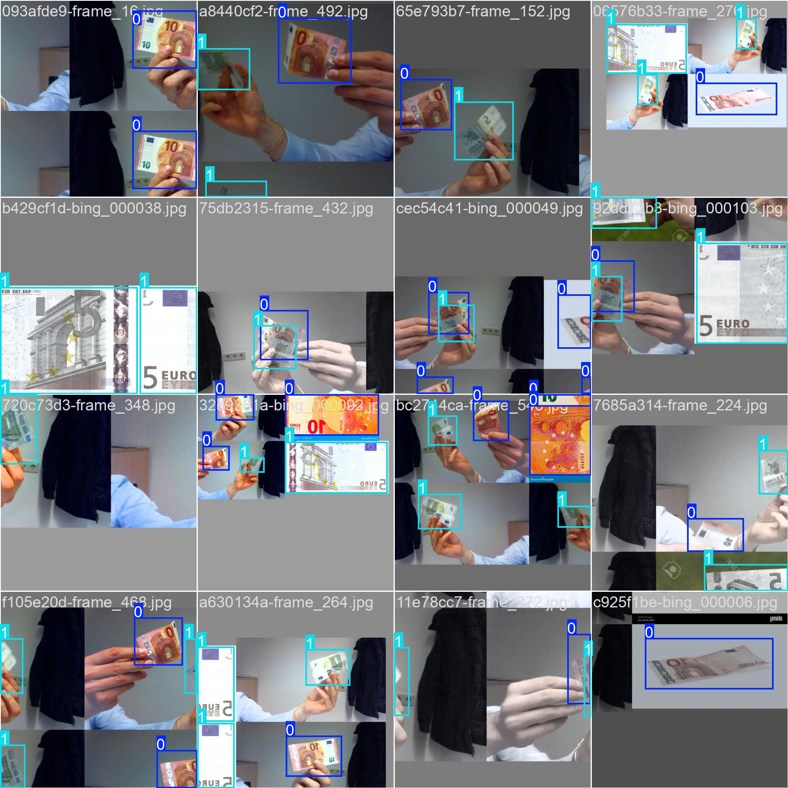
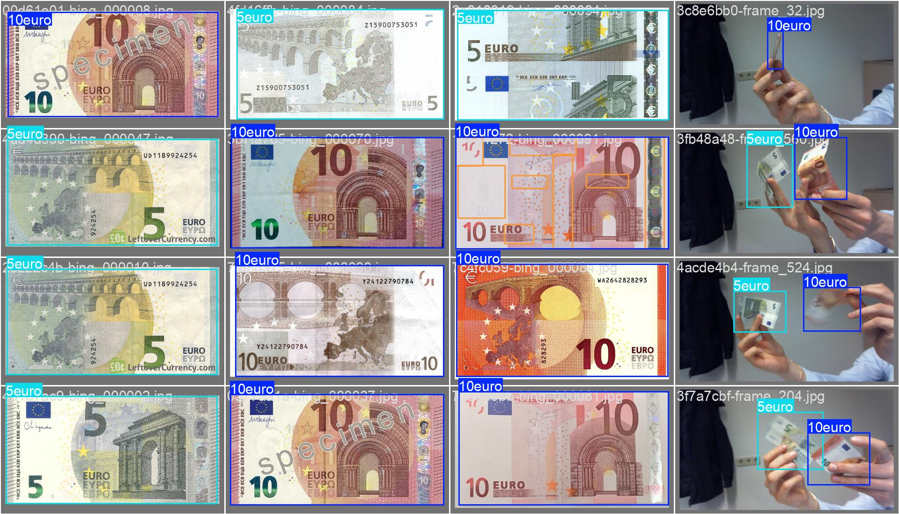
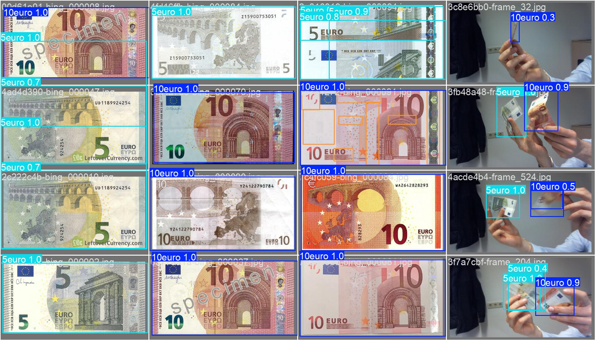
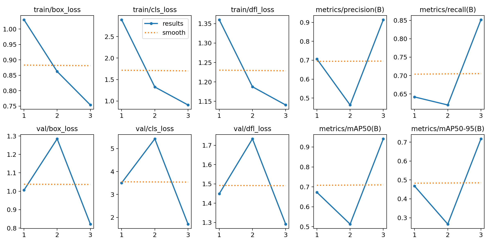
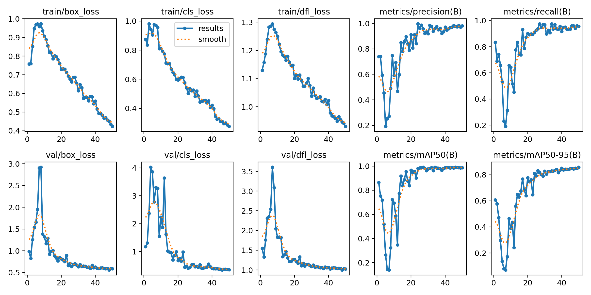

# Training




Now that we have collected and annotated our dataset, it's time to train our very own **YOLO** model. This chapter will guide you through the complete **training process**, from setting up the configuration file to interpreting results and fine-tuning the model.  

---

## Preparation

Before we can start the training of the model, we need to get a few things done. Add the following files and folders to your project folder:

```plaintext hl_lines="6 7 9 10 11 13"
📁 yolo_training/
├── 📁 .venv/
├── 📁 rawdata/
├── 📁 annotations/
|   ├── 📁 images/
|   |   ├── 📁 train/
|   |   └── 📁 val/
|   └── 📁 labels/
|       ├── 📁 train/
|       └── 📁 val/
├── 📄 config.yaml
├── 📄 data_acquisition.ipynb
└── 📄 training.ipynb
```


### Dataset Structure

In machine learning, datasets 📂 are divided into:

- **Training Set** (Train) → Used to teach the model by adjusting its parameters.
- **Validation Set** (Val) → Used to evaluate how well the model is learning.
- **Test Set** (Test) → Used to test the model after training.

Both the training and the validation set are passed to the training algorithm in advance. The model is then trained using the training set and then validated using the validation set. 
The results of the validation are then used to optimize the hyperparameters of the model. Furthermore, the results are saved and can be used for further analysis. We will look at this topic in more detail a little later.
The test dataset is then used to test the performance of the model in real-world use. In our case, we will not use this data set and instead record new images via webcam to test the performance of our model in the [inference chapter](./inference.md).

<figure markdown="span">
  {width=70% }
  <figcaption>(Source: <a href="https://algotrading101.com/learn/train-test-split/">AlgoTrading101</a>) </figcaption>
</figure>


A typical split ratio which is used in the machine learning community is **80% for training** and **20% for validation**. We split our dataset by moving the images and the corresponding labels into the newly created `train` and `val` folders.

???+ warning "Splitting Images and Labels"
    It is important to note, that the images and labels need to be split in the same way. For example, if you want to use the image `image_1.jpg` for training, you need to copy the label `image_1.txt` in the trainging folder as well.


### Configuration File

Now that we have the data in the correct structure, we can create a **configuration file** 📝 that tells YOLO where to find the dataset and how to train the model. This file contains the following information:  

- **Dataset paths** – Where the images and annotations are stored.  
- **Class labels** – The names of the object categories.  

The easiest way to create the configuration file is to use the before created `config.yaml` file.

```yaml
# Data
path: C:/path/to/your/yolo_training/annotations # path to your project folder
train: images/train # training images (relative to 'path')
val: images/val # validation images (relative to 'path')
#test: # test images (optional) (relative to 'path')

nc: 2 # number of classes

# Classes
names:
  0: Class1 # Name of the Object # (1)!
  1: Class2
```

1. The class numbers are defined in the `notes.json` file from the annotation chapter. The Names (here `Class1` and `Class2`) are arbitrary and can be chosen freely.

???+ question "Task: Preperation"
    Adjust the configuration file for our specific project (Euro Note Detection) and your specific path structure


---

## Training Process

Once we have our dataset and configuration ready, we can start training our own YOLO model. Therefore we will use the `training.ipynb` notebook.

### Running YOLO Training  

As with the use of pre-trained models, the training process is very simple and can be carried out with just a few lines of code.


```py
from ultralytics import YOLO

# Load the YOLO model as a starting point
model = YOLO("yolov8n.pt")  # Start with a pre-trained YOLOv8 model

# Train the model on the dataset
results = model.train(data="config.yaml", epochs=3)
```

Training will take some time, depending on the dataset size, the settings and the hardware. So it's time to go for a coffee or tea and come back later.

<figure markdown="span">
{width=50% }
<figcaption>(Source: <a href="https://www.yourtango.com/2019321990/funny-coffee-memes-quotes-march-caffeine-awareness-month">YourTango</a>) </figcaption>
</figure>


### Interpreting the Output

While the training is running, you can see the progress in the terminal or right under your jupyter notebook code cell. The length of the output is quite long, so we will split it into parts. 

???+ example "Example: Training Output" 

    ??? example "1. YOLO Model and Configuration" 
        **Software & Hardware Information**

        ```
        New https://pypi.org/project/ultralytics/8.3.75 available  Update with 'pip install -U ultralytics'
        Ultralytics 8.3.74  Python-3.12.6 torch-2.3.0+cpu CPU (12th Gen Intel Core(TM) i9-12900)
        ```

        - A **newer YOLO version (8.3.75)** is available, but you are using **version 8.3.74**.
        - **Python 3.12.6** and **Torch 2.3.0** are being used.
        - The model is running on **CPU** (Intel Core i9-12900). 🚀  

        💡 **Tip:** If training speed is slow, using a **GPU** (e.g., NVIDIA CUDA) would significantly improve performance. Therefore you need to install the [CUDA driver](https://developer.nvidia.com/cuda-toolkit), update [PyTorch (CUDA Version)](https://pytorch.org/get-started/locally/) and change the YOLO settings to use the GPU (`device=0`).

        ---

        **Training Configuration**

        ```
        task=detect, mode=train, model=yolo11s.pt, data=config.yaml, epochs=3, [...], batch=16, imgsz=640, save=True
        ```

        - **task=detect** → This is an **object detection** task.  
        - **model=yolo11s.pt** → Using the **YOLO11s** model (a lightweight version).  
        - **data=config.yaml** → Loading dataset configuration from `config.yaml`.  
        - **epochs=3** → Training for **3 epochs** (a very short training session; just for getting started).  
        - **batch=16** → Processing **16 images per batch** (each training step).  
        - **imgsz=640** → Resizing images to **640x640 pixels**.  

        ✅ **This is a short test run** with just **3 epochs**. Typically, models need **50+ epochs** for better accuracy.

        ---

        **Model Architecture and Parameters**

        ```
                          from  n    params  module                                       arguments                     
          0                 -1  1       928  ultralytics.nn.modules.conv.Conv             [3, 32, 3, 2]                 
          1                 -1  1     18560  ultralytics.nn.modules.conv.Conv             [32, 64, 3, 2]       
        [...]         
        YOLO11s summary: 319 layers, 9,428,566 parameters, 9,428,550 gradients, 21.6 GFLOPs
        ```

        - Detailed information about the model architecture and each layer.
        - **319 layers** → The total number of layers in the neural network.
        - **9.4 million parameters** → These are the **trainable weights** of the model.
        - **21.6 GFLOPs** → Number of operations the model performs per second.  

        ```
        Transferred 493/499 items from pretrained weights
        Freezing layer 'model.23.dfl.conv.weight'
        ```

        - **Pretrained Weights:** The model is using a **pretrained YOLO11s model** and transferring **493 out of 499 layers**.  
        - **Layer Freezing:** Some layers are **frozen** (not updated during training), possibly to **retain knowledge from the pre-trained model**.


    ??? example "2. Dataset Information" 

        ```
        train: Scanning [...] 301 images, 25 backgrounds, 0 corrupt
        val: Scanning [...] 74 images, 3 backgrounds, 0 corrupt
        ```

        - **Training Set:** 301 images, with 25 background images (images without objects).  
        - **Validation Set:** 74 images, with 3 background images.  
        - **No corrupt images** were found (which is good!). ✅  

        ```
        Plotting labels to runs\detect\trainX\labels.jpg...
        ```

        - The **label distribution** is being visualized in a plot (`labels.jpg`).

        <figure markdown="span">
        {width=50% }
        </figure>

    ??? example "3. Training Process" 


        **Training Overview**

        For **each epoch**, the model learns and improves.

        ```
        Epoch    GPU_mem   box_loss   cls_loss   dfl_loss  Instances       Size
          1/3         0G       1.03      2.892       1.36         39        640
          2/3         0G     0.8623      1.327      1.188         47        640
          3/3         0G     0.7538     0.9084      1.141         42        640
        ```

        - **Epoch 1/3 → Epoch 3/3**: Training for **3 cycles** over the dataset.
        - **box_loss (Bounding Box Loss)**: Started at **1.03** → Decreased to **0.75** (showing improvement).
        - **cls_loss (Classification Loss)**: Decreased from **2.89** → **0.90** (model is learning to classify objects).
        - **dfl_loss (Distribution Focal Loss)**: Decreased from **1.36** → **1.14** (better bounding box predictions).
        - **Instances per batch**: Around **39-47 objects** detected in each batch of training.

        ✅ **Lower loss values = model is learning well.**

        ---

        **Evaluation on Validation Set (After Each Epoch)**  

        ???+ warning "Metrics"
            We will look at the metrics in more detail a little later in the [corresponding section](#detour-metrics). So don't worry if you don't understand the values in detail. 

        ```
        Class     Images  Instances      Box(P          R      mAP50  mAP50-95)
          all         74         98      0.707      0.642      0.672      0.468  (Epoch 1)
          all         74         98      0.463       0.62      0.513      0.266  (Epoch 2)
          all         74         98      0.914      0.852      0.941      0.717  (Epoch 3)
        ```

        - **P (Precision)**: Increased from **0.707 → 0.914** (better at correctly identifying objects).  
        - **R (Recall)**: Increased from **0.642 → 0.852** (better at detecting all objects).  
        - **mAP50 (Mean Average Precision @ IoU 0.5)**: Increased from **0.672 → 0.941** (high accuracy).  
        - **mAP50-95 (More strict accuracy metric)**: Improved to **0.717** (good performance).

        ✅ **This shows the model improved significantly by the 3rd epoch.**


    ??? example "4. Final Results & Model Saving" 

        **Training Summary**

        ```
        3 epochs completed in 0.088 hours.
        Optimizer stripped from runs\detect\trainX\weights\last.pt, 19.2MB
        Optimizer stripped from runs\detect\trainX\weights\best.pt, 19.2MB
        ```

        - Training took **0.088 hours (~5 minutes)**.
        - **Saved model weights:**
            - `last.pt` → Model at the **end of training**.
            - `best.pt` → Model with the **best performance**.


        ---

        **Running evaluation on the best model**

        ???+ warning "Metrics"
            Again, we will talk about the metrics in more detail in the [corresponding section](#detour-metrics).

        ```
        Validating runs\detect\trainX\weights\best.pt...
        ```
       

        ```
         Class     Images  Instances      Box(P          R      mAP50  mAP50-95)
           all         74         98      0.915      0.856      0.943      0.718
        10euro         48         54      0.977      0.792      0.923      0.706
         5euro         39         44      0.853       0.92      0.962       0.73
        ```

        So, how can we read this? In the following, we will focus on the results of `all` classes and look at the metrics one by one and interpret them.

        - **Precision (P = 0.915)** → 91.5% of detected objects were correct.
        - **Recall (R = 0.856)** → 85.6% of actual objects were detected.
        - **mAP@50 (0.943)** → 94.3% accuracy at a basic IoU level (good performance).
        - **mAP@50-95 (0.718)** → 71.8% accuracy with stricter evaluation.

        **Class-Specific Performance:**

        - **10€ Note:** Precision **0.977**, Recall **0.792**, mAP50 **0.923**.
        - **5€ Note:** Precision **0.853**, Recall **0.920**, mAP50 **0.962**.

        **Conclusion:**  
        - **The model is performing very well!**  
        - The **5€ note is slightly easier to detect** than the 10€ note (higher recall).  
        - **Further fine-tuning** could improve results.  

    ??? example "5. Speed Analysis" 

        ```
        Speed: 0.4ms preprocess, 70.7ms inference, 0.0ms loss, 32.6ms postprocess per image
        ```

        - **Preprocessing Time**: **0.4ms** per image.
        - **Inference Time**: **70.7ms** per image (object detection time).
        - **Post-processing Time**: **32.6ms** (final adjustments).

        💡 **This means the model takes about ~100ms per image** → **~10 FPS on CPU** (slower than GPU).


### Training Settings
There are many different training settings available to tune the model's learning process. You can explore all options in the [YOLO documentation](https://docs.ultralytics.com/modes/train/#train-settings).  

Below are some **key settings** that significantly impact training:  

| **Setting** | **Default** | **Description** |
|------------:|:-------------:|----------------|
| **epochs** | `100` | Number of **times** the model will pass through the entire training dataset. More epochs allow the model to learn better but take longer to train. Example: `epochs=50`. |
| **batch** | `16` | Number of **images** processed in each training step. A higher batch size can speed up training but requires more memory. Example: `batch=16`. |
| **imgsz** | `640` | Input image **size** for training. Larger sizes improve accuracy but increase computation time. Example: `imgsz=640`. |
| **device** | `"cpu"` | Specifies **where** to run the training. `"cpu"` for a regular processor or `0` to use a **GPU** (which is much faster). Example: `device=0`. |

💡 **Tip:** If training is slow, try reducing `imgsz` or `batch`.


### Detour: Metrics

Before fine-tuning our model, we need to understand **metrics** - the key numbers that tell us how well our model is performing. These metrics help us analyze errors, optimize training, and improve detection accuracy. When training a model, we need to constantly evaluate the performance. This is done by using different **metrics**. YOLO typically uses the following metrics:

| Metric          | Meaning | Goal |
|----------------|---------|------|
| **Loss**       | Measures how much the model's predictions differ from the actual labels. | Minimize |
| **Precision**  | Of all the detections, how many were correct?   | Maximize |
| **Recall**     | Of all the objects that should have been detected, how many were found?   | Maximize |
| **mAP (mean Average Precision)** | A combined measure of **precision & recall** over all object classes. YOLO will calculate different mAP (@50, @50-95, @75, @95) for different IoU thresholds. | Maximize |

The metrics and the combination of them are crucial to understand the performance of the model. Especially the **mAP** is a good indicator for the performance of an object detection model.

???+ tip "Combined Interpretation of Metrics"

    - **High Precision, Low Recall**: Model is **careful but misses some objects**.  
    - **High Recall, Low Precision**: Model **detects many objects but makes mistakes**.  


<figure markdown="span">
{width=80% }
<figcaption>(Source: <a href="https://en.wikipedia.org/wiki/Precision_and_recall">Wikipedia by Walber</a>) </figcaption>
</figure>


💡 **A good YOLO model should have high precision, recall, and mAP.**

---


### Training Results

Now that we have a good understanding of YOLO metrics, let’s dive deeper into how to interpret the training results. After each training run, YOLO creates a folder inside `runs\detect` (e.g., `train`). This folder contains multiple files and visualizations that help us analyze the performance of our model.

---

#### Model Weights

The `weights` folder contains the **saved model weights** from training. 

- `best.pt`: The **best model** based on validation performance. (Model with highest accuracy)
- `last.pt`: The **final model** at the end of training. (most recently trained model = last epoch)

---

#### Confusion Matrix

<figure markdown="span">
{width=80% }
</figure>

🔎 **What does it show?**  

- The **confusion matrix** (`confusion_matrix_normalized.png` or `confusion_matrix.png`) helps us **understand misclassifications** by showing the relationship between actual and predicted classes.  
- Each column represents the **true class**, and each row represents the **predicted class**.  
- A perfect model would have **all values on the diagonal** (everything correctly classified).  
- If there are **many off-diagonal values**, the model is making **classification errors** (e.g., mistaking `5€` for `10€`).


<div class="grid cards" markdown>

-   
    ???+ success "We want:"
        - **High values on the diagonal** = Good model performance.
-   
    ???+ failure "We don't want:"
        - **Many off-diagonal values** = The model is confusing some classes. Consider **improving data quality or fine-tuning.**
</div>

---

#### Label Distribution

<figure markdown="span">
{width=80% }
</figure>

🔎 **What does it show?**

The image `labels.jpg` shows:

- Upper left: The **distribution of object labels** in the dataset. How often each class appears.
- Upper right: Overlay of all bounding boxes on the image.
- Lower left: 3D Histogram of bounding box center coordinates.
- Lower right: 3D Histogram of bounding box width and height.

<div class="grid cards" markdown>

-   
    ???+ success "We want:"
        - **Balanced dataset** = The model can learn all classes equally well.  
-   
    ???+ failure "We don't want:"
        - **Some classes appear much less frequently** = Model may struggle with those objects.
</div>

---

#### Training Batch

<figure markdown="span">
{width=80% }
</figure>

🔎 **What does it show?**  

The image `train_batch0.jpg` represents an input example and shows:

- Sample images from the **training dataset**, including applied **augmentations** like rotation, scaling, and flipping.  
- This helps the model **generalize better** and avoid overfitting.  

<div class="grid cards" markdown>

-   
    ???+ success "We want:"
        - If **bounding boxes are correct**, the annotations are likely fine.    
-   
    ???+ failure "We don't want:"
        - If bounding boxes look **incorrect or missing**, check your annotations.  
</div>

---

#### Validation Predictions

| **Ground Truth (Labels)** | **Model Predictions** |
|:----:|:----:|
| |  |

🔎 **What do they show?**  

- **Left** (`val_batch0_labels.jpg`): The correct bounding boxes (**ground truth labels**).  
- **Right** (`val_batch0_pred.jpg`): The model’s predictions after training.  

<div class="grid cards" markdown>

-   
    ???+ success "We want:"
        - **Bounding boxes match well** = Model is learning correctly.  
-   
    ???+ failure "We don't want:"
        - **Bounding boxes are missing or wrong** = Model might need more training or data improvements.  
</div>


---

#### Resulting Metrics

<figure markdown="span">
{width=80% }
</figure>

The `results.png` file tracks key metrics across all **epochs** (training cycles). This image is very useful to understand the performance of the model over time and can be used to define the further training process.   

🔎 **What does it show?**  

???+ info "Training & Validation Losses"

    - `train/box_loss` & `val/box_loss`: Measures how accurately the model predicts object bounding boxes. A decreasing trend indicates improved localization.  
    - `train/cls_loss` & `val/cls_loss`: Represents the classification loss, showing how well the model differentiates between object classes. A lower value suggests better class predictions.  
    - `train/dfl_loss` & `val/dfl_loss`: The distribution focal loss helps refine bounding box predictions. A decreasing loss means improved precision in object localization. 


???+ info "Metrics"

    - `metrics/precision(B)`: Precision measures the proportion of correctly predicted objects among all detections. A higher value means fewer false positives.  
    - `metrics/recall(B)`: Recall indicates how many actual objects were detected. A higher recall means fewer false negatives.  
    - `metrics/mAP50(B)`: The mean Average Precision at IoU 0.5 evaluates overall detection performance. A higher value reflects better accuracy.  
    - `metrics/mAP50-95(B)`: The mAP averaged over multiple IoU thresholds (0.50 to 0.95) provides a more comprehensive evaluation of the model’s performance.


<div class="grid cards" markdown>

-   
    ???+ success "We want:"
        - **Loss decreases steadily** = The model is learning well.
        - **Metrics increase** = The model is detecting more objects correctly.
-   
    ???+ failure "We don't want:"
        - **Loss stays high or fluctuates a lot** = Model might be struggling (check learning rate or dataset quality).
        - **Metrics stay low** = The model is not learning well.
</div>


### Interpreting the Results

So let's get back to our Euro note :euro: example and interpret the results. In the [`results.png`](#resulting-metrics) file, we can analyze the before described metrics and derive the following observations:

???+ info "Observations"

    1. **Training Losses (Box, Class, DFL) are Decreasing** 

        - The **box loss**, **classification loss**, and **DFL loss** are consistently decreasing, indicating that the model is learning effectively and improving its predictions.  
        - ✅ **This is a good sign** - it means the model is adjusting weights correctly and optimizing performance.  

    2. **Validation Losses (Box, Class, DFL) are Fluctuating**  

        - The validation losses increase in epoch 2 but then decrease in epoch 3.  
        - ⚠️ **This could indicate some instability in training**, possibly due to a small dataset or high variance in validation samples.  
        - Further monitoring is required to ensure stability in later epochs.  

    3. **Precision and Recall are Inconsistent**  

        - The **precision and recall values drop in epoch 2 but recover in epoch 3**.  
        - This fluctuation suggests that the model might still be adjusting to the data distribution.  
        - ⚠️ If these values remain unstable in later epochs, **you may need to fine-tune hyperparameters or use more training data**.  

    4. **mAP50 and mAP50-95 Initially Drop but Recover** 

        - The mAP metrics (mean Average Precision) drop in epoch 2 and then increase significantly in epoch 3.  
        - ✅ This suggests that while there were performance fluctuations, the model eventually improved its object detection accuracy.  


**So what should we do now?** 

Since the model is still fluctuating, we should continue training for more epochs (10+), monitor validation loss closely, and adjust the learning rate if needed. Keep an eye on precision/recall stability!

---

### Fine-Tuning the Model

To do so, we do not need to train the model from scratch again. We can continue training the model from the last checkpoint.

```py
# Load the already trained model
model = YOLO('./runs/detect/trainX/weights/last.pt')  # (2)!

# Resume training
model.train(data = 'config.yaml', epochs = 50) #(1)!
```

1. We now continue training the model for 50 more epochs.
2. In this case, we load the last model from the `trainX` folder.

After some time (or a lot of time depending on your hardware 🙈) our results should look like this: 

<figure markdown="span">
{width=80% }
</figure>

This training run is significantly better than the previous one because:  

- Losses are decreasing smoothly with no major fluctuations.
- Validation loss is following training loss, meaning the model is generalizing well.
- Precision, recall, and mAP are increasing steadily and stabilizing near 1.0, showing strong detection capabilities.


???+ warning "Monitor for overfitting"
    If validation loss starts increasing while training loss keeps decreasing, it might be overfitting. Consider adding data augmentation or early stopping if needed.

???+ tip "Things to Try"

    - **Increase the number of epochs**:
        - Try training for `100+` epochs instead of `50`. 
          ```python
          model.train(data="config.yaml", epochs=100)
          ```

    - **Use a larger YOLO model**:
        - Instead of `yolo11s.pt` (small model), try `yolo11m.pt` or `yolo11l.pt` (medium/large models).
          ```python
          model = YOLO("yolo11m.pt")  # Medium model
          ```

    - **Train on a larger dataset**:
        - More labeled images can significantly boost performance.
        - Try adding **more angles, backgrounds, and lighting conditions**.

---

## Next Steps 

As already mentioned in the [training results section](#model-weights), the best and the final model are saved in the `best.pt` and `last.pt` files.
We will use those models now for the inference and a real-world evaluation.