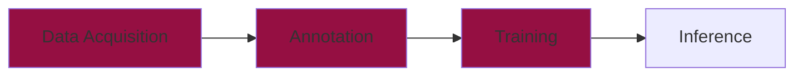

# Training




Now that we have collected and annotated our dataset, it's time to train our very own **YOLO** model. This chapter will guide you through the complete **training process**, from setting up the configuration file to interpreting results and fine-tuning the model.  

---

## Preparation

Before we can start the training of the model, we need to create a **configuration file** that tells YOLO where to find the dataset and how to train the model. 

### What is the `config.yaml` file?  

The `config.yaml` file contains:  
- **Dataset paths** – Where the images and annotations are stored.  
- **Number of object classes** – In our case, `5€` and `10€` notes.  
- **Class labels** – The names of the object categories.  

### Creating the `config.yaml` File  

Create a new file named `config.yaml` in your dataset folder and add the following content:  

```yaml
train: data/train/images  # Path to training images
val: data/val/images      # Path to validation images

nc: 2  # Number of object classes

names: ["five_euro", "ten_euro"]  # Class names
```

✅ **Make sure the dataset structure looks like this:**  

```
📁 data/
│── 📁 train/
│   ├── 📁 images/
│   ├── 📁 labels/
│── 📁 val/
│   ├── 📁 images/
│   ├── 📁 labels/
│── config.yaml
```

This structure ensures that YOLO knows **where to find images and labels** for training and validation.

---

## 2️⃣ Starting the Training Process  

Once we have our dataset and configuration ready, we can start training the YOLO model.  

### 🚀 Running YOLO Training  

First, install YOLOv8 (if you haven't already):  

```bash
pip install ultralytics
```

Then, run the training command:  

```python
from ultralytics import YOLO

# Load the YOLO model
model = YOLO("yolov8n.pt")  # Start with a pre-trained YOLOv8 model

# Train the model on the dataset
results = model.train(data="config.yaml", epochs=50, imgsz=640)
```

### 🔧 Key Training Parameters:  
- `data="config.yaml"` – Specifies the dataset configuration file.  
- `epochs=50` – Defines the number of training cycles (adjustable).  
- `imgsz=640` – Resizes images to 640x640 for training.  
- `yolov8n.pt` – Uses YOLOv8's small pre-trained model as a starting point.  

Training will take some time, depending on the dataset size and hardware.

---

## 3️⃣ Learning About Metrics  

After training, we need to **evaluate** our model’s performance using key **metrics**. Let’s break them down:

### 📊 Key Object Detection Metrics  

| Metric          | Meaning |
|----------------|---------|
| **Loss**       | Measures how much the model's predictions differ from the actual labels. |
| **Precision**  | How many detected objects were actually correct? |
| **Recall**     | How many actual objects were correctly detected? |
| **mAP (mean Average Precision)** | A combined measure of **precision & recall** over all object classes. |

### 🔍 Understanding the Metrics  

✅ **Precision**: Of all the detections, how many were correct?  
✅ **Recall**: Of all the objects that should have been detected, how many were found?  
✅ **mAP**: A **summary score** that considers both **precision** and **recall**.  

💡 **A good YOLO model should have high precision, recall, and mAP.**

---

## 4️⃣ Interpreting the Results  

Once training is complete, YOLO provides **metrics and plots** to help analyze performance.

Run the following command to display the results:

```python
import matplotlib.pyplot as plt

# Load training results
results = model.load("runs/detect/train")

# Show training curves
results.plot()
plt.show()
```

🔎 **What to look for?**
- **Loss decreasing** → The model is learning properly.  
- **High mAP (~0.5 or higher)** → Good object detection performance.  
- **Balanced precision and recall** → Model detects objects correctly without too many false positives or negatives.

---

## 5️⃣ Fine-Tuning the Model  

If your model isn't performing well, you can **fine-tune** it by adjusting key parameters.

### 🔧 Things to Try:

1️⃣ **Increase the number of epochs**:
   - Try training for `100+` epochs instead of `50`.
   - Example:  
     ```python
     model.train(data="config.yaml", epochs=100)
     ```

2️⃣ **Use a larger YOLO model**:
   - Instead of `yolov8n.pt` (small model), try `yolov8m.pt` or `yolov8l.pt` (medium/large models).
   - Example:  
     ```python
     model = YOLO("yolov8m.pt")  # Medium model
     ```

3️⃣ **Improve data augmentation**:
   - Apply **random flips, rotations, or brightness adjustments** to your dataset.
   - This helps the model **generalize** better.

4️⃣ **Train on a larger dataset**:
   - More labeled images can significantly boost performance.
   - Try adding **more angles, backgrounds, and lighting conditions**.

---

## ✅ Next Steps  

After fine-tuning, you can **test your trained YOLO model** on new images or videos!  

```python
# Run inference on a test image
results = model("test_image.jpg", show=True)
```

Now you have a fully trained **custom YOLO model**! 🚀

---

🔜 **Up Next: Model Deployment & Real-World Testing** 🎯